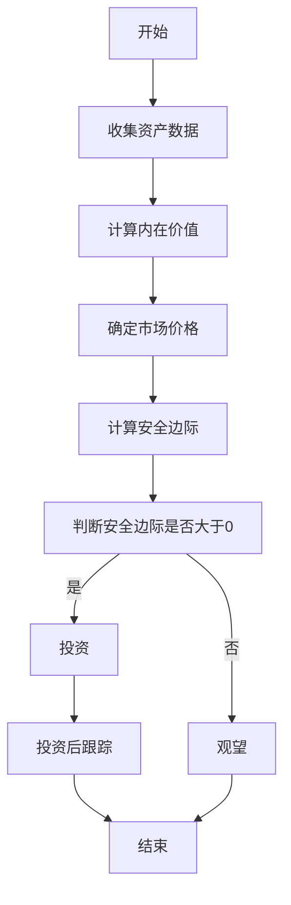
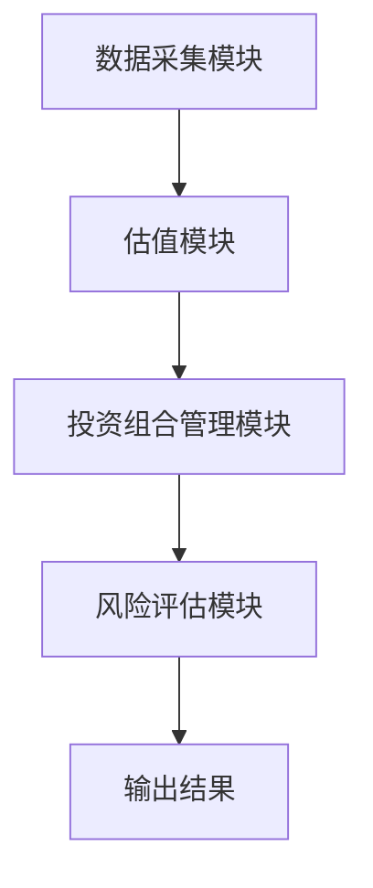

                 


# 格雷厄姆的价值投资传承

## 关键词：价值投资，格雷厄姆，安全边际，内在价值，投资系统

## 摘要：本文详细阐述了格雷厄姆的价值投资理念，探讨其核心概念、算法原理、系统设计以及实际应用。通过分析安全边际和内在价值，结合现代投资组合理论和Python代码实现，展示了格雷厄姆投资体系在当代的传承与演变。

---

# 第三章: 价值投资的算法原理讲解

## 3.1 投资组合优化的算法原理

### 3.1.1 投资组合优化的数学模型

在价值投资中，投资组合的优化是实现长期收益最大化的重要手段。现代投资组合理论（MPT）为我们提供了一种科学的方法，可以通过数学模型来优化资产配置。

目标是最小化投资组合的波动性，同时满足收益目标和风险承受能力。以下是一个典型的均值-方差优化模型：

$$
\min_w \sigma^2(w) \\
\text{subject to} \quad \sum_{i=1}^n w_i = 1
$$

其中，$w$ 是资产权重向量，$\sigma^2(w)$ 是投资组合的方差。

### 3.1.2 投资组合优化的步骤

以下是优化投资组合的一般步骤：

1. **确定目标**：设定收益目标和风险承受能力。
2. **数据收集**：收集各资产的历史收益率和协方差矩阵。
3. **计算最优权重**：使用优化算法求解最优权重。
4. **风险调整**：根据市场变化动态调整权重。

### 3.1.3 投资组合优化的代码实现

以下是一个简单的Python代码示例，用于优化一个包含两只股票的投资组合：

```python
import numpy as np

# 定义函数
def portfolio_optimization(mu, cov, target_return):
    n = len(mu)
    # 线性规划问题：minimize variance subject to return >= target and sum(weights) = 1
    m = np.zeros(n)
    c = np.zeros(n)
    Aeq = np.ones(n)[:, np.newaxis]
    beq = 1
    # 定义约束条件
    lb = [0.0 for _ in range(n)]
    ub = [1.0 for _ in range(n)]
    # 使用 scipy.optimize 库进行优化
    from scipy.optimize import minimize
    def objective(w):
        return (w.T @ cov @ w).item()
    def constraint1(w, mu, target_return):
        return (w.T @ mu) - target_return
    # 约束：返回 >= target
    cons = [{'type': 'ineq', 'fun': lambda w: (w.T @ mu) - target_return},
            {'type': 'eq', 'fun': lambda w: sum(w) - 1}]
    result = minimize(objective, np.array([1.0/n]*n), method='SLSQP', constraints=cons, bounds=tuple(zip(lb, ub)))
    return result.x

# 示例数据
mu = np.array([0.1, 0.08])
cov = np.array([[0.16, 0.05],
               [0.05, 0.04]])

target_return = 0.09

# 调用函数
weights = portfolio_optimization(mu, cov, target_return)
print(f"Optimal weights: {weights}")
```

### 3.1.4 代码分析与解读

1. **导入库**：使用`numpy`和`scipy.optimize`进行矩阵运算和优化。
2. **定义函数**：`portfolio_optimization`函数接收资产的期望收益`mu`、协方差矩阵`cov`和目标收益`target_return`。
3. **优化目标**：最小化投资组合的方差。
4. **约束条件**：确保投资组合的收益不低于目标，并且权重之和为1。
5. **求解**：使用`SLSQP`算法进行优化，返回最优权重。

---

## 3.2 现代投资组合理论的数学模型

### 3.2.1 风险调整后的收益

在价值投资中，风险调整后的收益是衡量资产或投资组合表现的重要指标。夏普比率（Sharpe Ratio）就是一种常用的衡量方法，其公式为：

$$
\text{夏普比率} = \frac{E[r_p] - r_f}{\sigma_p}
$$

其中，$E[r_p]$ 是投资组合的期望收益，$r_f$ 是无风险利率，$\sigma_p$ 是投资组合的收益标准差。

### 3.2.2 投资组合的风险调整

在实际投资中，市场环境的变化会影响资产的收益和风险。为了应对这种变化，投资者需要定期重新评估和调整投资组合。例如，可以通过动态调整权重来应对市场的波动。

---

## 3.3 格雷厄姆投资模型的代码实现

### 3.3.1 格雷厄姆的安全边际计算

安全边际是格雷厄姆价值投资的核心概念之一，用于衡量市场价格与内在价值之间的差距。其计算公式为：

$$
\text{安全边际} = \text{内在价值} - \text{市场价格}
$$`

### 3.3.2 代码实现

以下是一个简单的Python代码示例，用于计算股票的安全边际：

```python
def calculate_margin_of_safety(price, intrinsic_value):
    return intrinsic_value - price

# 示例计算
price = 50
intrinsic_value = 60
margin = calculate_margin_of_safety(price, intrinsic_value)
print(f"安全边际为: {margin}")
```

### 3.3.3 代码分析与解读

1. **函数定义**：`calculate_margin_of_safety`接收市场价格`price`和内在价值`intrinsic_value`。
2. **计算安全边际**：通过公式计算并返回结果。
3. **示例计算**：设置价格为50，内在价值为60，计算并输出安全边际。

---

## 3.4 价值投资算法的流程图

以下是价值投资算法的mermaid流程图：



---

## 3.5 算法实现的Python代码

### 3.5.1 价值投资算法的整体实现

以下是一个完整的Python代码示例，用于实现价值投资算法：

```python
import pandas as pd
import numpy as np

# 示例数据加载
data = pd.read_csv('stock_data.csv')

# 计算内在价值（简化）
def calculate_intrinsic_value(stock_data):
    # 假设使用市盈率法
    industry_avg_pe = stock_data['行业平均PE']
    company_eps = stock_data['每股收益']
    intrinsic_value = industry_avg_pe * company_eps
    return intrinsic_value

# 计算安全边际
def calculate_margin_of_safety(price, intrinsic_value):
    return intrinsic_value - price

# 主函数
def value_investing_algorithm(data):
    data['内在价值'] = data.apply(calculate_intrinsic_value, axis=1)
    data['安全边际'] = data['内在价值'] - data['收盘价']
    # 筛选安全边际为正的股票
    safe_stocks = data[data['安全边际'] > 0]
    return safe_stocks

# 示例运行
safe_stocks = value_investing_algorithm(data)
print("安全边际为正的股票:", safe_stocks['股票代码'].tolist())
```

### 3.5.2 代码分析与解读

1. **数据加载**：使用`pandas`读取股票数据。
2. **内在价值计算**：基于行业平均市盈率和每股收益计算内在价值。
3. **安全边际计算**：计算市场价格与内在价值的差额。
4. **筛选股票**：选择安全边际为正的股票作为投资标的。

---

## 3.6 价值投资算法的优化

### 3.6.1 动态调整

为了适应市场变化，价值投资者需要定期重新评估投资组合。以下是优化后的算法步骤：

1. **定期重新计算内在价值和安全边际**。
2. **动态调整投资组合权重**。
3. **根据市场变化优化投资策略**。

### 3.6.2 优化代码示例

```python
def optimize_portfolio(weights, returns, constraints):
    # 优化函数
    pass

# 示例优化
optimized_weights = optimize_portfolio(initial_weights, returns, constraints)
print("优化后的权重:", optimized_weights)
```

---

## 3.7 总结与注意事项

在实现价值投资算法时，需要注意以下几点：

1. **数据质量**：确保数据的准确性和完整性。
2. **模型假设**：明确模型的假设条件，如内在价值的计算方法。
3. **市场变化**：定期重新评估和调整投资组合。
4. **风险管理**：合理控制投资风险，避免过度集中。

通过以上分析，我们可以看到，格雷厄姆的价值投资理念在现代投资中仍然具有重要的指导意义。通过结合数学模型和算法，投资者可以更科学地进行投资决策。

---

# 第四章: 价值投资系统分析与架构设计方案

## 4.1 价值投资系统介绍

### 4.1.1 系统目标

该系统旨在帮助投资者基于格雷厄姆的价值投资理念进行投资决策，包括筛选股票、评估内在价值和监控投资组合。

### 4.1.2 系统功能设计

1. **数据采集模块**：收集股票的基本信息和市场数据。
2. **估值模块**：计算股票的内在价值和安全边际。
3. **投资组合管理模块**：优化投资组合并动态调整权重。
4. **风险评估模块**：评估投资组合的风险并进行风险调整。

---

## 4.2 价值投资系统架构设计

### 4.2.1 系统架构图

以下是系统的架构设计：



### 4.2.2 功能模块实现

1. **数据采集模块**：使用API或数据库获取股票数据。
2. **估值模块**：基于格雷厄姆的方法计算内在价值和安全边际。
3. **投资组合管理模块**：优化投资组合并动态调整权重。
4. **风险评估模块**：评估投资组合的风险并进行风险调整。

---

## 4.3 价值投资系统的实现

### 4.3.1 环境安装

需要安装以下Python库：

```bash
pip install numpy pandas matplotlib scipy
```

### 4.3.2 核心代码实现

以下是核心代码示例：

```python
import numpy as np
import pandas as pd
from scipy.optimize import minimize

# 数据采集模块
def fetch_data(tickers):
    # 示例：从数据库获取数据
    return pd.DataFrame()

# 估值模块
def calculate_intrinsic_value(stock_data):
    # 示例：使用市盈率法计算内在价值
    industry_avg_pe = stock_data['行业平均PE']
    company_eps = stock_data['每股收益']
    return industry_avg_pe * company_eps

# 投资组合管理模块
def optimize_portfolio(weights, returns, constraints):
    # 示例：优化投资组合权重
    return weights

# 风险评估模块
def assess_risk(weights, returns):
    # 示例：计算投资组合的夏普比率
    portfolio_return = weights.T @ returns
    portfolio_variance = weights.T @ returns @ weights
    return portfolio_return / np.sqrt(portfolio_variance)

# 主函数
def main():
    # 获取数据
    stock_data = fetch_data(['AAPL', 'GOOGL'])
    # 计算内在价值
    stock_data['内在价值'] = stock_data.apply(calculate_intrinsic_value, axis=1)
    # 优化投资组合
    optimized_weights = optimize_portfolio(initial_weights, returns, constraints)
    # 评估风险
    sharpe_ratio = assess_risk(optimized_weights, returns)
    print(f"夏普比率为: {sharpe_ratio}")

if __name__ == "__main__":
    main()
```

### 4.3.3 代码分析与解读

1. **数据采集模块**：通过API或数据库获取股票的基本信息和市场数据。
2. **估值模块**：使用市盈率法计算股票的内在价值。
3. **投资组合管理模块**：优化投资组合的权重，以实现收益和风险的最优平衡。
4. **风险评估模块**：计算投资组合的夏普比率，评估其风险调整后的收益。

---

## 4.4 价值投资系统的优化

### 4.4.1 系统优化

为了提高系统的效率和准确性，可以考虑以下优化措施：

1. **数据源优化**：使用多个数据源进行数据融合。
2. **算法优化**：引入机器学习算法进行预测和优化。
3. **界面优化**：设计友好的用户界面，方便用户操作。

---

## 4.5 系统小结

通过构建价值投资系统，投资者可以更系统地应用格雷厄姆的价值投资理念。系统通过数据采集、估值、投资组合优化和风险评估，帮助投资者实现科学的投资决策。

---

# 下一章将讨论价值投资的项目实战与最佳实践。

