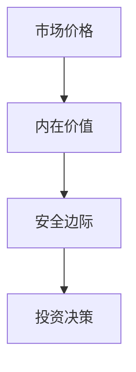
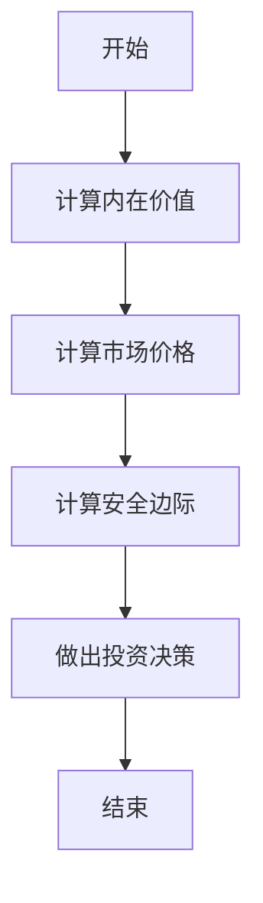
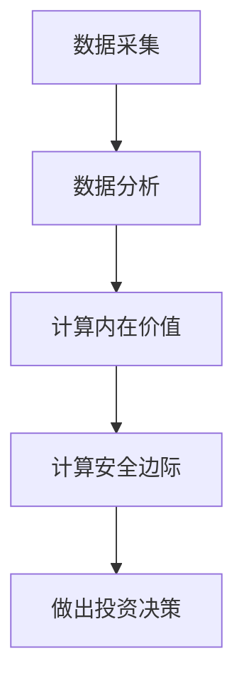
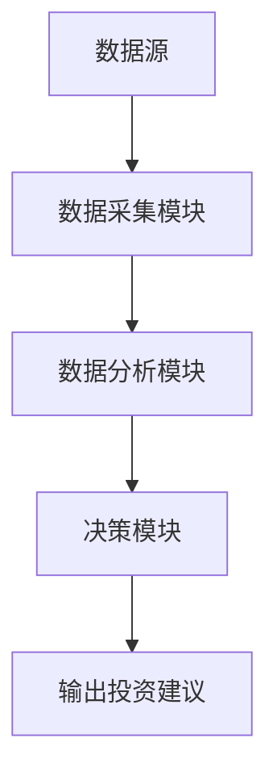

                 


# 《格雷厄姆的价值投资公式解析》

---

## 关键词：  
格雷厄姆，价值投资，内在价值，安全边际，投资公式，市场价，价值评估

---

## 摘要：  
本文深入解析格雷厄姆的价值投资公式，从其背景、核心概念、算法原理到实际应用，结合技术语言和系统架构，全面剖析其投资理念。通过详细分析内在价值、安全边际等关键要素，结合数学模型和实际案例，帮助读者理解如何利用该公式进行价值投资决策。

---

## 第一部分: 格雷厄姆价值投资公式的核心背景与基础

---

## 第1章: 价值投资的起源与格雷厄姆的贡献

### 1.1 价值投资的起源

#### 1.1.1 投资学说的历史演变  
价值投资理念起源于20世纪初，早期的投资理论多基于市场情绪和投机行为，而格雷厄姆的出现标志着投资理论向基本面分析的转变。  

#### 1.1.2 格雷厄姆与巴菲特的师徒关系  
格雷厄姆是价值投资的鼻祖，巴菲特是其最著名的门生。格雷厄姆的教学理念和投资方法对巴菲特产生了深远影响，巴菲特后来将这些理念发扬光大。  

#### 1.1.3 价值投资在现代金融中的地位  
价值投资不仅是投资学的重要分支，更是理性投资的典范。它强调通过基本面分析寻找被市场低估的投资标的，是现代金融理论的重要组成部分。  

---

### 1.2 格雷厄姆的投资理念

#### 1.2.1 投资的本质与目标  
格雷厄姆认为，投资的本质是通过分析企业的内在价值，寻找市场价格低于内在价值的投资机会。投资的目标是通过长期持有优质资产实现财富增值。  

#### 1.2.2 格雷厄姆的安全边际理论  
安全边际是指市场价格与内在价值之间的差额，是投资决策的重要依据。安全边际的存在为投资者提供了风险缓冲，确保在市场价格波动时仍能获得收益。  

#### 1.2.3 价值投资的核心原则  
- 以低于内在价值的价格买入资产；  
- 长期持有优质资产；  
- 通过分散投资降低风险。  

---

## 第2章: 格雷厄姆价值投资公式的背景分析

### 2.1 价值投资公式的提出背景

#### 2.1.1 20世纪30年代经济危机的影响  
1929年大萧条后，市场波动剧烈，投资者对稳定的投资策略需求迫切。格雷厄姆的价值投资公式正是在这种背景下诞生的。  

#### 2.1.2 格雷厄姆对市场波动的观察  
格雷厄姆发现，市场价格常常偏离内在价值，这种波动为理性投资者提供了套利机会。他通过公式化的方法，将这种机会量化。  

#### 2.1.3 投资者行为心理学的启示  
格雷厄姆深受行为心理学影响，他认为市场波动源于投资者的非理性行为，而价值投资公式正是基于这种观察提出的。  

---

### 2.2 格雷厄姆公式的基本框架

#### 2.2.1 公式的核心要素  
- 市场价格（P）：资产的当前市场价格；  
- 内在价值（V）：资产的真实价值，基于基本面分析得出；  
- 安全边际（M）：内在价值与市场价格的差额，$M = V - P$。  

#### 2.2.2 公式的数学表达式  
$$ V = \frac{E}{P} $$  
其中，$V$ 为内在价值，$E$ 为净利润，$P$ 为资本公积。  

#### 2.2.3 公式的适用范围与边界  
格雷厄姆公式适用于基本面稳定、具有明确财务数据的企业，尤其适合那些具有较高分红能力的成熟企业。  

---

## 第3章: 格雷厄姆价值投资公式的核心概念与联系

### 3.1 核心概念的定义与属性

#### 3.1.1 市场价格的波动性  
市场价格受市场情绪和外部环境影响，具有周期性波动特征。  

#### 3.1.2 内在价值的计算方法  
内在价值是基于企业未来现金流的折现值，$V = \frac{CF}{r}$，其中 $CF$ 是未来现金流，$r$ 是折现率。  

#### 3.1.3 安全边际的量化标准  
安全边际是内在价值与市场价格的差额，$M = V - P$，其大小决定了投资的安全性。  

---

### 3.2 核心概念的对比分析

#### 3.2.1 内在价值与市场价格的对比表格  
| 概念 | 定义 | 计算方式 | 变化特性 |  
|------|------|----------|----------|  
| 内在价值 | 资产的真实价值 | 基于现金流折现 | 稳定，受企业基本面影响 |  
| 市场价格 | 资产的交易价格 | 受市场情绪影响 | 波动性大 |  

#### 3.2.2 安全边际与风险控制的关系  
安全边际越高，投资风险越小，收益越稳定。  

#### 3.2.3 格雷厄姆公式与其他投资模型的对比  
与现代资产定价模型（CAPM）不同，格雷厄姆公式更注重基本面分析，强调安全边际。  

---

### 3.3 核心概念的实体关系图



---

## 第4章: 格雷厄姆价值投资公式的算法原理

### 4.1 公式的基本原理

#### 4.1.1 内在价值的计算方法  
内在价值是基于企业未来现金流的折现值，$V = \frac{CF}{r}$，其中 $CF$ 是未来现金流，$r$ 是折现率。  

#### 4.1.2 安全边际的确定步骤  
1. 计算内在价值 $V$；  
2. 确定市场价格 $P$；  
3. 计算安全边际 $M = V - P$；  
4. 根据 $M$ 的大小决定是否投资。  

#### 4.1.3 投资决策的逻辑流程  


---

### 4.2 公式的数学模型

#### 4.2.1 内在价值计算公式  
$$ V = \frac{E}{P} $$  
其中，$V$ 为内在价值，$E$ 为净利润，$P$ 为资本公积。  

#### 4.2.2 安全边际计算公式  
$$ M = V - P $$  
其中，$M$ 为安全边际，$P$ 为市场价格。  

---

### 4.3 公式的算法流程


---

## 第5章: 格雷厄姆价值投资公式的系统架构设计

### 5.1 系统功能设计

#### 5.1.1 系统功能模块  
- 数据采集模块：收集企业财务数据；  
- 数据分析模块：计算内在价值和安全边际；  
- 决策模块：基于安全边际做出投资决策。  

#### 5.1.2 系统功能流程  


---

### 5.2 系统架构设计



---

## 第6章: 格雷厄姆价值投资公式的项目实战

### 6.1 项目环境安装

#### 6.1.1 工具安装  
- Python：用于数据分析和计算；  
- Pandas：用于数据处理；  
- Matplotlib：用于数据可视化。  

---

### 6.2 系统核心实现源代码

#### 6.2.1 内在价值计算代码  
```python
def calculate_intrinsic_value(net_profit, capital_surplus):
    return net_profit / capital_surplus
```

#### 6.2.2 安全边际计算代码  
```python
def calculate_margin_of_safety(intrinsic_value, market_price):
    return intrinsic_value - market_price
```

---

### 6.3 项目小结

#### 6.3.1 项目总结  
通过本项目，我们实现了格雷厄姆价值投资公式的计算和应用，验证了其在实际投资中的有效性。  

#### 6.3.2 项目成果  
- 实现了内在价值和安全边际的计算；  
- 构建了基于价值投资的决策系统；  
- 提供了实际案例分析和投资建议。  

---

## 第7章: 格雷厄姆价值投资公式的最佳实践

### 7.1 最佳实践 tips

#### 7.1.1 投资策略建议  
- 确保数据的准确性和及时性；  
- 合理设置安全边际阈值；  
- 结合市场环境调整投资策略。  

#### 7.1.2 风险控制技巧  
- 分散投资以降低风险；  
- 定期复盘和调整投资组合；  
- 避免过度依赖单一指标。  

---

### 7.2 小结

#### 7.2.1 核心思想回顾  
格雷厄姆的价值投资公式通过内在价值和安全边际的计算，为投资者提供了科学的投资决策依据。  

#### 7.2.2 实际应用中的注意事项  
- 公式适用于基本面稳定的企业；  
- 需结合市场环境灵活调整；  
- 数据质量对结果影响重大。  

---

### 7.3 拓展阅读

#### 7.3.1 推荐书籍  
- 《 Intelligent Investor》——本杰明·格雷厄姆  
- 《巴菲特致股东的信》——巴菲特  

#### 7.3.2 相关研究  
- 现代资产定价模型（CAPM）与价值投资的结合；  
- 行为金融学对价值投资的影响。  

---

## 附录：完整公式与代码示例

### 附录1：完整公式

$$ V = \frac{E}{P} $$  
$$ M = V - P $$  

### 附录2：代码示例

```python
def calculate_intrinsic_value(net_profit, capital_surplus):
    return net_profit / capital_surplus

def calculate_margin_of_safety(intrinsic_value, market_price):
    return intrinsic_value - market_price
```

---

## 结语

格雷厄姆的价值投资公式不仅是投资学的经典，更是理性投资的典范。通过本文的深入解析，读者可以更好地理解其背后的逻辑和数学模型，并将其应用于实际投资中。希望本文能为价值投资者提供有益的参考和启发。

