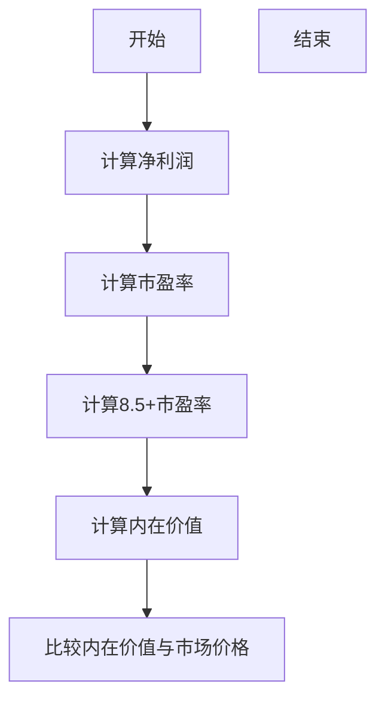

                 


# 格雷厄姆的价值投资公式：寻找被低估的股票

## 关键词：
- 价值投资
- 格雷厄姆
- 股票筛选
- 内在价值
- 安全边际

## 摘要：
本文详细介绍了格雷厄姆的价值投资公式，探讨了其在寻找被低估股票中的应用。通过分析公式的核心原理、数学模型及实际案例，帮助投资者理解如何运用该公式进行有效的投资决策。

---

# 第一部分: 价值投资的背景与基础

## 第1章: 价值投资的核心理念

### 1.1 格雷厄姆的投资哲学

#### 1.1.1 投资的定义与本质
投资的本质是通过购买资产，以期在未来获得超过初始投入的回报。格雷厄姆认为，投资不是投机，而是基于深入分析的一种行为。

#### 1.1.2 安全边际的概念
安全边际是格雷厄姆理论的核心。它指的是股票的市场价格与内在价值之间的差距，即市场价格低于内在价值的部分。安全边际的存在可以降低投资的风险。

#### 1.1.3 格雷厄姆的价值投资体系
格雷厄姆的价值投资体系强调以低于内在价值的价格购买优质资产。他认为，市场的短期波动不应影响投资者的决策，而内在价值是决定投资价值的关键。

### 1.2 价值投资的核心要素

#### 1.2.1 股票的内在价值
内在价值是股票基于其财务状况和未来现金流的真正价值，与市场波动无关。格雷厄姆通过分析公司的财务报表来估算内在价值。

#### 1.2.2 市场价格与内在价值的差异
市场价格受市场情绪影响，经常偏离内在价值。价值投资者寻找市场价格低于内在价值的股票。

#### 1.2.3 安全边际的计算方法
安全边际 = 内在价值 - 市场价格。格雷厄姆建议投资者选择安全边际较大的股票，以降低投资风险。

### 1.3 价值投资的适用场景

#### 1.3.1 理论背景与市场环境
格雷厄姆的投资理论在市场波动较大时尤为有效。在市场恐慌或低估时，投资者可以找到被低估的股票。

#### 1.3.2 不同市场周期中的投资策略
在牛市中，投资者应谨慎，避免高估股票；在熊市中，投资者可以寻找被低估的股票。

#### 1.3.3 价值投资的局限性
价值投资不适合所有市场环境，尤其在市场泡沫期间，可能会错过一些高增长股票的机会。

## 第2章: 格雷厄姆的价值投资公式

### 2.1 格雷厄姆投资公式的核心原理

#### 2.1.1 公式的基本结构
格雷厄姆的价值投资公式旨在估算企业的内在价值，公式为：
$$
\text{内在价值} = \text{净利润} \times \left(8.5 + \text{市盈率}\right)
$$

#### 2.1.2 公式中的关键变量
- 净利润：公司过去几年的平均净利润。
- 市盈率：当前股价与每股收益的比率。

#### 2.1.3 公式的数学推导
通过分析企业的盈利能力，格雷厄姆得出内在价值的计算公式。该公式考虑了企业的未来盈利能力，并将其与当前市场估值进行对比。

### 2.2 格雷厄姆公式中的关键指标

#### 2.2.1 息税折旧及摊销前利润（EBITDA）
EBITDA是衡量企业盈利能力的重要指标，公式为：
$$
\text{EBITDA} = \text{净利润} + \text{利息} + \text{税} + \text{折旧} + \text{摊销}
$$

#### 2.2.2 企业价值（EV）
企业价值是公司整体价值的衡量标准，公式为：
$$
\text{EV} = \text{股价} \times \text{股数} + \text{总债务}
$$

#### 2.2.3 股东权益（Book Value）
股东权益是公司资产净值，公式为：
$$
\text{Book Value} = \text{资产} - \text{负债}
$$

### 2.3 格雷厄姆公式在股票筛选中的应用

#### 2.3.1 公式的实际计算步骤
1. 计算净利润和市盈率。
2. 计算内在价值。
3. 比较内在价值与市场价格。

#### 2.3.2 公式的适用范围与限制
适用于稳定增长的企业，不适用于高增长或亏损企业。

#### 2.3.3 公式的改进与扩展
结合其他指标，如市净率和股息率，进一步优化筛选标准。

## 第3章: 格雷厄姆投资公式的核心算法

### 3.1 格雷厄姆投资公式的数学模型

#### 3.1.1 公式的数学表达
$$
\text{内在价值} = \text{净利润} \times \left(8.5 + \text{市盈率}\right)
$$

#### 3.1.2 公式的变量关系
$$
\text{EV} = \text{市场价格} + \text{总债务}
$$

### 3.2 格雷厄姆投资公式的算法流程图



### 3.3 代码实现

```python
def calculate_intrinsic_value(net_profit, pe_ratio):
    return net_profit * (8.5 + pe_ratio)

net_profit = 100  # 假设净利润为100
pe_ratio = 15     # 假设市盈率为15
intrinsic_value = calculate_intrinsic_value(net_profit, pe_ratio)
print(f"内在价值为：{intrinsic_value}")
```

---

# 第四部分: 项目实战

## 第4章: 格雷厄姆投资公式在实际中的应用

### 4.1 环境安装
- 安装必要的Python库，如pandas、numpy。

### 4.2 系统核心实现源代码

```python
import pandas as pd

def calculate_intrinsic_value(df):
    df['Intrinsic Value'] = df['净利润'] * (8.5 + df['市盈率'])
    return df

# 示例数据
data = {
    '公司': ['公司A', '公司B', '公司C'],
    '净利润': [100, 150, 80],
    '市盈率': [15, 20, 12]
}

df = pd.DataFrame(data)
result = calculate_intrinsic_value(df)
print(result)
```

### 4.3 实际案例分析
以某公司为例，计算其内在价值，并与市场价格进行对比。

---

# 第五部分: 总结与展望

## 第5章: 总结

### 5.1 核心观点回顾
格雷厄姆的价值投资公式为投资者提供了寻找被低估股票的有效方法。

### 5.2 投资者注意事项
- 确保数据的准确性。
- 结合其他指标进行综合分析。

## 第6章: 未来展望

### 6.1 价值投资的未来发展
随着市场的变化，价值投资策略需要不断优化。

### 6.2 人工智能与价值投资的结合
人工智能可以帮助投资者更高效地分析数据，优化投资决策。

---

通过以上结构，您可以详细撰写一篇关于格雷厄姆的价值投资公式的深度技术博客，涵盖理论、公式、代码实现和实际应用等多个方面。

