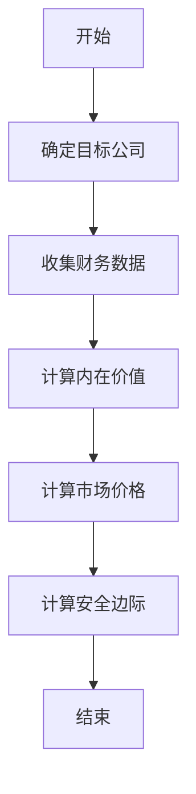

                 


# 格雷厄姆的价值投资名言解读与实践

> 关键词：价值投资、格雷厄姆、安全边际、内在价值、投资策略

> 摘要：本文将深入解读格雷厄姆的价值投资理论，分析其核心概念和投资策略，结合数学模型和实际案例，探讨如何在现代投资实践中应用这些理论，帮助投资者做出明智决策。

---

## 第一部分：价值投资的背景与发展

### 第1章：价值投资的起源与发展

#### 1.1 价值投资的起源
- **投资的基本概念与问题背景**：介绍投资的基本概念，指出传统投资与投机的区别，提出价值投资的初衷是为了降低风险。
- **价值投资的定义与核心要素**：定义价值投资，强调其核心要素包括内在价值、安全边际和长期视角。
- **格雷厄姆与价值投资的关系**：简述格雷厄姆的学术背景及其对价值投资的贡献。

#### 1.2 格雷厄姆的投资理念
- **投资与投机的区分**：通过表格对比投资与投机的特点，明确价值投资者应遵循的原则。
- **安全边际的概念与重要性**：详细解释安全边际的定义、计算公式，并通过实例说明其应用。
- **避免情绪化投资的原则**：分析情绪化投资的危害，提出理性决策的方法。

---

## 第二部分：价值投资的核心概念与联系

### 第2章：价值投资的核心概念与联系

#### 2.1 内在价值与市场价格的关系
- **内在价值计算模型**：介绍股息贴现模型（DDM）和现金流量折现模型（DCF），并用公式说明。
  $$ V = \frac{D}{r - g} $$
  $$ V = \sum_{t=1}^{n} \frac{CF_t}{(1+r)^t} $$
- **安全边际计算**：展示安全边际的计算公式，并通过图表对比内在价值与市场价格的关系。
  $$ \text{安全边际} = \text{内在价值} - \text{市场价格} $$

#### 2.2 核心概念对比表格与ER实体关系图
- **核心概念对比表格**：比较股票价值与市场价格的异同，分析安全边际与风险控制的关系。
- **ER实体关系图（Mermaid流程图）**：
  ```mermaid
  graph TD
      A[投资者] --> B[股票]
      B --> C[内在价值]
      B --> D[市场价格]
      C --> E[安全边际]
  ```

---

## 第三部分：价值投资的数学模型与算法原理

### 第3章：价值投资的数学模型与算法原理

#### 3.1 内在价值计算模型
- **股息贴现模型（DDM）**：通过公式和实例，说明如何计算股票的内在价值。
  $$ V = \frac{D}{r - g} $$
- **现金流量折现模型（DCF）**：解释如何通过现金流折现计算企业价值。
  $$ V = \sum_{t=1}^{n} \frac{CF_t}{(1+r)^t} $$

#### 3.2 安全边际计算
- **安全边际公式**：展示如何通过安全边际判断投资风险。
  $$ \text{安全边际} = \text{内在价值} - \text{市场价格} $$

#### 3.3 算法流程图（Mermaid）


---

## 第四部分：系统分析与架构设计

### 第4章：系统分析与架构设计

#### 4.1 投资决策系统架构
- **系统功能模块**：介绍数据收集模块、分析模块和决策模块的功能。
- **系统架构设计（Mermaid架构图）**：
  ```mermaid
  classDiagram
      class 投资者 {
          输入目标公司
          输出投资决策
      }
      class 数据收集模块 {
          收集财务数据
          收集市场数据
      }
      class 分析模块 {
          计算内在价值
          计算市场价格
      }
      class 决策模块 {
          计算安全边际
          输出投资建议
      }
  ```

---

## 第五部分：项目实战与最佳实践

### 第5章：项目实战与最佳实践

#### 5.1 项目实战
- **环境安装**：介绍投资分析工具的安装步骤。
- **代码实现**：展示价值投资分析的Python代码，说明如何计算内在价值和安全边际。
  ```python
  def calculate_intrinsic_value(enterprise_value, free_cash_flow, discount_rate):
      # 简单DCF模型计算企业价值
      return enterprise_value / (1 + discount_rate)
  ```
- **案例分析**：以实际股票为例，详细分析如何应用格雷厄姆的理论进行投资决策。

#### 5.2 最佳实践 tips
- **小结**：总结价值投资的核心要点和实际应用中的注意事项。
- **注意事项**：提醒投资者注意市场波动、数据准确性等问题。
- **拓展阅读**：推荐相关书籍和资源，鼓励深入学习。

---

## 总结

本文通过解读格雷厄姆的价值投资理论，结合数学模型和系统架构设计，帮助读者系统地理解和应用价值投资策略。通过实际案例和最佳实践，读者可以掌握如何在现代投资环境中做出明智的决策。

