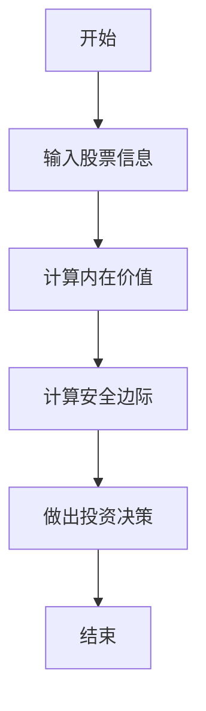

                 

# 格雷厄姆的价值投资实践案例

## 关键词：价值投资、格雷厄姆、内在价值、安全边际、股票估值

## 摘要：  
本文深入探讨了格雷厄姆的价值投资理论，通过数学模型和实际案例分析，揭示了如何在投资实践中应用其核心理念。文章首先介绍了价值投资的背景与发展，详细阐述了格雷厄姆的投资策略和核心概念。接着，通过数学模型和算法原理，分析了内在价值的计算方法和安全边际的应用。最后，通过系统架构设计和项目实战案例，展示了如何将价值投资理论应用于实际投资决策中，帮助读者更好地理解和实践价值投资。

---

## 第一部分: 格雷厄姆的价值投资基础

### 第1章: 价值投资的背景与核心概念

#### 1.1 价值投资的起源与发展

##### 1.1.1 投资学的演变历程  
投资学作为一门学科，经历了从简单的企业估值到复杂的金融模型的演变。早期的投资行为更多依赖于市场情绪和直觉判断，而随着金融市场的发展，投资者开始关注企业的基本面分析。格雷厄姆的价值投资理论正是在这一背景下诞生的。

##### 1.1.2 格雷厄姆与价值投资的诞生  
本杰明·格雷厄姆（Benjamin Graham）是20世纪最伟大的投资学家之一，被誉为“价值投资之父”。他在1934年出版的《证券分析》（Security Analysis）一书中，系统地阐述了价值投资的理论和方法。格雷厄姆的投资理念强调以低于内在价值的价格买入优质股票，并长期持有，以获取超额收益。

##### 1.1.3 价值投资的核心理念  
价值投资的核心理念是“安全边际”。格雷厄姆认为，投资者应该以低于企业内在价值的价格买入股票，从而在市场波动中获得安全边际，降低投资风险。

---

#### 1.2 格雷厄姆的投资策略与原则

##### 1.2.1 安全边际的概念与重要性  
安全边际是指股票的市场价格与内在价值之间的差距。通过购买低于内在价值的股票，投资者可以在市场下跌时获得保护，同时在市场上涨时获得收益。

##### 1.2.2 内在价值的定义与计算方法  
内在价值是股票在理论上应该具有的价值，与市场波动无关。计算内在价值的方法包括现金流折现法（DCF）和股利折现模型（DDM）。

##### 1.2.3 投资组合的构建与管理  
格雷厄姆建议投资者构建一个分散的投资组合，以降低风险。他强调长期投资的重要性，避免短期市场波动的干扰。

---

#### 1.3 价值投资的核心要素

##### 1.3.1 市场情绪与投资者心理  
市场情绪是影响股票价格的重要因素。价值投资者需要忽略短期市场情绪，专注于企业的基本面。

##### 1.3.2 股票估值的关键指标  
常见的股票估值指标包括市盈率（P/E）、市净率（P/B）和股息率。这些指标可以帮助投资者评估股票的内在价值。

##### 1.3.3 风险控制与收益平衡  
价值投资者需要在风险和收益之间找到平衡点。通过安全边际和分散投资，可以有效控制风险，同时追求长期收益。

---

#### 1.4 价值投资与其他投资策略的对比

##### 1.4.1 价值投资与成长投资的区别  
价值投资关注低估值的股票，而成长投资关注高增长的股票。价值投资者注重安全边际，而成长投资者更关注企业的增长潜力。

##### 1.4.2 价值投资与趋势投资的差异  
趋势投资依赖于市场趋势，而价值投资关注企业的基本面。趋势投资者注重短期市场波动，而价值投资者更关注长期价值。

##### 1.4.3 价值投资的适用场景与局限性  
价值投资在市场低迷时表现优异，但在市场繁荣时可能表现不佳。因此，价值投资需要结合市场环境灵活运用。

---

#### 1.5 本章小结  
本章介绍了价值投资的背景与发展，详细阐述了格雷厄姆的投资策略和核心概念。通过分析安全边际、内在价值和投资组合管理，读者可以更好地理解价值投资的核心思想。

---

## 第二部分: 格雷厄姆价值投资策略的数学模型与算法原理

### 第2章: 内在价值计算的数学模型

#### 2.1 内在价值的基本公式

##### 2.1.1 内在价值公式：$$V = \frac{CF}{r - g}$$  
其中，\( V \) 是内在价值，\( CF \) 是现金流，\( r \) 是贴现率，\( g \) 是增长率。

##### 2.1.2 现金流折现模型（DCF）的原理  
DCF模型通过将未来现金流折现到现值，计算企业的内在价值。该模型适用于具有稳定现金流的企业。

##### 2.1.3 股利折现模型（DDM）的运用  
DDM模型通过将未来股利折现，计算股票的内在价值。该模型适用于股利稳定的公司。

---

#### 2.2 股票估值的关键指标分析

##### 2.2.1 市盈率（P/E）的计算与应用  
市盈率 = 股价 / 每股净利润。低市盈率通常意味着股票被低估。

##### 2.2.2 市净率（P/B）的含义与局限  
市净率 = 股价 / 每股净资产。低市净率通常意味着股票被低估。

##### 2.2.3 股息率的计算与投资决策  
股息率 = 每股股息 / 股价。高股息率通常意味着股票具有较高的分红能力。

---

#### 2.3 格雷厄姆的防御性投资策略

##### 2.3.1 安全边际的数学表达：$$Margin~of~Safety = \frac{V_{intrinsic} - P}{P}$$  
安全边际 = 内在价值 - 市场价格。通过安全边际，投资者可以评估股票的风险。

##### 2.3.2 投资组合的风险分散原理  
通过分散投资，投资者可以降低特定股票的风险。价值投资者通常选择多个低估值的股票构建投资组合。

##### 2.3.3 稳定收益的投资组合构建  
价值投资者注重长期稳定的收益，而非短期的高收益。

---

#### 2.4 算法原理与流程图

##### 2.4.1 算法流程图

---

## 第三部分: 价值投资的系统分析与架构设计

### 第3章: 价值投资系统的功能设计

#### 3.1 系统功能模块划分

##### 3.1.1 数据采集模块  
数据采集模块负责收集股票的基本信息，包括财务数据和市场数据。

##### 3.1.2 估值计算模块  
估值计算模块使用DCF和DDM模型计算股票的内在价值。

##### 3.1.3 投资决策模块  
投资决策模块根据安全边际和市场环境，做出投资决策。

---

#### 3.2 系统架构设计

##### 3.2.1 系统架构图

---

#### 3.3 系统接口设计

##### 3.3.1 数据接口规范  
数据接口需要支持股票代码、财务数据和市场数据的输入。

##### 3.3.2 计算接口规范  
计算接口需要支持DCF和DDM模型的计算。

##### 3.3.3 输出接口规范  
输出接口需要支持内在价值、安全边际和投资建议的输出。

---

#### 3.4 系统交互流程图

##### 3.4.1 系统交互流程图

---

## 第四部分: 价值投资的项目实战

### 第4章: 实战案例分析

#### 4.1 案例选择与背景

##### 4.1.1 案例选择  
以某公司为例，分析其内在价值和安全边际。

##### 4.1.2 案例背景  
选择一家具有稳定财务表现和良好前景的公司作为分析对象。

---

#### 4.2 内在价值计算

##### 4.2.1 使用DCF模型计算内在价值  
假设公司未来5年的现金流分别为100、120、140、160、180万元，贴现率为10%，永续增长率为5%。  
$$V = \frac{100}{(1+0.1)^1} + \frac{120}{(1+0.1)^2} + \frac{140}{(1+0.1)^3} + \frac{160}{(1+0.1)^4} + \frac{180}{(1+0.1)^5} + \frac{180 \times (1+0.05)}{(0.1-0.05) \times (1+0.1)^5}$$  
计算结果为内在价值约为1000万元。

---

#### 4.3 安全边际分析

##### 4.3.1 计算当前市场价格  
假设当前市场价格为800万元。

##### 4.3.2 计算安全边际  
$$Margin~of~Safety = \frac{1000 - 800}{800} = 25\%$$  
安全边际为25%，表明股票具有较高的投资价值。

---

#### 4.4 投资决策

##### 4.4.1 建议投资策略  
基于计算结果，建议买入该股票，持有至内在价值被市场发现。

---

#### 4.5 案例小结

##### 4.5.1 案例分析总结  
通过DCF模型和安全边际分析，投资者可以在实际投资中找到低估的股票。

---

## 第五部分: 总结与展望

### 第5章: 总结与最佳实践

#### 5.1 总结  
格雷厄姆的价值投资理论通过安全边际和内在价值计算，帮助投资者在市场中找到低估的股票。通过系统的分析和实战案例，读者可以更好地理解和应用价值投资。

---

#### 5.2 最佳实践 tips

##### 5.2.1 长期投资的重要性  
价值投资者应注重长期投资，避免短期市场波动的干扰。

##### 5.2.2 分散投资的风险  
通过分散投资，可以降低特定股票的风险。

##### 5.2.3 持续学习与研究  
投资者需要不断学习和研究，以适应市场的变化。

---

#### 5.3 拓展阅读  
推荐阅读格雷厄姆的《证券分析》和《聪明的投资者》，深入理解价值投资的理论和实践。

---

## 附录: 价值投资相关工具与资源

### 附录A: 价值投资工具推荐  
常用的股票估值工具包括Excel、Python和一些在线平台。

---

### 附录B: 价值投资书籍推荐  
推荐阅读《证券分析》、《聪明的投资者》等书籍。

---

### 附录C: 价值投资社区与论坛  
投资者可以加入价值投资相关的社区和论坛，分享投资经验。

---

## 结语  
通过本文的分析，读者可以深入了解格雷厄姆的价值投资理论，并通过实际案例和数学模型，掌握其在投资实践中的应用。希望本文能为价值投资者提供有价值的参考和启发。

