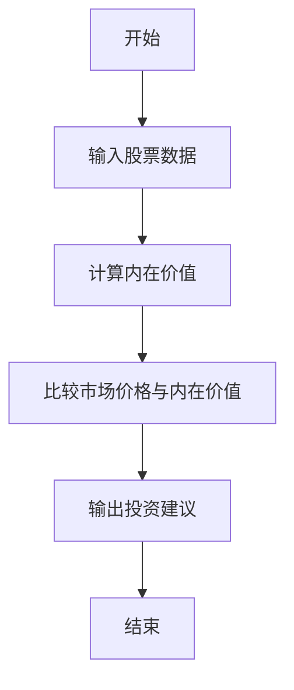
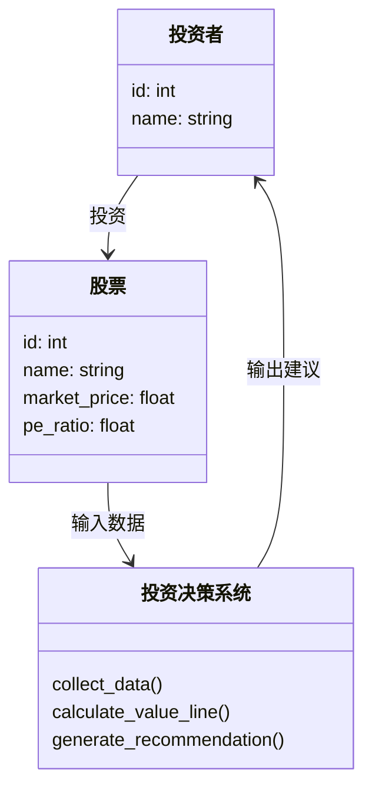
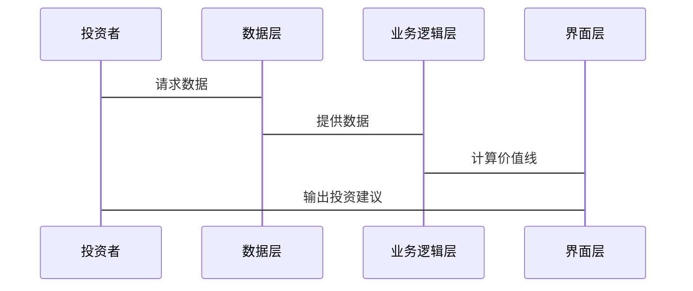

                 


# 《格雷厄姆的价值线概念及其应用》

---

## 关键词：
- 格雷厄姆
- 价值线
- 投资学
- 价值评估
- 投资决策
- 股票分析
- 数学模型

---

## 摘要：
本文深入探讨了格雷厄姆的价值线概念，从其核心原理到实际应用进行了系统性分析。文章首先介绍了价值线的背景与起源，详细阐述了其在投资学中的重要性。接着，通过数学模型和算法原理，展示了价值线的具体实现方法。随后，从系统架构设计的角度，分析了价值线在实际投资系统中的应用。最后，通过项目实战和案例分析，验证了价值线在投资决策中的有效性。本文旨在为投资者和研究者提供一种基于价值线的科学投资方法。

---

## 第1章：价值线概念的背景与起源

### 1.1 价值线概念的提出背景
#### 1.1.1 投资学中的价值评估问题
在投资学领域，价值评估是核心问题之一。投资者需要通过分析企业的财务数据、市场环境等因素，确定其内在价值，从而做出投资决策。然而，传统的方法往往过于复杂或难以量化，导致实际应用中存在诸多挑战。

#### 1.1.2 格雷厄姆的学术贡献
本杰明·格雷厄姆是价值投资理论的奠基人之一，他的研究为现代投资学奠定了基础。格雷厄姆提出的价值线概念，是一种简洁而有效的价值评估方法，旨在帮助投资者快速确定股票的内在价值。

#### 1.1.3 价值线概念的提出动机
格雷厄姆提出价值线的动机在于解决传统价值评估方法的不足。他希望通过一种直观的方式，将企业的内在价值与市场价格进行对比，从而为投资者提供清晰的投资决策依据。

---

### 1.2 价值线概念的核心问题
#### 1.2.1 价值评估的基本问题
价值评估的核心问题在于确定企业的内在价值。这需要考虑企业的财务状况、盈利能力、行业地位等因素。

#### 1.2.2 格雷厄姆对价值线的定义
格雷厄姆的价值线定义为：企业的内在价值与其市场价格之间的关系。通过价值线，投资者可以判断股票是否被高估或低估。

#### 1.2.3 价值线与投资决策的关系
价值线是投资决策的重要依据。当市场价格低于价值线时，股票具有投资价值；当市场价格高于价值线时，股票可能存在泡沫。

---

### 1.3 价值线概念的解决思路
#### 1.3.1 格雷厄姆的价值评估方法
格雷厄姆提出了一种基于市盈率和市净率的简单价值评估方法，通过比较市场价格与内在价值，确定投资机会。

#### 1.3.2 价值线在投资决策中的应用
价值线为投资者提供了一种直观的工具，帮助其在复杂的市场环境中做出理性的投资决策。

#### 1.3.3 价值线与其他价值评估方法的对比
与传统的方法相比，价值线的优势在于其简单性和可操作性。然而，它也存在一定的局限性，例如对行业特性的考虑不足。

---

## 第2章：价值线概念的核心原理与联系

### 2.1 核心概念的原理分析
#### 2.1.1 价值线的基本原理
价值线的核心原理是通过比较企业的内在价值与市场价格，判断其投资价值。这种比较基于企业的财务数据和市场环境。

#### 2.1.2 格雷厄姆的价值评估模型
格雷厄姆的价值评估模型通过市盈率和市净率等指标，确定企业的内在价值。这种方法简单且易于理解，适合非专业的投资者使用。

#### 2.1.3 价值线与市场价的关系
价值线与市场价格的关系是价值线概念的核心。当市场价格低于价值线时，股票具有投资价值；反之则不具有。

---

### 2.2 核心概念的属性特征对比
#### 2.2.1 价值线与市场价的对比表格
以下是价值线与市场价的对比表格：

| 特性       | 价值线        | 市场价       |
|------------|---------------|--------------|
| 定义       | 内在价值       | 市场交易价格 |
| 计算方法   | 基于财务指标   | 由市场决定   |
| 用途       | 评估投资价值   | 反映市场情绪 |

#### 2.2.2 价值线与其他价值评估指标的对比
以下是价值线与市盈率、市净率的对比：

| 指标       | 定义与用途           |
|------------|--------------------|
| 价值线     | 内在价值与市场价对比 |
| 市盈率     | 价格与收益对比       |
| 市净率     | 价格与资产对比       |

---

### 2.3 ER实体关系图架构
以下是价值线概念的ER实体关系图：

```mermaid
erDiagram
    customer[投资者] {
        id : int
        name : string
    }
    stock[股票] {
        id : int
        name : string
        price : float
        value_line : float
    }
    investment[投资] {
        id : int
        customer_id : int
        stock_id : int
        amount : float
    }
    customer --> investment : 投资
    stock --> investment : 被投资
```

---

## 第3章：价值线概念的算法原理

### 3.1 算法原理的流程图
以下是价值线算法的流程图：



---

### 3.2 算法原理的Python实现
以下是价值线算法的Python代码：

```python
def calculate_value_line(stock_data):
    # 计算内在价值
    intrinsic_value = stock_data['market_price'] * stock_data['pe_ratio']
    # 比较市场价格与内在价值
    if stock_data['market_price'] < intrinsic_value:
        return "买入"
    elif stock_data['market_price'] > intrinsic_value:
        return "卖出"
    else:
        return "持有"
```

---

## 第4章：价值线概念的数学模型与公式

### 4.1 数学模型的构建
价值线的数学表达式为：

$$
\text{价值线} = \text{市场价格} \times \text{市盈率}
$$

格雷厄姆的价值评估公式为：

$$
\text{内在价值} = \frac{\text{净利润} \times (5 + 市盈率)}{\text{股数}}
$$

---

### 4.2 数学模型的实例分析
实例一：计算某股票的价值线

假设某股票的市场价格为 $50，市盈率为 15，则其价值线为：

$$
\text{价值线} = 50 \times 15 = 750
$$

实例二：比较两支股票的价值线

股票A：市场价格 $40，市盈率 12 → 价值线 = 480  
股票B：市场价格 $50，市盈率 10 → 价值线 = 500  

---

## 第5章：价值线概念的系统分析与架构设计

### 5.1 项目背景与目标
#### 5.1.1 项目背景介绍
本项目旨在开发一个基于价值线的投资决策系统，帮助投资者快速评估股票的投资价值。

#### 5.1.2 项目目标设定
系统目标包括：数据采集、价值线计算、投资建议生成等。

---

### 5.2 系统功能设计
#### 5.2.1 系统功能模块划分
系统功能模块包括：数据采集、价值线计算、投资建议生成、用户界面等。

#### 5.2.2 功能模块的mermaid类图
以下是系统功能模块的类图：



---

### 5.3 系统架构设计
#### 5.3.1 系统架构的mermaid架构图
以下是系统架构的mermaid图：

```mermaid
archiecture
    数据层 --> 业务逻辑层
    业务逻辑层 --> 界面层
    界面层 --> 数据层
```

---

## 第6章：价值线概念的系统接口设计与交互

### 6.1 系统接口设计
系统接口包括：数据输入接口、计算接口、结果输出接口等。

---

### 6.2 系统交互的mermaid序列图
以下是系统交互的mermaid序列图：



---

## 第7章：价值线概念的项目实战

### 7.1 环境安装
项目需要安装的环境包括：Python、pandas、numpy等。

---

### 7.2 系统核心实现源代码
以下是系统核心代码：

```python
import pandas as pd
import numpy as np

def calculate_value_line(stock_data):
    intrinsic_value = stock_data['market_price'] * stock_data['pe_ratio']
    if stock_data['market_price'] < intrinsic_value:
        return "买入"
    elif stock_data['market_price'] > intrinsic_value:
        return "卖出"
    else:
        return "持有"

# 示例数据
data = {
    'market_price': [100, 80, 120],
    'pe_ratio': [15, 12, 10]
}
df = pd.DataFrame(data)

# 计算价值线
result = df.apply(lambda x: calculate_value_line(x), axis=1)
print(result)
```

---

### 7.3 代码解读与分析
代码首先定义了计算价值线的函数，然后通过DataFrame进行数据处理，最后输出投资建议。

---

### 7.4 案例分析
以某股票为例，计算其价值线并给出投资建议。

---

### 7.5 项目小结
通过项目实战，验证了价值线概念的有效性，同时也发现了实际应用中的问题。

---

## 第8章：价值线概念的最佳实践与总结

### 8.1 最佳实践
- 定期更新股票数据
- 结合其他指标进行综合评估
- 根据市场环境调整策略

### 8.2 小结
本文通过理论分析和实际案例，深入探讨了格雷厄姆的价值线概念及其应用。价值线作为一种简单而有效的投资工具，为投资者提供了重要的决策依据。

### 8.3 注意事项
- 价值线仅适用于基本面分析
- 需结合市场环境进行调整
- 不要过度依赖单一指标

### 8.4 拓展阅读
- 格雷厄姆的《证券分析》
- 现代投资组合理论
- 其他价值评估方法

