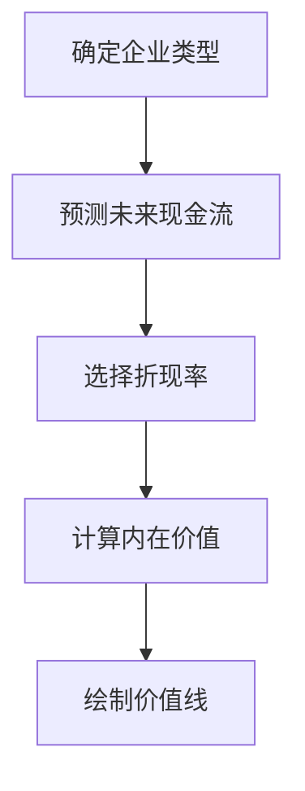
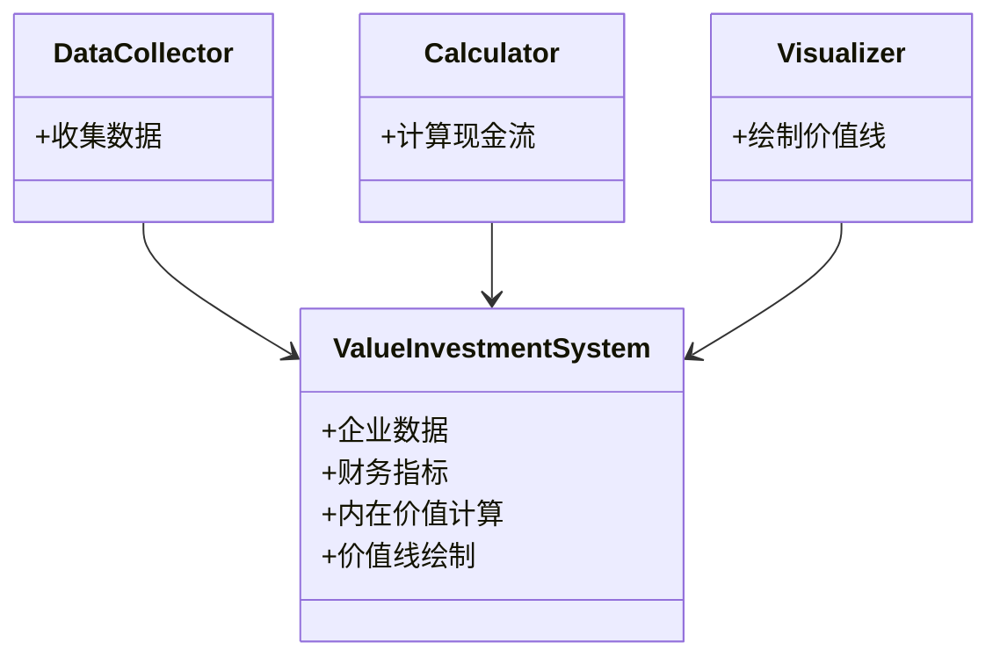
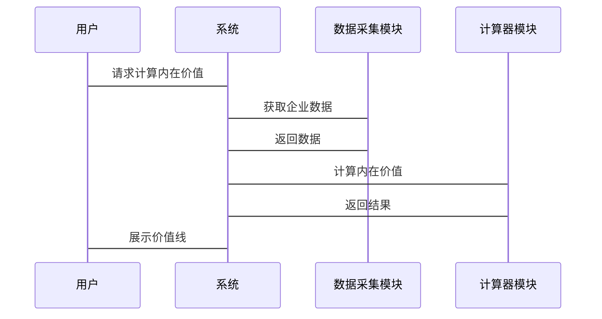

                 


# 格雷厄姆的价值线概念：买入低于内在价值的股票

## 关键词：价值投资，内在价值，价值线，股票估值，格雷厄姆，投资策略

## 摘要：  
本文深入探讨了格雷厄姆的价值线概念，即买入低于内在价值的股票。通过分析价值投资的核心原理、内在价值的计算方法、价值线的数学模型以及实际应用案例，本文为读者提供了全面的理解和实践指导。从价值投资的背景到系统架构设计，从数学模型到项目实战，本文旨在帮助读者掌握价值线概念的精髓，并在实际投资中应用这一策略。

---

## 第一部分：价值投资的背景与基础

### 第1章：价值投资的起源与发展

#### 1.1 价值投资的起源
价值投资是一种长期投资策略，起源于20世纪初。它强调以低于资产内在价值的价格买入股票，并长期持有，直到市场认识到其真实价值。  
**问题背景：**  
传统投资理论往往依赖市场短期波动和价格预测，但这种方法在实践中难以稳定盈利。价值投资则通过分析企业的基本面，寻找被市场低估的投资机会。

**问题解决：**  
格雷厄姆提出的价值投资方法，通过分析企业的内在价值，帮助投资者在市场恐慌或忽视时买入优质资产，从而实现长期收益。

**边界与外延：**  
价值投资的外延包括对股票、债券、房地产等多种资产的分析，但其核心始终围绕资产的内在价值与市场价格的差异。

#### 1.2 格雷厄姆的生平与贡献
本章将介绍格雷厄姆的生平及其对价值投资的贡献。通过分析他的学术背景和《 Intelligent Investor》的核心思想，我们可以理解价值投资的哲学基础。

#### 1.3 价值投资的基本概念
本节将详细阐述价值投资的核心理念，包括内在价值、市场价格、安全边际等关键概念。通过对比分析，帮助读者理解价值投资与其他投资策略的区别。

---

## 第二部分：价值线概念的核心原理

### 第2章：价值线概念的定义与计算

#### 2.1 价值线的定义
价值线是格雷厄姆提出的一个重要概念，用于衡量股票的内在价值与市场价格之间的差异。  
**核心要素：**  
- 内在价值：基于企业基本面的未来现金流折现值。
- 市场价格：当前股票的市场交易价格。
- 安全边际：内在价值与市场价格的差额，反映投资的安全性。

#### 2.2 内在价值的评估方法
本节将详细讲解内在价值的计算方法，包括现金流折现法、市盈率和市净率分析等。通过对比不同方法的优缺点，帮助读者选择合适的投资策略。

#### 2.3 价值线的计算流程
通过一个实际案例，详细展示如何计算股票的内在价值，并绘制价值线。读者将学习如何通过价值线判断股票的买入机会。

---

## 第三部分：价值线概念的数学模型与算法

### 第3章：内在价值的数学模型

#### 3.1 现金流折现法（DCF）的公式
现金流折现法是计算内在价值的核心方法。公式如下：
$$ V = \frac{CF_1}{(1 + r)^1} + \frac{CF_2}{(1 + r)^2} + \cdots + \frac{CF_n}{(1 + r)^n} $$
其中，$CF$为未来现金流，$r$为折现率，$n$为投资期限。

#### 3.2 内在价值与市场价格的对比
通过对比表格，展示内在价值和市场价格的特征，帮助读者理解两者的关系。

#### 3.3 价值线的计算步骤
使用Mermaid流程图展示计算过程：


---

## 第四部分：价值线概念的系统分析与架构设计

### 第4章：价值投资系统的架构

#### 4.1 系统功能模块
- 数据采集模块：收集企业的财务数据、行业信息等。
- 内在价值计算模块：基于现金流折现法计算内在价值。
- 价值线绘制模块：将内在价值与市场价格对比，绘制价值线。
- 投资决策模块：根据价值线判断买入机会。

#### 4.2 系统架构设计
使用Mermaid类图展示系统架构：


#### 4.3 系统接口设计
- 数据接口：从数据库或API获取企业数据。
- 计算接口：接收财务指标，输出内在价值。
- 可视化接口：将价值线展示给用户。

#### 4.4 系统交互流程
使用Mermaid序列图展示交互流程：


---

## 第五部分：项目实战

### 第5章：价值投资系统的实现

#### 5.1 环境安装
- 安装Python和相关库（Pandas、NumPy、Matplotlib）。
- 数据来源：从Yahoo Finance获取股票数据。

#### 5.2 核心代码实现
以下是Python代码示例：
```python
import pandas as pd
import numpy as np
import matplotlib.pyplot as plt

def calculate_intrinsic_value(cash_flows, discount_rate):
    return np.sum(cash_flows / (1 + discount_rate) ** np.arange(len(cash_flows)))

# 示例数据
cash_flows = [100, 150, 200, 250]
discount_rate = 0.1

intrinsic_value = calculate_intrinsic_value(cash_flows, discount_rate)
print(f"内在价值：{intrinsic_value:.2f}")
```

#### 5.3 代码解读与分析
代码解释：
- `calculate_intrinsic_value`函数通过现金流折现法计算内在价值。
- 示例数据展示如何计算内在价值，并与市场价格进行对比。

#### 5.4 案例分析
以苹果公司为例，分析其内在价值与市场价格的关系，并绘制价值线。

---

## 第六部分：最佳实践

### 第6章：价值投资的注意事项

#### 6.1 小结
- 价值线概念的核心在于识别市场低估的股票。
- 长期持有是实现价值回归的关键。

#### 6.2 注意事项
- 需要持续关注企业的基本面变化。
- 避免过度依赖单一指标。

#### 6.3 拓展阅读
推荐阅读格雷厄姆的《 Intelligent Investor》以及巴菲特的价值投资理念。

---

## 结语
通过本文的详细讲解，读者可以全面理解格雷厄姆的价值线概念，并在实际投资中应用这一策略。价值投资不仅是一种投资方法，更是一种长期坚持的哲学。希望本文能为读者在投资道路上提供有价值的指导。

--- 

这篇文章通过详细阐述价值线概念的背景、原理、数学模型和实际应用，帮助读者掌握这一投资策略的核心精髓。

