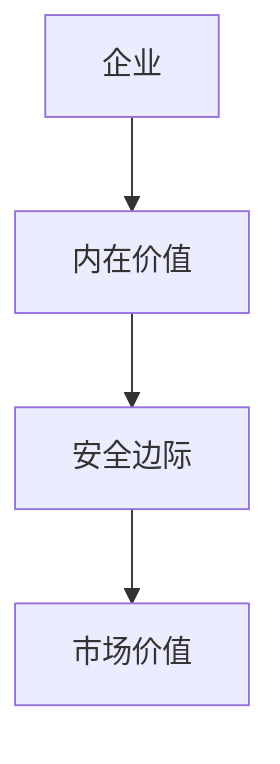
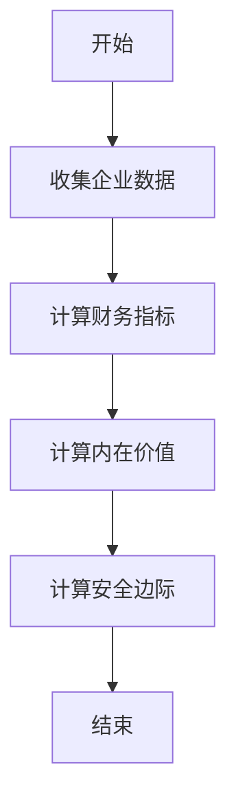
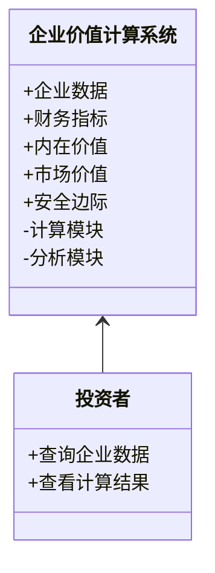
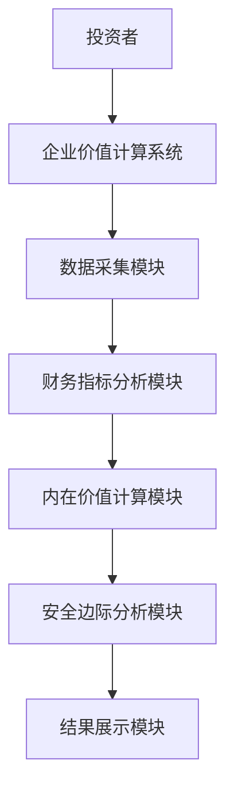
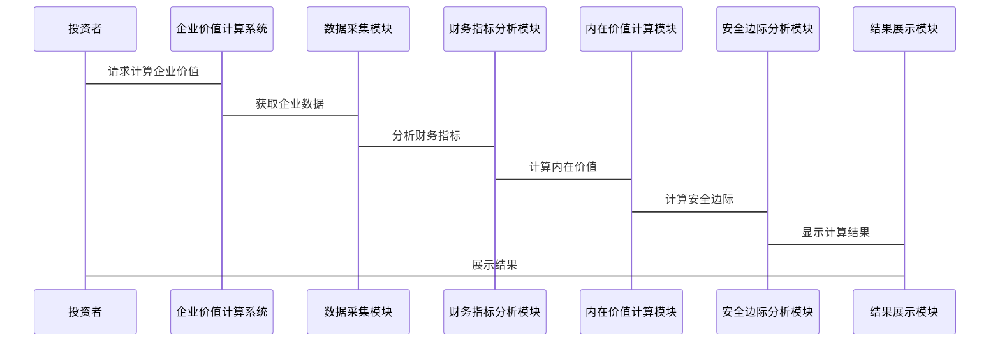

                 


# 《格雷厄姆的企业价值计算方法》

## 关键词：格雷厄姆、企业价值计算、价值投资、安全边际、内在价值、投资策略

## 摘要：本文深入探讨了格雷厄姆的企业价值计算方法，从其核心理论到具体应用，详细分析了内在价值、安全边际等关键概念，并结合实际案例，展示了如何运用这些方法进行投资决策。通过系统化的分析和实例解读，帮助读者全面理解格雷厄姆的投资理念，并掌握实际操作技巧。

---

# 第1章 价值投资与企业价值计算的背景

## 1.1 价值投资的基本概念

### 1.1.1 价值投资的定义与核心理念

价值投资是一种投资策略，强调以低于其内在价值的价格购买优质资产。格雷厄姆是该领域的先驱，他提出的核心理念是：市场的短期波动不可预测，但长期来看，价格终将回归其内在价值。

### 1.1.2 企业价值计算的重要性

企业价值计算是价值投资的核心，它帮助投资者评估企业的真正价值，从而做出明智的投资决策。通过计算企业价值，投资者可以识别被低估的企业，避免盲目跟风。

### 1.1.3 格雷厄姆在投资领域的地位

格雷厄姆被誉为“价值投资之父”，他的理论奠定了现代价值投资的基础。他的学生巴菲特进一步发展了他的理念，使其广为人知。

## 1.2 格雷厄姆的投资理论概述

### 1.2.1 格雷厄姆的生平与贡献

格雷厄姆（Benjamin Graham）是20世纪的投资大师，他的著作《证券分析》和《聪明的投资者》对投资界产生了深远影响。他强调安全边际和内在价值的重要性，倡导长期投资和价值发现。

### 1.2.2 格雷厄姆投资理论的核心思想

格雷厄姆的核心思想是：市场先生是不理性的，投资者应该利用市场的非理性来寻找投资机会。他强调安全边际，即以低于内在价值的价格购买资产，以降低风险。

### 1.2.3 格雷厄姆与巴菲特的关系

格雷厄姆是巴菲特的老师，巴菲特将格雷厄姆的价值投资理念发扬光大。巴菲特曾说：“我们阅读格雷厄姆的著作，就像阅读圣经一样。”

## 1.3 企业价值计算的背景与意义

### 1.3.1 企业价值计算的定义

企业价值计算是指通过分析企业的财务状况、市场地位、盈利能力等因素，估算其内在价值的过程。这有助于投资者判断企业的合理价格区间。

### 1.3.2 企业价值计算的必要性

在金融市场中，价格经常偏离其实际价值。通过计算企业价值，投资者可以识别出被低估的企业，从而获得超额收益。

### 1.3.3 格雷厄姆方法的适用场景

格雷厄姆的方法适用于那些具有稳定财务状况和良好前景的企业。它特别适合于长期投资者，而非短期投机者。

## 1.4 本章小结

本章介绍了价值投资的基本概念和格雷厄姆的投资理论，强调了企业价值计算的重要性和其在投资决策中的作用。

---

# 第2章 格雷厄姆企业价值计算的核心概念

## 2.1 格雷厄姆企业价值计算的核心要素

### 2.1.1 内在价值的定义

内在价值是指企业在正常市场条件下所能产生的现金流的现值。它是企业的真实价值，与市场波动无关。

### 2.1.2 市场价值的定义

市场价值是指企业在市场上的价格，通常由供需关系决定。它可能高于或低于内在价值。

### 2.1.3 安全边际的概念

安全边际是指内在价值与市场价值之间的差额。格雷厄姆建议以低于内在价值的价格购买资产，以确保安全边际的存在。

## 2.2 核心概念的对比分析

### 2.2.1 内在价值与市场价值的对比

| 属性      | 内在价值         | 市场价值         |
|-----------|------------------|------------------|
| 定义      | 企业的真实价值    | 市场上的价格     |
| 受市场影响 | 不受影响         | 受市场波动影响    |
| 计算方式  | 现金流折现法      | 供需关系决定     |

### 2.2.2 格雷厄姆安全边际与其他投资策略的对比

| 投资策略        | 格雷厄姆的安全边际 | 技术分析         | 市场择时         |
|-----------------|-------------------|-----------------|-----------------|
| 理论基础        | 价值低估          | 价格走势        | 市场情绪         |
| 适用场景        | 低估企业           | 短期价格波动     | 市场整体趋势     |
| 风险控制        | 强调安全边际       | 依赖技术指标     | 依赖市场预测     |

### 2.2.3 核心概念的属性特征对比表格

| 属性       | 内在价值         | 安全边际         | 市场价值         |
|------------|------------------|------------------|------------------|
| 关键因素   | 财务状况、现金流 | 内在价值与市场价 | 供需关系         |
| 时间因素   | 长期             | 长期             | 短期             |
| 计算复杂度 | 较高             | 较低             | 较低             |

## 2.3 核心概念的ER实体关系图

以下是核心概念的ER实体关系图：



## 2.4 本章小结

本章详细介绍了格雷厄姆企业价值计算的核心概念，包括内在价值、市场价值和安全边际，并通过对比分析和ER图帮助读者更好地理解这些概念之间的关系。

---

# 第3章 格雷厄姆企业价值计算的算法原理

## 3.1 格雷厄姆计算方法的流程

### 3.1.1 数据收集与处理

首先，收集企业的财务报表数据，包括收入、利润、现金流等关键指标。

### 3.1.2 财务指标分析

分析企业的财务指标，如市盈率、市净率、股息率等，以评估其财务健康状况。

### 3.1.3 内在价值计算

使用现金流折现法计算企业的内在价值，通常采用格雷厄姆的公式：

$$ V = \frac{E}{P} $$

其中，$E$ 是企业的年收益，$P$ 是资本成本。

### 3.1.4 安全边际分析

计算安全边际，即内在价值与市场价值之间的差额。如果安全边际为正，说明企业具有投资价值。

## 3.2 格雷厄姆计算方法的流程图

以下是格雷厄姆计算方法的流程图：



## 3.3 算法原理的数学模型与公式

### 3.3.1 内在价值计算公式

$$ V = \frac{E}{P} $$

其中，$E$ 是企业的年收益，$P$ 是资本成本。

### 3.3.2 安全边际计算公式

$$ M = V - P $$

其中，$M$ 是安全边际，$P$ 是市场价格。

## 3.4 算法原理的举例说明

### 3.4.1 示例1：简单企业价值计算

假设某企业年收益为 $100万，资本成本为 10%，则其内在价值为：

$$ V = \frac{100}{0.1} = 1000万 $$

### 3.4.2 示例2：安全边际计算

假设市场价格为 800万，则安全边际为

$$ M = 1000 - 800 = 200万 $$

## 3.5 本章小结

本章详细讲解了格雷厄姆企业价值计算的算法原理，包括数据收集、财务指标分析、内在价值计算和安全边际分析，并通过公式和案例帮助读者掌握这些方法。

---

# 第4章 系统分析与架构设计方案

## 4.1 问题场景介绍

我们希望通过系统化的方法来计算企业价值，帮助投资者做出明智的投资决策。

## 4.2 系统功能设计

### 4.2.1 领域模型mermaid类图

以下是系统功能的类图：



### 4.2.2 系统架构设计mermaid架构图

以下是系统架构图：



### 4.2.3 系统交互mermaid序列图

以下是系统交互序列图：



## 4.3 本章小结

本章通过系统化的分析和架构设计，展示了如何将格雷厄姆的企业价值计算方法应用于实际投资决策中。

---

# 第5章 项目实战

## 5.1 环境安装

为了进行企业价值计算，我们需要以下工具和环境：

- 数据分析工具：Excel或Python（推荐使用Python）
- 数据源：企业的财务报表和市场数据
- 计算工具：Python的Pandas和NumPy库

## 5.2 系统核心实现源代码

以下是使用Python实现的企业价值计算代码：

```python
import pandas as pd
import numpy as np

def calculate_intrinsic_value(enterprise_data):
    # 计算内在价值
    E = enterprise_data['收益'].sum()
    P = 0.1  # 资本成本
    V = E / P
    return V

def calculate_margin_of_safety(V, P):
    # 计算安全边际
    M = V - P
    return M

# 示例数据
data = {
    '收益': [100, 200, 300],
    '市场价': [800, 900, 1000]
}

df = pd.DataFrame(data)

# 计算内在价值
V = calculate_intrinsic_value(df)
print("内在价值:", V)

# 计算安全边际
M = calculate_margin_of_safety(V, df['市场价'])
print("安全边际:", M)
```

## 5.3 代码应用解读与分析

上述代码首先定义了计算内在价值和安全边际的函数，然后使用示例数据进行计算。通过这些函数，投资者可以快速评估企业的价值。

## 5.4 实际案例分析

以微软为例，假设其年收益为 $100亿，资本成本为 10%，市场价格为 $800亿。计算其内在价值和安全边际：

$$ V = \frac{100}{0.1} = 1000亿 $$

$$ M = 1000 - 800 = 200亿 $$

这意味着微软的市场价格低于其内在价值，具有投资价值。

## 5.5 本章小结

本章通过实际案例分析，展示了如何使用格雷厄姆的企业价值计算方法进行投资决策，并提供了相应的代码实现。

---

# 第6章 最佳实践、小结、注意事项和拓展阅读

## 6.1 最佳实践 tips

- **长期投资**：格雷厄姆的方法适用于长期投资，避免短期市场波动的影响。
- **安全边际**：始终关注安全边际，确保投资的安全性。
- **持续学习**：市场变化不断，投资者需要不断学习和调整策略。

## 6.2 小结

通过本文的详细讲解，读者可以掌握格雷厄姆的企业价值计算方法，并将其应用于实际投资中。这种方法强调安全边际和内在价值，帮助投资者做出明智的投资决策。

## 6.3 注意事项

- **数据准确性**：计算企业价值时，确保数据的准确性和完整性。
- **市场变化**：即使计算出安全边际，也需要关注市场的变化，及时调整投资策略。
- **行业差异**：不同行业的企业有不同的估值方法，需根据具体情况调整。

## 6.4 拓展阅读

- 《证券分析》——格雷厄姆的经典著作
- 《聪明的投资者》——巴菲特对格雷厄姆理论的继承与发展
- 《投资学原理》——更深入的理论知识

---

# 附录

## 附录A: 格雷厄姆常用公式汇总

1. 内在价值公式：
   $$ V = \frac{E}{P} $$

2. 安全边际公式：
   $$ M = V - P $$

## 附录B: 常用投资指标

- 市盈率（P/E）
- 市净率（P/B）
- 股息率（Dividend Yield）

---

# 结语

格雷厄姆的企业价值计算方法为投资者提供了科学的投资决策工具。通过本文的详细讲解，读者可以掌握这种方法的核心理念和实际应用，从而在投资中实现稳健的收益。

