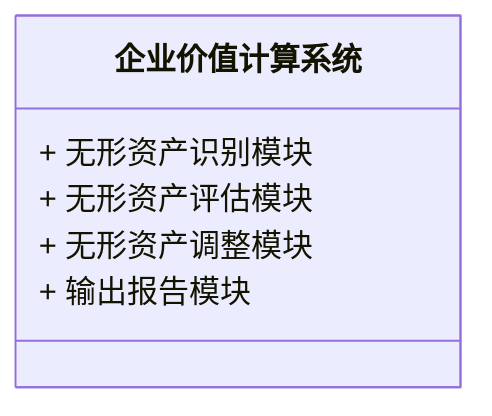

                 


# 格雷厄姆的企业价值计算：调整无形资产的重要性

## 关键词：企业价值计算、格雷厄姆理论、无形资产、投资评估、价值投资

## 摘要：本文深入探讨了格雷厄姆的价值投资理论在企业价值计算中的应用，重点分析了调整无形资产的重要性。通过详细阐述无形资产的识别、评估和调整方法，结合实际案例和系统架构设计，本文为投资者提供了一套科学的企业价值评估体系，帮助他们在投资决策中更准确地衡量企业价值。

---

# 第一部分：引言

## 第1章：企业价值计算的背景与重要性

### 1.1 企业价值计算的基本概念

#### 1.1.1 企业价值的定义
企业价值（Enterprise Value, EV）是指公司整体的经济价值，包括股权和债务的总价值。它是企业未来现金流的现值，反映了企业的整体实力和市场地位。

$$ EV = \text{未来现金流的现值} $$

#### 1.1.2 企业价值计算的目的与意义
企业价值计算旨在为企业提供合理的估值，帮助投资者做出明智的投资决策。它不仅反映了企业的财务状况，还能揭示企业的市场竞争力和潜在价值。

#### 1.1.3 无形资产在企业价值中的作用
无形资产，如品牌、专利、商誉等，对企业价值具有重要影响。它们通常无法在资产负债表中完全体现，但却是企业长期竞争优势的关键因素。

---

### 1.2 传统企业价值计算方法的局限性

#### 1.2.1 市盈率法的局限性
市盈率法仅考虑了股价与每股收益的关系，忽视了企业的负债和资本结构，无法全面反映企业的真实价值。

$$ P/E = \frac{\text{股价}}{\text{每股收益}} $$

#### 1.2.2 净资产收益率法的局限性
净资产收益率（ROE）虽然能衡量企业的盈利能力，但忽略了资产周转率和杠杆效应，无法准确评估企业价值。

$$ ROE = \frac{\text{净利润}}{\text{净资产}} $$

#### 1.2.3 现金流折现法的局限性
现金流折现法虽然考虑了未来现金流的现值，但在实际操作中，预测未来现金流具有较高的不确定性，且难以量化无形资产的价值。

$$ EV = \sum_{t=1}^{n} \frac{\text{现金流}}{(1 + r)^t} $$

---

### 1.3 调整无形资产的重要性

#### 1.3.1 无形资产的定义与分类
无形资产是指企业长期使用、不具有实物形态的资产，主要包括专利权、商标权、商誉等。

#### 1.3.2 无形资产对企业价值的影响
无形资产能够为企业创造超额利润，增强市场竞争力，从而提升企业价值。忽视无形资产的贡献，会导致企业估值偏低。

#### 1.3.3 调整无形资产的必要性
在传统的价值评估中，无形资产的价值往往被低估或忽略。通过调整无形资产，可以更准确地反映企业的实际价值。

---

## 第2章：格雷厄姆的企业价值计算理论

### 2.1 格雷厄姆投资理论概述

#### 2.1.1 格雷厄姆的价值投资理念
格雷厄姆认为，投资的本质是寻找低于内在价值的股票，通过安全边际来降低投资风险。

#### 2.1.2 格雷厄姆的企业价值计算方法
格雷厄姆提出了基于资产净值的估值方法，即：

$$ EV = \text{资产净值} \times \text{安全边际系数} $$

#### 2.1.3 格雷厄姆理论的现代应用
尽管格雷厄姆的理论提出于20世纪，但其核心思想在现代投资实践中仍具有重要指导意义。

---

### 2.2 格雷厄姆企业价值计算的核心公式

#### 2.2.1 格雷厄姆公式的基本结构
格雷厄姆公式将企业的价值与其账面价值和市场价值进行对比，提出了以下公式：

$$ \text{内在价值} = \text{账面价值} \times \text{安全边际} $$

#### 2.2.2 格雷厄姆公式的关键参数
- 账面价值：企业的资产净值。
- 安全边际：基于市场波动和企业风险的安全系数。

#### 2.2.3 格雷厄姆公式的数学推导
通过对企业历史数据的分析，格雷厄姆提出了以下简化公式：

$$ EV = \frac{\text{净利润} \times \text{市盈率}}{\text{资本成本}} $$

---

### 2.3 格雷厄姆理论与无形资产的关系

#### 2.3.1 格雷厄姆理论中无形资产的定位
格雷厄姆理论并未忽视无形资产的重要性，但其调整方法主要基于账面价值，未能充分考虑无形资产的未来收益。

#### 2.3.2 格雷厄姆理论对无形资产的调整方法
通过调整无形资产的折旧率和摊销期，可以更准确地反映其对企业价值的影响。

#### 2.3.3 格雷厄姆理论的局限性与改进方向
格雷厄姆理论在无形资产调整方面存在一定局限性，需要结合现代评估方法进行改进。

---

# 第二部分：调整无形资产的方法论

## 第3章：无形资产的识别与评估

### 3.1 无形资产的识别标准

#### 3.1.1 无形资产的可识别性
通过市场分析和财务报表识别无形资产的存在和价值。

#### 3.1.2 无形资产的可计量性
采用市场法、收益法和成本法等方法评估无形资产的价值。

#### 3.1.3 无形资产的可变现性
分析无形资产的市场前景和变现能力，确定其对企业的贡献。

---

### 3.2 无形资产的评估方法

#### 3.2.1 市场法评估无形资产
通过对比类似资产的市场价格，评估无形资产的价值。

#### 3.2.2 收益法评估无形资产
基于未来现金流的现值，计算无形资产的价值。

#### 3.2.3 成本法评估无形资产
根据无形资产的开发成本，估算其价值。

---

### 3.3 无形资产评估中的关键问题

#### 3.3.1 无形资产的寿命问题
评估无形资产的使用寿命，确保其价值计算的合理性。

#### 3.3.2 无形资产的经济性问题
分析无形资产的经济收益，避免高估或低估其价值。

#### 3.3.3 无形资产的法律保护问题
考虑无形资产的法律保护措施，确保其价值的可持续性。

---

## 第4章：调整无形资产的具体方法

### 4.1 调整无形资产的基本思路

#### 4.1.1 调整无形资产的必要性
通过调整无形资产，确保企业价值评估的准确性。

#### 4.1.2 调整无形资产的步骤
1. 识别无形资产。
2. 评估无形资产的价值。
3. 调整无形资产的账面价值。

#### 4.1.3 调整无形资产的关键点
确保调整方法的科学性和可操作性。

---

### 4.2 调整无形资产的具体方法

#### 4.2.1 基于市场比较的调整方法
通过市场比较，调整无形资产的评估值。

#### 4.2.2 基于收益预测的调整方法
根据未来收益预测，调整无形资产的价值。

#### 4.2.3 基于资产重估的调整方法
定期重估无形资产的价值，确保其与市场一致。

---

### 4.3 调整无形资产的数学模型

#### 4.3.1 市场比较法的数学模型
$$ \text{调整后的价值} = \text{市场平均值} \times \text{调整系数} $$

#### 4.3.2 收益预测法的数学模型
$$ \text{调整后的价值} = \sum_{t=1}^{n} \frac{\text{未来现金流}}{(1 + r)^t} $$

---

# 第三部分：系统架构与项目实战

## 第5章：系统架构设计

### 5.1 问题场景介绍
本系统旨在帮助企业准确评估无形资产的价值，优化企业价值计算。

### 5.2 系统功能设计

#### 5.2.1 领域模型（Mermaid类图）


### 5.3 系统架构设计（Mermaid架构图）


---

## 第6章：项目实战

### 6.1 环境安装
- 安装Python和相关库（如numpy、pandas）。
- 安装Mermaid工具用于绘制图表。

### 6.2 系统核心实现源代码

#### 6.2.1 无形资产识别模块
```python
def identify_intangible_assets(financial_data):
    # 代码实现
    pass
```

#### 6.2.2 无形资产评估模块
```python
def assess_intangible_assets(assets):
    # 代码实现
    pass
```

#### 6.2.3 无形资产调整模块
```python
def adjust_intangible_assets(assessment):
    # 代码实现
    pass
```

### 6.3 代码应用解读与分析
通过实际案例分析，展示代码的实现过程和结果。

### 6.4 实际案例分析
以某科技公司为例，展示如何通过系统计算调整后的无形资产价值，提升企业估值。

---

## 第7章：总结与展望

### 7.1 最佳实践 tips
- 定期调整无形资产价值。
- 结合多种评估方法，确保准确性。

### 7.2 小结
本文详细探讨了格雷厄姆的企业价值计算理论，重点分析了调整无形资产的重要性，并通过系统架构和项目实战验证了方法的有效性。

### 7.3 注意事项
在实际操作中，需注意数据的准确性和方法的适用性。

### 7.4 拓展阅读
推荐相关书籍和论文，供读者深入学习。

---

通过以上内容，本文系统地阐述了格雷厄姆的企业价值计算理论，并重点分析了调整无形资产的重要性。结合实际案例和系统设计，为投资者提供了科学的企业价值评估方法。

