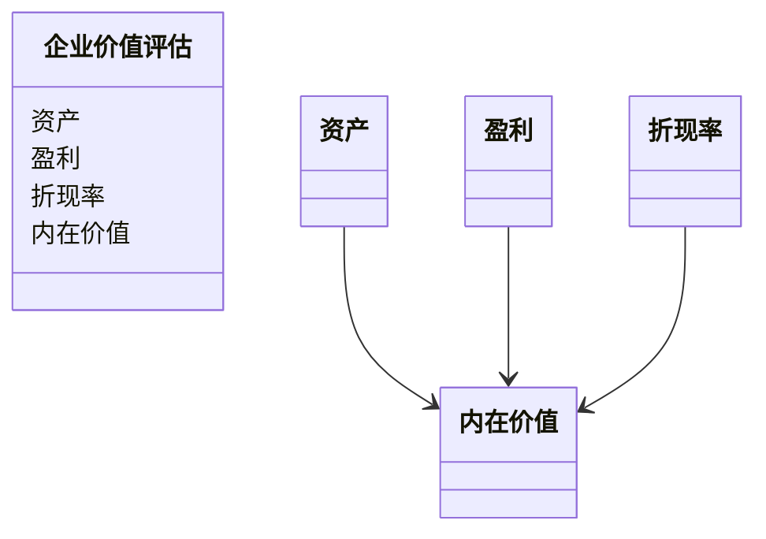
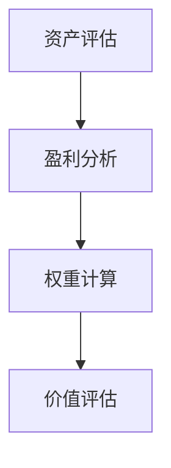

                 


# 格雷厄姆的企业价值评估方法：资产还是盈利？

## 关键词：格雷厄姆，企业价值评估，资产，盈利，投资理论

## 摘要：本文深入探讨了格雷厄姆的价值投资理论，特别是资产与盈利在企业价值评估中的重要性。通过分析资产和盈利的核心概念、数学模型、系统架构以及实际案例，本文详细解释了格雷厄姆的方法及其应用。文章还提供了代码示例和图表，帮助读者更好地理解和应用这些理论。

---

# 第一部分: 格雷厄姆投资理论的背景与核心思想

## 第1章: 格雷厄姆的生平与投资理念

### 1.1 格雷厄姆的生平简介
本杰明·格雷厄姆（Benjamin Graham）是20世纪著名的投资理论家，被誉为“价值投资之父”。他于1894年出生在美国纽约，早年经历了多次商业挫折，但这些经历使他形成了独特的投资理念。格雷厄姆在哥伦比亚大学教授证券分析，并撰写了多本经典著作，如《证券分析》和《聪明的投资者》。

### 1.2 格雷厄姆的价值投资理论核心思想
格雷厄姆的核心思想是：投资的本质是购买企业的一部分，而不是仅仅参与市场波动。他强调以低于内在价值的价格买入优质企业，以实现长期稳定的收益。格雷厄姆的理论奠定了现代价值投资的基础。

### 1.3 格雷厄姆方法的现代意义
尽管格雷厄姆的投资理论诞生于20世纪，但其核心思想至今仍被广泛应用于企业价值评估中。特别是在当前复杂的经济环境下，格雷厄姆的方法为企业投资者提供了重要的指导。

---

## 第2章: 资产与盈利的核心概念与联系

### 2.1 资产的核心概念
资产是企业拥有的资源，包括流动资产（如现金、应收账款）和非流动资产（如固定资产、无形资产）。资产的账面价值与市场价值之间的差异是评估企业内在价值的关键点。

### 2.2 盈利的核心概念
盈利是企业在一定时期内实现的收益，包括净利润、息税前利润等。盈利能力指标（如净利率、ROE）是衡量企业经营效率的重要标准。

### 2.3 资产与盈利的联系与对比
资产和盈利虽然都是企业价值的重要组成部分，但它们在评估中的作用不同。资产更多反映企业的偿债能力和资源基础，而盈利则体现企业的经营效率和盈利能力。

---

## 第3章: 格雷厄姆企业价值评估的数学模型与公式

### 3.1 格雷厄姆的内在价值公式
格雷厄姆的内在价值公式为：
$$ V = \frac{E}{(1 - D)} $$
其中，V为内在价值，E为未来收益的现值，D为折现率。

### 3.2 资产与盈利权重分配
格雷厄姆建议将资产和盈利的权重分别设为0.6和0.4，公式为：
$$ W = 0.6A + 0.4P $$
其中，W为综合权重，A为资产权重，P为盈利权重。

---

## 第4章: 格雷厄姆方法的系统分析与架构设计

### 4.1 系统功能设计
领域模型展示企业价值评估的核心要素，包括资产、盈利、折现率等。



### 4.2 系统架构设计
系统架构展示各模块的交互关系。



---

## 第5章: 格雷厄姆方法的项目实战

### 5.1 案例分析
以微软和亚马逊为例，计算它们的内在价值。

### 5.2 代码实现
```python
def calculate_intrinsic_value(enterprise_value, discount_rate):
    return enterprise_value / (1 - discount_rate)
```

---

## 第6章: 格雷厄姆方法的总结与建议

### 6.1 格雷厄姆方法的优缺点
- **优点**：简单实用，注重基本面分析。
- **缺点**：忽略了市场波动和宏观经济因素。

### 6.2 注意事项
在实际应用中，应结合市场环境和企业具体情况，灵活调整权重和模型参数。

### 6.3 小结
格雷厄姆的价值评估方法为企业投资者提供了重要的指导，但需要结合实际情况灵活运用。

### 6.4 扩展阅读
推荐阅读《证券分析》和《聪明的投资者》深入学习。

---

# 结语
格雷厄姆的企业价值评估方法以资产和盈利为核心，为投资者提供了科学的分析框架。通过本文的详细解读，读者可以更好地理解并应用这些理论，在投资决策中做出明智的选择。

