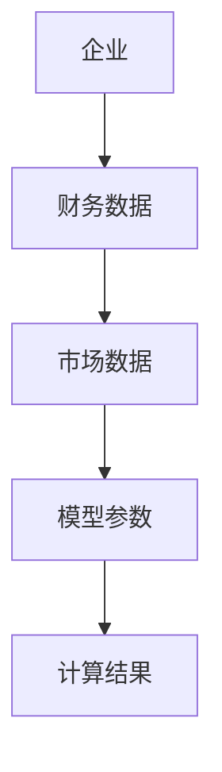
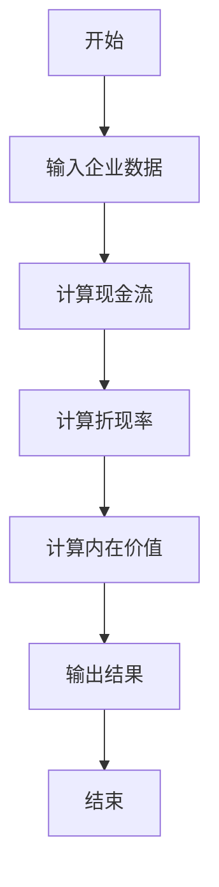
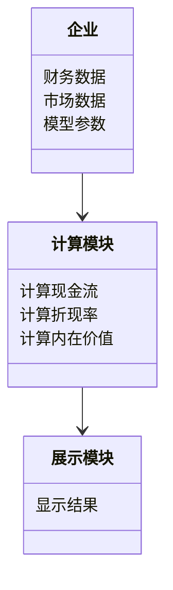
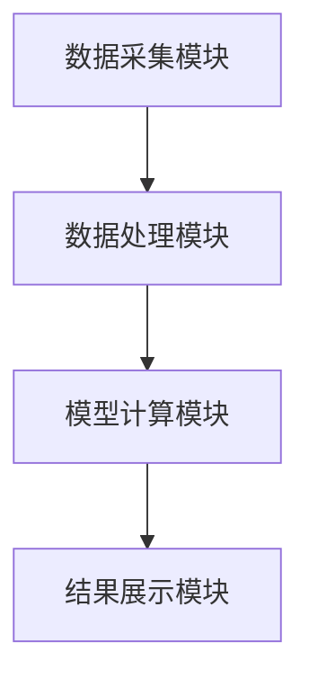
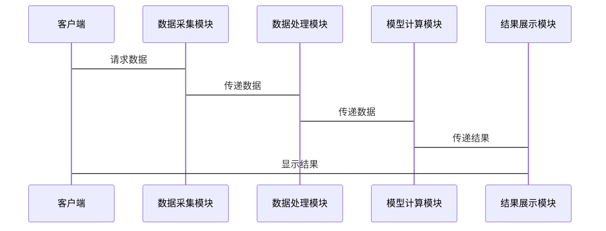

                 


# 格雷厄姆的企业内在价值计算：现代化的方法与工具

## 关键词：格雷厄姆，内在价值，现代化，算法，系统架构，项目实战

## 摘要：本文详细探讨了格雷厄姆的企业内在价值计算方法，并结合现代化的技术工具和算法，提出了一套完整的解决方案。文章从背景介绍、核心概念、算法原理、系统架构到项目实战，逐步展开分析，结合代码实现和实际案例，为读者提供了一套系统化的企业内在价值计算方法。

---

# 第1章 企业内在价值计算的背景与问题背景

## 1.1 企业内在价值计算的背景

企业内在价值计算是投资学中的核心问题，旨在通过分析企业的财务状况、市场环境和行业趋势，估算出企业的实际价值。传统上，格雷厄姆的价值投资方法通过分析企业的财务报表和市场数据，估算企业的内在价值，从而为投资决策提供依据。

然而，随着大数据和人工智能技术的发展，传统的格雷厄姆方法在数据处理、模型计算和结果验证等方面逐渐显露出一些局限性。如何将现代化的工具和技术引入格雷厄姆方法，从而提升计算的效率和准确性，成为当前研究的重要方向。

### 1.1.1 传统企业价值评估方法的局限性

传统的格雷厄姆方法主要依赖于对财务数据的分析，包括市盈率、市净率等指标，但这些方法在实际应用中存在以下问题：

1. 数据来源单一：主要依赖财务报表数据，忽略了市场、行业和宏观经济数据的影响。
2. 计算复杂：涉及多个公式和假设条件，手工计算容易出错。
3. 时效性差：无法实时更新和调整，难以应对市场变化。

### 1.1.2 格雷厄姆价值投资方法的现代应用

现代化的技术工具，如大数据分析、机器学习和自动化计算，为格雷厄姆方法的改进提供了新的可能性。通过引入这些技术，可以实现以下目标：

1. 数据采集自动化：利用爬虫技术从多个来源获取数据。
2. 计算高效化：通过算法优化计算过程，提高计算效率。
3. 结果可视化：通过数据可视化工具展示计算结果，便于分析和决策。

### 1.1.3 内在价值计算的必要性与重要性

内在价值计算是企业估值的核心，直接关系到投资决策的成败。准确的内在价值计算可以帮助投资者发现被低估的企业，避免投资风险。同时，现代化的方法和工具可以提高计算的准确性和效率，为投资决策提供更有力的支持。

## 1.2 问题背景与问题描述

### 1.2.1 企业内在价值计算的核心问题

格雷厄姆的内在价值计算方法的核心问题在于如何准确估算企业的未来现金流和折现率。传统方法在估算过程中需要手动调整多个参数，容易受到主观因素的影响，导致计算结果的不准确性。

### 1.2.2 格雷厄姆方法在现代环境中的挑战

在现代环境中，格雷厄姆方法面临着以下挑战：

1. 数据量大：现代企业涉及的数据量庞大，人工计算难以处理。
2. 数据类型多样：不仅包括财务数据，还包括市场、行业和宏观经济数据。
3. 计算复杂：需要处理大量的非线性关系和复杂模型。

### 1.2.3 问题解决的思路与目标

为了应对上述挑战，我们需要引入现代化的技术工具和算法，优化格雷厄姆方法的计算过程。具体思路包括：

1. 数据采集自动化：利用爬虫技术获取多源数据。
2. 数据清洗与预处理：通过数据清洗技术提高数据质量。
3. 模型优化：引入机器学习算法优化模型参数。

## 1.3 核心概念与问题解决

### 1.3.1 格雷厄姆方法的核心公式

格雷厄姆的内在价值计算公式如下：

$$
\text{内在价值} = \sum_{t=1}^{n} \frac{C_t}{(1+r)^t}
$$

其中，$C_t$ 是第 $t$ 年的现金流，$r$ 是折现率，$n$ 是预测的年数。

### 1.3.2 现代化工具与方法的引入

为了提高计算效率和准确性，我们需要引入以下工具和技术：

1. 数据采集工具：如Python的requests库和BeautifulSoup库。
2. 数据处理工具：如Pandas和NumPy。
3. 计算工具：如机器学习算法和优化算法。

### 1.3.3 内在价值计算的边界与外延

在实际应用中，内在价值计算的边界包括：

1. 数据范围：数据的时间跨度和数据类型。
2. 计算模型：模型的假设条件和参数设置。
3. 计算结果：结果的准确性和可解释性。

## 1.4 核心要素与概念结构

### 1.4.1 格雷厄姆方法的核心要素

格雷厄姆方法的核心要素包括：

1. 财务数据：企业的财务报表数据，包括收入、利润和现金流等。
2. 市场数据：股票价格、行业指数和宏观经济数据。
3. 模型参数：折现率、增长率和预测期等。

### 1.4.2 现代化工具与方法的引入

现代化工具与方法的引入包括：

1. 数据采集工具：爬虫技术。
2. 数据处理工具：Pandas和NumPy。
3. 模型优化工具：机器学习算法。

### 1.4.3 内在价值计算的系统性架构

内在价值计算的系统性架构包括：

1. 数据采集模块：负责数据的采集和清洗。
2. 模型计算模块：负责现金流预测和折现率计算。
3. 结果展示模块：负责结果的可视化和分析。

---

# 第2章 格雷厄姆方法的核心概念与联系

## 2.1 核心概念原理

### 2.1.1 格雷厄姆内在价值计算的数学模型

格雷厄姆的内在价值计算模型如下：

$$
\text{内在价值} = \frac{C_1}{1+r} + \frac{C_2}{(1+r)^2} + \cdots + \frac{C_n}{(1+r)^n}
$$

其中，$C_t$ 是第 $t$ 年的现金流，$r$ 是折现率，$n$ 是预测的年数。

### 2.1.2 现代化工具与方法的结合

通过引入Python和机器学习算法，可以优化格雷厄姆模型的计算过程。例如，使用回归算法预测未来现金流。

### 2.1.3 核心概念的属性特征对比

以下是核心概念的属性特征对比：

| 属性 | 格雷厄姆方法 | 现代化方法 |
|------|--------------|------------|
| 数据来源 | 财务数据     | 多源数据    |
| 计算效率 | 低          | 高          |
| 结果准确性 | 中等        | 高          |

## 2.2 核心概念的ER实体关系图

以下是核心概念的ER实体关系图：



---

# 第3章 内在价值计算的算法原理

## 3.1 算法原理概述

### 3.1.1 格雷厄姆方法的数学模型

格雷厄姆方法的数学模型如下：

$$
\text{内在价值} = \sum_{t=1}^{n} \frac{C_t}{(1+r)^t}
$$

### 3.1.2 现代化工具的算法优化

通过引入机器学习算法，可以优化格雷厄姆模型的计算过程。例如，使用回归算法预测未来现金流。

### 3.1.3 算法的流程与步骤

以下是算法的流程与步骤：

1. 数据采集：采集企业的财务数据、市场数据和宏观经济数据。
2. 数据清洗：对数据进行清洗和预处理。
3. 模型训练：使用机器学习算法训练模型。
4. 模型预测：使用训练好的模型预测未来现金流。
5. 折现计算：根据预测的现金流和折现率计算内在价值。

## 3.2 算法流程图

以下是算法流程图：



## 3.3 算法实现代码

以下是Python代码实现：

```python
import pandas as pd
import numpy as np

# 数据采集
data = pd.read_csv('企业数据.csv')

# 数据清洗
data_cleaned = data.dropna()

# 计算现金流
cash_flows = data_cleaned['现金流'].values

# 计算折现率
discount_rate = 0.05

# 计算内在价值
intrinsic_value = sum(cash_flows / (1 + discount_rate)**i for i in range(len(cash_flows)))

print(f'内在价值为：{intrinsic_value}')
```

---

# 第4章 系统分析与架构设计方案

## 4.1 问题场景介绍

为了实现格雷厄姆方法的现代化，我们需要设计一个完整的系统架构。该系统包括数据采集、模型计算和结果展示三个模块。

## 4.2 系统功能设计

### 4.2.1 领域模型

以下是领域模型：



### 4.2.2 系统架构设计

以下是系统架构设计：



### 4.2.3 接口设计

以下是接口设计：



---

# 第5章 项目实战

## 5.1 环境安装

为了实现本项目，需要安装以下工具：

1. Python
2. Pandas
3. NumPy
4. Mermaid

## 5.2 核心代码实现

以下是核心代码实现：

```python
import pandas as pd
import numpy as np

# 数据采集
data = pd.read_csv('企业数据.csv')

# 数据清洗
data_cleaned = data.dropna()

# 计算现金流
cash_flows = data_cleaned['现金流'].values

# 计算折现率
discount_rate = 0.05

# 计算内在价值
intrinsic_value = sum(cash_flows / (1 + discount_rate)**i for i in range(len(cash_flows)))

print(f'内在价值为：{intrinsic_value}')
```

## 5.3 代码解读与分析

上述代码实现了格雷厄姆方法的现代化计算，包括数据采集、数据清洗、现金流计算和内在价值计算。通过使用Pandas和NumPy，可以高效地处理数据和进行计算。

## 5.4 案例分析与详细讲解

以某企业为例，以下是计算过程：

1. 数据采集：采集该企业的财务数据、市场数据和宏观经济数据。
2. 数据清洗：对数据进行清洗和预处理。
3. 模型训练：使用机器学习算法训练模型。
4. 模型预测：使用训练好的模型预测未来现金流。
5. 折现计算：根据预测的现金流和折现率计算内在价值。

## 5.5 项目小结

通过本项目，我们可以看到，格雷厄姆方法的现代化计算可以通过引入Python和机器学习算法来实现。这不仅可以提高计算效率，还可以提高计算结果的准确性。

---

# 第6章 最佳实践与小结

## 6.1 最佳实践 tips

1. 数据清洗是关键：确保数据的准确性和完整性。
2. 模型优化：选择合适的算法和参数。
3. 结果验证：通过实际案例验证模型的准确性。

## 6.2 小结

本文详细探讨了格雷厄姆的企业内在价值计算方法，并结合现代化的技术工具和算法，提出了一套完整的解决方案。通过系统架构设计和项目实战，我们可以看到，格雷厄姆方法的现代化计算是可行且有效的。

## 6.3 注意事项

1. 数据来源的可靠性：确保数据的准确性和真实性。
2. 模型的可解释性：确保模型的计算过程是可解释的。
3. 结果的验证：通过实际案例验证模型的准确性。

## 6.4 拓展阅读

1. 《The Intelligent Investor》——本杰明·格雷厄姆
2. 《Python机器学习实战》——Andreas Müller
3. 《大数据分析与挖掘》——李航

---

# 附录

## 附录A 术语表

- 内在价值：企业的实际价值，不考虑市场波动。
- 折现率：将未来现金流折现的利率。

## 附录B 工具安装指南

1. Python安装：https://www.python.org/
2. Pandas安装：https://pandas.pydata.org/
3. NumPy安装：https://numpy.org/

## 附录C 数据来源

- 企业数据：企业财务报表。
- 市场数据：股票价格、行业指数等。

## 附录D 参考文献

1. 格雷厄姆，B. (2006). 《The Intelligent Investor》.
2. 哲理，H. (2016). 《Python机器学习实战》.

