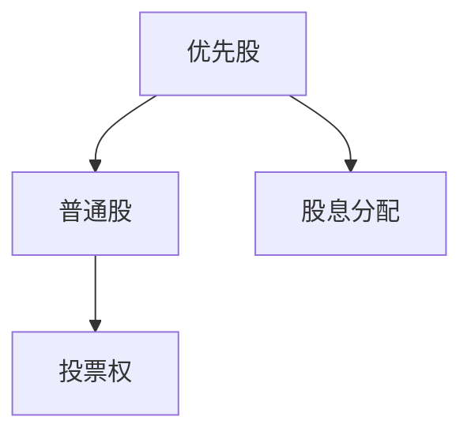
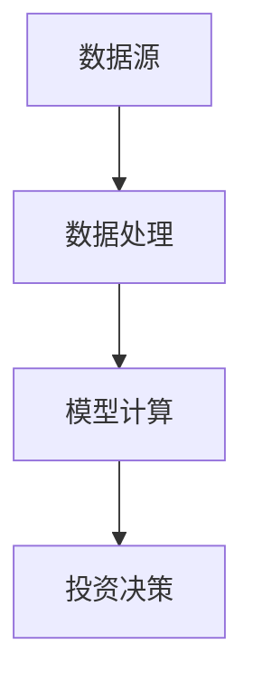
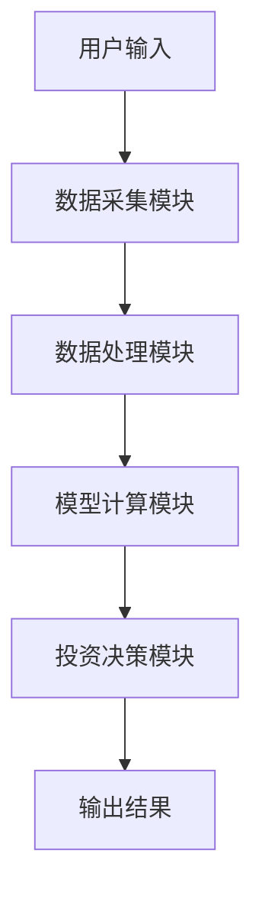

                 


# 格雷厄姆的优先股投资策略

> 关键词：格雷厄姆、优先股、投资策略、价值投资、股息率、内在价值

> 摘要：本文深入探讨了格雷厄姆的优先股投资策略，从优先股的基本概念、核心特征到具体的数学模型和系统设计，结合实际案例，为投资者提供理论和实践指导。

---

# 第一部分：优先股投资策略的背景与基础

## 第1章：优先股投资策略的背景与重要性

### 1.1 优先股的基本概念

#### 1.1.1 优先股的定义与特点
优先股是一种特殊的股票类型，具有以下特点：
- **优先股息分配**：优先股股东在股息分配上优先于普通股股东。
- **优先剩余资产分配**：在公司清算时，优先股股东优先获得剩余资产。
- **固定股息率**：优先股通常有固定的股息率，保证了相对稳定的收益。

#### 1.1.2 优先股与普通股的区别
以下是优先股和普通股的对比表格：

| 特性            | 优先股                     | 普通股                     |
|-----------------|---------------------------|---------------------------|
| 股息分配        | 优先                     | 按顺序分配               |
| 剩余资产分配     | 优先                     | 无优先                   |
| 股权投票权      | 通常无投票权             | 有投票权                 |
| 股价波动性      | 较低                     | 较高                     |

#### 1.1.3 优先股的投资价值与优势
优先股的投资价值体现在其稳定的股息收益和较低的波动性。对于追求稳定收益的投资者，优先股是一个理想的选择。

### 1.2 格雷厄姆投资理论的简介

#### 1.2.1 格雷厄姆的生平与投资理念
本杰明·格雷厄姆是价值投资的鼻祖，他提出了“安全边际”和“内在价值”等核心概念，强调以低于内在价值的价格买入优质资产。

#### 1.2.2 价值投资的核心思想
价值投资的核心思想是寻找市场价低于内在价值的资产，通过长期持有实现收益。

#### 1.2.3 优先股在价值投资中的地位
优先股因其稳定的股息收益和较低的波动性，成为格雷厄姆投资组合中的重要组成部分。

---

## 第2章：优先股的核心概念与特征

### 2.1 优先股的分类与属性

#### 2.1.1 按股息率分类
- **固定股息率优先股**：股息率固定，每年按固定金额分配。
- **浮动股息率优先股**：股息率随市场利率变化而调整。

#### 2.1.2 按可赎回性分类
- **可赎回优先股**：公司有权在特定条件下赎回股票。
- **不可赎回优先股**：公司无权赎回股票。

#### 2.1.3 按优先级分类
- **第一优先股**：优先级最高，最先分配股息和资产。
- **第二优先股**：优先级低于第一优先股。

### 2.2 优先股与普通股的对比分析

#### 2.2.1 核心属性对比表格
以下是优先股和普通股的核心属性对比：

| 特性            | 优先股                     | 普通股                     |
|-----------------|---------------------------|---------------------------|
| 投资风险        | 较低                     | 较高                     |
| 收益稳定性       | 高                      | 低                       |
| 股权控制权      | 无                       | 有                       |

#### 2.2.2 实体关系图（ER图）
以下是优先股和普通股的关系图：



### 2.3 优先股的经济原理

#### 2.3.1 优先股的收益与风险分析
优先股的收益主要来自固定的股息收入，风险较低，适合风险厌恶型投资者。

#### 2.3.2 优先股的市场定价机制
优先股的价格受市场利率和公司财务状况的影响，通常波动较小。

#### 2.3.3 优先股的流动性与交易特性
优先股的流动性较差，但可以通过二级市场进行交易。

---

## 第3章：优先股投资的数学模型与算法原理

### 3.1 优先股投资的数学模型

#### 3.1.1 股息率计算公式
股息率计算公式：
$$ \text{股息率} = \frac{\text{年股息}}{\text{股价}} \times 100\% $$

例如，如果某优先股的年股息为2元，股价为50元，股息率为4%。

#### 3.1.2 内在价值评估公式
内在价值评估公式：
$$ \text{内在价值} = \frac{\text{预期股息}}{\text{折现率}} $$

例如，预期股息为2元，折现率为5%，内在价值为40元。

### 3.2 优先股投资的算法原理

#### 3.2.1 简单线性回归模型（用于预测股息率）
简单线性回归模型用于预测股息率的变化趋势：
$$ y = a + bx $$

其中，y为股息率，x为市场利率，a为截距，b为斜率。

#### 3.2.2 马可夫链模型（用于风险评估）
马可夫链模型用于评估优先股的风险等级，状态包括低风险、中风险和高风险。

---

## 第4章：优先股投资的系统分析与架构设计

### 4.1 投资系统场景介绍

#### 4.1.1 投资目标与约束条件
- 投资目标：获取稳定的股息收益。
- 约束条件：风险承受能力较低。

#### 4.1.2 数据来源与处理流程
- 数据来源：历史股价、股息数据、市场利率。
- 处理流程：清洗数据、特征提取、模型训练。

### 4.2 系统功能设计

#### 4.2.1 数据采集模块（股票数据获取）
- 数据采集模块负责从数据库或API获取优先股和普通股的数据。

#### 4.2.2 模型计算模块（股息率、内在价值计算）
- 模型计算模块基于数学公式计算股息率和内在价值。

#### 4.2.3 投资决策模块（基于格雷厄姆理论的策略）
- 投资决策模块根据计算结果和市场状况制定投资策略。

### 4.3 系统架构设计

#### 4.3.1 模块化架构图（Mermaid图）


#### 4.3.2 系统架构图（Mermaid图）


### 4.4 系统接口设计

#### 4.4.1 数据接口规范
- 输入：股票代码、时间范围。
- 输出：历史股价、股息数据。

#### 4.4.2 API调用流程
1. 用户输入股票代码和时间范围。
2. 系统调用API获取数据。
3. 数据处理模块清洗数据。
4. 模型计算模块计算股息率和内在价值。
5. 投资决策模块制定投资策略。

---

## 第5章：优先股投资的项目实战

### 5.1 环境安装与配置

#### 5.1.1 Python环境搭建
- 安装Python 3.8以上版本。
- 安装Jupyter Notebook用于数据分析。

#### 5.1.2 数据分析库安装
- 使用pip安装Pandas、NumPy、Matplotlib。

### 5.2 核心代码实现

#### 5.2.1 股息率计算代码
```python
import pandas as pd

def calculate_dividend_yield(dividend, price):
    return (dividend / price) * 100

# 示例数据
data = {'股票代码': ['A', 'B', 'C'],
         '年股息': [2, 3, 4],
         '股价': [50, 60, 70]}
df = pd.DataFrame(data)

# 计算股息率
df['股息率'] = df.apply(lambda x: calculate_dividend_yield(x['年股息'], x['股价']), axis=1)
print(df)
```

#### 5.2.2 内在价值评估代码
```python
import numpy as np

def calculate_intrinsic_value(dividend, discount_rate):
    return dividend / discount_rate

# 示例数据
data = {'股票代码': ['A', 'B', 'C'],
         '预期股息': [2, 3, 4],
         '折现率': [5, 6, 7]}
df = pd.DataFrame(data)

# 计算内在价值
df['内在价值'] = df.apply(lambda x: calculate_intrinsic_value(x['预期股息'], x['折现率']), axis=1)
print(df)
```

### 5.3 案例分析与解读

#### 5.3.1 案例分析
假设某优先股的年股息为3元，股价为60元，折现率为6%。计算股息率和内在价值：
- 股息率：5%
- 内在价值：5元

#### 5.3.2 投资决策
根据计算结果，如果市场价低于内在价值，建议买入；如果市场价高于内在价值，建议卖出。

---

## 第6章：总结与展望

### 6.1 小结
格雷厄姆的优先股投资策略通过稳定股息收益和较低风险，为投资者提供了可靠的收益来源。

### 6.2 注意事项
- 优先股的投资需结合市场环境和公司财务状况。
- 需定期监控股息率和内在价值的变化。

### 6.3 拓展阅读
建议阅读格雷厄姆的《聪明的投资者》深入理解价值投资理论。

---

# 结语

通过本文的分析，读者可以全面了解格雷厄姆的优先股投资策略，并能够结合实际案例进行操作。希望本文能为投资者提供有价值的参考和指导。

