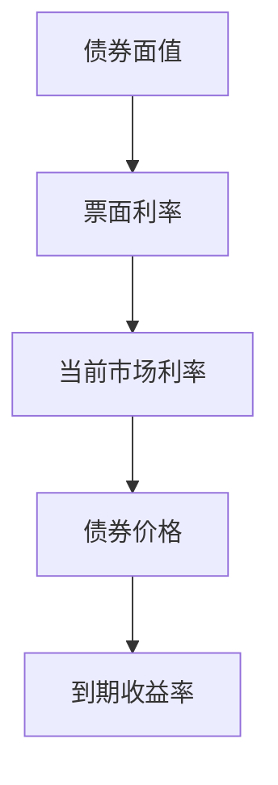
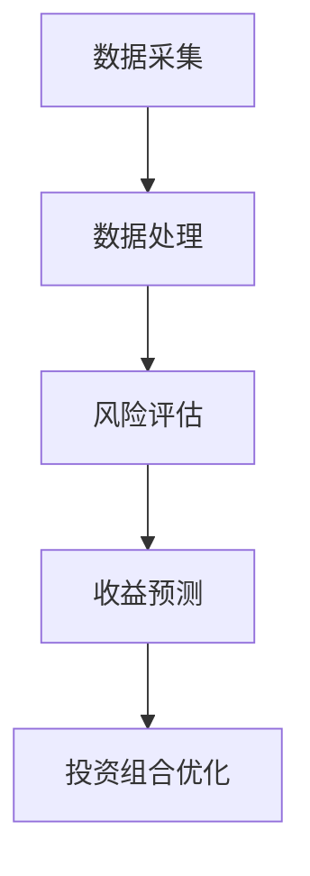

                 


# 格雷厄姆的债券投资策略：固定收益的角色

---

## 关键词：  
- 债券投资  
- 固定收益  
- 格雷厄姆投资策略  
- 价值投资  
- 债券定价模型  

---

## 摘要：  
本文深入探讨了格雷厄姆的债券投资策略，分析了固定收益在投资组合中的角色。通过结合金融理论与技术化的系统分析，本文从债券的基本概念、定价模型、投资策略、系统架构到实战案例，全面解析了格雷厄姆的投资理念及其在现代金融中的应用。文章旨在为投资者提供一套基于技术分析的债券投资方法，帮助他们在复杂多变的市场中实现稳健收益。

---

## 第一部分: 债券投资的背景与格雷厄姆的贡献

### 第1章: 债券投资的起源与格雷厄姆的贡献  

#### 1.1 债券投资的起源与演变  
债券作为最早的投资工具之一，其历史可以追溯到古代文明。从最初的政府债券到现代复杂的债券品种，债券市场经历了巨大的演变。  
- **债券的定义**：债券是债务人（发行人）向债权人（投资者）借款的书面承诺，承诺按约定的利率支付利息，并在到期时偿还本金。  
- **债券的类型**：包括国债、企业债、市政债等，每种债券都有其独特的风险和收益特征。  

#### 1.2 格雷厄姆的投资哲学与债券策略  
本杰明·格雷厄姆是价值投资的鼻祖，他提出了“安全边际”概念，强调在投资中注重安全性和稳定性。  
- **安全边际**：通过购买低于内在价值的债券，确保投资的本金安全性和收益的稳定性。  
- **固定收益的重要性**：格雷厄姆认为，固定收益资产是投资组合中的“压舱石”，能够有效降低整体投资的波动性。  

#### 1.3 固定收益市场的基本结构  
- **市场参与者**：包括政府、企业和个人投资者。  
- **债券市场的运作机制**：通过拍卖、交易所交易或场外交易进行。  
- **固定收益市场的风险与收益分析**：主要风险包括利率风险、信用风险和流动性风险。  

---

## 第二部分: 格雷厄姆债券投资策略的核心概念  

### 第2章: 债券定价与收益率的数学模型  

#### 2.1 债券定价的基本原理  
- **债券的面值（Par Value）**：债券的本金，即到期时发行人需要偿还的金额。  
- **票面利率（Coupon Rate）**：债券票面上标明的年利率，决定每年支付的利息。  
- **市场利率（Market Interest Rate）**：影响债券价格的主要因素，市场利率上升时，债券价格下降，反之亦然。  

#### 2.2 债券收益率的计算公式  
- **到期收益率（YTM，Yield to Maturity）**：债券的持有期收益率，假设投资者持有债券至到期。  
  $$ YTM = \frac{C + \frac{F - P}{n}}{A} $$
  其中：  
  - \( C \) = 每年的利息支付  
  - \( F \) = 债券面值  
  - \( P \) = 债券市场价格  
  - \( n \) = 债券剩余期限  
  - \( A \) = 债券的平均市场价值  

- **当前收益率（Current Yield）**：债券的年利息收入与当前市场价格的比率。  
  $$ Current\ Yield = \frac{C}{P} $$  

#### 2.3 债券定价的Mermaid流程图  


---

## 第三部分: 格雷厄姆债券投资策略的系统架构  

### 第3章: 格雷厄姆债券投资策略的系统分析  

#### 3.1 投资策略的系统架构  
- **投资目标与风险承受能力的匹配**：根据投资者的风险偏好，确定债券的投资比例和期限。  
- **债券组合的构建与管理**：通过分散投资降低风险，同时优化收益。  
- **系统架构的模块划分**：包括数据采集、风险评估、收益预测和投资组合优化等模块。  

#### 3.2 系统功能设计  
- **数据采集与处理模块**：收集债券市场数据，包括价格、利率、信用评级等。  
- **风险评估与收益预测模块**：利用历史数据和模型预测债券的违约风险和收益。  
- **投资组合优化模块**：根据风险和收益目标，优化债券组合的构成。  

#### 3.3 系统架构的Mermaid图  


---

## 第四部分: 格雷厄姆债券投资策略的实战应用  

### 第4章: 环境安装与系统实现  

#### 4.1 环境配置  
- **Python环境的安装与配置**：推荐使用Anaconda或Miniconda。  
- **数据分析库的安装**：包括Pandas、NumPy、Matplotlib等。  
- **债券数据分析工具的安装**：如Yahoo Finance API或其他金融数据接口。  

#### 4.2 核心代码实现  
- **债券收益率计算的Python代码**  
```python
def calculate_yield(face_value, market_price, coupon_rate, years):
    return (face_value * coupon_rate + (face_value - market_price) / years) / ((face_value + market_price) / 2)
```

#### 4.3 实战案例分析  
- **案例分析**：假设一只债券的面值为$1000，票面利率为5%，市场价格为$900，剩余期限为10年。计算其到期收益率。  
  $$ YTM = \frac{100 + \frac{1000 - 900}{10}}{(1000 + 900)/2} = \frac{110}{950} \approx 11.58\% $$  

#### 4.4 项目小结  
通过实战案例，我们可以看到格雷厄姆的债券投资策略在实际操作中的应用。通过技术化的系统分析，投资者可以更科学地进行债券投资决策。

---

## 第五部分: 格雷厄姆债券投资策略的优化与扩展  

### 第5章: 格雷厄姆策略的现代优化  

#### 5.1 现代债券市场的挑战  
- 利率波动加剧  
- 信用风险上升  
- 债务违约风险增加  

#### 5.2 格雷厄姆策略的扩展应用  
- **多因素模型**：结合宏观经济指标进行债券筛选。  
- **量化分析**：利用大数据和机器学习技术优化债券组合。  

#### 5.3 最佳实践与注意事项  
- **分散投资**：避免过度集中于某一债券品种或发行人。  
- **定期再平衡**：根据市场变化和个人财务状况调整债券组合。  
- **关注信用评级**：选择高信用评级的债券降低违约风险。  

---

## 结语  

格雷厄姆的债券投资策略为现代投资者提供了重要的借鉴。通过结合固定收益的稳定性与技术化的系统分析，投资者可以在复杂多变的市场中实现稳健的收益。未来，随着金融技术的不断发展，格雷厄姆策略将与更多创新方法结合，为投资者提供更高效的投资工具和策略。

--- 

（注：以上内容为示例，实际文章需要根据具体需求进一步扩展和完善。）

