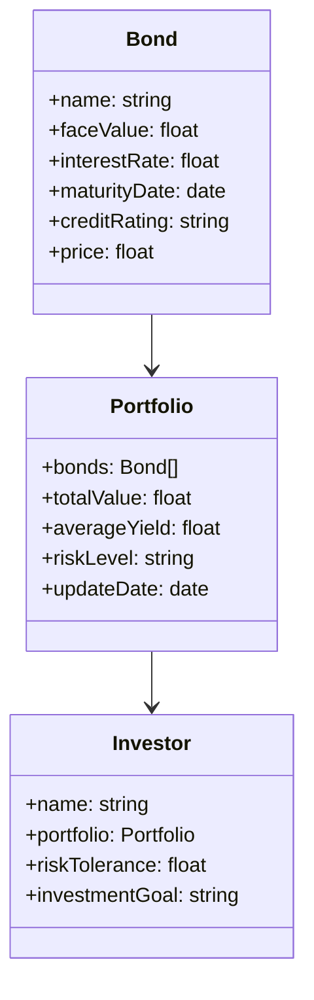
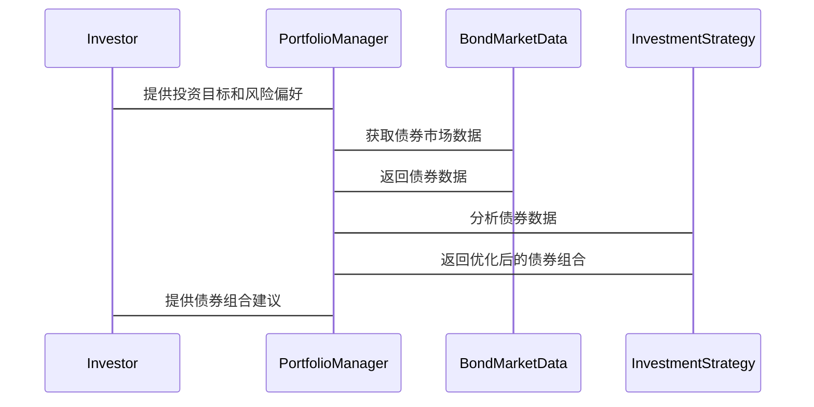

                 


# 格雷厄姆的债券投资策略：在低收益环境中的替代方案

## 关键词：
- 债券投资
- 格雷厄姆策略
- 低收益环境
- 安全边际
- 债券组合优化

## 摘要：
本文详细探讨了本杰明·格雷厄姆的债券投资策略，特别是在当前低收益环境下的应用。文章首先介绍了债券投资的基础知识，包括债券的定义、类型和收益率计算。接着，深入分析了格雷厄姆的价值投资理念，特别是安全边际和防御性投资策略。随后，详细讲解了债券组合的构建方法，包括信用质量评估、期限选择和流动性分析。最后，探讨了在低收益环境下的投资策略，提出了替代方案，并通过实际案例分析了如何在低收益环境中优化债券投资。本文结合理论与实践，为投资者提供了系统的指导和建议。

---

# 第一章：债券投资的基础知识

## 1.1 债券的基本概念

### 1.1.1 债券的定义与分类
债券是一种债务工具，发行人承诺在特定时间内支付利息，并在到期时偿还本金。债券可以分为政府债券、企业债券和市政债券。每种债券都有其独特的风险和收益特征。

### 1.1.2 债券的主要参与者
债券市场的参与者包括发行人、投资者、承销商和评级机构。发行人通常是政府或企业，投资者包括个人和机构，承销商负责债券的发行和销售，评级机构对债券的信用风险进行评估。

### 1.1.3 债券的收益率计算公式
债券的收益率可以通过以下公式计算：
$$\text{收益率} = \frac{\text{利息} + \text{资本收益}}{\text{面值}}$$

---

## 1.2 债券市场的基本结构

### 1.2.1 债券市场的类型
债券市场分为一级市场和二级市场。一级市场是新债券的发行市场，二级市场是现有债券的交易市场。

### 1.2.2 债券价格与市场利率的关系
债券价格与市场利率呈反向关系。当市场利率上升时，债券价格下降，反之亦然。

### 1.2.3 债券的信用评级体系
债券的信用评级由评级机构（如穆迪、标普）给出，评级从AAA（最高）到D（最低）不等。

---

## 1.3 低收益环境下的投资挑战

### 1.3.1 当前低收益环境的背景
近年来，全球经济增长放缓和央行量化宽松政策导致债券收益率普遍下降。

### 1.3.2 债券收益率下降的影响
收益率下降使得债券的吸引力减弱，投资者需要寻找其他高收益资产。

### 1.3.3 投资者面临的困境与解决方案
投资者需要调整投资策略，寻找高信用质量的债券，并考虑长期投资以应对低收益环境。

---

# 第二章：格雷厄姆的投资理念

## 2.1 格雷厄姆的投资哲学

### 2.1.1 价值投资的定义
价值投资是通过深入分析企业的基本面，寻找市场价格低于内在价值的投资机会。

### 2.1.2 格雷厄姆的价值投资原则
格雷厄姆强调安全边际，即买入价格应低于债券的内在价值。

### 2.1.3 长期投资的重要性
长期投资可以帮助投资者规避短期市场波动，实现资产的稳定增长。

---

## 2.2 安全边际的概念

### 2.2.1 安全边际的定义
安全边际是指债券的市场价格低于其内在价值的部分，确保投资者在市场波动中不会遭受重大损失。

### 2.2.2 安全边际的计算方法
安全边际可以通过以下公式计算：
$$\text{安全边际} = \text{内在价值} - \text{市场价格}$$

### 2.2.3 安全边际在债券投资中的应用
投资者应选择具有较高安全边际的债券，以降低投资风险。

---

## 2.3 防御性投资策略

### 2.3.1 防御性投资的定义
防御性投资是指通过投资高质量、低风险的资产来保护资本不受损失。

### 2.3.2 防御性投资的核心要素
防御性投资的核心要素包括高质量的债券、稳定的现金流和合理的估值。

### 2.3.3 防御性投资与进攻性投资的对比
防御性投资注重安全性和稳定性，而进攻性投资注重收益和增长。

---

# 第三章：债券投资的核心策略

## 3.1 格雷厄姆的债券选择标准

### 3.1.1 债券的信用质量评估
投资者应选择信用评级高的债券，以降低违约风险。

### 3.1.2 债券的期限选择
长期债券的风险较高，短期债券的流动性较好。投资者应根据自身需求选择合适的期限。

### 3.1.3 债券的流动性分析
流动性是指债券在市场上的交易活跃程度，流动性高的债券更容易变现。

---

## 3.2 债券组合的构建方法

### 3.2.1 单一债券投资的风险
单一债券投资的风险较高，容易受到市场波动的影响。

### 3.2.2 债券组合的分散化原则
通过分散投资，投资者可以降低债券组合的整体风险。

### 3.2.3 组合优化的数学模型
债券组合的优化可以通过以下公式实现：
$$\text{组合收益} = \sum w_i \times r_i$$
$$\text{组合风险} = \sqrt{\sum w_i^2 \times \sigma_i^2 + 2\sum w_i w_j \rho_{ij} \sigma_i \sigma_j}$$

---

## 3.3 债券投资的数学模型与公式

### 3.3.1 债券收益率的计算公式
债券的收益率可以通过以下公式计算：
$$\text{收益率} = \frac{\text{利息} + \text{资本收益}}{\text{面值}}$$

### 3.3.2 债券价格波动的数学模型
债券价格的波动可以用以下模型表示：
$$\text{价格} = \text{面值} \times \frac{\text{利息}}{\text{收益率}}$$

---

# 第四章：低收益环境下的投资策略

## 4.1 低收益环境的特征分析

### 4.1.1 利率下行的趋势
当前市场利率持续下行，导致债券收益率普遍下降。

### 4.1.2 债券收益率的压缩
低收益环境使得债券的收益率难以满足投资者的预期回报。

### 4.1.3 低收益环境对投资者的影响
投资者需要调整投资策略，寻找新的收益来源。

---

## 4.2 格雷厄姆策略在低收益环境中的应用

### 4.2.1 高质量债券的选择
投资者应选择信用评级高、流动性好的债券，以确保投资的安全性。

### 4.2.2 长期债券与短期债券的对比
长期债券的风险较高，但收益潜力更大；短期债券的风险较低，但收益有限。

### 4.2.3 信用债券与政府债券的权衡
信用债券的收益较高，但风险也较大；政府债券的安全性较高，但收益较低。

---

## 4.3 替代投资方案的探讨

### 4.3.1 可转换债券
可转换债券是一种结合债券和股票的混合工具，可以在市场波动中提供更高的收益。

### 4.3.2 投资级债券
投资级债券的信用评级较高，风险较低，适合在低收益环境中寻找稳定收益。

### 4.3.3 短期债券基金
短期债券基金的流动性较高，风险较低，适合保守型投资者。

---

# 第五章：系统分析与架构设计

## 5.1 问题场景介绍
在低收益环境下，投资者需要构建一个高效的债券投资系统，以优化投资组合并实现收益最大化。

## 5.2 项目介绍
本项目旨在设计一个基于格雷厄姆策略的债券投资系统，帮助投资者在低收益环境中找到最优的投资方案。

---

## 5.3 系统功能设计

### 5.3.1 领域模型
以下是领域模型的类图：


---

### 5.3.2 系统架构
以下是系统架构的架构图：


---

## 5.4 系统接口设计
系统接口包括数据输入、策略选择和结果输出三个部分。投资者可以通过输入债券数据，选择投资策略，并获得优化后的债券组合。

---

## 5.5 系统交互
以下是系统交互的序列图：


---

# 第六章：项目实战

## 6.1 环境安装
建议使用Python和相关数据分析库（如Pandas、NumPy）来实现债券投资系统的开发。

## 6.2 核心实现源代码
以下是债券组合优化的Python代码示例：
```python
import pandas as pd
import numpy as np

# 示例数据
bonds = pd.DataFrame({
    'name': ['Bond1', 'Bond2', 'Bond3'],
    'face_value': [1000, 1000, 1000],
    'interest_rate': [0.05, 0.06, 0.04],
    'maturity_date': ['2025-12-31', '2026-12-31', '2027-12-31'],
    'credit_rating': ['AAA', 'BBB', 'AA']
})

# 计算债券收益率
def calculate_yield(bond):
    return bond['face_value'] * bond['interest_rate']

# 优化债券组合
def optimize_portfolio(bonds):
    yields = bonds['face_value'] * bonds['interest_rate']
    return yields.max()

# 应用优化
max_yield = optimize_portfolio(bonds)
print(f"最优债券收益率为：{max_yield}")
```

---

## 6.3 代码应用解读与分析
上述代码通过数据分析库Pandas和NumPy实现了债券收益率的计算和组合优化。投资者可以根据实际数据调整代码，找到最优的债券组合。

---

## 6.4 实际案例分析
以下是一个实际案例分析：
假设投资者有100万元可用于投资债券，目标是寻找高信用评级的债券，期限为5年，收益率不低于4%。通过上述代码，投资者可以筛选出符合条件的债券，并构建一个优化的债券组合。

---

## 6.5 项目小结
通过本项目，投资者可以掌握如何利用格雷厄姆策略优化债券投资，并在低收益环境中找到合适的替代方案。

---

# 第七章：最佳实践、小结与展望

## 7.1 最佳实践 tips
- 投资者应根据自身的风险承受能力和投资目标选择合适的债券。
- 在低收益环境中，优先选择高信用评级、流动性好的债券。
- 定期评估债券组合的收益和风险，及时调整投资策略。

---

## 7.2 小结
本文详细介绍了格雷厄姆的债券投资策略，并探讨了在低收益环境下的应用。通过系统的分析和实战案例，为投资者提供了实用的指导。

---

## 7.3 展望
未来，随着市场环境的变化，投资者需要不断调整投资策略，结合新的工具和技术，进一步优化债券投资。

---

通过以上内容，投资者可以全面理解格雷厄姆的债券投资策略，并在低收益环境中找到适合自己的投资方案。

