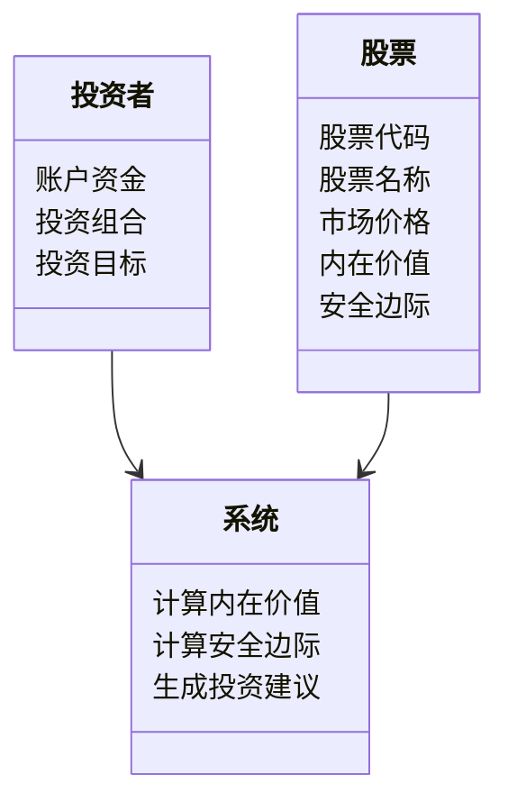
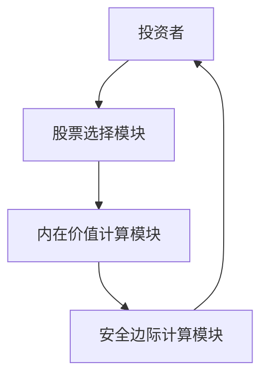
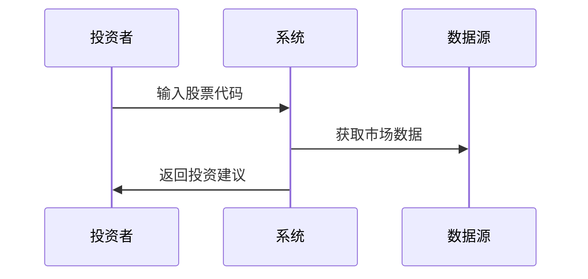

                 


# 格雷厄姆的净净策略在不同市场环境中的应用

## 关键词：
- 格雷厄姆
- 净净策略
- 投资策略
- 市场环境
- 安全边际

## 摘要：
本文深入分析了本杰明·格雷厄姆提出的净净策略在不同市场环境中的应用。通过探讨净净策略的核心概念、数学模型、系统架构设计以及在牛市、熊市和震荡市中的具体应用，本文旨在为投资者提供一套在不同市场条件下优化投资决策的有效方法。文章还结合实际案例和数学公式，详细讲解了如何通过计算内在价值和安全边际来选择优质投资标的，并提出了在实际投资中应用净净策略的最佳实践建议。

---

# 第1章 净净策略的基本原理

## 1.1 净净策略的核心概念

### 1.1.1 净值与账面价值的定义
净净策略的核心在于评估企业的内在价值，这需要明确企业的净值和账面价值。净值是指企业所有资产减去负债后的价值，而账面价值则是企业资产在财务报表上的历史成本价值。

$$ 净值 = 资产 - 负债 $$

$$ 账面价值 = 资产的原始成本 - 折旧与减值准备 $$

### 1.1.2 净净策略的核心思想
格雷厄姆提出，投资者应以低于企业净值的价格购买股票，以确保投资的安全边际。这种策略强调以合理的价格买入优质资产，而不是盲目追随市场趋势。

### 1.1.3 净净策略与价值投资的关系
净净策略是价值投资的重要组成部分。价值投资的核心是寻找市场低估的股票，而净净策略通过计算内在价值和安全边际，为投资者提供了一种量化的方法。

---

## 1.2 净净策略的关键要素

### 1.2.1 内在价值的计算方法
内在价值是企业未来现金流的现值。格雷厄姆的净净策略通过分析企业的盈利能力、资产质量和行业地位来估算其内在价值。

$$ V = \frac{E}{1 + k} $$
其中，\( V \) 是内在价值，\( E \) 是企业的未来收益，\( k \) 是预期收益率。

### 1.2.2 安全边际的概念与作用
安全边际是市场价格与内在价值之间的差额。通过保持足够的安全边际，投资者可以降低市场波动对企业价值的影响。

$$ 安全边际 = 内在价值 - 市场价格 $$

### 1.2.3 净值与市场价值的对比分析
净值反映了企业的实际价值，而市场价值则是投资者对企业的主观估值。通过对比净值与市场价值，投资者可以判断是否存在低估或高估的情况。

$$ 市场价值 = 股价 \times 股数 $$

---

## 1.3 净净策略的适用场景

### 1.3.1 净净策略在熊市中的应用
熊市中，市场情绪低迷，股票价格往往低于企业净值。此时，净净策略能够帮助投资者发现被低估的优质股票。

### 1.3.2 净净策略在牛市中的应用
牛市中，市场情绪高涨，股票价格可能高于企业净值。此时，净净策略可以帮助投资者避免过度投机，选择具有合理估值的股票。

### 1.3.3 净净策略在震荡市中的应用
震荡市中，市场波动频繁，股票价格难以预测。通过净净策略，投资者可以保持理性，选择具有稳定内在价值的股票。

---

## 1.4 净净策略的局限性与改进方向

### 1.4.1 净净策略的局限性分析
净净策略主要依赖于财务数据，忽略了市场情绪和宏观经济因素的影响。此外，该策略在新兴行业和高增长企业的应用中可能显得不足。

### 1.4.2 如何改进净净策略
结合技术分析和市场情绪指标，可以进一步优化净净策略。例如，通过分析成交量和趋势线，投资者可以更好地判断买卖时机。

### 1.4.3 净净策略与其他投资策略的结合
将净净策略与其他策略（如成长型投资策略）相结合，可以实现风险分散和收益最大化。

---

## 1.5 本章小结

本章详细介绍了净净策略的基本原理，包括净值与账面价值的定义、内在价值的计算方法以及安全边际的概念。同时，我们分析了净净策略在不同市场环境中的适用场景，并探讨了其局限性和改进方向。通过这些分析，读者可以更好地理解净净策略的核心思想和实际应用。

---

# 第2章 净净策略在不同市场环境中的应用

## 2.1 牛市环境下的净净策略应用

### 2.1.1 牛市环境的特点
牛市中，市场情绪乐观，股票价格普遍上涨。然而，部分股票可能被高估，此时净净策略可以帮助投资者筛选出具有合理估值的股票。

### 2.1.2 净净策略在牛市中的优势
通过计算内在价值和安全边际，投资者可以在牛市中避免过度投机，选择具有长期增长潜力的股票。

### 2.1.3 牛市中净净策略的具体操作
1. 优先选择具有稳定盈利和高资产质量的企业。
2. 计算股票的内在价值，确保购买价格低于内在价值。
3. 保持适当的安全边际，避免过度投资。

---

## 2.2 熊市环境下的净净策略应用

### 2.2.1 熊市环境的特点
熊市中，市场情绪悲观，股票价格普遍下跌。此时，许多优质股票可能被低估，为净净策略提供了良好的投资机会。

### 2.2.2 净净策略在熊市中的优势
通过净净策略，投资者可以在熊市中以较低的价格买入优质股票，为未来市场复苏做好准备。

### 2.2.3 熊市中净净策略的具体操作
1. 寻找净值远高于市场价格的股票。
2. 优先选择具有强大财务状况和良好行业地位的企业。
3. 增加安全边际，确保投资的安全性。

---

## 2.3 震荡市环境下的净净策略应用

### 2.3.1 震荡市环境的特点
震荡市中，市场波动频繁，股票价格难以预测。此时，投资者需要更加谨慎，避免盲目跟风。

### 2.3.2 净净策略在震荡市中的优势
通过净净策略，投资者可以保持理性，选择具有稳定内在价值的股票，避免受到市场波动的影响。

### 2.3.3 震荡市中净净策略的具体操作
1. 定期重新评估股票的内在价值和市场价格。
2. 保持适度的仓位，避免过度集中投资。
3. 灵活调整投资组合，根据市场变化及时优化。

---

## 2.4 不同市场环境下的策略对比

### 2.4.1 不同市场环境下的策略选择
根据市场环境的变化，投资者需要灵活调整净净策略的应用。例如，在牛市中注重安全边际，在熊市中寻找低估股票。

### 2.4.2 净净策略在不同市场中的表现
通过对比分析，我们可以发现，净净策略在熊市中的表现优于牛市，但在震荡市中需要更加谨慎。

### 2.4.3 如何根据市场环境调整净净策略
1. 了解当前市场环境的特点。
2. 根据市场环境调整投资目标和策略。
3. 定期评估策略的有效性，并及时优化。

---

## 2.5 本章小结

本章详细探讨了净净策略在不同市场环境中的应用，包括牛市、熊市和震荡市。通过分析不同市场环境下的策略优劣，读者可以更好地理解如何根据市场变化灵活调整投资策略，从而实现稳健的投资收益。

---

# 第3章 净净策略的数学模型与公式

## 3.1 内在价值的计算公式

### 3.1.1 内在价值的定义
内在价值是企业未来现金流的现值，反映了企业的实际价值。

$$ V = \frac{E}{1 + k} $$

其中，\( V \) 是内在价值，\( E \) 是企业的未来收益，\( k \) 是预期收益率。

---

## 3.2 安全边际的计算公式

### 3.2.1 安全边际的定义
安全边际是市场价格与内在价值之间的差额，反映了投资的安全程度。

$$ M = V - P $$

其中，\( M \) 是安全边际，\( V \) 是内在价值，\( P \) 是市场价格。

---

## 3.3 净值与市场价值的对比分析

### 3.3.1 净值与市场价值的定义
净值反映了企业的实际价值，而市场价值是投资者对企业的主观估值。

$$ N = \frac{A}{P} $$

其中，\( N \) 是净值与市场价值的比值，\( A \) 是资产价值，\( P \) 是股价。

---

## 3.4 净净策略的数学模型

### 3.4.1 净净策略的数学模型
通过综合考虑企业的内在价值和市场价格，净净策略为投资者提供了一种量化的方法来选择优质股票。

$$ 投资决策 = \begin{cases} 
买入 & \text{如果 } P < V \\
持有 & \text{如果 } P = V \\
卖出 & \text{如果 } P > V 
\end{cases} $$

---

## 3.5 本章小结

本章通过数学公式详细讲解了净净策略的核心计算方法，包括内在价值、安全边际以及净值与市场价值的对比分析。通过这些公式，投资者可以更加量化地评估股票的价值，从而做出更加科学的投资决策。

---

# 第4章 净净策略的系统架构设计

## 4.1 问题场景介绍

### 4.1.1 投资者的需求
投资者需要一种能够在不同市场环境中优化投资决策的方法。

### 4.1.2 系统的目标
开发一个基于净净策略的投资决策支持系统，帮助投资者选择优质股票。

---

## 4.2 系统功能设计

### 4.2.1 领域模型
通过领域模型，我们可以清晰地看到系统的核心要素及其关系。



---

## 4.3 系统架构设计

### 4.3.1 系统架构图
通过系统架构图，我们可以清晰地看到系统的各个模块及其交互。



---

## 4.4 系统接口设计

### 4.4.1 输入接口
投资者输入股票代码和市场数据。

### 4.4.2 输出接口
系统输出股票的内在价值、安全边际以及投资建议。

---

## 4.5 系统交互设计

### 4.5.1 交互流程
1. 投资者输入股票代码。
2. 系统获取股票的市场数据。
3. 系统计算股票的内在价值和安全边际。
4. 系统生成投资建议并反馈给投资者。



---

## 4.6 本章小结

本章通过系统架构设计，详细讲解了如何将净净策略应用于实际投资决策中。通过构建领域模型和系统架构图，我们能够清晰地看到系统的各个模块及其交互。同时，通过系统接口设计和交互流程，投资者可以更加直观地了解系统的操作流程。

---

# 第5章 净净策略的实战案例分析

## 5.1 环境安装

### 5.1.1 系统要求
- 操作系统：Windows/Mac/Linux
- 编程语言：Python 3.6+
- 开发工具：Jupyter Notebook/VS Code

---

## 5.2 系统核心实现源代码

### 5.2.1 计算内在价值的代码

```python
def calculate_intrinsic_value(enterprise_value, expected_return):
    return enterprise_value / (1 + expected_return)
```

### 5.2.2 计算安全边际的代码

```python
def calculate_margin_of_safety(intrinsic_value, market_price):
    return intrinsic_value - market_price
```

---

## 5.3 代码应用解读与分析

### 5.3.1 计算内在价值
通过上述代码，投资者可以快速计算出股票的内在价值，从而判断其是否被低估。

### 5.3.2 计算安全边际
通过计算安全边际，投资者可以评估投资的风险程度，从而做出更加科学的投资决策。

---

## 5.4 实际案例分析

### 5.4.1 案例背景
假设某股票的市场价格为 $50，计算出的内在价值为 $60，安全边际为 $10。

### 5.4.2 投资建议
由于市场价格低于内在价值，建议投资者买入该股票。

---

## 5.5 本章小结

本章通过实战案例分析，详细讲解了如何将净净策略应用于实际投资中。通过编写和运行源代码，投资者可以更好地理解净净策略的核心思想，并能够在实际操作中灵活运用。

---

# 第6章 净净策略的总结与展望

## 6.1 本章总结

### 6.1.1 净净策略的核心思想
通过计算内在价值和安全边际，投资者可以在不同市场环境中优化投资决策。

### 6.1.2 净净策略的实际应用
净净策略不仅适用于传统投资，还可以应用于量化投资和算法交易。

---

## 6.2 未来展望

### 6.2.1 净净策略的改进方向
未来，可以通过引入机器学习和大数据分析，进一步优化净净策略。

### 6.2.2 净净策略的拓展应用
净净策略还可以应用于其他领域，例如企业估值和风险管理。

---

## 6.3 最佳实践 tips

### 6.3.1 投资者注意事项
1. 定期重新评估股票的内在价值和市场价格。
2. 保持适度的仓位，避免过度集中投资。
3. 结合市场环境，灵活调整投资策略。

### 6.3.2 投资建议
1. 在熊市中，优先选择净值远高于市场价格的股票。
2. 在牛市中，注重安全边际，避免过度投机。
3. 在震荡市中，保持理性，选择具有稳定内在价值的股票。

---

## 6.4 本章小结

本章对净净策略进行了总结，并展望了其未来的发展方向。同时，我们还提出了投资者在实际操作中需要注意的事项和最佳实践建议，帮助读者更好地将净净策略应用于实际投资中。

---

# 附录

## 附录 A：净净策略的数学模型

### A.1 内在价值的计算公式
$$ V = \frac{E}{1 + k} $$

### A.2 安全边际的计算公式
$$ M = V - P $$

---

## 附录 B：系统架构设计图

### B.1 领域模型类图


---

## 附录 C：系统交互序列图


---

通过以上内容，我们详细分析了格雷厄姆的净净策略在不同市场环境中的应用。从基本原理到实际操作，从数学模型到系统架构设计，再到实战案例分析，我们为投资者提供了一套完整的投资策略体系。希望本文能够帮助投资者在复杂多变的市场环境中，做出更加科学和理性的投资决策。

