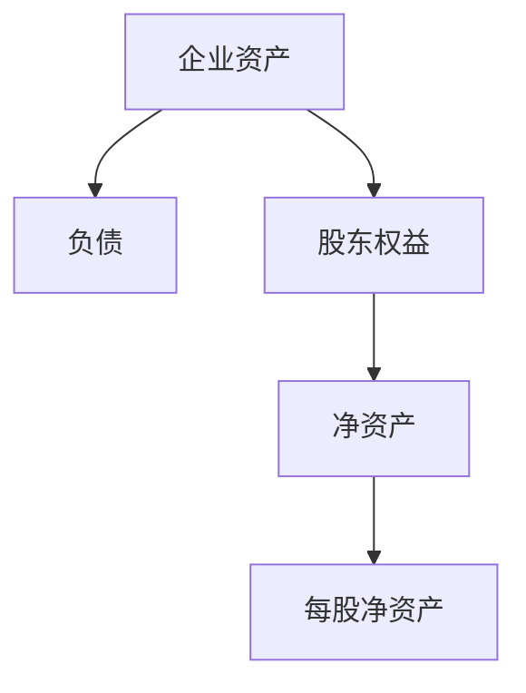
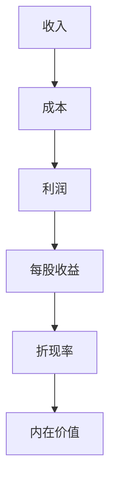
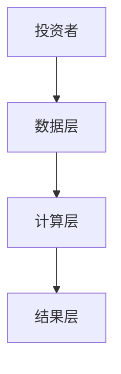

                 


# 格雷厄姆的净净股投资策略

> 关键词：格雷厄姆，净净股，价值投资，投资策略，股票分析，内在价值

> 摘要：本文深入探讨了格雷厄姆提出的净净股投资策略，从其核心概念、数学模型、系统架构到实际案例，全面解析了如何利用该策略进行股票投资。通过详细分析和实例演示，本文揭示了净净股投资的逻辑与方法，并提供了系统化的解决方案。

---

## 第一部分: 格雷厄姆的净净股投资策略概述

### 第1章: 格雷厄姆与净净股投资的背景

#### 1.1 投资领域的背景与挑战

##### 1.1.1 传统投资方法的局限性
传统投资方法往往依赖市场情绪、短期波动和市场趋势，这种方法容易受到市场非理性行为的影响，导致投资者面临较高的风险。例如，许多投资者在市场热潮中盲目追涨，而在市场下跌时盲目抛售，这种行为往往会导致投资损失。

##### 1.1.2 格雷厄姆的学术背景与贡献
本杰明·格雷厄姆（Benjamin Graham）是20世纪著名的投资学家，被誉为“价值投资之父”。他在《证券分析》（Security Analysis）一书中提出了许多深刻的投资理念，其中包括“净净股”（Net Net）的概念。格雷厄姆的学生彼得·林奇（Peter Lynch）和沃伦·巴菲特（Warren Buffett）都深受其影响，并将这些理念发扬光大。

##### 1.1.3 净净股投资的提出与意义
净净股投资的核心思想是通过分析企业的财务报表，尤其是资产负债表，找到那些市场价格低于其内在价值的股票。这种方法可以帮助投资者规避市场的非理性波动，专注于寻找那些被市场低估的优质企业。

#### 1.2 净净股投资的核心概念

##### 1.2.1 净净股的定义与特征
净净股（Net Net）是指那些市场价格低于其每股净收益（Net Worth per Share）的股票。具体来说，净收益是指企业在清偿所有债务后的剩余资产，也就是企业的净资产。如果市场价格低于这个净资产价值，那么该股票就被认为是“净净股”，具有较高的投资价值。

##### 1.2.2 净净股与传统股票投资的区别
与传统股票投资相比，净净股投资更加注重企业的基本面分析，尤其是企业的资产状况和负债情况。传统投资方法更多关注市场的短期波动和市场趋势，而净净股投资则更关注企业的长期价值和内在价值。

##### 1.2.3 净净股投资的目标与策略
净净股投资的目标是通过找到市场价格低于内在价值的股票，实现长期稳定的收益。其核心策略包括：
1. **基本面分析**：通过分析企业的财务报表，尤其是资产负债表，计算企业的净资产价值。
2. **价值发现**：寻找市场价格低于净资产价值的股票。
3. **长期持有**：买入低估股票并长期持有，等待其价格回归内在价值。

#### 1.3 格雷厄姆的投资理念与方法

##### 1.3.1 格雷厄姆的价值投资理论
格雷厄姆的价值投资理论强调，股票的价格波动与其内在价值之间的差异是投资机会的来源。他主张以低于内在价值的价格买入股票，并长期持有，直到价格回归其真实价值。

##### 1.3.2 净净股投资的逻辑与框架
净净股投资的逻辑是基于企业的净资产价值进行分析。通过计算企业的净资产价值，投资者可以确定哪些股票是被市场低估的。这种方法不仅能够帮助投资者规避市场的非理性波动，还能帮助他们找到那些具有长期投资价值的股票。

##### 1.3.3 格雷厄姆投资策略的现代应用
尽管格雷厄姆的投资策略提出于20世纪，但其核心思想在现代投资领域依然具有重要的指导意义。许多投资者和机构仍然沿用这种方法，尤其是在寻找价值型股票时，净净股分析是一种重要的工具。

---

### 第2章: 净净股投资的核心概念与联系

#### 2.1 净净股的数学模型与公式

##### 2.1.1 净净股价值的计算公式
$$ \text{内在价值} = \frac{\text{收益}}{\text{折现率}} $$
其中，收益是指企业的净利润，折现率则是基于市场利率或风险溢价计算的。

##### 2.1.2 净净股价值与市场价值的关系
$$ \text{市场价格} < \text{内在价值} $$

##### 2.1.3 净净股投资的数学模型构建
通过建立数学模型，投资者可以量化企业的内在价值，并将其与市场价格进行比较。例如，如果一个企业的内在价值为50元，而市场价格为30元，那么该股票就是一只净净股。

#### 2.2 核心概念对比分析

##### 2.2.1 净净股与账面价值的对比
- 净净股：市场价格 < 净资产价值
- 账面价值：资产的账面价值，不考虑市场波动

##### 2.2.2 净净股与市盈率的对比
- 净净股：关注内在价值
- 市盈率：关注市价与收益的比例

##### 2.2.3 净净股与市净率的对比
- 净净股：市场价格 < 净资产价值
- 市净率：市价与净资产价值的比率

#### 2.3 实体关系图



---

### 第3章: 净净股投资的算法原理

#### 3.1 净值计算算法



#### 3.2 核心代码实现

```python
def calculate_intrinsic_value(revenue, cost,折现率):
    profit = revenue - cost
    EPS = profit / shares_outstanding
    intrinsic_value = EPS /折现率
    return intrinsic_value
```

#### 3.3 实例分析

```plaintext
假设某公司收入为100万，成本为60万，折现率为8%
利润 = 100万 - 60万 = 40万
EPS = 40万 / 10万股 = 4元
内在价值 = 4元 / 0.08 = 50元
```

---

### 第4章: 系统分析与架构设计

#### 4.1 问题场景介绍

##### 4.1.1 投资者如何快速评估股票价值
通过分析企业的财务报表，尤其是资产负债表，计算企业的净资产价值，并将其与市场价格进行比较。

##### 4.1.2 净净股投资的系统化流程
1. 数据收集：获取企业的财务数据
2. 计算内在价值：通过公式计算企业的内在价值
3. 比较市场价格与内在价值
4. 选择低估股票进行投资

##### 4.1.3 系统设计的目标与范围
设计一个系统，能够自动化地计算企业的内在价值，并将其与市场价格进行比较，帮助投资者快速找到净净股。

#### 4.2 系统功能设计


#### 4.3 系统架构设计



---

## 第五章: 项目实战

### 5.1 环境安装

#### 5.1.1 安装Python环境
```bash
python --version
pip install numpy pandas matplotlib
```

### 5.2 系统核心实现源代码

#### 5.2.1 数据收集
```python
import pandas as pd
import requests

# 下载股票数据
url = "https://example.com/stock_data.csv"
data = pd.read_csv(url)
print(data.head())
```

#### 5.2.2 计算内在价值
```python
def calculate_intrinsic_value(data,折现率):
    revenue = data['revenue']
    cost = data['cost']
    profit = revenue - cost
    EPS = profit / data['shares_outstanding']
    intrinsic_value = EPS /折现率
    return intrinsic_value

# 示例计算
折现率 = 0.08
iv = calculate_intrinsic_value(data,折现率)
print("内在价值:", iv)
```

#### 5.2.3 结果展示
```python
import matplotlib.pyplot as plt

plt.plot(data['price'], data['intrinsic_value'])
plt.xlabel('市场价格')
plt.ylabel('内在价值')
plt.title('市场价格与内在价值对比')
plt.show()
```

### 5.3 实际案例分析

#### 5.3.1 数据分析与计算
```plaintext
公司名称：ABC公司
收入：100万
成本：60万
折现率：8%
计算结果：
利润 = 40万
EPS = 4元
内在价值 = 50元
市场价格 = 30元
结论：市场价格 < 内在价值，适合投资
```

#### 5.3.2 代码实现与结果解读
```python
# 数据输入
revenue = 1000000
cost = 600000
shares_outstanding = 100000
折现率 = 0.08

# 计算内在价值
profit = revenue - cost
EPS = profit / shares_outstanding
intrinsic_value = EPS /折现率

# 输出结果
print(f"利润：{profit} 元")
print(f"每股收益：{EPS} 元")
print(f"内在价值：{intrinsic_value} 元")
print(f"市场价格：{data['price']} 元")
print(f"结论：市场价格 {data['price']} < 内在价值 {intrinsic_value}")
```

### 5.4 项目小结

#### 5.4.1 最佳实践 tips
- 定期更新财务数据
- 设置合理的折现率
- 长期持有低估股票

#### 5.4.2 总结
通过系统化的分析和计算，投资者可以快速找到市场价格低于内在价值的股票，从而实现长期稳定的收益。

#### 5.4.3 注意事项
- 数据准确性
- 折现率的合理性
- 市场波动的不确定性

#### 5.4.4 拓展阅读
- 《证券分析》（格雷厄姆）
- 《巴菲特的投资组合》（彼得·林奇）

---

## 第六章: 小结

格雷厄姆的净净股投资策略是一种基于基本面分析的投资方法，通过计算企业的内在价值，寻找市场价格低于内在价值的股票。这种方法不仅能够帮助投资者规避市场的非理性波动，还能帮助他们找到那些具有长期投资价值的股票。通过系统化的分析和计算，投资者可以更好地应用这种方法，实现长期稳定的收益。

--- 

**感谢您的阅读！希望本文对您理解格雷厄姆的净净股投资策略有所帮助。如果您有任何疑问或建议，请随时与我联系！**

