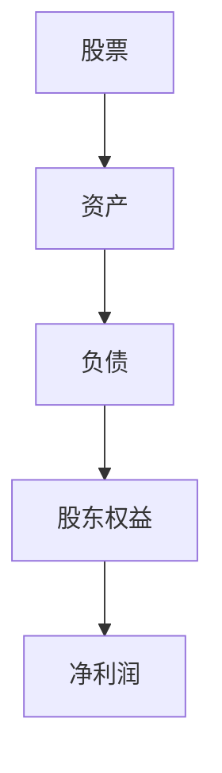
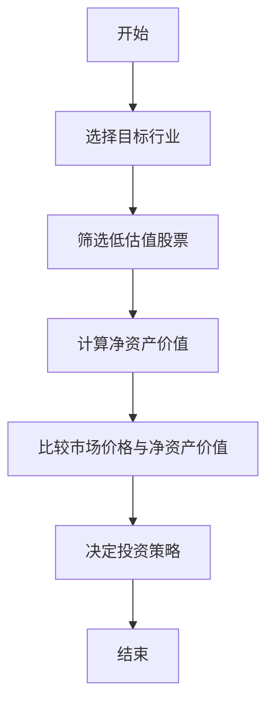
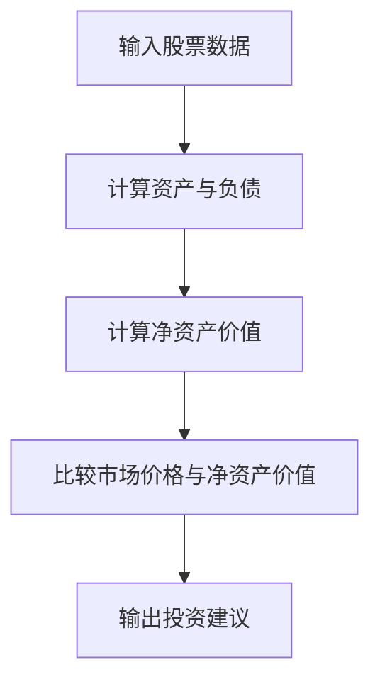
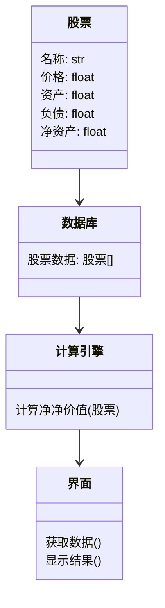
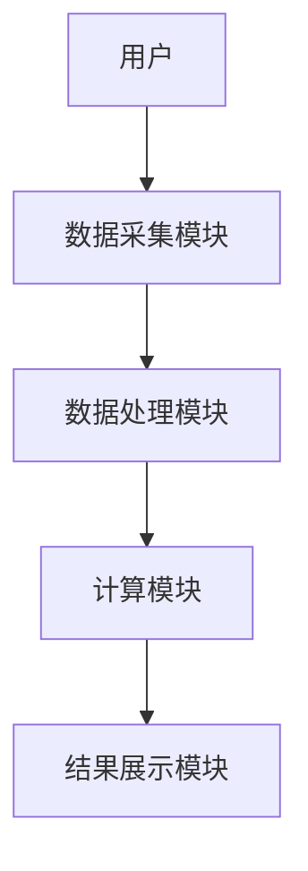

                 


# 格雷厄姆的净净股策略

> 关键词：格雷厄姆，净净股策略，价值投资，股票分析，投资策略

> 摘要：本文深入探讨了格雷厄姆的净净股策略，分析了其核心概念、算法原理、系统架构以及实际应用。通过详细讲解和案例分析，帮助读者理解如何利用该策略进行价值投资，掌握投资中的关键点和注意事项。

---

# 第1章 净净股策略的背景与核心概念

## 1.1 净净股策略的起源与发展

### 1.1.1 价值投资的鼻祖：本杰明·格雷厄姆

本杰明·格雷厄姆是20世纪最著名的价值投资者之一，他的投资理念深刻影响了巴菲特等一代投资者。格雷厄姆主张以低于内在价值的价格买入股票，并长期持有，直到市场认识到其真实价值。

### 1.1.2 净净股策略的提出背景

20世纪20年代末至30年代初，美国股市经历了剧烈的波动，投资者对稳健投资策略的需求日益迫切。格雷厄姆在这一背景下提出了净净股策略，旨在帮助投资者在市场低迷时期发现被低估的股票。

### 1.1.3 净净股策略在投资界的影响

格雷厄姆的净净股策略不仅是价值投资的基石，还为现代投资分析奠定了基础。许多投资者将其作为寻找低估股票的重要方法，尤其在市场下跌或经济危机时更为适用。

## 1.2 净净股策略的核心思想

### 1.2.1 价值投资理念

格雷厄姆强调以企业的内在价值为基础进行投资，而不是关注市场波动。他认为，股票的真正价值是其未来现金流的现值，而市场价格會围绕这个价值波动。

### 1.2.2 净净股策略的核心原则

净净股策略的核心是寻找市场价格低于其清算价值的股票。格雷厄姆认为，如果股票价格远低于其清算价值，那么该股票具有较大的安全边际，风险较低。

### 1.2.3 与其他投资策略的区别

与技术分析或动量策略不同，净净股策略注重基本面分析，尤其是企业的资产状况和财务健康状况。它更关注企业的内在价值，而非市场趋势。

## 1.3 净净股策略的基本框架

### 1.3.1 净净股的定义与计算

净净股（Net Net）是指股票的市场价格低于其账面价值的差额。计算公式为：

$$ 净净价值 = 资产 - 负债 - 市场价格 $$

如果市场价格低于净资产价值，则该股票被认为是被低估的。

### 1.3.2 净净股策略的适用场景

该策略适用于市场低迷、企业资产被低估的时期，尤其适合那些资产-heavy的行业，如银行、保险公司等。

### 1.3.3 净净股策略的优缺点

- **优点**：风险低，安全边际高。
- **缺点**：筛选难度大，需要详细分析财务报表。

---

# 第2章 净净股策略的核心概念与联系

## 2.1 净净股的定义与属性

### 2.1.1 净净股的定义

净净股是指市场价格低于其净资产价值的股票，即：

$$ 市场价格 < 净资产价值 $$

### 2.1.2 净净股的属性特征对比

| 属性 | 净净股 | 非净净股 |
|------|--------|----------|
| 市场价格 | 低于净资产价值 | 高于或接近净资产价值 |
| 投资风险 | 较低 | 较高 |
| 投资回报 | 有较大潜力 | 风险较高 |

### 2.1.3 净净股与其他价值指标的对比

| 指标 | 净净股 | 市盈率 | 市净率 |
|------|--------|---------|--------|
| 计算公式 | $P < N$ | $P/E$ | $P/B$ |
| 适用场景 | 低估值股票 | 成长型企业 | 资产-heavy企业 |

## 2.2 净净股策略的ER实体关系图



## 2.3 净净股策略的流程图



---

# 第3章 净净股策略的算法原理

## 3.1 净净价值的计算公式

$$ 净净价值 = \frac{资产 - 负债}{流通股数量} $$

## 3.2 净净股策略的筛选算法

### 3.2.1 算法流程图



### 3.2.2 算法实现的Python代码

```python
def calculate_net_nets(stock_data):
    assets = stock_data['Total Assets']
    liabilities = stock_data['Total Liabilities']
    shares_outstanding = stock_data['Shares Outstanding']
    net_assets = assets - liabilities
    net_nets = net_assets / shares_outstanding
    return net_nets

# 示例数据
stock_data = {
    'Total Assets': 500,
    'Total Liabilities': 300,
    'Shares Outstanding': 100
}

net_nets = calculate_net_nets(stock_data)
print(f"净净价值为: {net_nets}")
```

---

# 第4章 净净股策略的系统分析与架构设计

## 4.1 投资分析系统的功能设计

### 4.1.1 领域模型



### 4.1.2 系统架构图



## 4.2 系统接口设计

- 数据采集模块：从数据库或API获取股票数据。
- 计算模块：调用计算净净价值的函数。
- 结果展示模块：以表格或图表形式显示结果。

---

# 第5章 净净股策略的项目实战

## 5.1 环境安装

```bash
pip install pandas numpy matplotlib
```

## 5.2 核心实现代码

```python
import pandas as pd
import numpy as np

def calculate_net_nets(stock_data):
    assets = stock_data['Total Assets']
    liabilities = stock_data['Total Liabilities']
    shares_outstanding = stock_data['Shares Outstanding']
    net_assets = assets - liabilities
    net_nets = net_assets / shares_outstanding
    return net_nets

# 示例数据
data = {
    '公司': ['公司A', '公司B', '公司C'],
    'Total Assets': [500, 600, 700],
    'Total Liabilities': [300, 400, 500],
    'Shares Outstanding': [100, 150, 200]
}

df = pd.DataFrame(data)
net_nets = df.apply(calculate_net_nets, axis=1)
print(net_nets)
```

## 5.3 实际案例分析

以某公司为例，计算其净净价值，并与市场价格进行比较，判断是否符合净净股条件。

---

# 第6章 净净股策略的最佳实践

## 6.1 投资策略的注意事项

- 定期更新数据，避免过时。
- 结合其他指标进行综合分析。
- 选择信誉良好的数据源。

## 6.2 小结

净净股策略是一种简单有效的价值投资方法，但需要结合实际情况灵活运用。

## 6.3 拓展阅读

推荐阅读格雷厄姆的《证券分析》和巴菲特的《巴菲特致股东的信》。

---

# 第7章 总结

## 7.1 本文总结

本文全面介绍了格雷厄姆的净净股策略，从理论到实践，帮助读者掌握其核心思想和应用方法。

## 7.2 投资中的注意事项

- 风险控制是投资成功的关键。
- 长期投资，耐心持有。

---

通过本文的学习，读者可以更好地理解净净股策略，并在实际投资中灵活运用，做出明智的投资决策。

