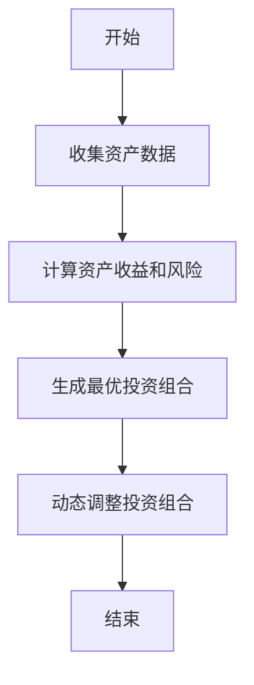

                 


# 格雷厄姆的分散投资原则：在全球化退潮中的新应用

---

## 关键词
- 分散投资
- 格雷厄姆
- 投资组合优化
- 全球化退潮
- 现代投资组合理论（MPT）

---

## 摘要
本文深入探讨了本杰明·格雷厄姆的分散投资原则在全球化退潮背景下的新应用。首先，我们回顾了格雷厄姆的投资哲学及其核心理念，分析了分散投资的数学模型与系统架构。接着，我们结合当前全球化退潮的市场环境，探讨了分散投资策略的调整与优化。通过实际案例分析，我们展示了如何在新兴市场与区域化投资中应用格雷厄姆的分散投资原则。最后，我们总结了分散投资的最佳实践与未来展望，为投资者提供了切实可行的指导。

---

## 第一部分：格雷厄姆分散投资原则的背景与理论基础

### 第1章：分散投资原则的起源与核心理念

#### 1.1 本杰明·格雷厄姆的投资哲学
格雷厄姆是价值投资的鼻祖，他的投资哲学强调安全边际和长期价值。他认为，投资者应通过分散投资来降低风险，并避免将所有资金投入单一资产。

- **安全边际**：通过购买低于其内在价值的股票，确保投资的安全性。
- **分散投资**：通过持有多种资产来降低特定资产的风险。

#### 1.2 分散投资的核心思想
格雷厄姆的分散投资原则基于以下核心思想：
- **避免过度集中**：不要将资金集中在少数资产或行业中。
- **长期投资**：分散投资的核心目标是通过长期持有优质资产实现稳健收益。
- **风险控制**：通过分散投资降低非系统性风险。

#### 1.3 格雷厄姆的投资策略与风险管理
格雷厄姆强调，分散投资不仅是策略，更是一种风险管理工具。他建议投资者根据市场环境动态调整投资组合，并通过分散化降低市场波动带来的影响。

---

### 第2章：分散投资的数学模型与原理

#### 2.1 投资组合的数学模型
分散投资的理论基础来源于现代投资组合理论（MPT），由哈里·马科维茨提出。MPT的核心是通过分散化降低投资组合的总体风险。

- **投资组合的收益与风险公式**：
  - 收益：$E(r_p) = \sum w_i E(r_i)$
  - 风险：$\sigma_p^2 = \sum \sum w_i w_j \sigma_{i,j}$

  其中，$w_i$ 是资产 $i$ 的权重，$E(r_i)$ 是资产 $i$ 的期望收益，$\sigma_{i,j}$ 是资产 $i$ 和 $j$ 的协方差。

- **有效前沿**：在给定风险水平下，投资组合的收益最大化的曲线。

#### 2.2 风险与收益的平衡
分散投资通过降低非系统性风险（特定资产风险）来提高整体收益。以下是风险与收益的平衡机制：

- **风险的度量方法**：
  - 方差：衡量资产收益的波动性。
  - 标准差：方差的平方根，用于比较不同资产的风险。

- **收益的期望值计算**：
  - 通过历史数据或市场预期计算资产的期望收益。

#### 2.3 分散化对风险的降低作用
通过分散投资，投资者可以降低非系统性风险。例如，将资金分配到不同行业、地区或资产类别中，可以有效抵消单一资产的波动性。

---

### 第3章：格雷厄姆分散投资原则的系统架构

#### 3.1 系统架构概述
- **投资目标的确定**：明确投资目标（如保本、收益最大化）。
- **资产配置的策略**：根据市场环境制定资产分配比例。
- **投资组合的动态调整**：定期审查并调整投资组合以适应市场变化。

#### 3.2 系统实现与接口设计
- **数据采集与处理**：从市场数据源获取资产价格、收益等信息。
- **风险评估模型**：基于历史数据计算资产的风险和收益。
- **投资组合优化算法**：使用数学模型优化投资组合。

---

## 第二部分：全球化退潮下的投资环境分析

### 第4章：全球化退潮下的投资环境分析

#### 4.1 全球化退潮的背景与影响
- **全球化退潮的主要原因**：
  - 地缘政治冲突（如中美贸易摩擦）。
  - 疾病大流行（如COVID-19）的影响。
  - 各国政策差异的加大。

- **对全球投资环境的影响**：
  - 新兴市场的崛起。
  - 区域化投资趋势的增强。

#### 4.2 分散投资在新环境下的应用
- **新兴市场的投资机会**：通过分散投资新兴市场，投资者可以捕捉高增长潜力。
- **区域化投资策略的调整**：根据地缘政治变化调整资产分配。

---

### 第5章：分散投资的数学模型与实际应用

#### 5.1 投资组合优化的数学模型
- **基于MPT的投资组合优化**：
  - 使用拉格朗日乘数法求解最优化问题。
  - 通过协方差矩阵计算资产之间的相关性。

- **风险调整后的收益最大化**：
  - 在给定风险水平下，选择收益最大的投资组合。

#### 5.2 实际案例分析
- **美国市场的分散投资策略**：
  - 将资金分配到科技、金融、医疗等多个行业。
- **新兴市场的分散投资策略**：
  - 投资于印度、东南亚等高增长地区。

---

## 第三部分：系统分析与项目实战

### 第6章：分散投资原则的最佳实践与小结

#### 6.1 最佳实践 tips
- **投资组合的定期审查与调整**：每年至少审查一次投资组合。
- **风险管理的持续优化**：根据市场变化动态调整风险敞口。
- **长期投资与价值发现的结合**：坚持长期投资，同时关注资产的内在价值。

#### 6.2 小结与展望
- **格雷厄姆分散投资原则的总结**：分散投资是降低风险、实现稳健收益的有效策略。
- **全球化退潮下的投资策略调整**：在新兴市场与区域化投资中应用分散投资原则。
- **未来投资环境的展望**：随着全球化进一步退潮，分散投资的重要性将更加凸显。

---

### 第7章：系统架构与项目实战

#### 7.1 系统架构设计
- **系统功能模块划分**：
  - 数据采集模块：从金融市场获取实时数据。
  - 风险评估模块：计算资产的风险和收益。
  - 投资组合优化模块：生成最优投资组合。

- **系统架构图**：
  ```mermaid
  graph TD
    A[用户] --> B[数据采集模块]
    B --> C[数据存储模块]
    C --> D[风险评估模块]
    D --> E[投资组合优化模块]
    E --> F[投资组合结果]
  ```

#### 7.2 项目实战
- **环境安装与配置**：
  - 安装Python和相关库（如Pandas、NumPy、Scipy）。
  - 获取金融市场数据（如通过Yahoo Finance API）。

- **核心算法实现**：
  ```python
  import numpy as np
  import pandas as pd

  # 假设我们有资产的收益率数据
  returns = pd.DataFrame({
      '资产1': [0.1, 0.05, 0.08],
      '资产2': [0.08, 0.12, 0.05],
      '资产3': [0.06, 0.09, 0.1]
  })

  # 计算协方差矩阵
  covariance_matrix = returns.cov()

  # 计算资产的权重（假设等权）
  weights = np.array([1/3, 1/3, 1/3])

  # 计算投资组合的期望收益
  expected_return = weights.dot(returns.mean())

  # 计算投资组合的风险（标准差）
  portfolio_variance = np.dot(weights.T, np.dot(covariance_matrix, weights))
  portfolio_std_deviation = np.sqrt(portfolio_variance)
  ```

- **代码解读与分析**：
  - 上述代码展示了如何计算投资组合的期望收益和标准差。
  - 通过调整权重，可以优化投资组合的风险和收益。

---

### 第8章：数学模型与公式详细讲解

#### 8.1 投资组合的数学模型
- **投资组合的期望收益公式**：
  $$ E(r_p) = \sum_{i=1}^n w_i E(r_i) $$
- **投资组合的风险度量公式**：
  $$ \sigma_p^2 = \sum_{i=1}^n \sum_{j=1}^n w_i w_j \sigma_{i,j} $$

#### 8.2 风险与收益的平衡
- **夏普比率公式**：
  $$ \text{夏普比率} = \frac{E(r_p) - r_f}{\sigma_p} $$
  其中，$r_f$ 是无风险利率。

---

### 第9章：算法原理讲解与流程图

#### 9.1 算法原理
- 分散投资算法通过以下步骤实现：
  1. 收集资产数据。
  2. 计算资产的期望收益和风险。
  3. 使用优化算法生成最优投资组合。
  4. 动态调整投资组合以适应市场变化。

#### 9.2 算法流程图


---

## 第四部分：未来展望与小结

### 第10章：未来展望与总结

#### 10.1 未来展望
- 随着全球化进一步退潮，分散投资的重要性将更加凸显。
- 技术的进步（如人工智能）将进一步优化投资组合的优化算法。

#### 10.2 总结
- 分散投资是降低风险、实现稳健收益的有效策略。
- 在全球化退潮的背景下，投资者应灵活调整分散投资策略，抓住新兴市场和区域化投资的机会。

---

## 结语
通过本文的分析，我们深入探讨了格雷厄姆分散投资原则在全球化退潮背景下的新应用。无论是从理论还是实践的角度，分散投资都为投资者提供了稳健的投资策略。未来，随着市场环境的变化，投资者需要不断优化分散投资策略，以应对更加复杂的投资环境。

--- 

* 本文结合了技术与金融的双重视角，通过系统的分析和详细的案例，为投资者提供了切实可行的指导。

