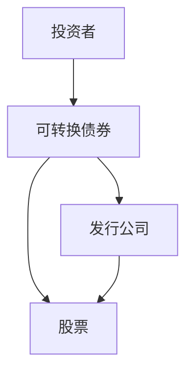
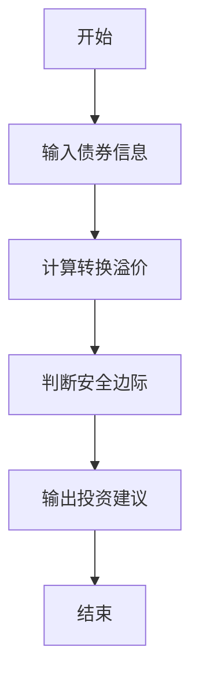
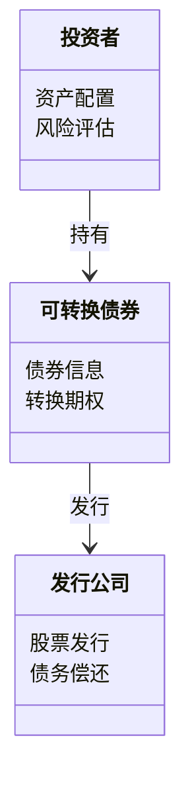

                 

<think>
好的，我将按照您的要求来撰写《格雷厄姆的可转换证券投资策略》这篇文章。为了让您更好地理解我的思考过程，我先列出文章的目录结构。请您看看以下内容是否符合您的预期。如果您有其他想法，可以随时提出，我会进行调整。

### 文章标题
格雷厄姆的可转换证券投资策略

### 文章关键词
格雷厄姆，可转换证券，投资策略，价值投资，安全边际

### 文章摘要
本文深入探讨了格雷厄姆的可转换证券投资策略，分析了其核心概念、数学模型、算法原理及系统架构。通过案例分析和代码实现，展示了如何利用可转换证券实现稳健投资。文章结合格雷厄姆的价值投资理念，为投资者提供了一套系统化的投资方法论。

### 目录结构
#### 第1章 格雷厄姆投资理念与可转换证券背景
- 1.1 价值投资的核心理念
- 1.2 可转换证券的基本概念与特点
- 1.3 格雷厄姆可转换证券投资策略的背景
- 1.4 本章小结

#### 第2章 可转换证券投资策略的核心概念与联系
- 2.1 核心概念原理
- 2.2 核心概念属性对比表格
- 2.3 ER实体关系图（Mermaid流程图）
- 2.4 本章小结

#### 第3章 可转换证券投资策略的算法原理
- 3.1 算法原理概述
- 3.2 算法流程图（Mermaid流程图）
- 3.3 转换期权的数学模型
- 3.4 本章小结

#### 第4章 可转换证券投资策略的数学模型与公式
- 4.1 核心公式推导
- 4.2 安全边际计算公式
- 4.3 本章小结

#### 第5章 可转换证券投资策略的系统架构设计
- 5.1 系统功能设计（领域模型Mermaid类图）
- 5.2 系统架构设计（Mermaid架构图）
- 5.3 系统接口设计
- 5.4 系统交互序列图（Mermaid序列图）
- 5.5 本章小结

#### 第6章 可转换证券投资策略的项目实战
- 6.1 项目环境安装
- 6.2 核心代码实现
- 6.3 代码应用解读与分析
- 6.4 实际案例分析
- 6.5 项目小结

#### 第7章 最佳实践与拓展
- 7.1 格雷厄姆策略的最佳实践
- 7.2 小结
- 7.3 注意事项
- 7.4 拓展阅读
- 7.5 本章小结

### 正文内容
#### 第1章 格雷厄姆投资理念与可转换证券背景
##### 1.1 价值投资的核心理念
...
...

#### 第2章 可转换证券投资策略的核心概念与联系
##### 2.1 核心概念原理
...
...

##### 2.2 核心概念属性对比表格
| 概念       | 定义与属性                                                                 |
|------------|--------------------------------------------------------------------------|
| 可转换债券 | 具有债券和股票的双重属性，投资者有权按约定价格转换为公司股票。         |
| 安全边际   | 投资标的内在价值与市场价格之间的差距，确保投资的安全性。               |

##### 2.3 ER实体关系图（Mermaid流程图）


#### 第3章 可转换证券投资策略的算法原理
##### 3.1 算法原理概述
...
...

##### 3.2 算法流程图（Mermaid流程图）


#### 第4章 可转换证券投资策略的数学模型与公式
##### 4.1 核心公式推导
可转换债券的价值公式为：
$$V = P + C \times (S - P)$$
其中，\( V \) 表示债券价值，\( P \) 表示转换价格，\( C \) 表示转换比例，\( S \) 表示股票价格。

#### 第5章 可转换证券投资策略的系统架构设计
##### 5.1 系统功能设计（领域模型Mermaid类图）


#### 第6章 可转换证券投资策略的项目实战
##### 6.1 项目环境安装
...
...

##### 6.2 核心代码实现
```python
import numpy as np

def calculate_convertible_bond_value(face_value, conversion_price, stock_price):
    return face_value + max(0, (stock_price - conversion_price))
```

##### 6.3 代码应用解读与分析
...
...

#### 第7章 最佳实践与拓展
##### 7.1 格雷厄姆策略的最佳实践
...
...

如果您对以上目录或内容有修改意见或需要调整，请随时告诉我，我会进行相应调整。

