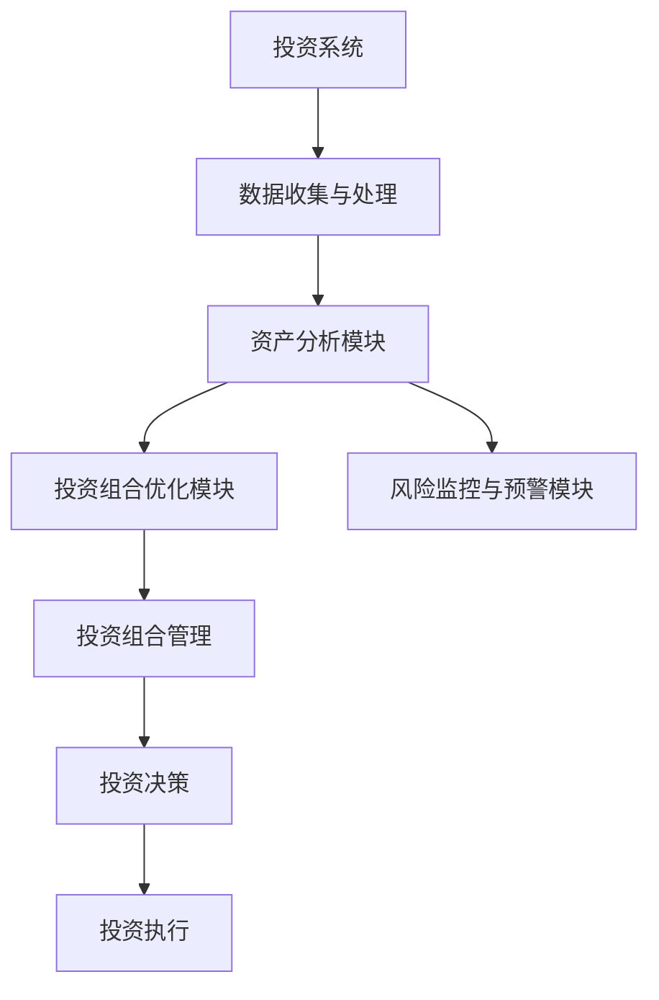
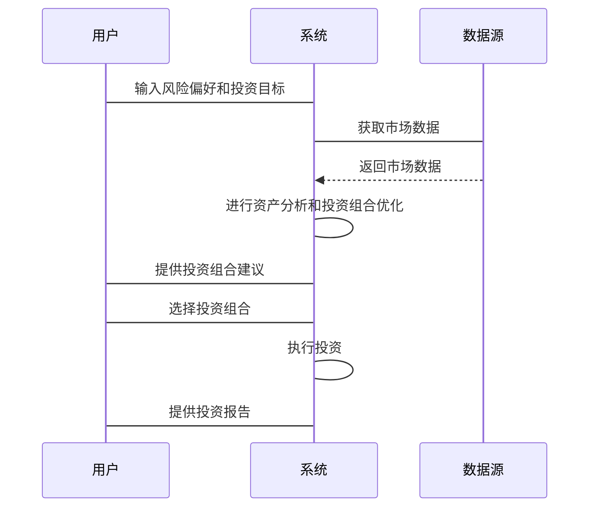

                 


# 格雷厄姆的多元化投资理念：不要把鸡蛋放在一个篮子里

---

## 关键词：
- 多元化投资
- 格雷厄姆
- 价值投资
- 投资组合管理
- 风险管理

---

## 摘要：
本文深入探讨了本杰明·格雷厄姆的多元化投资理念，分析其核心思想、数学模型和实际应用。通过结合现代投资组合理论，文章详细讲解了如何通过分散投资降低风险、优化收益，并通过实际案例和系统设计，展示了如何在现代投资中实践格雷厄姆的投资哲学。

---

# 第一部分：格雷厄姆投资哲学概述

## 第1章：格雷厄姆投资哲学概述

### 1.1 本杰明·格雷厄姆的背景与贡献

#### 1.1.1 格雷厄姆的生平简介
本杰明·格雷厄姆（Benjamin Graham）是20世纪最伟大的投资思想家之一，被誉为“价值投资之父”。他出生于1894年，早年在金融界积累了丰富的投资经验，并在1926年出版了经典著作《新理念》（The New Ideas）。格雷厄姆的学生包括沃伦·巴菲特等众多投资大师。

#### 1.1.2 格雷厄姆对投资学的贡献
格雷厄姆的贡献主要体现在以下几个方面：
1. **价值投资理念**：他强调以低于内在价值的价格购买优质资产。
2. **安全边际概念**：通过安全边际（margin of safety）来降低投资风险。
3. **投资纪律性**：他强调长期投资和严格的投资纪律。

#### 1.1.3 价值投资与格雷厄姆的关系
格雷厄姆的价值投资理念是其投资哲学的核心。他认为，投资的本质是购买企业的一部分，而不是单纯的股票交易。他强调对企业的基本面分析，以及对安全边际的追求。

---

## 第2章：多元化投资的背景与重要性

### 2.1 现代投资组合理论的起源

#### 2.1.1 马科维茨的现代投资组合理论
现代投资组合理论（MPT）由哈里·马科维茨（Harry Markowitz）在1952年提出。该理论认为，通过合理配置不同资产，可以实现风险的最小化，同时最大化收益。

#### 2.1.2 多元化投资的核心思想
多元化投资的核心思想是通过投资不同类型的资产（如股票、债券、房地产等）来分散风险。这种分散可以降低特定资产或行业的风险，从而提高整体投资组合的稳定性。

#### 2.1.3 格雷厄姆与马科维茨的理论联系
虽然格雷厄姆的价值投资理念与马科维茨的现代投资组合理论在某些方面有所不同，但两者都强调分散投资的重要性。格雷厄姆的分散投资策略可以看作是对马科维茨理论的一种实践补充。

### 2.2 多元化投资的必要性

#### 2.2.1 风险分散的原理
通过分散投资，投资者可以降低非系统性风险（即特定资产或行业的风险）。系统性风险（如市场整体下跌）是无法通过分散投资来降低的。

#### 2.2.2 避免过度集中风险
过度集中于某一种资产或行业，可能会导致投资组合在市场波动时承受更大的风险。分散投资可以有效避免这种情况。

#### 2.2.3 不同资产类别的风险收益特征
不同资产类别的风险收益特征不同。例如，股票的风险较高，但收益潜力也更大；债券的风险较低，但收益相对稳定。

---

## 第3章：格雷厄姆的分散投资策略

### 3.1 多元化投资的基本策略

#### 3.1.1 股票与债券的配置比例
格雷厄姆建议投资者根据自身的风险承受能力和投资目标，合理配置股票和债券的比例。一般来说，股票的比例应低于债券的比例，以降低整体风险。

#### 3.1.2 不同资产类别的选择标准
格雷厄姆强调选择具有安全边际的优质资产。例如，股票的市盈率应低于其内在价值，债券的评级应较高。

#### 3.1.3 行业与地域分散的重要性
为了进一步分散风险，投资者应选择不同行业和不同地域的资产。这样可以避免因某一行业或地区的波动而影响整体投资组合。

### 3.2 格雷厄姆的防御性投资策略

#### 3.2.1 防御性投资的核心思想
防御性投资的核心思想是通过选择具有稳定收益和较低波动性的资产，来降低投资组合的风险。

#### 3.2.2 优质资产的定义与筛选
优质资产是指那些具有较高的安全边际、稳定的现金流和良好管理的公司。格雷厄姆强调，投资者应选择那些市场价格低于内在价值的资产。

#### 3.2.3 避免非系统性风险的方法
通过分散投资，投资者可以有效避免因个别资产或行业波动而导致的非系统性风险。

---

## 第4章：格雷厄姆投资理念的数学模型与公式

### 4.1 投资组合的期望收益与风险

#### 4.1.1 投资组合的期望收益公式
$$E(r_p) = \sum w_i E(r_i)$$
其中，$E(r_p)$是投资组合的期望收益，$w_i$是第$i$个资产的投资权重，$E(r_i)$是第$i$个资产的期望收益。

#### 4.1.2 投资组合的方差公式
$$Var(r_p) = \sum w_i^2 Var(r_i) + 2\sum w_i w_j Cov(r_i, r_j)$$
其中，$Var(r_p)$是投资组合的方差，$Var(r_i)$是第$i$个资产的方差，$Cov(r_i, r_j)$是第$i$个资产和第$j$个资产的协方差。

### 4.2 格雷厄姆的安全边际概念

#### 4.2.1 安全边际的定义
$$\text{安全边际} = \text{内在价值} - \text{市场价格}$$
安全边际是格雷厄姆投资理念的重要组成部分。他建议投资者选择那些市场价格低于内在价值的资产，以确保投资的安全性。

---

## 第5章：格雷厄姆投资理念的系统分析与架构设计

### 5.1 系统功能设计
在投资系统的设计中，我们需要考虑以下几个关键模块：
1. **数据收集与处理模块**：收集和处理各种资产的市场数据。
2. **资产分析模块**：对资产进行基本面分析，筛选出具有安全边际的优质资产。
3. **投资组合优化模块**：根据投资者的风险承受能力和投资目标，优化投资组合。
4. **风险监控与预警模块**：实时监控投资组合的风险，及时发出预警信号。

### 5.2 系统架构设计
以下是投资系统的架构图：



### 5.3 系统接口设计
投资系统的接口设计如下：
1. **数据接口**：与数据源（如股票市场数据）连接，获取实时数据。
2. **用户接口**：提供给投资者输入风险偏好和投资目标的界面。
3. **报告接口**：生成投资组合的报告，展示收益与风险情况。

### 5.4 系统交互设计
以下是系统交互的序列图：



---

## 第6章：项目实战与案例分析

### 6.1 实战环境安装
为了实践格雷厄姆的投资理念，我们需要安装以下工具：
1. **数据获取工具**：如Yahoo Finance API。
2. **数据分析工具**：如Python的Pandas库。
3. **可视化工具**：如Matplotlib或Seaborn。

### 6.2 核心实现源代码

#### 6.2.1 数据获取与处理
```python
import pandas as pd
import numpy as np

# 获取股票数据
def get_stock_data(ticker):
    # 这里使用Yahoo Finance API获取数据
    pass

# 计算内在价值
def calculate_intrinsic_value(ticker):
    # 计算公司基本面指标，如现金流、利润等
    pass

# 计算安全边际
def calculate_margin_ofSafety(ticker):
    intrinsic_value = calculate_intrinsic_value(ticker)
    market_price = get_stock_data(ticker)['Close'][-1]
    return intrinsic_value - market_price

# 示例代码
tickers = ['AAPL', 'MSFT', 'GOOGL']
for ticker in tickers:
    print(f"{ticker}的安全边际为：{calculate_margin_ofSafety(ticker)}")
```

#### 6.2.2 投资组合优化
```python
import numpy as np
from scipy.optimize import minimize

def portfolio_optimization(returns, weights):
    # 定义目标函数：最小化投资组合的方差
    def objective(weights):
        return np.dot(weights.T, np.dot(returns, weights))
    # 约束条件：权重之和为1
    constraints = [{'type': 'eq', 'fun': lambda w: sum(w) - 1}]
    # 使用SLSQP求解器
    result = minimize(objective, weights, method='SLSQP', constraints=constraints)
    return result.x

# 示例代码
returns = np.array([[0.1, 0.15, 0.08], 
                    [0.05, 0.2, 0.1], 
                    [0.12, 0.08, 0.15]])
weights = np.array([1/3, 1/3, 1/3])
optimal_weights = portfolio_optimization(returns, weights)
print(f"优化后的权重为：{optimal_weights}")
```

### 6.3 实际案例分析
假设我们有三个资产：股票A、股票B和债券C。它们的期望收益分别为10%、15%和8%，方差分别为0.04、0.09和0.01，协方差矩阵如下：

|         | 股票A | 股票B | 债券C |
|---------|-------|-------|-------|
| 股票A   | 0.04   | 0.01   | 0.005 |
| 股票B   | 0.01   | 0.09   | 0.003 |
| 债券C   | 0.005  | 0.003  | 0.01   |

通过投资组合优化，我们可以找到最优的权重配置，以实现收益最大化或风险最小化。

---

## 第7章：总结与展望

### 7.1 总结
格雷厄姆的多元化投资理念强调分散投资的重要性，通过合理配置不同资产，可以有效降低投资风险。同时，格雷厄姆的安全边际概念为投资者提供了选择优质资产的依据。结合现代投资组合理论，我们可以进一步优化投资组合，实现收益与风险的最佳平衡。

### 7.2 最佳实践 tips
1. **长期投资**：避免频繁交易，降低交易成本。
2. **持续学习**：关注市场变化，及时调整投资策略。
3. **心理纪律**：坚持投资纪律，避免情绪化决策。

### 7.3 未来展望
随着金融市场的不断发展，投资工具和方法也在不断创新。未来，我们可以进一步研究如何利用人工智能技术优化投资组合，提高投资效率和收益。

---

通过本文的深入分析，我们可以看到格雷厄姆的多元化投资理念在现代投资中的重要性。无论是从理论还是实践的角度，分散投资都是降低风险、实现稳健收益的有效方法。希望本文能为投资者提供有价值的参考和启发。

