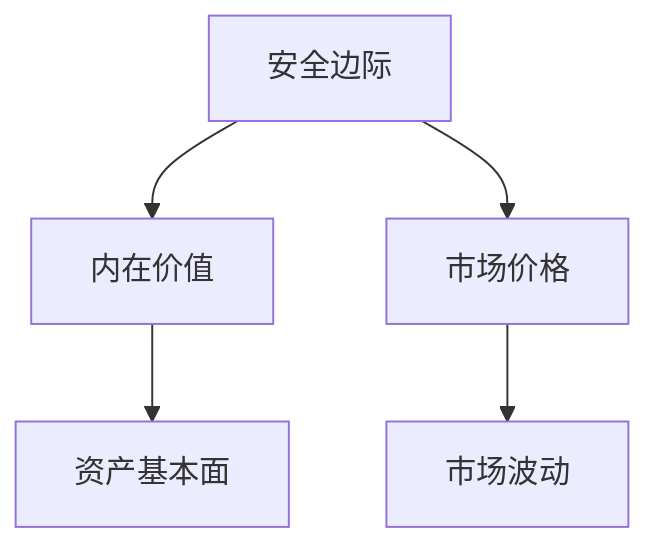
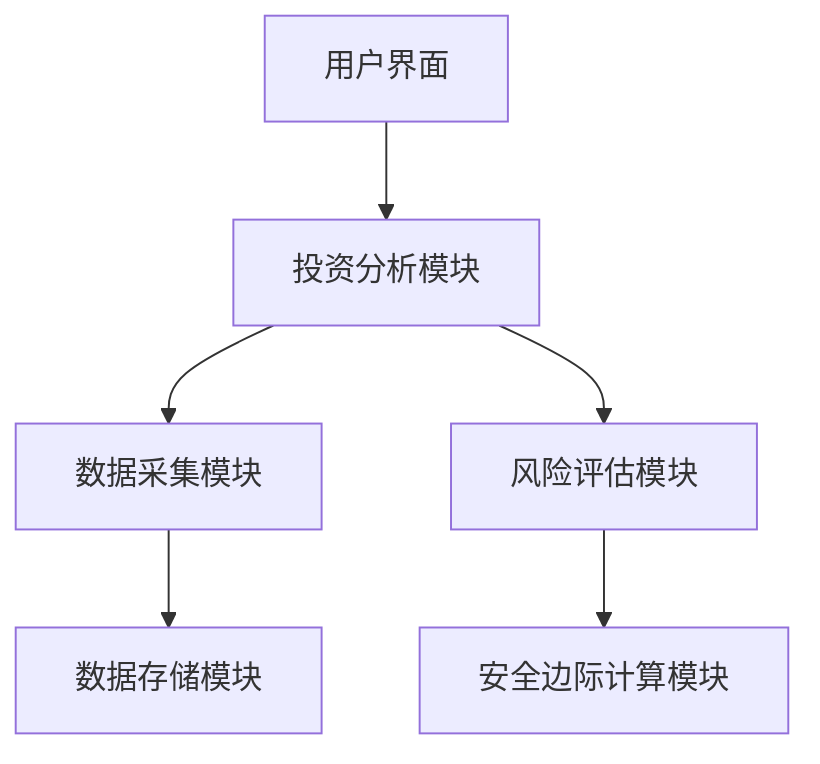

                 


# 格雷厄姆的安全边际概念

> 关键词：安全边际，格雷厄姆，投资学，内在价值，风险管理，价值投资

> 摘要：本文深入探讨了格雷厄姆提出的安全边际概念，分析其在投资学中的重要性，结合实际案例，详细讲解了安全边际的计算方法、应用场景以及系统架构设计。通过数学模型和系统设计，展示了如何将安全边际理念应用于实际投资中，确保投资决策的科学性和稳健性。

---

## 第一章: 安全边际的基本概念

### 1.1 投资学中的安全边际概念

安全边际是投资学中的一个重要概念，由 Benjamin Graham 提出，主要用于评估投资风险和潜在回报。它通过比较资产的市场价格与内在价值，确保投资的安全性和盈利性。安全边际的核心思想是避免过度投资，确保在市场波动中具备足够的缓冲空间。

### 1.2 格雷厄姆的学术背景与投资理念

Benjamin Graham 是价值投资的鼻祖，他的投资理念强调以低于内在价值的价格买入资产，以确保投资的安全边际。他的著作《证券分析》和《聪明的投资者》奠定了安全边际理论的基础，影响了后来的投资者，如沃伦·巴菲特。

### 1.3 安全边际的重要性

在投资过程中，安全边际帮助投资者避免因市场价格波动带来的损失，确保在市场低估时能够以合理的价格买入资产。通过计算安全边际，投资者可以更好地控制风险，提高投资回报率。

---

## 第二章: 核心概念与联系

### 2.1 核心概念的原理

安全边际的计算基于资产的内在价值和市场价格。内在价值是通过基本面分析得出的资产真实价值，而市场价格是市场参与者行为的结果。安全边际 = 内在价值 - 市场价格。

### 2.2 核心概念的属性对比

以下是安全边际与其他投资策略的对比：

| 比较维度        | 安全边际                     | 其他投资策略                 |
|-----------------|------------------------------|-----------------------------|
| 核心理念         | 避免过度投资，控制风险       | 追求高收益，注重市场趋势     |
| 计算方法         | 基于内在价值和市场价格       | 基于技术分析或市场情绪       |
| 风险控制         | 强调风险控制，确保安全空间   | 风险控制较弱，依赖市场判断   |

### 2.3 安全边际的结构与要素

使用 Mermaid 绘制安全边际的概念结构图：



---

## 第三章: 安全边际的算法原理

### 3.1 安全边际的计算流程

1. 计算资产的内在价值。
2. 确定资产的市场价格。
3. 计算安全边际：安全边际 = 内在价值 - 市场价格。

### 3.2 安全边际的数学模型

安全边际的计算公式为：

$$ \text{安全边际} = \text{内在价值} - \text{市场价格} $$

其中，内在价值的计算可以通过以下公式进行：

$$ \text{内在价值} = \sum \frac{\text{现金流}}{(1 + r)^t} $$

其中，r 是折现率，t 是时间。

---

## 第四章: 系统分析与架构设计

### 4.1 应用场景分析

安全边际可以应用于股票投资、风险管理等领域。通过系统化的方法，投资者可以在不同市场条件下动态调整投资策略。

### 4.2 系统架构设计

使用 Mermaid 绘制系统架构图：



---

## 第五章: 项目实战

### 5.1 环境安装

安装 Python 和必要的库，如 pandas 和 numpy。

### 5.2 核心代码实现

以下是计算安全边际的 Python 代码：

```python
import pandas as pd
import numpy as np

# 示例数据
data = {'市场价格': [50, 60, 70], '内在价值': [60, 70, 80]}
df = pd.DataFrame(data)

# 计算安全边际
df['安全边际'] = df['内在价值'] - df['市场价格']

print(df)
```

### 5.3 案例分析

通过上述代码计算，当市场价格为 50，内在价值为 60 时，安全边际为 10，表明投资是安全的。

---

## 第六章: 最佳实践

### 6.1 小结

安全边际是价值投资的核心理念，通过合理计算和应用，投资者可以在市场波动中保持稳健的投资回报。

### 6.2 注意事项

- 安全边际的计算需要准确的内在价值评估。
- 市场价格波动可能会影响安全边际的准确性。
- 定期调整投资组合，确保安全边际的有效性。

### 6.3 拓展阅读

- 《证券分析》 by Benjamin Graham
- 《聪明的投资者》 by Benjamin Graham

---

通过以上章节的详细讲解，我们全面探讨了格雷厄姆的安全边际概念，从理论到实践，帮助投资者更好地理解和应用这一重要的投资理念。

