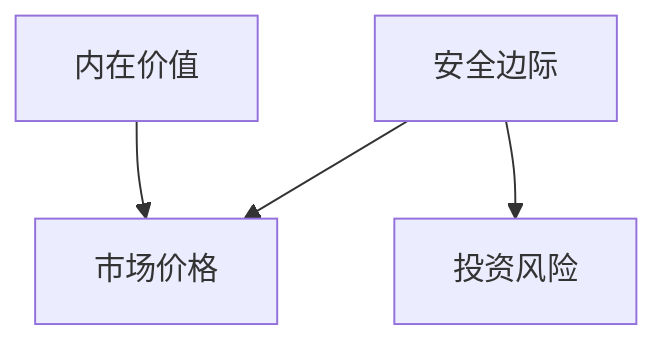
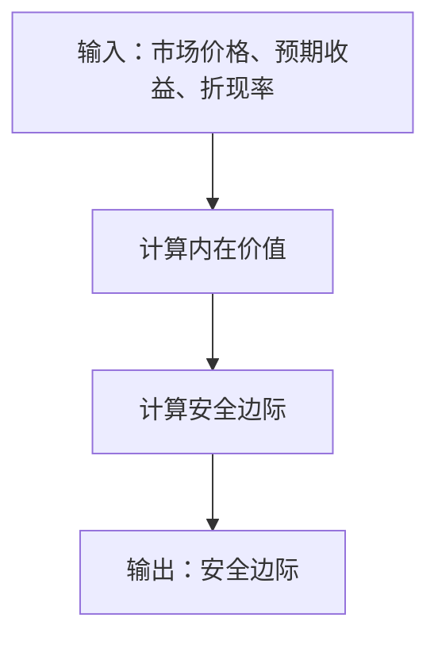
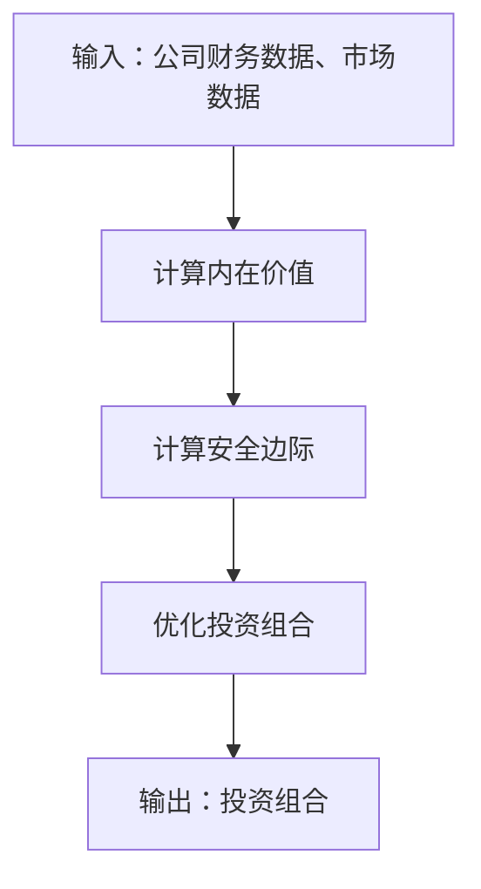
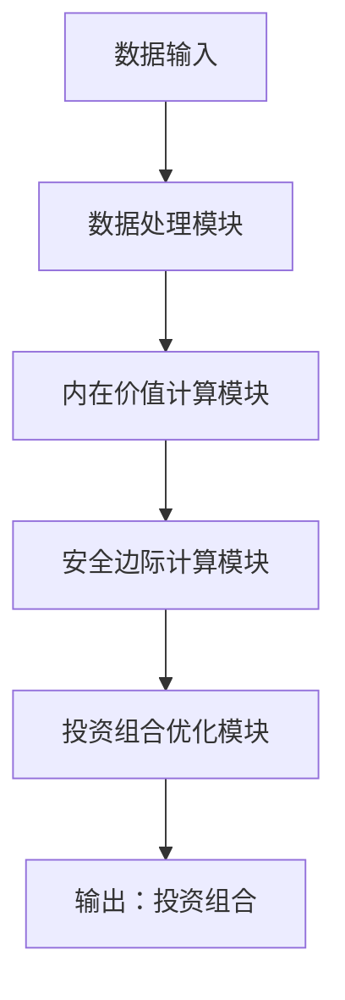
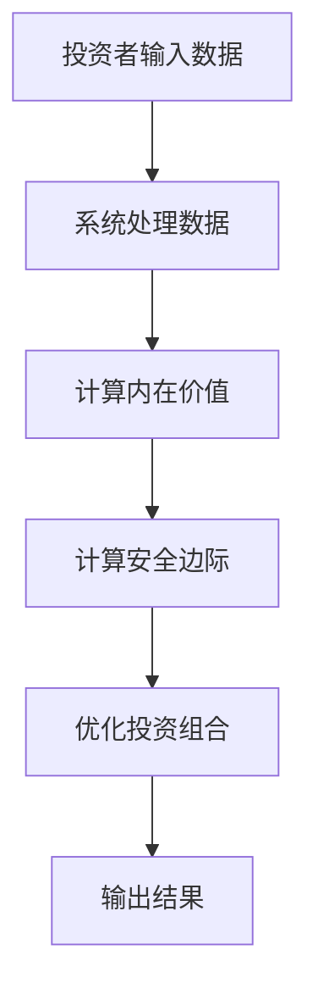
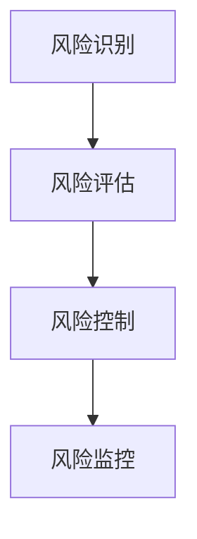

                 


# 格雷厄姆的安全边际理论：在高估值市场中的应用

## 关键词：安全边际理论，高估值市场，投资策略，风险管理，价值投资，本杰明·格雷厄姆

## 摘要：  
格雷厄姆的安全边际理论是价值投资的核心思想之一，强调在投资决策中留出安全空间以应对市场不确定性。本文系统阐述了安全边际理论的背景、核心概念、数学模型，并结合当前高估值市场的特点，分析了其在投资实践中的应用。通过实际案例和系统架构设计，深入探讨了如何利用安全边际理论优化投资组合，降低风险，实现长期稳健收益。

---

# 第1章: 安全边际理论的背景与核心概念

## 1.1 安全边际理论的起源与发展

### 1.1.1 本杰明·格雷厄姆与价值投资的起源  
本杰明·格雷厄姆（Benjamin Graham）是20世纪最伟大的投资思想家之一，他于1934年出版的《证券分析》一书中首次系统提出了安全边际理论。格雷厄姆的投资理念深受其导师多利士·多德（Dorothy Dodd）的影响，强调以基本面分析为基础，寻找被市场低估的投资标的。

### 1.1.2 安全边际理论的提出背景  
20世纪20年代末至30年代初，美国股市经历了剧烈的波动，尤其是1929年的股灾，导致许多投资者损失惨重。格雷厄姆意识到，市场情绪的波动性和投资者的非理性行为会导致股票价格严重偏离其内在价值。因此，他提出“安全边际”概念，旨在通过比较股票的市场价格和内在价值，为投资者提供一个安全的保护空间，以应对市场的不确定性。

### 1.1.3 理论的核心框架与核心要素  
安全边际理论的核心框架包括以下几个方面：  
1. **内在价值**：股票的真实价值，基于公司财务数据、行业地位和未来盈利能力计算得出。  
2. **市场价格**：市场参与者买卖行为形成的股票价格。  
3. **安全边际**：内在价值与市场价格之间的差值，即 $ \text{安全边际} = \text{内在价值} - \text{市场价格} $。  

---

## 1.2 安全边际的核心概念与定义

### 1.2.1 安全边际的定义与内涵  
安全边际是衡量股票投资风险的重要指标，它反映了市场价格与内在价值之间的差距。如果市场价格低于内在价值，且两者之间的差距足够大，那么该股票就具有较高的安全边际，投资风险较低。

### 1.2.2 安全边际的计算方法  
安全边际的计算公式为：  
$$ \text{安全边际} = \frac{\text{内在价值} - \text{市场价格}}{\text{市场价格}} $$  
其中，内在价值可以通过对公司未来现金流的折现计算得出，公式为：  
$$ V = \frac{E}{k} $$  
其中，$V$ 表示内在价值，$E$ 表示预期收益，$k$ 表示折现率。

### 1.2.3 安全边际与投资风险的关系  
安全边际越大，投资风险越小。当市场价格远低于内在价值时，即使市场出现短期波动，投资者也能通过安全边际获得保护，避免因价格波动而产生重大损失。

---

## 1.3 安全边际理论的现代发展

### 1.3.1 理论的演变与扩展  
随着金融市场的不断发展，安全边际理论也在不断演变。现代投资者将安全边际与资产配置、风险管理等策略相结合，形成了更加完善的理论体系。

### 1.3.2 现代投资理论中的安全边际  
在现代投资组合理论（MPT）中，安全边际被用于评估资产的风险调整后收益。通过计算不同资产的安全边际，投资者可以优化投资组合，降低整体风险。

### 1.3.3 当代市场环境下的安全边际  
在当前高估值市场中，安全边际的重要性更加凸显。由于市场整体估值偏高，投资者需要更加谨慎地选择标的，确保投资标的具有足够的安全边际。

---

## 1.4 本章小结

### 1.4.1 核心概念回顾  
安全边际是衡量股票投资风险的重要指标，其计算公式为：  
$$ \text{安全边际} = \frac{\text{内在价值} - \text{市场价格}}{\text{市场价格}} $$  

### 1.4.2 理论框架总结  
安全边际理论的核心在于通过比较股票的市场价格和内在价值，为投资者提供一个安全的保护空间，降低投资风险。

---

# 第2章: 安全边际理论的核心原理与数学模型

## 2.1 安全边际的数学模型与公式

### 2.1.1 内在价值的计算公式  
股票的内在价值可以通过对未来现金流的折现计算得出：  
$$ V = \frac{E}{k} $$  
其中，$E$ 表示预期收益，$k$ 表示折现率。

### 2.1.2 安全边际的计算公式  
安全边际的计算公式为：  
$$ \text{安全边际} = \frac{\text{内在价值} - \text{市场价格}}{\text{市场价格}} $$  

## 2.2 安全边际的属性与特征对比

### 2.2.1 安全边际的属性对比表格  
| 属性         | 特征                     |
|--------------|--------------------------|
| 计算基础     | 内在价值                 |
| 计算方式     | 市场价格与内在价值的差值 |
| 应用场景     | 投资决策                 |

## 2.3 安全边际的ER实体关系图



---

## 2.4 安全边际的算法原理讲解

### 2.4.1 算法原理流程图



### 2.4.2 核心代码实现

```python
def calculate_intrinsic_value(expected_earnings, discount_rate):
    return expected_earnings / discount_rate

def calculate_margin_of_safety(intrinsic_value, market_price):
    return (intrinsic_value - market_price) / market_price

# 示例计算
expected_earnings = 100
discount_rate = 0.1
market_price = 80

intrinsic_value = calculate_intrinsic_value(expected_earnings, discount_rate)
margin_of_safety = calculate_margin_of_safety(intrinsic_value, market_price)

print(f"内在价值：{intrinsic_value}")
print(f"安全边际：{margin_of_safety}")
```

### 2.4.3 代码解读与分析  
1. `calculate_intrinsic_value` 函数用于计算股票的内在价值，公式为：  
$$ V = \frac{E}{k} $$  
2. `calculate_margin_of_safety` 函数用于计算安全边际，公式为：  
$$ \text{安全边际} = \frac{V - P}{P} $$  
3. 示例计算中，假设预期收益为 $100，折现率为 10%，市场价格为 $80，计算得到内在价值为 $100，安全边际为 25%。

---

## 2.5 本章小结

### 2.5.1 核心公式总结  
内在价值公式：  
$$ V = \frac{E}{k} $$  
安全边际公式：  
$$ \text{安全边际} = \frac{V - P}{P} $$  

### 2.5.2 算法实现要点  
- 输入：市场价格、预期收益、折现率  
- 输出：安全边际  

---

# 第3章: 高估值市场中的安全边际分析

## 3.1 高估值市场的现状与风险

### 3.1.1 高估值市场的定义与特征  
高估值市场是指市场整体估值远高于历史平均水平，通常用市盈率（P/E）或市净率（P/B）等指标衡量。

### 3.1.2 当前市场环境下的风险因素  
1. 利率上升：债券收益率上升可能导致股票价格下跌。  
2. 市场波动：投资者情绪波动可能导致股价剧烈波动。  
3. 估值压力：高估值市场的股票可能面临估值回调压力。

## 3.2 高估值市场中的安全边际应用

### 3.2.1 安全边际在高估值市场中的重要性  
在高估值市场中，安全边际是投资者规避风险的重要工具。通过计算安全边际，投资者可以避免投资于高估值股票，降低投资风险。

### 3.2.2 高估值市场中的安全边际计算

#### 3.2.2.1 内在价值的调整  
在高估值市场中，投资者需要根据市场环境调整内在价值的计算公式。例如，如果市场利率上升，折现率 $k$ 应该相应提高。

#### 3.2.2.2 安全边际的动态调整  
在高估值市场中，安全边际应动态调整，以反映市场变化。例如，当市场估值上升时，安全边际应相应降低。

## 3.3 高估值市场中的投资策略

### 3.3.1 策略一：寻找具有高安全边际的股票  
投资者应优先选择具有高安全边际的股票，即内在价值远高于市场价格的股票。

### 3.3.2 策略二：分散投资，降低风险  
通过分散投资，投资者可以降低单一股票的风险，同时利用安全边际理论优化整体投资组合。

### 3.3.3 策略三：长期持有，等待市场回归  
在高估值市场中，投资者应保持耐心，长期持有具有高安全边际的股票，等待市场回归其内在价值。

---

## 3.4 本章小结

### 3.4.1 高估值市场中的安全边际应用  
在高估值市场中，投资者应通过计算安全边际，选择具有高安全边际的股票，降低投资风险。

### 3.4.2 投资策略总结  
1. 寻找具有高安全边际的股票。  
2. 分散投资，降低风险。  
3. 长期持有，等待市场回归。  

---

# 第4章: 安全边际的系统分析与架构设计

## 4.1 问题场景介绍  
在高估值市场中，投资者需要通过系统化的分析，优化投资组合，降低风险。

## 4.2 系统功能设计

### 4.2.1 系统功能模块  
1. **内在价值计算模块**：根据公司财务数据计算股票的内在价值。  
2. **市场价格数据模块**：获取股票的市场价格数据。  
3. **安全边际计算模块**：计算股票的安全边际。  
4. **投资组合优化模块**：根据安全边际优化投资组合。

### 4.2.2 系统功能流程图



## 4.3 系统架构设计

### 4.3.1 系统架构图



## 4.4 系统接口设计  
1. **数据接口**：从数据源获取公司财务数据和市场价格数据。  
2. **计算接口**：计算内在价值和安全边际。  
3. **优化接口**：优化投资组合。

## 4.5 系统交互设计

### 4.5.1 投资者操作流程图



---

## 4.6 本章小结

### 4.6.1 系统架构总结  
通过系统化的分析和架构设计，投资者可以更加高效地计算安全边际，优化投资组合。

### 4.6.2 关键技术总结  
1. 内在价值计算模块。  
2. 安全边际计算模块。  
3. 投资组合优化模块。  

---

# 第5章: 高估值市场中的投资实战

## 5.1 环境安装与配置  
1. 安装Python编程环境。  
2. 安装必要的库：pandas、numpy、scipy。

## 5.2 核心实现代码

### 5.2.1 数据获取与处理

```python
import pandas as pd
import numpy as np

# 获取公司财务数据
def get_finance_data(company):
    # 示例数据
    return pd.DataFrame({
        '收入': [100, 200, 300],
        '净利润': [20, 30, 40],
        '股东权益': [150, 250, 350]
    })

# 获取市场价格数据
def get_market_price(company):
    return 100  # 示例价格
```

### 5.2.2 内在价值计算

```python
def calculate_intrinsic_value(net_income, equity, discount_rate):
    return net_income * equity / discount_rate

# 示例计算
net_income = 30
equity = 250
discount_rate = 0.1

intrinsic_value = calculate_intrinsic_value(net_income, equity, discount_rate)
print(f"内在价值：{intrinsic_value}")
```

### 5.2.3 安全边际计算

```python
market_price = get_market_price(company)
margin_of_safety = (intrinsic_value - market_price) / market_price
print(f"安全边际：{margin_of_safety}")
```

## 5.3 代码解读与分析  
1. `get_finance_data` 函数用于获取公司财务数据。  
2. `calculate_intrinsic_value` 函数用于计算内在价值，公式为：  
$$ V = \frac{E \times B}{k} $$  
其中，$E$ 表示净利润，$B$ 表示股东权益，$k$ 表示折现率。  
3. `get_market_price` 函数用于获取市场价格数据。  
4. `margin_of_safety` 计算公式为：  
$$ \text{安全边际} = \frac{V - P}{P} $$  

---

## 5.4 投资组合优化与策略调整

### 5.4.1 投资组合优化算法

```python
def optimize_portfolio(stocks, market_prices, expected_earnings, discount_rates):
    optimal_portfolio = []
    for i in range(len(stocks)):
        intrinsic_value = calculate_intrinsic_value(expected_earnings[i], discount_rates[i])
        margin_of_safety = (intrinsic_value - market_prices[i]) / market_prices[i]
        optimal_portfolio.append((stocks[i], margin_of_safety))
    return optimal_portfolio

# 示例优化
stocks = ['AAPL', 'MSFT', 'GOOGL']
market_prices = [100, 80, 120]
expected_earnings = [100, 80, 120]
discount_rates = [0.1, 0.1, 0.1]

optimal_portfolio = optimize_portfolio(stocks, market_prices, expected_earnings, discount_rates)
print("优化后投资组合：", optimal_portfolio)
```

### 5.4.2 投资策略调整  
1. 优先选择具有高安全边际的股票。  
2. 根据市场变化动态调整投资组合。  
3. 定期评估投资组合的安全边际，及时调整。

---

## 5.5 本章小结

### 5.5.1 核心代码实现  
通过Python代码实现内在价值计算、安全边际计算和投资组合优化。

### 5.5.2 投资策略总结  
1. 优先选择具有高安全边际的股票。  
2. 根据市场变化动态调整投资组合。  
3. 定期评估投资组合的安全边际，及时调整。  

---

# 第6章: 风险管理与心理因素

## 6.1 风险管理策略

### 6.1.1 风险管理框架  
1. **风险识别**：识别潜在风险，如市场波动、公司基本面变化等。  
2. **风险评估**：评估风险的严重程度，计算安全边际。  
3. **风险控制**：通过分散投资、调整仓位等方式控制风险。  
4. **风险监控**：定期监控投资组合的风险，及时调整。

### 6.1.2 风险管理流程图



## 6.2 心理因素与投资行为

### 6.2.1 心理偏差对投资行为的影响  
1. **过度自信**：投资者可能过于自信，忽视市场风险。  
2. **从众心理**：投资者可能因从众心理而盲目跟风。  
3. **损失厌恶**：投资者可能因害怕损失而做出非理性决策。

### 6.2.2 心理因素对安全边际的影响  
1. **情绪波动**：市场情绪波动可能导致安全边际计算失误。  
2. **决策疲劳**：长期的市场波动可能导致投资者决策疲劳，影响判断。

## 6.3 应对策略

### 6.3.1 理性决策与纪律性  
投资者需要保持理性，避免情绪化决策，严格按照安全边际理论进行投资。

### 6.3.2 持续学习与反思  
投资者需要不断学习，反思自己的投资行为，优化投资策略。

---

## 6.4 本章小结

### 6.4.1 风险管理总结  
1. 通过风险识别、评估、控制和监控，降低投资风险。  
2. 理性决策，避免情绪化投资。  
3. 持续学习，优化投资策略。  

---

# 第7章: 安全边际理论的未来展望

## 7.1 理论的局限性与改进方向

### 7.1.1 理论的局限性  
1. 安全边际理论假设市场是有效的，但现实中市场可能存在信息不对称等问题。  
2. 理论对高成长性公司的估值可能存在偏差。

### 7.1.2 改进方向  
1. 结合大数据分析，优化内在价值计算模型。  
2. 将安全边际理论应用于新兴市场，如ESG投资。  
3. 结合人工智能技术，提高安全边际计算的准确性和效率。

## 7.2 技术进步对安全边际理论的影响

### 7.2.1 人工智能与大数据分析  
人工智能技术可以帮助投资者更精准地计算内在价值和安全边际，优化投资决策。

### 7.2.2 区块链技术的应用  
区块链技术可以提高数据透明度，降低信息不对称，为安全边际理论提供更可靠的数据支持。

## 7.3 未来投资策略的演变

### 7.3.1 多因子模型的应用  
通过多因子模型，投资者可以更全面地评估股票的风险和收益，优化投资组合。

### 7.3.2 动态调整策略  
随着市场环境的变化，投资者需要动态调整安全边际计算模型，优化投资策略。

---

## 7.4 本章小结

### 7.4.1 理论改进方向  
1. 结合大数据分析，优化内在价值计算模型。  
2. 将安全边际理论应用于新兴市场。  
3. 结合人工智能技术，提高安全边际计算的准确性和效率。  

### 7.4.2 未来投资策略  
1. 多因子模型的应用。  
2. 动态调整策略。  

---

# 结语  
安全边际理论是价值投资的核心思想之一，其在高估值市场中的应用为投资者提供了重要的风险管理工具。通过系统化的分析和实践，投资者可以更好地利用安全边际理论，优化投资组合，降低风险，实现长期稳健收益。

---

# 参考文献  
1. 格雷厄姆，本杰明. 《证券分析》. 北京：机械工业出版社，2008.  
2. 葛拉罕姆，大卫. 《投资的智慧》. 北京：中信出版社，2012.  
3. 纳西姆·尼古拉斯·塔勒布. 《黑天鹅》. 北京：中信出版社，2008.

