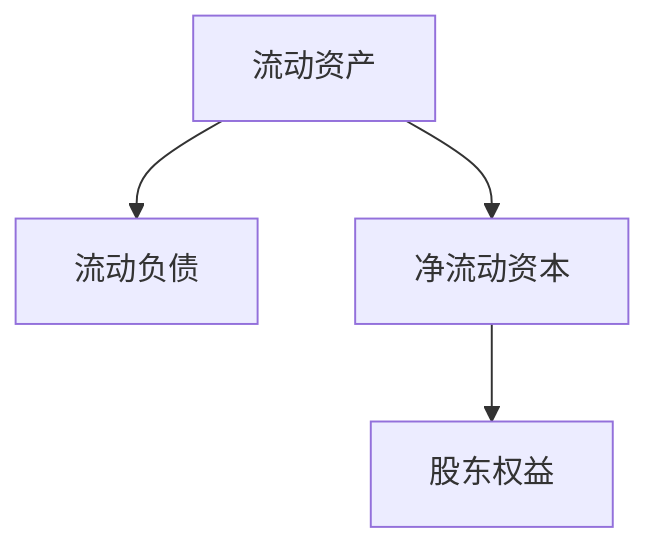
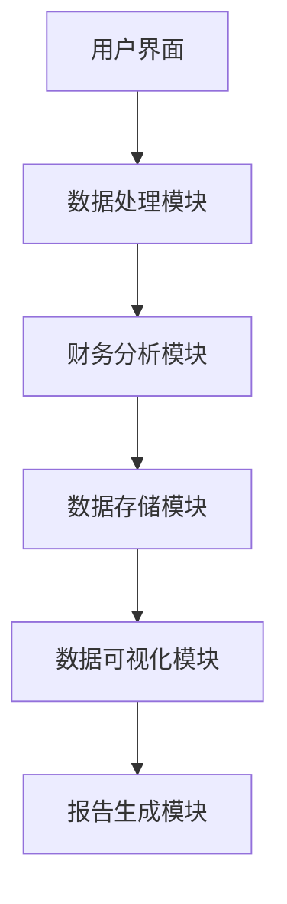

                 


# 格雷厄姆的工作资本分析在现代企业估值中的应用

## 关键词：
- 格雷厄姆
- 工作资本分析
- 企业估值
- 现代企业
- 财务分析

## 摘要：
本文将探讨格雷厄姆的经典工作资本分析方法在现代企业估值中的应用。通过分析工作资本分析的核心原理、现代企业的财务特征以及数字技术对企业估值的影响，本文旨在揭示如何在现代复杂商业环境中优化和应用这一传统方法，为企业估值提供新的视角和解决方案。

---

## 第一部分: 工作资本分析的背景与基础

### 第1章: 工作资本分析的定义与历史演变

#### 1.1 工作资本分析的核心概念
##### 1.1.1 格雷厄姆工作资本分析的定义
工作资本分析是格雷厄姆提出的一种企业估值方法，主要用于评估企业的财务健康状况和内在价值。其核心在于通过分析企业的流动资产和流动负债，计算净流动资本，并以此为基础评估企业的财务安全性和成长潜力。

##### 1.1.2 工作资本分析的历史背景
格雷厄姆在20世纪初提出工作资本分析，主要应用于传统制造业和实体经济领域。这种方法基于企业的财务报表数据，通过分析流动资产和流动负债的比例关系，判断企业的短期偿债能力和财务稳定性。

##### 1.1.3 工作资本分析的现代发展
随着经济全球化和数字化转型的推进，工作资本分析的应用范围逐渐扩展到现代高科技企业和服务业。现代企业估值需要考虑更多动态因素，如技术创新、数据驱动的财务管理等，这使得工作资本分析在方法和内容上都需要进行相应的优化和调整。

#### 1.2 工作资本分析的理论基础
##### 1.2.1 价值投资的基本原理
价值投资的核心理念是寻找市场低估的企业，通过分析企业的内在价值来判断其投资价值。格雷厄姆的工作资本分析方法正是基于这一理念，通过对企业财务状况的深入分析，寻找具有安全边际的投资标的。

##### 1.2.2 格雷厄姆投资策略的核心思想
格雷厄姆强调安全边际和价值评估，主张通过保守的财务分析方法来识别具有长期稳定收益的企业。他提出的工作资本分析方法不仅关注企业的财务健康状况，还注重企业的成长性和盈利能力。

##### 1.2.3 工作资本分析在企业估值中的地位
工作资本分析是企业估值的重要组成部分，尤其是在评估企业的短期偿债能力和流动性方面具有独特的优势。然而，随着企业经营模式的变化，工作资本分析需要与其他估值方法相结合，才能更好地适应现代企业的复杂性。

---

### 第2章: 工作资本分析的应用价值

#### 2.1 工作资本分析的适用场景
##### 2.1.1 传统制造业企业的估值
在传统制造业中，工作资本分析主要用于评估企业的短期偿债能力和流动性。通过分析企业的流动资产和流动负债比例，可以判断企业在短期内的财务安全性和经营稳定性。

##### 2.1.2 现代科技企业的估值
现代科技企业通常具有较高的研发投入和无形资产，其财务结构和盈利模式与传统企业有很大不同。工作资本分析需要结合企业的研发投入、知识产权和未来收益潜力，进行动态调整。

##### 2.1.3 服务业企业的估值
服务业企业的财务结构通常以流动资产为主，工作资本分析在评估企业的流动性和短期偿债能力方面具有重要意义。然而，由于服务业的收入来源具有较大的波动性，工作资本分析需要结合企业的收入周期和客户稳定性进行综合评估。

#### 2.2 工作资本分析的优势与局限性
##### 2.2.1 优势
1. **简单易懂**：工作资本分析基于流动资产和流动负债的计算，方法简单，易于理解和应用。
2. **直观反映流动性**：通过分析流动资产和流动负债的比例，可以直观判断企业的流动性状况和短期偿债能力。
3. **风险控制**：工作资本分析可以帮助投资者识别企业的短期财务风险，避免因流动性不足导致的企业危机。

##### 2.2.2 局限性
1. **静态性**：工作资本分析主要基于财务报表的静态数据，难以反映企业的动态变化和未来发展趋势。
2. **行业差异**：不同行业的企业具有不同的财务结构和经营特点，工作资本分析需要根据行业特点进行调整。
3. **忽略长期价值**：工作资本分析主要关注企业的短期财务状况，忽视了企业的长期价值和未来收益潜力。

##### 2.2.3 补充方法的必要性
为了克服工作资本分析的局限性，需要结合其他估值方法，如市盈率、市净率、现金流折现法等，进行综合评估。特别是在现代企业估值中，还需要考虑企业的技术创新能力、市场竞争力和管理团队等因素。

---

## 第二部分: 工作资本分析的核心原理

### 第3章: 工作资本分析的数学模型与公式

#### 3.1 工作资本的基本公式
##### 3.1.1 工作资本的计算公式
$$ \text{工作资本} = \text{流动资产} - \text{流动负债} $$

工作资本是企业流动资产减去流动负债的差额，反映了企业的短期偿债能力和流动性。流动资产包括现金、应收账款、存货等，流动负债包括应付账款、短期借款等。

##### 3.1.2 工作资本与股东权益的关系
$$ \text{股东权益} = \text{资产} - \text{负债} $$

股东权益是企业净资产的价值，包括所有者权益和留存收益等。工作资本是股东权益的重要组成部分，反映了企业在短期内的财务健康状况。

##### 3.1.3 工作资本的动态模型
工作资本的动态模型可以通过时间序列分析和回归分析来评估企业的流动性变化趋势。例如，可以通过分析过去几年的工作资本变化趋势，预测未来的工作资本状况。

#### 3.2 工作资本分析的核心要素与关系
##### 3.2.1 核心要素的定义与属性
- **流动资产**：包括现金、应收账款、存货等，反映了企业的短期资产状况。
- **流动负债**：包括应付账款、短期借款等，反映了企业的短期负债状况。
- **净流动资本**：流动资产减去流动负债，反映了企业的短期偿债能力和流动性。

##### 3.2.2 核心要素的对比分析
- **资产与负债的对比**：通过流动资产与流动负债的对比，可以判断企业的短期偿债能力和流动性。
- **流动与非流动资产的对比**：分析流动资产与非流动资产的比例，可以判断企业的资产结构和长期偿债能力。
- **流动与非流动负债的对比**：分析流动负债与非流动负债的比例，可以判断企业的负债结构和财务稳定性。

##### 3.2.3 实体关系图


---

### 第4章: 工作资本分析的核心要素与关系

#### 4.1 核心要素的定义与属性
##### 4.1.1 流动资产
流动资产是指企业在一年内可以转化为现金的资产，包括现金、应收账款、存货等。流动资产的流动性越高，企业的短期偿债能力越强。

##### 4.1.2 流动负债
流动负债是指企业在一年内需要偿还的债务，包括应付账款、短期借款等。流动负债的多少直接影响企业的短期偿债能力和流动性。

##### 4.1.3 净流动资本
净流动资本是流动资产减去流动负债的结果，反映了企业在短期内的财务安全性和流动性。净流动资本为正，说明企业有足够的流动资产来偿还短期负债。

#### 4.2 核心要素的对比分析
##### 4.2.1 资产与负债的对比
通过分析流动资产与流动负债的比例，可以判断企业的短期偿债能力和流动性。例如，流动资产与流动负债的比例越高，企业的短期偿债能力越强。

##### 4.2.2 流动与非流动资产的对比
流动资产与非流动资产的比例反映了企业的资产结构。流动资产比例越高，企业的资产流动性越强，但长期投资能力可能较弱。

##### 4.2.3 流动与非流动负债的对比
流动负债与非流动负债的比例反映了企业的负债结构。流动负债比例越高，企业的短期偿债压力越大，但长期负债比例较高可能意味着企业具有更强的长期偿债能力。

#### 4.3 核心要素的ER实体关系图


---

## 第三部分: 工作资本分析在现代企业的应用

### 第5章: 现代企业估值中的工作资本分析

#### 5.1 现代企业的财务特征
##### 5.1.1 高速增长行业的特征
高速增长行业的企业通常具有较高的研发投入和较快的收入增长。在进行工作资本分析时，需要考虑企业的未来收益潜力和研发投入的资本化问题。

##### 5.1.2 稳定行业的特征
稳定行业的企业通常具有稳定的收入和较低的财务风险。工作资本分析在评估这类企业的短期偿债能力和流动性方面具有重要意义。

##### 5.1.3 衰退行业的特征
衰退行业的企业通常面临市场需求下降和收入增长乏力的问题。在进行工作资本分析时，需要特别关注企业的流动资产质量，避免因资产贬值导致的财务危机。

#### 5.2 现代企业估值中的工作资本调整
##### 5.2.1 行业差异的调整
不同行业的企业具有不同的财务结构和经营特点，工作资本分析需要根据行业特点进行调整。例如，科技企业需要考虑研发投入的资本化问题，而服务业需要关注客户稳定性。

##### 5.2.2 企业规模的调整
大型企业的财务结构通常较为复杂，工作资本分析需要考虑企业的规模效应和协同效应。例如，大型企业的流动资产和流动负债比例可能与小型企业有所不同。

##### 5.2.3 财务杠杆的调整
财务杠杆是企业负债与股东权益的比例。在进行工作资本分析时，需要结合企业的财务杠杆水平，评估企业的短期偿债能力和财务风险。

### 第6章: 数字技术对企业估值的影响

#### 6.1 数字技术对企业财务结构的影响
##### 6.1.1 数据驱动的财务管理
数字技术的应用使得企业的财务管理更加数据化和精准化。例如，通过大数据分析，企业可以更准确地预测现金流和评估资产质量。

##### 6.1.2 云计算对企业估值的影响
云计算的普及使得企业的 IT 资产管理更加灵活和高效。在进行工作资本分析时，需要考虑云计算的资本化问题，避免因资产贬值导致的估值偏差。

##### 6.1.3 大数据分析的应用
大数据分析可以帮助企业更好地识别市场风险和优化财务结构。例如，通过分析市场数据和竞争对手的财务状况，企业可以制定更科学的财务策略。

#### 6.2 数字技术与工作资本分析的结合
##### 6.2.1 数字技术对企业流动资产和流动负债的影响
数字技术的应用使得企业的流动资产和流动负债更加动态化和复杂化。例如，电子商务企业的流动资产包括存货和应收账款，而流动负债可能包括应付账款和短期借款。

##### 6.2.2 数字技术对企业流动资本的优化
通过数字技术的应用，企业可以更高效地管理流动资产和流动负债。例如，通过供应链管理优化存货周转率，通过应收账款管理提高资金利用率。

##### 6.2.3 数字技术对工作资本分析的挑战
数字技术的应用也带来了一些新的挑战，例如数据隐私和安全问题、技术更新换代快等问题。这些都需要在进行工作资本分析时加以考虑。

---

## 第四部分: 工作资本分析的系统架构与实现

### 第7章: 系统架构与实现

#### 7.1 系统功能设计
##### 7.1.1 财务数据采集与处理
系统需要采集企业的财务数据，包括流动资产、流动负债等，并进行清洗和处理，确保数据的准确性和完整性。

##### 7.1.2 工作资本计算与分析
系统需要根据流动资产和流动负债计算工作资本，并进行动态分析，评估企业的短期偿债能力和流动性。

##### 7.1.3 数据可视化与报告生成
系统需要将分析结果进行可视化展示，并生成财务报告，帮助企业管理层和投资者更好地理解和决策。

#### 7.2 系统架构设计
##### 7.2.1 系统架构图


##### 7.2.2 系统接口设计
系统需要与企业的财务系统和数据源进行对接，确保数据的实时性和准确性。接口设计需要遵循标准协议，确保系统的兼容性和扩展性。

##### 7.2.3 系统交互流程
系统交互流程包括数据采集、处理、分析、可视化和报告生成等环节，确保系统的高效运行和用户友好的体验。

---

## 第五部分: 项目实战与最佳实践

### 第8章: 项目实战

#### 8.1 环境安装与配置
##### 8.1.1 系统安装
需要安装和配置相关的财务分析系统和数据处理工具，确保系统的正常运行。

##### 8.1.2 数据源接入
将企业的财务数据接入系统，确保数据的准确性和完整性。

#### 8.2 核心代码实现
##### 8.2.1 工作资本计算
```python
def calculate_working_capital(current_assets, current_liabilities):
    return current_assets - current_liabilities
```

##### 8.2.2 动态分析与预测
```python
import pandas as pd
import numpy as np

def calculate_working_capital_trend(data):
    data['working_capital'] = data['current_assets'] - data['current_liabilities']
    return data['working_capital'].rolling(3).mean()
```

##### 8.2.3 数据可视化
```python
import matplotlib.pyplot as plt

def visualize_working_capital(data):
    plt.plot(data['date'], data['working_capital'])
    plt.xlabel('日期')
    plt.ylabel('工作资本')
    plt.title('工作资本变化趋势')
    plt.show()
```

#### 8.3 案例分析与解读
##### 8.3.1 案例背景
以某制造企业为例，分析其工作资本的变化趋势和财务健康状况。

##### 8.3.2 数据分析与解读
通过计算和可视化，发现该企业的流动资产与流动负债比例逐渐下降，说明企业的短期偿债能力在减弱，需要引起关注。

##### 8.3.3 优化建议
建议企业优化存货管理和应收账款回收，提高流动资产的周转效率，改善短期偿债能力。

#### 8.4 项目小结
通过项目实战，我们验证了工作资本分析方法的有效性和实用性，同时也发现了在实际应用中需要注意的问题，如数据的准确性和模型的动态调整。

---

## 第六部分: 总结与展望

### 第9章: 总结与展望

#### 9.1 核心要点回顾
##### 9.1.1 工作资本分析的核心概念
工作资本是流动资产减去流动负债，反映了企业的短期偿债能力和流动性。

##### 9.1.2 现代企业估值中的应用
工作资本分析需要结合企业的行业特点和财务结构进行动态调整，尤其是在数字技术环境下，需要考虑数据驱动的财务管理。

##### 9.1.3 数字技术的影响
数字技术的应用使得企业的财务结构更加复杂化，同时也为工作资本分析提供了新的工具和方法。

#### 9.2 未来展望
##### 9.2.1 技术进步的影响
随着人工智能和大数据技术的进一步发展，工作资本分析将更加智能化和自动化，能够实时分析企业的财务状况，提供更精准的估值结果。

##### 9.2.2 行业发展趋势
未来，随着经济全球化和数字化转型的推进，工作资本分析的应用范围将更加广泛，尤其是在新兴行业和高科技企业中，其重要性将更加凸显。

##### 9.2.3 研究方向
未来的研究方向将集中在如何将工作资本分析与现代企业估值方法相结合，探索更全面、更动态的财务分析方法，以适应复杂多变的商业环境。

---

## 第七部分: 最佳实践与小结

### 第10章: 最佳实践与小结

#### 10.1 小结
通过本文的探讨，我们深入分析了格雷厄姆的工作资本分析方法在现代企业估值中的应用，揭示了其在企业财务分析中的重要作用和适用性。同时，我们也认识到在实际应用中，工作资本分析需要结合企业的行业特点和财务结构进行动态调整。

#### 10.2 注意事项
1. **数据的准确性**：在进行工作资本分析时，需要确保数据的准确性和完整性。
2. **模型的动态性**：工作资本分析需要结合企业的实际情况进行动态调整，避免因静态分析导致的估值偏差。
3. **综合评估**：工作资本分析需要与其他估值方法相结合，进行全面的财务分析和评估。

#### 10.3 拓展阅读
1. 格雷厄姆的《证券分析》
2. 现代企业估值方法的相关书籍和文献
3. 数字技术与财务分析的结合

---

## 总结

通过本文的详细探讨，我们不仅深入理解了格雷厄姆的工作资本分析方法，还将其应用到现代企业的估值中，揭示了其在实际应用中的优势和挑战。未来，随着技术的进步和企业经营模式的不断变化，工作资本分析将与更多新的方法和工具相结合，为企业估值提供更全面、更精准的解决方案。

