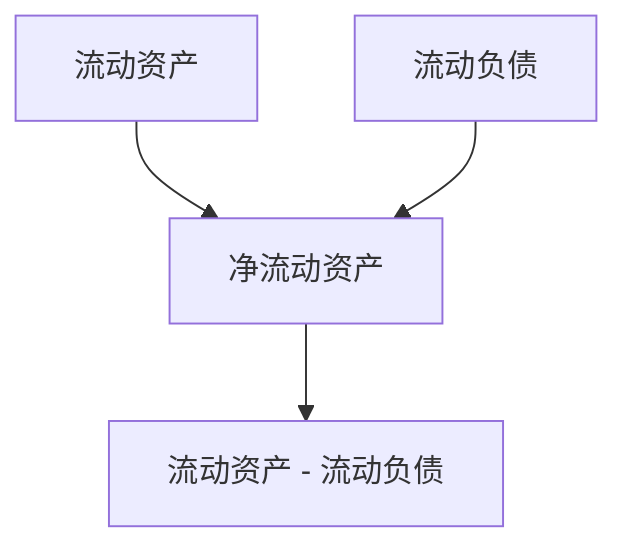
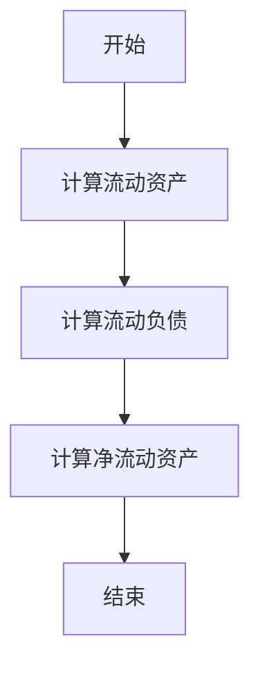
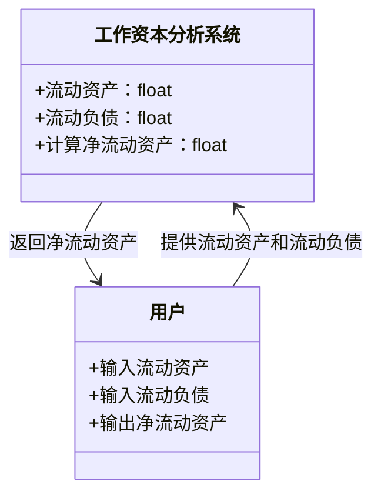
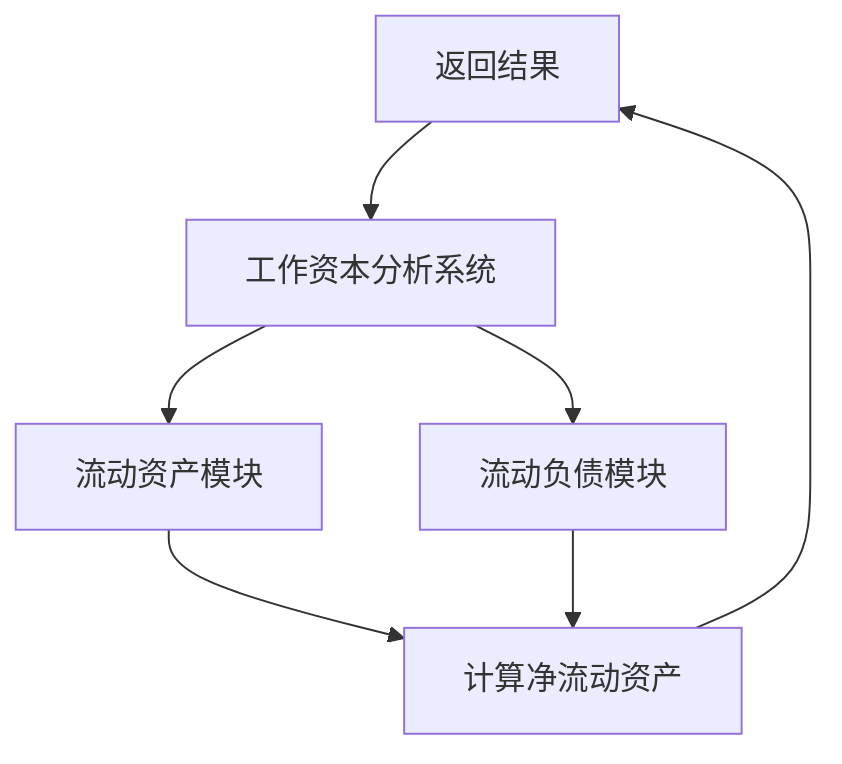
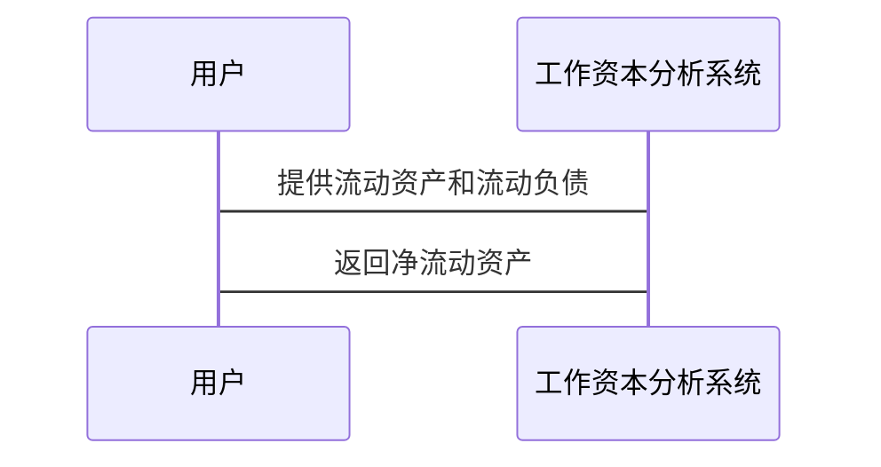

                 


# 格雷厄姆的工作资本分析方法

> 关键词：格雷厄姆，工作资本分析，价值投资，流动资产，流动负债，净流动资产

> 摘要：本文深入探讨了格雷厄姆的工作资本分析方法，从背景介绍、核心概念、数学模型、系统架构到项目实战，全面分析了工作资本分析的原理和应用。通过详细讲解和实际案例，展示了如何利用这种方法评估企业的内在价值，为投资者提供科学的决策依据。

---

# 第一部分: 工作资本分析方法概述

## 第1章: 工作资本分析的背景与核心概念

### 1.1 工作资本分析的背景

#### 1.1.1 价值投资的起源与发展

价值投资是一种长期投资策略，起源于20世纪初，由本杰明·格雷厄姆和戴维·多德等人发展和完善。格雷厄姆是价值投资的鼻祖，他的核心思想是通过分析企业的基本面，寻找那些被市场低估的企业进行投资。

#### 1.1.2 格雷厄姆的投资理念与工作资本分析

格雷厄姆在《证券分析》中提出，投资者应该关注企业的内在价值，而非市场的短期波动。他强调通过对企业财务报表的深入分析，尤其是流动资产和流动负债的分析，来评估企业的短期偿债能力和财务健康状况。这种分析方法被称为“工作资本分析”。

#### 1.1.3 工作资本分析的现实意义

在现代金融市场上，工作资本分析仍然具有重要的现实意义。通过分析企业的流动资产和流动负债，投资者可以评估企业的短期财务健康状况，从而做出更明智的投资决策。

### 1.2 工作资本分析的核心概念

#### 1.2.1 流动资产与流动负债的定义

流动资产是指企业能够在一年内或一个经营周期内变现或耗用的资产，主要包括现金、应收账款、存货等。

流动负债是指企业在一年内或一个经营周期内需要偿还的债务，主要包括应付账款、短期借款等。

#### 1.2.2 净流动资产的计算公式

$$\text{净流动资产} = \text{流动资产} - \text{流动负债}$$

#### 1.2.3 工作资本分析的边界与外延

工作资本分析主要关注企业的短期财务状况，但也可以扩展到企业的长期资产和负债，从而更全面地评估企业的整体财务健康状况。

#### 1.2.4 核心要素对比

| 要素 | 流动资产 | 流动负债 | 净流动资产 |
|------|----------|----------|------------|
| 定义 | 短期内变现的资产 | 短期内偿还的债务 | 流动资产减去流动负债 |
| 特性 | 转换为现金的能力 | 偿债压力 | 衡量短期偿债能力 |
| 作用 | 支持日常运营 | 影响短期债务偿还 | 评估短期财务健康 |

#### 1.2.5 实体关系ER图



---

## 第2章: 工作资本分析的数学模型与算法实现

### 2.1 工作资本分析的数学模型

#### 2.1.1 算法流程图



#### 2.1.2 算法实现代码

```python
def calculate_working_capital(current_assets, current_liabilities):
    net_current_assets = current_assets - current_liabilities
    return net_current_assets

# 示例数据
current_assets = 1000000  # 流动资产
current_liabilities = 800000  # 流动负债

working_capital = calculate_working_capital(current_assets, current_liabilities)
print(f"净流动资产为：{working_capital}")
```

#### 2.1.3 公式解释与举例

$$\text{净流动资产} = \text{流动资产} - \text{流动负债}$$

假设某企业的流动资产为500万元，流动负债为300万元，则净流动资产为：

$$\text{净流动资产} = 500 - 300 = 200 \text{万元}$$

---

## 第3章: 工作资本分析的系统架构与设计

### 3.1 系统分析与架构设计

#### 3.1.1 系统功能设计



#### 3.1.2 系统架构设计



#### 3.1.3 系统接口设计

系统接口设计包括以下步骤：

1. 用户输入流动资产和流动负债。
2. 系统计算净流动资产。
3. 系统返回计算结果。

#### 3.1.4 系统交互流程图



---

## 第4章: 工作资本分析的项目实战与案例分析

### 4.1 项目实战

#### 4.1.1 项目背景

以某制造企业为例，我们可以通过工作资本分析评估其短期财务健康状况。

#### 4.1.2 项目实现

```python
def calculate_working_capital(current_assets, current_liabilities):
    net_current_assets = current_assets - current_liabilities
    return net_current_assets

# 输入数据
current_assets = 1500000  # 流动资产
current_liabilities = 1000000  # 流动负债

# 计算净流动资产
working_capital = calculate_working_capital(current_assets, current_liabilities)
print(f"企业的净流动资产为：{working_capital}元")
```

#### 4.1.3 项目解读与分析

通过上述代码，我们可以得出该企业的净流动资产为50万元。这表明该企业在短期内具有较强的偿债能力。

#### 4.1.4 案例分析

假设某企业的流动资产为200万元，流动负债为150万元，则净流动资产为：

$$\text{净流动资产} = 200 - 150 = 50 \text{万元}$$

这表明该企业在短期内具有较强的财务健康状况。

---

## 第5章: 总结与展望

### 5.1 最佳实践

在进行工作资本分析时，投资者应该注意以下几点：

1. 结合企业的整体财务状况进行分析。
2. 关注企业的流动资产和流动负债的具体构成。
3. 结合市场环境和企业所处行业进行综合判断。

### 5.2 小结

本文详细探讨了格雷厄姆的工作资本分析方法，从背景介绍、核心概念、数学模型到系统架构和项目实战，全面分析了工作资本分析的原理和应用。

### 5.3 注意事项

工作资本分析仅能评估企业的短期财务健康状况，投资者在进行投资决策时，还需要结合其他因素进行综合判断。

### 5.4 拓展阅读

推荐阅读格雷厄姆的《证券分析》和《聪明的投资者》，深入理解价值投资的理念和方法。

---

通过以上分析，我们可以看到，工作资本分析是一种简单而有效的评估企业短期财务健康状况的方法。它不仅适用于个人投资者，也适用于企业财务管理。希望本文能为读者提供有价值的参考和启发。

