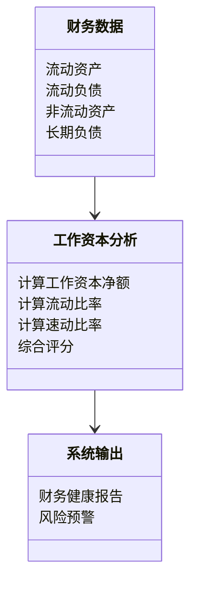
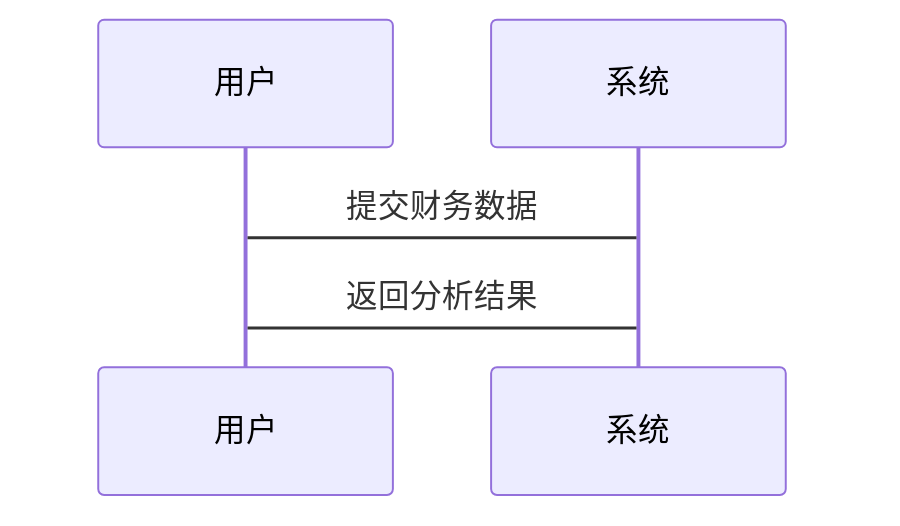

                 


# 第一部分: 格雷厄姆工作资本分析基础

# 第1章: 工作资本分析概述

## 1.1 工作资本分析的重要性

### 1.1.1 什么是工作资本

工作资本，又称净营运资本，是公司流动资产减去流动负债后的净额。它反映了企业在短期内偿还债务的能力，是评估公司短期财务健康的重要指标。

### 1.1.2 工作资本在企业财务健康中的作用

工作资本是企业维持日常运营和偿还短期债务的关键。充足的净营运资本表明公司有足够的流动资产来应对短期负债，而不足的净营运资本可能导致公司面临流动性危机。

### 1.1.3 格雷厄姆分析法的核心理念

本杰明·格雷厄姆是价值投资的鼻祖，他提出的工作资本分析法强调关注企业的基本面，尤其是流动资产和流动负债的结构。这种方法旨在通过分析企业的短期财务状况来评估其内在价值和投资潜力。

## 1.2 工作资本分析的基本框架

### 1.2.1 分析的范围与边界

工作资本分析主要关注流动资产和流动负债，不包括非流动资产和长期负债。流动资产包括现金、应收账款、存货等，流动负债包括应付账款、短期借款、应计费用等。

### 1.2.2 格雷厄姆分析法的适用场景

该方法适用于评估企业的短期偿债能力和流动性。特别适用于那些主要依赖流动资产运营的公司，如贸易公司、制造企业等。

### 1.2.3 分析框架的结构化方法

格雷厄姆的工作资本分析框架包括以下几个步骤：
1. 计算流动资产和流动负债，得出工作资本净额。
2. 计算流动比率和速动比率等指标，评估企业的短期偿债能力。
3. 结合行业标准和公司历史数据，判断企业的财务健康状况。

## 1.3 本章小结

本章介绍了工作资本分析的重要性和其在企业财务健康评估中的作用，详细阐述了格雷厄姆分析法的核心理念和基本框架。

# 第2章: 工作资本的核心构成

## 2.1 流动资产分析

### 2.1.1 流动资产的定义与分类

流动资产是指可以在一年内或一个正常营业周期内转换为现金的资产，主要包括现金、应收账款、存货等。

### 2.1.2 核心流动资产项目解读

#### 现金

现金是流动性最强的资产，包括库存现金和银行存款。充足的现金储备是企业应对突发事件的关键。

#### 应收账款

应收账款是企业因赊销商品而产生的债权，其回收周期直接影响企业的流动性。

#### 存货

存货是企业用于销售或生产过程中的原材料、在制品和产成品，存货周转率是衡量企业运营效率的重要指标。

### 2.1.3 流动资产的健康评估标准

流动资产的健康评估不仅要看总额，还要关注其结构合理性。例如，存货占比过高可能表明企业存在库存积压问题。

## 2.2 流动负债分析

### 2.2.1 流动负债的定义与分类

流动负债是指企业在一年内或一个正常营业周期内需要偿还的债务，主要包括应付账款、短期借款、应计费用等。

### 2.2.2 核心流动负债项目解读

#### 应付账款

应付账款是企业因购买商品或服务而产生的债务，其周转速度影响企业的流动性。

#### 短期借款

短期借款是企业在短期内需要偿还的债务，利息成本和还款压力是需要重点关注的因素。

#### 应计费用

应计费用包括预提费用和应付职工薪酬，是企业在会计期间内尚未支付的各项费用。

### 2.2.3 流动负债的健康评估标准

流动负债的健康评估需要关注其结构和期限。例如，短期借款占比过低可能表明企业资金使用效率不高。

## 2.3 工作资本计算与净额分析

### 2.3.1 工作资本计算公式

$$
\text{净额} = \text{流动资产} - \text{流动负债}
$$

工作资本净额是衡量企业短期偿债能力的重要指标。正数表明企业有足够的流动资产偿还短期负债，负数则表明企业可能面临流动性风险。

### 2.3.2 净额分析的要点

- 净额为正时，需要关注流动资产和流动负债的结构是否合理。
- 净额为负时，企业可能需要外部融资来弥补流动性缺口。

### 2.3.3 净额分析的局限性

净额分析仅反映了流动资产和流动负债的总量关系，无法揭示资产和负债的具体构成及其周转效率。

## 2.4 本章小结

本章详细分析了流动资产和流动负债的核心构成，重点讲解了工作资本净额的计算方法及其意义，为后续的短期偿债能力评估奠定了基础。

# 第3章: 短期偿债能力评估

## 3.1 流动比率分析

### 3.1.1 流动比率的定义

流动比率是衡量企业短期偿债能力的重要指标，计算公式为：

$$
\text{流动比率} = \frac{\text{流动资产}}{\text{流动负债}}
$$

### 3.1.2 流动比率的计算公式

例如，某公司2023年的流动资产为500万元，流动负债为200万元，则其流动比率为：

$$
\text{流动比率} = \frac{500}{200} = 2.5
$$

### 3.1.3 流动比率的评估标准

一般而言，流动比率应保持在2:1以上，表明企业有足够的流动资产偿还短期负债。过低的流动比率可能表明企业面临流动性风险，而过高的流动比率可能意味着资金使用效率低下。

## 3.2 速动比率分析

### 3.2.1 速动比率的定义

速动比率是将流动资产中扣除存货后的部分与流动负债的比率，计算公式为：

$$
\text{速动比率} = \frac{\text{流动资产} - \text{存货}}{\text{流动负债}}
$$

### 3.2.2 速动比率的计算公式

以某公司为例，流动资产为500万元，存货为100万元，流动负债为200万元，则速动比率为：

$$
\text{速动比率} = \frac{500 - 100}{200} = \frac{400}{200} = 2
$$

### 3.2.3 速动比率的评估标准

速动比率一般应保持在1:1以上，表明企业在扣除存货后仍有足够的流动资产偿还短期负债。过低的速动比率可能表明企业存货积压或面临较大的流动性压力。

## 3.3 其他短期偿债能力指标

### 3.3.1 现金比率

现金比率是现金及现金等价物与流动负债的比率，计算公式为：

$$
\text{现金比率} = \frac{\text{现金及现金等价物}}{\text{流动负债}}
$$

例如，某公司现金及现金等价物为50万元，流动负债为200万元，则现金比率为：

$$
\text{现金比率} = \frac{50}{200} = 0.25
$$

### 3.3.2 净营运资本比率

净营运资本比率是净营运资本与流动负债的比率，计算公式为：

$$
\text{净营运资本比率} = \frac{\text{净营运资本}}{\text{流动负债}} = \frac{\text{流动资产} - \text{流动负债} - \text{非流动资产}}{\text{流动负债}}
$$

### 3.3.3 其他相关指标

除了上述指标外，还包括应收账款周转率、存货周转率等，这些指标能够更全面地反映企业的流动性状况。

## 3.4 本章小结

本章重点介绍了流动比率和速动比率的计算方法及评估标准，同时探讨了其他短期偿债能力指标，为全面评估企业的短期偿债能力提供了多维度的视角。

# 第4章: 格雷厄姆工作资本分析的数学模型

## 4.1 工作资本分析的基本公式

### 4.1.1 工作资本净额公式

$$
\text{净额} = \text{流动资产} - \text{流动负债}
$$

例如，某公司流动资产为600万元，流动负债为300万元，则工作资本净额为：

$$
\text{净额} = 600 - 300 = 300 \text{万元}
$$

### 4.1.2 流动比率公式

$$
\text{流动比率} = \frac{\text{流动资产}}{\text{流动负债}}
$$

例如，某公司流动资产为500万元，流动负债为200万元，则流动比率为：

$$
\text{流动比率} = \frac{500}{200} = 2.5
$$

## 4.2 格雷厄姆净营运资本模型

### 4.2.1 净营运资本的定义

净营运资本是指流动资产减去流动负债和非流动资产后的净额，计算公式为：

$$
\text{净营运资本} = \text{流动资产} - \text{流动负债} - \text{非流动资产}
$$

例如，某公司流动资产为500万元，流动负债为200万元，非流动资产为100万元，则净营运资本为：

$$
\text{净营运资本} = 500 - 200 - 100 = 200 \text{万元}
$$

### 4.2.2 净营运资本的评估标准

净营运资本为正时，表明企业有足够的流动资产偿还短期负债，同时还能维持一定的营运资本。负数时，可能表明企业需要外部融资支持运营资本需求。

## 4.3 财务健康综合评估模型

### 4.3.1 综合评分模型

综合评分模型将多个财务指标（如流动比率、速动比率、净营运资本等）进行加权评分，最终得出企业的财务健康综合评分。

### 4.3.2 模型的数学表达

$$
\text{综合评分} = w_1 \times \text{流动比率} + w_2 \times \text{速动比率} + w_3 \times \text{净营运资本比率}
$$

其中，\( w_1, w_2, w_3 \)分别为各指标的权重，通常根据行业特点和企业实际情况确定。

### 4.3.3 模型的适用性分析

该模型适用于多维度评估企业的财务健康状况，但需要根据具体行业和企业特点调整各指标的权重。

## 4.4 本章小结

本章通过数学模型详细阐述了工作资本分析的核心公式和评估方法，为综合评估企业的短期财务健康提供了理论基础。

# 第5章: 系统分析与架构设计

## 5.1 系统分析框架

### 5.1.1 分析目标

本系统旨在通过格雷厄姆的工作资本分析方法，帮助企业评估短期财务健康，识别潜在的流动性风险。

### 5.1.2 问题场景

企业财务部门需要定期评估公司短期财务状况，及时发现和解决流动性问题，优化资金使用效率。

## 5.2 系统功能设计

### 5.2.1 领域模型



### 5.2.2 系统架构


### 5.2.3 系统接口设计

- **输入接口**：接收流动资产、流动负债、非流动资产等财务数据。
- **输出接口**：提供工作资本净额、流动比率、速动比率等分析结果。

### 5.2.4 系统交互设计



## 5.3 本章小结

本章通过系统分析和架构设计，展示了如何将格雷厄姆的工作资本分析方法应用于实际的企业财务管理中，提供了系统化的解决方案。

# 第6章: 项目实战与案例分析

## 6.1 项目实战

### 6.1.1 环境安装

需要安装Python编程语言和相关数据分析库，如Pandas、NumPy等。

### 6.1.2 核心代码实现

以下是计算工作资本净额和流动比率的Python代码示例：

```python
import pandas as pd

# 假设财务数据存储在Excel文件中
data = pd.read_excel('financial_data.xlsx')

# 计算工作资本净额
working_capital = data['流动资产'] - data['流动负债']

# 计算流动比率
current_ratio = data['流动资产'] / data['流动负债']

# 存储结果
result = pd.DataFrame({
    '工作资本净额': working_capital,
    '流动比率': current_ratio
})

result.to_excel('analysis_results.xlsx', index=False)
```

### 6.1.3 代码应用解读

上述代码从Excel文件中读取流动资产和流动负债数据，分别计算工作资本净额和流动比率，并将结果存储回Excel文件中。

## 6.2 案例分析

### 6.2.1 案例背景

某制造公司2023年的财务数据如下：

| 项目         | 金额（万元） |
|--------------|--------------|
| 流动资产     | 800          |
| 流动负债     | 400          |

### 6.2.2 分析过程

1. 计算工作资本净额：

$$
\text{净额} = 800 - 400 = 400 \text{万元}
$$

2. 计算流动比率：

$$
\text{流动比率} = \frac{800}{400} = 2
$$

### 6.2.3 结果解读

- 工作资本净额为正，表明公司有足够的流动资产偿还短期负债。
- 流动比率为2，处于合理区间，表明公司的短期偿债能力较强。

## 6.3 本章小结

本章通过项目实战和案例分析，详细讲解了如何应用格雷厄姆的工作资本分析方法进行实际的财务评估，帮助读者掌握具体的操作步骤和分析技巧。

# 第7章: 总结与最佳实践

## 7.1 总结

本章对全文进行了总结，强调了工作资本分析在评估企业短期健康中的重要性，并归纳了格雷厄姆分析法的核心要点。

## 7.2 最佳实践

### 7.2.1 数据收集与处理

确保财务数据的准确性和完整性，建议使用专业的财务软件进行数据管理。

### 7.2.2 指标分析与解读

结合行业特点和企业实际情况，灵活运用多种财务指标进行综合分析。

### 7.2.3 系统应用与优化

利用专业的财务分析系统，定期进行财务评估，并根据分析结果优化企业财务管理。

## 7.3 小结

通过本章的学习，读者可以全面掌握格雷厄姆工作资本分析的核心思想和实际应用，为企业的短期财务健康评估提供有力支持。

---

# 文章关键词：

- 工作资本分析
- 格雷厄姆分析法
- 短期财务健康
- 流动比率
- 速动比率
- 财务健康综合评估

# 文章摘要：

格雷厄姆的工作资本分析是一种评估企业短期财务健康的重要方法。本文系统介绍了工作资本分析的核心概念、数学模型和实际应用，重点探讨了流动资产、流动负债的构成，以及流动比率、速动比率等关键指标的计算与评估。通过详细分析和案例实践，本文为读者提供了全面了解和应用格雷厄姆分析法的指导，帮助企业优化短期财务管理和风险控制。

