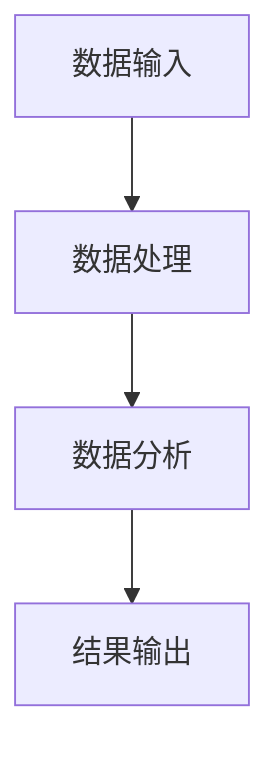

                 


# 格雷厄姆的工作资本分析：适应轻资产商业模式

> 关键词：格雷厄姆，工作资本分析，轻资产模式，投资分析，商业模式

> 摘要：本文深入探讨了格雷厄姆的工作资本分析方法，并分析其如何适应轻资产商业模式。通过详细阐述工作资本分析的核心概念、数学模型、算法实现以及系统架构设计，本文为读者提供了从理论到实践的全面指南。结合实际项目案例，本文进一步展示了如何在轻资产模式下应用工作资本分析，为投资决策提供有力支持。

---

## 第一部分: 工作资本分析基础

### 第1章: 工作资本分析的背景与概念

#### 1.1 工作资本分析的定义与核心要素
工作资本分析是投资分析中的重要方法，用于评估企业的工作资本效率和投资回报率。其核心在于通过分析企业的各项资产、负债和所有者权益，评估企业的财务健康状况和投资潜力。

##### 1.1.1 工作资本的定义
工作资本是指企业在日常经营活动中所需的资金，包括现金、存货、应收账款等流动资产。与传统资本不同，工作资本更关注企业的短期流动性。

##### 1.1.2 工作资本的核心要素
- **流动资产**：现金、存货、应收账款。
- **流动负债**：短期借款、应付账款、其他应付款。
- **净流动资产**：流动资产减去流动负债。

##### 1.1.3 工作资本与企业价值的关系
工作资本是企业价值的重要组成部分，直接影响企业的偿债能力、运营效率和投资回报率。

#### 1.2 轻资产商业模式的特点
轻资产模式是一种以知识、技术、品牌为核心竞争力的商业模式，与传统重资产模式不同，其特点是低固定资产投入、高知识资本投入和快速 scalability。

##### 1.2.1 轻资产模式的定义
轻资产模式是指企业通过减少固定资产投入，依赖知识、技术、品牌等无形资产进行经营的模式。

##### 1.2.2 轻资产模式与传统商业模式的对比
- **固定资产投入**：轻资产模式低，传统模式高。
- **资产流动性**：轻资产模式高，传统模式低。
- **风险承受能力**：轻资产模式较低，传统模式较高。

##### 1.2.3 轻资产模式下的工作资本分析
在轻资产模式下，工作资本分析更加重要，因为企业更依赖流动资产和无形资产的效率。

---

### 第2章: 工作资本分析的理论基础

#### 2.1 格雷厄姆投资理论概述
格雷厄姆是价值投资的鼻祖，其理论强调以低于内在价值的价格买入优质股票。

##### 2.1.1 格雷厄姆的投资理念
- **安全边际**：买入价格低于内在价值。
- **长期投资**：关注企业的长期价值。
- **价值投资**：寻找被市场低估的企业。

##### 2.1.2 格雷厄姆的价值投资方法
- **内在价值计算**：通过DCF模型评估企业价值。
- **安全边际**：买入价格低于内在价值。

##### 2.1.3 格雷厄姆对工作资本分析的贡献
格雷厄姆的工作资本分析方法为评估企业价值提供了重要工具。

#### 2.2 工作资本分析的核心原理
工作资本分析的核心在于通过分析企业的各项资产、负债和所有者权益，评估企业的财务健康状况和投资潜力。

##### 2.2.1 工作资本分析的基本假设
- 企业价值主要由工作资本决定。
- 工作资本的流动性直接影响企业的偿债能力和运营效率。

##### 2.2.2 工作资本分析的数学模型
$$\text{净流动资产} = \text{流动资产} - \text{流动负债}$$

##### 2.2.3 工作资本分析的公式推导
通过分析流动资产和流动负债的关系，可以得出企业的净流动资产，进而评估企业的财务健康状况。

---

### 第3章: 工作资本分析的数学模型与公式

#### 3.1 工作资本分析的数学模型
##### 3.1.1 工作资本分析的基本公式
$$\text{净流动资产} = \text{流动资产} - \text{流动负债}$$

##### 3.1.2 工作资本分析的扩展公式
$$\text{净流动资产} = \text{现金} + \text{存货} + \text{应收账款} - \text{应付账款} - \text{其他应付款}$$

##### 3.1.3 工作资本分析的边界条件
- 数据的准确性。
- 假设条件的合理性。

#### 3.2 工作资本分析的公式推导
##### 3.2.1 格雷厄姆原始公式
$$\text{内在价值} = \frac{\text{未来现金流的现值}}{\text{折现率}}$$

##### 3.2.2 现代工作资本分析公式
$$\text{净流动资产} = \text{流动资产} - \text{流动负债}$$

##### 3.2.3 公式之间的关系与对比
格雷厄姆的内在价值公式与工作资本分析公式密切相关，但侧重点不同。

---

### 第4章: 工作资本分析的算法实现

#### 4.1 工作资本分析的算法步骤
##### 4.1.1 数据输入
- 企业财务报表数据。
- 其他相关数据。

##### 4.1.2 数据处理
- 数据清洗。
- 数据转换。

##### 4.1.3 数据分析与计算
- 计算流动资产和流动负债。
- 计算净流动资产。

##### 4.1.4 结果输出
- 净流动资产值。
- 财务健康状况分析。

#### 4.2 工作资本分析的Python实现
##### 4.2.1 环境安装与配置
- 安装Python和相关库。

##### 4.2.2 核心代码实现
```python
import pandas as pd

# 读取财务报表数据
data = pd.read_csv('financial_data.csv')

# 计算流动资产和流动负债
current_assets = data['现金'] + data['存货'] + data['应收账款']
current_liabilities = data['应付账款'] + data['其他应付款']

# 计算净流动资产
net_current_assets = current_assets - current_liabilities

# 输出结果
print(net_current_assets)
```

##### 4.2.3 代码解读与分析
- 读取数据。
- 计算流动资产和流动负债。
- 计算净流动资产。
- 输出结果。

##### 4.2.4 代码优化与改进
- 增加错误处理。
- 提高计算效率。

---

### 第5章: 工作资本分析的系统架构设计

#### 5.1 系统功能设计
##### 5.1.1 系统功能模块划分
- 数据输入模块。
- 数据处理模块。
- 数据分析模块。
- 结果输出模块。

##### 5.1.2 系统功能流程图


##### 5.1.3 系统功能实现细节
- 数据输入：支持多种格式的数据输入。
- 数据处理：包括数据清洗和转换。
- 数据分析：包括流动资产和流动负债的计算。
- 结果输出：包括净流动资产值和财务健康状况分析。

#### 5.2 系统架构设计
##### 5.2.1 系统架构图


##### 5.2.2 系统模块之间的关系
- 数据输入模块与数据处理模块交互。
- 数据处理模块与数据分析模块交互。
- 数据分析模块与结果输出模块交互。

##### 5.2.3 系统架构的优缺点
- 优点：模块化设计，便于维护和扩展。
- 缺点：可能需要更多的资源和时间。

---

### 第6章: 工作资本分析的项目实战

#### 6.1 项目背景与目标
##### 6.1.1 项目背景
- 某轻资产企业的财务数据分析。
- 目标：评估企业的财务健康状况。

##### 6.1.2 项目目标
- 计算企业的净流动资产。
- 分析企业的财务健康状况。

##### 6.1.3 项目范围
- 数据范围：流动资产和流动负债。
- 时间范围：最近一个季度的数据。

#### 6.2 项目实施过程
##### 6.2.1 数据收集
- 收集企业的财务报表数据。

##### 6.2.2 数据处理
- 清洗数据。
- 转换数据格式。

##### 6.2.3 数据分析
- 计算流动资产和流动负债。
- 计算净流动资产。

##### 6.2.4 结果输出
- 输出净流动资产值。
- 分析企业的财务健康状况。

#### 6.3 项目总结
##### 6.3.1 项目成果
- 成功计算出企业的净流动资产。
- 评估了企业的财务健康状况。

##### 6.3.2 经验与教训
- 数据的准确性非常重要。
- 算法的优化可以提高计算效率。

---

## 第七章: 最佳实践

### 7.1 小结
工作资本分析是投资分析中的重要方法，尤其在轻资产模式下具有重要意义。通过本文的分析，我们可以更好地理解工作资本分析的核心概念和算法实现。

### 7.2 注意事项
- 数据的准确性。
- 算法的优化。
- 系统的维护。

### 7.3 拓展阅读
- 格雷厄姆的《证券分析》。
- 现代投资组合理论。

---

## 参考文献
- 格雷厄姆，本杰明. 《证券分析》. 原文版.

---

通过以上思考，我们可以看到，格雷厄姆的工作资本分析方法在轻资产模式下具有重要的应用价值。通过本文的分析，我们可以更好地理解工作资本分析的核心概念和算法实现，为投资决策提供有力支持。

