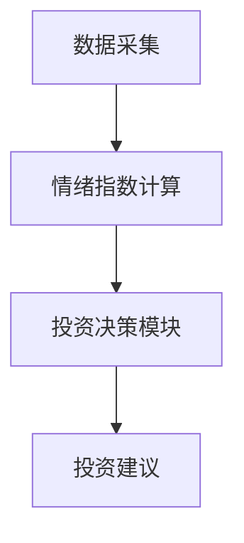

                 


# 《格雷厄姆的市场先生比喻》

## 关键词：市场先生比喻、投资者心理、市场波动、投资策略、情绪指数、本杰明·格雷厄姆

## 摘要：  
本文深入探讨了格雷厄姆提出的市场先生比喻，分析其在解释市场波动和投资者行为中的应用。通过结合投资者情绪、市场机制和量化模型，本文详细阐述了如何利用市场先生比喻进行投资决策，并通过实际案例展示了其在现代投资中的实践价值。

---

## 第1章：市场先生比喻的基本概念

### 1.1 市场先生比喻的起源与意义  
市场先生比喻由本杰明·格雷厄姆提出，旨在帮助投资者理解市场的非理性波动。市场先生每天为投资者提供买卖机会，象征市场的供需机制。通过这个比喻，投资者可以更好地认识情绪对决策的影响。  

### 1.2 投资者行为与市场波动  
投资者的行为往往受到情绪驱动，如贪婪和恐惧。这些情绪会导致市场波动，进而影响资产价格。市场先生比喻揭示了这种非理性行为对市场的影响，帮助投资者避免情绪化决策。  

### 1.3 市场先生比喻的结构与要素  
市场先生比喻包括市场机制、投资者情绪和市场波动三个核心要素。通过模拟市场供需，投资者可以更好地理解市场动态，制定更理性的投资策略。  

### 1.4 与现代金融理论的结合  
市场先生比喻与有效市场假说、行为金融学等现代金融理论密切相关。它为投资者提供了一个简化但深刻的框架，帮助他们在复杂市场中做出更明智的决策。

---

## 第2章：市场先生比喻的结构与原理

### 2.1 市场先生比喻的结构分解  
市场先生比喻由市场机制、投资者情绪和市场波动三部分构成。市场机制模拟了供需关系，投资者情绪反映了个体决策，市场波动则展示了整体市场的动态变化。  

### 2.2 投资者情绪与市场波动的关系  
投资者情绪是市场波动的核心驱动因素。当市场情绪高涨时，资产价格可能被高估；当情绪低落时，价格可能被低估。市场先生比喻强调了情绪对市场定价的双重影响。  

### 2.3 市场先生比喻的数学模型  
通过情绪指数的计算，我们可以量化市场情绪，并将其应用于投资决策。情绪指数的计算公式如下：  
$$ 情绪指数 = \frac{收盘价 - 开盘价}{开盘价} \times 100 $$  
该公式反映了市场的波动性和投资者情绪的变化。

---

## 第3章：市场先生比喻与投资者行为分析

### 3.1 投资者心理与市场波动  
投资者的心理偏差，如过度自信和羊群效应，会导致市场波动。市场先生比喻通过简化模型，帮助投资者识别和克服这些心理偏差。  

### 3.2 市场先生比喻中的投资者分类  
投资者可分为理性投资者和非理性投资者。理性投资者能够克服情绪影响，做出理性的决策；而非理性投资者则容易受到市场情绪的驱动。  

### 3.3 投资者行为对市场的影响  
投资者的集体行为会导致市场波动的放大效应。市场先生比喻提醒投资者关注整体市场的动态，避免被短期波动所迷惑。

---

## 第4章：市场情绪指数的计算与分析

### 4.1 情绪指数的计算方法  
情绪指数的计算基于市场数据，反映了投资者的总体情绪。通过分析情绪指数，投资者可以更好地理解市场的潜在趋势。  

### 4.2 基于市场的数据情绪指数计算  
情绪指数的计算过程包括数据收集、处理和分析。以下是Python代码示例：  

```python
import pandas as pd

def calculate_emotion_index(data):
    emotion_index = data['收盘价'] / data['开盘价'] - 1
    return emotion_index.mean()

data = pd.read_csv('market_data.csv')
emotion_index = calculate_emotion_index(data)
print(f"情绪指数为：{emotion_index}")
```

该代码计算了市场数据中的情绪指数，并展示了其应用过程。

### 4.3 情绪指数与投资策略  
情绪指数可以帮助投资者制定投资策略。当情绪指数过高时，投资者应考虑减少风险敞口；当情绪指数过低时，可以寻找投资机会。

---

## 第5章：系统架构与投资决策支持

### 5.1 投资决策支持系统的架构设计  
投资决策支持系统包括数据采集、情绪指数计算和投资决策模块。系统架构如下：  



### 5.2 系统功能设计  
投资决策支持系统通过数据采集、处理和分析，为投资者提供实时的情绪指数和投资建议。系统功能包括：  
1. 数据采集：获取市场数据。  
2. 情绪指数计算：量化市场情绪。  
3. 投资决策：基于情绪指数制定投资策略。  

### 5.3 系统接口设计  
系统接口设计包括数据输入接口、情绪指数计算接口和投资建议输出接口。以下是接口描述：  
- 数据输入接口：接收市场数据。  
- 情绪指数计算接口：处理数据，返回情绪指数。  
- 投资建议输出接口：根据情绪指数，提供投资建议。  

---

## 第6章：项目实战与案例分析

### 6.1 项目实战：环境配置  
需要安装Python和相关库，如Pandas和NumPy。以下是环境配置示例：  
```bash
pip install pandas numpy
```

### 6.2 核心实现：情绪指数计算  
以下是情绪指数计算的Python代码：  

```python
import pandas as pd
import numpy as np

def calculate_emotion_index(data):
    return data['收盘价'].apply(lambda x: x / data['开盘价'].values)

data = pd.read_csv('market_data.csv')
emotion_index = calculate_emotion_index(data)
print(emotion_index)
```

### 6.3 案例分析：投资决策  
假设市场情绪指数为0.2，投资者应保持谨慎，避免高位投资。当情绪指数为-0.1时，投资者可以寻找低位买入机会。

---

## 第7章：总结与展望

### 7.1 总结  
市场先生比喻为投资者提供了一个理解市场波动和投资者行为的框架。通过量化市场情绪，投资者可以做出更理性的决策。  

### 7.2 展望  
未来，市场先生比喻可以与人工智能和大数据分析结合，进一步提升投资决策的科学性和准确性。

---

## 附录：注意事项与最佳实践

- **风险管理**：始终关注市场风险，避免过度依赖情绪指数。  
- **长期投资**：情绪指数仅作为参考，长期投资应结合基本面分析。  
- **心理调节**：投资者需克服情绪偏差，保持理性决策。  
- **持续学习**：市场环境不断变化，投资者需持续学习和适应。

---

通过本文的详细分析，读者可以更好地理解市场先生比喻，并将其应用于实际投资中。

