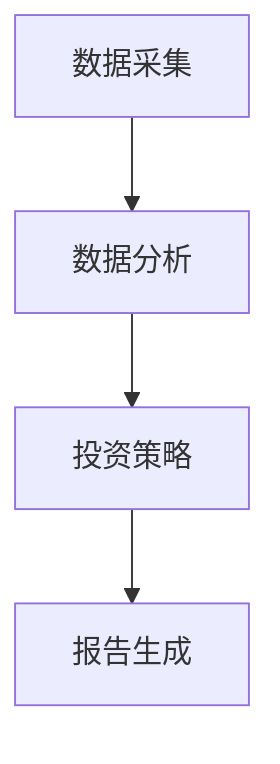

                 


# 格雷厄姆的市场先生比喻及其启示

> 关键词：市场先生，投资理论，波动率，价值投资，趋势投资，风险管理

> 摘要：本文通过分析格雷厄姆提出的市场先生比喻，探讨其在现代投资理论中的意义。文章从市场先生的背景、核心概念、数学模型、系统架构、投资策略等多维度展开，结合实际案例和代码实现，深入剖析市场先生对投资决策的启示。

---

## 第一章: 市场先生比喻的背景与核心概念

### 1.1 市场先生的提出与背景

#### 1.1.1 本杰明·格雷厄姆的生平简介

本杰明·格雷厄姆（Benjamin Graham）是20世纪著名的投资理论家，被誉为“价值投资之父”。他于1894年出生于纽约，早年从商，后转向金融投资领域，并在哥伦比亚大学教授证券分析。格雷厄姆的理论对现代投资学产生了深远影响，尤其是他提出的“市场先生”概念，为投资者理解市场波动性和非理性提供了重要的视角。

#### 1.1.2 市场先生比喻的提出

在《聪明的投资者》一书中，格雷厄姆引入了“市场先生”（Mr. Market）的概念，用来描述市场的波动性和投资者的心理变化。市场先生是一个虚构的角色，他的行为反映了市场的短期波动和投资者情绪的变化。格雷厄姆通过这个比喻强调，市场并非总是理性的，投资者应该以冷静的态度应对市场的波动，而不是被短期波动所左右。

#### 1.1.3 市场先生比喻的核心思想

市场先生的核心思想在于：市场的波动性主要源于投资者情绪的波动，而非企业的实际价值变化。投资者应该关注企业的内在价值，而不是市场的短期波动。市场先生的出现和消失，象征着市场的短期波动和非理性行为。

---

### 1.2 市场先生比喻的核心概念

#### 1.2.1 市场先生的定义与特征

- **定义**：市场先生是市场波动的化身，代表了市场的短期波动和投资者情绪的变化。
- **特征**：
  - 非理性：市场先生的行为常常偏离理性，表现出过度乐观或悲观。
  - 波动性：市场先生的情绪波动导致市场价格的短期波动。
  - 不确定性：市场先生的行为难以预测，体现了市场的不确定性。

#### 1.2.2 市场先生与投资者心理的关系

市场先生的行为反映了投资者心理的变化。当市场先生情绪高涨时，投资者往往表现出过度乐观；当市场先生情绪低落时，投资者则可能过于悲观。这种心理变化导致了市场的波动性，并为投资者提供了套利机会。

#### 1.2.3 市场先生与现代金融市场的关联

现代金融市场中的波动性、泡沫和危机，都可以通过市场先生的比喻来理解。例如，2008年金融危机可以看作是市场先生过度乐观导致的市场泡沫破裂。市场先生的比喻提醒我们，市场的波动性是永恒存在的，投资者需要学会在波动中保持冷静。

---

## 第二章: 市场先生的理性与非理性分析

### 2.1 市场先生的理性特征

#### 2.1.1 理性市场的定义

理性市场是指市场参与者基于理性和逻辑进行决策，市场价格反映的是资产的内在价值。在理性市场中，投资者不会受到情绪的影响，而是基于基本面分析做出决策。

#### 2.1.2 市场先生理性行为的表现

- 理性投资者会根据企业的基本面信息进行投资决策。
- 理性投资者会分散投资，降低风险。
- 理性投资者会长期持有优质资产，而非频繁交易。

#### 2.1.3 理性市场与实际市场的差异

实际市场中，投资者常常受到情绪的影响，导致市场出现非理性波动。理性市场是一个理想化的状态，现实中很难完全实现。

---

### 2.2 市场先生的非理性特征

#### 2.2.1 非理性市场的定义

非理性市场是指市场参与者基于情绪和非理性决策进行交易，导致市场价格偏离资产的内在价值。

#### 2.2.2 市场先生非理性行为的表现

- 投资者在市场上涨时过于乐观，导致过度投资。
- 投资者在市场下跌时过于悲观，导致过度抛售。
- 投资者受到羊群效应的影响，盲目跟风。

#### 2.2.3 非理性市场对投资决策的影响

非理性市场会导致市场的波动性增加，投资者需要在这种环境中做出理性的决策，避免受到市场情绪的影响。

---

## 第三章: 市场先生与投资策略

### 3.1 市场先生比喻对投资决策的启示

#### 3.1.1 市场波动与投资策略的关系

市场波动是投资决策的重要影响因素。投资者需要根据市场的波动性调整自己的投资策略。

#### 3.1.2 市场先生的非理性与投资机会的识别

市场先生的非理性行为为投资者提供了套利机会。例如，在市场恐慌时买入低估资产，在市场狂热时卖出高估资产。

#### 3.1.3 市场先生的理性与风险管理

投资者需要在市场波动中保持冷静，避免被市场情绪左右。同时，需要制定合理的风险管理策略，降低投资风险。

---

### 3.2 市场先生与价值投资

#### 3.2.1 价值投资的核心理念

价值投资的核心理念是寻找市场价格低于内在价值的资产进行投资。格雷厄姆的市场先生比喻强调了价值投资的重要性。

#### 3.2.2 市场先生与价值投资的结合

市场先生的非理性行为导致市场价格波动，为价值投资者提供了买入低估资产的机会。

#### 3.2.3 市场先生比喻对价值投资的启示

投资者应该关注企业的内在价值，而不是市场的短期波动。市场先生的比喻提醒我们，市场波动是暂时的，内在价值是永恒的。

---

### 3.3 市场先生与趋势投资

#### 3.3.1 趋势投资的定义与特点

趋势投资是一种基于市场趋势的投资策略，认为市场趋势会延续一段时间。趋势投资者通过捕捉市场趋势的变化来获得收益。

#### 3.3.2 市场先生与趋势投资的关联

市场先生的非理性行为导致市场的趋势变化。趋势投资者需要根据市场的趋势变化调整自己的投资策略。

#### 3.3.3 市场先生比喻对趋势投资的启示

市场先生的比喻提醒趋势投资者，市场趋势的变化是复杂且不可预测的。投资者需要根据市场的实际情况调整自己的投资策略。

---

## 第四章: 市场先生的数学模型与算法分析

### 4.1 市场波动的数学模型

#### 4.1.1 波动率的定义与计算公式

波动率是衡量资产价格波动程度的重要指标。常见的波动率计算公式如下：

$$
\text{波动率} = \sqrt{\frac{1}{n}\sum_{i=1}^{n}(x_i - \mu)^2}
$$

其中，$\mu$是资产价格的平均值，$x_i$是第$i$个资产价格，$n$是样本数量。

#### 4.1.2 波动率的计算方法

以Python为例，计算资产价格的波动率：

```python
import numpy as np

prices = [100, 105, 98, 110, 107]
mu = np.mean(prices)
variance = np.sum((x - mu) ** 2 for x in prices) / len(prices)
volatility = np.sqrt(variance)
print("波动率:", volatility)
```

---

### 4.2 市场情绪的量化模型

#### 4.2.1 市场情绪的量化指标

市场情绪可以通过多种指标量化，例如：

- 市场情绪指数（Market Sentiment Index）
- 投资者信心指数（Investor Confidence Index）
- 市场恐慌指数（VIX指数）

#### 4.2.2 市场情绪与市场波动的关系

市场情绪是市场波动的重要驱动因素。当市场情绪高涨时，市场波动性增加；当市场情绪低落时，市场波动性减小。

---

## 第五章: 市场先生的系统架构与接口设计

### 5.1 系统架构设计

#### 5.1.1 系统功能模块

- 数据采集模块：采集市场数据，包括价格、成交量等。
- 数据分析模块：计算波动率、市场情绪等指标。
- 投资策略模块：根据市场波动和市场情绪调整投资策略。
- 报告生成模块：生成市场分析报告。

#### 5.1.2 系统架构图



---

### 5.2 系统接口设计

#### 5.2.1 数据接口

- 数据接口：从数据源获取市场数据。
- 接口类型：API接口。
- 接口描述：通过API接口获取股票价格、成交量等数据。

#### 5.2.2 投资策略接口

- 策略接口：根据市场数据调整投资策略。
- 接口类型：函数接口。
- 接口描述：根据波动率和市场情绪调整投资组合。

---

## 第六章: 市场先生的项目实战

### 6.1 环境安装与配置

#### 6.1.1 安装Python环境

```bash
python --version
pip install numpy pandas matplotlib
```

#### 6.1.2 安装数据接口

```bash
pip install yfinance
```

---

### 6.2 核心代码实现

#### 6.2.1 数据采集代码

```python
import yfinance as yf

def get_market_data(ticker, start_date, end_date):
    data = yf.download(ticker, start=start_date, end=end_date)
    return data['Close']
```

---

#### 6.2.2 波动率计算代码

```python
def calculate_volatility(prices):
    mu = np.mean(prices)
    variance = np.sum((x - mu) ** 2 for x in prices) / len(prices)
    volatility = np.sqrt(variance)
    return volatility
```

---

#### 6.2.3 投资策略代码

```python
def market_strategy(prices, volatility_threshold):
    if volatility > volatility_threshold:
        return "卖出"
    else:
        return "买入"
```

---

### 6.3 实际案例分析

#### 6.3.1 案例背景

以某股票为例，计算其波动率，并根据波动率调整投资策略。

#### 6.3.2 数据分析结果

假设某股票的价格波动率为5%，高于波动率阈值4%，则触发卖出信号。

#### 6.3.3 投资策略调整

根据波动率计算结果，调整投资策略，卖出该股票。

---

## 第七章: 总结与展望

### 7.1 本章小结

市场先生的比喻为我们理解市场的波动性和投资者心理提供了重要的视角。投资者应该关注企业的内在价值，而不是市场的短期波动。市场先生的比喻提醒我们，市场波动是暂时的，内在价值是永恒的。

---

### 7.2 未来展望

未来的研究可以进一步结合市场先生的比喻，探索市场波动与投资者心理的关系，以及如何利用市场先生的模型进行风险管理和投资决策优化。

---

### 7.3 最佳实践 tips

- 长期投资，避免短期波动的影响。
- 分散投资，降低风险。
- 定期评估投资组合，调整投资策略。

---

### 7.4 注意事项

- 市场波动是不可预测的，投资者需要做好心理准备。
- 投资者需要根据自身的风险承受能力调整投资策略。
- 市场先生的比喻是理想化的，实际市场中需要结合实际情况进行分析。

---

### 7.5 拓展阅读

- 《聪明的投资者》——本杰明·格雷厄姆
- 《波动率与风险管理》——风险管理领域的经典书籍

---

通过以上分析，我们可以看到，市场先生的比喻为我们理解市场的波动性和投资者心理提供了重要的视角。投资者应该关注企业的内在价值，而不是市场的短期波动。市场先生的比喻提醒我们，市场波动是暂时的，内在价值是永恒的。

