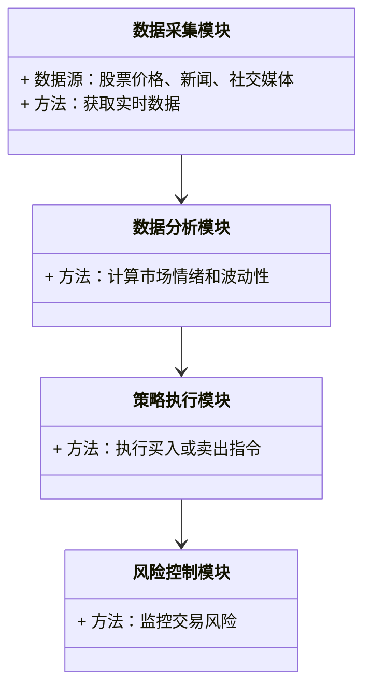

                 


# 《格雷厄姆的市场先生理论：高频交易时代的反思》

> **关键词**：市场先生理论，高频交易，市场情绪，投资决策，风险管理，金融算法

> **摘要**：本文深入探讨了格雷厄姆提出的市场先生理论在高频交易时代的应用与反思。通过分析市场情绪、波动性和投资者行为，结合现代算法交易的技术挑战，本文提出了对传统理论的创新性解读，并探讨了高频交易对金融市场稳定性的影响。文章结合数学模型和实际案例，为投资者和算法交易者提供了新的视角和实践指导。

---

## 第1章：市场先生理论的背景与发展

### 1.1 格雷厄姆与市场先生理论的提出

#### 1.1.1 本杰明·格雷厄姆的生平简介

本杰明·格雷厄姆（Benjamin Graham）是20世纪著名的投资学家，被誉为“价值投资之父”。他于1894年出生于英国伦敦，后移居美国，曾在哥伦比亚大学教授金融学。格雷厄姆的职业生涯始于1920年代，当时正值美国股市的繁荣与崩盘时期。他通过分析市场的波动性和投资者的心理行为，提出了许多深刻的投资理论。

#### 1.1.2 市场先生理论的提出背景

格雷厄姆的市场先生理论（Mr. Market）是他在1949年出版的经典著作《证券分析》（co-authored with David Dodd）中首次提出的。该理论的核心观点是，市场波动并非随机，而是与投资者的心理预期密切相关。市场先生代表了市场的整体情绪，其波动性反映了投资者的乐观或悲观。

#### 1.1.3 市场先生理论的核心观点

- **市场波动性**：市场的波动性是投资者情绪的直接反映。
- **价值与价格的分离**：市场价格与内在价值之间存在差异，这种差异为投资者提供了套利机会。
- **长期投资**：投资者应关注长期价值，而非短期价格波动。

---

### 1.2 市场先生理论的核心概念

#### 1.2.1 市场情绪的波动性

市场情绪（Market Sentiment）是投资者对市场的整体看法，通常分为乐观（ bullish）和悲观（ bearish）两种状态。市场情绪的波动性是市场先生理论的核心，它影响着市场的买卖行为和价格走势。

#### 1.2.2 市场波动与投资决策的关系

市场波动性与投资决策密切相关。投资者在市场波动加剧时，更容易受到情绪影响，做出非理性决策，从而加剧市场的波动性。

#### 1.2.3 市场先生理论的数学模型

市场先生理论可以用数学模型来描述。假设市场情绪的变化服从某种随机过程，例如马尔可夫链或时间序列模型。这种模型可以帮助投资者预测市场的未来走势。

---

## 第2章：高频交易的特点与挑战

### 2.1 高频交易的基本概念

#### 2.1.1 高频交易的定义与特点

高频交易（High-Frequency Trading, HFT）是指通过计算机算法在极短时间内进行大量交易的行为。其特点是交易速度快、交易次数多、依赖技术优势。

#### 2.1.2 高频交易的技术实现

高频交易依赖于高速网络、低延迟硬件和高效的算法。交易者利用技术优势，捕捉市场中的微小价格波动。

#### 2.1.3 高频交易对市场的影响

高频交易可以提高市场的流动性，但也可能导致市场的不稳定性。例如，算法交易可能引发“闪电崩盘”（Flash Crash）。

---

### 2.2 高频交易中的市场情绪分析

#### 2.2.1 市场情绪在高频交易中的重要性

市场情绪是高频交易者的重要参考指标。通过分析市场情绪，交易者可以预测市场的短期走势。

#### 2.2.2 高频交易中市场情绪的实时监测

高频交易者通过实时数据分析市场情绪。例如，利用自然语言处理技术分析新闻标题和社交媒体情绪。

#### 2.2.3 市场情绪对高频交易策略的影响

市场情绪的变化会影响高频交易策略的执行。例如，当市场情绪转向悲观时，交易者可能会减少买入操作，转而进行卖出操作。

---

### 2.3 高频交易中的市场波动分析

#### 2.3.1 市场波动的高频特征

高频交易中，市场的波动性通常表现为高频振荡。交易者需要捕捉这些高频波动，以获得短期收益。

#### 2.3.2 高频交易对市场波动的放大效应

高频交易可能放大市场的波动性。例如，算法交易的共振效应可能导致市场的剧烈波动。

#### 2.3.3 市场波动的预测与控制

交易者通过数学模型预测市场的波动性，并制定相应的风险管理策略。例如，使用时间序列模型预测未来的波动性。

---

## 第3章：市场情绪的量化模型

### 3.1 市场情绪的量化指标

#### 3.1.1 市场情绪的定义与度量

市场情绪可以通过多种指标量化，例如：

- **情绪指数（Sentiment Index）**：通过分析新闻标题、社交媒体和市场参与者的行为，计算出的情绪指数。
- **波动率（Volatility）**：市场的价格波动率反映了市场的不确定性。

#### 3.1.2 市场情绪的数学表达式

市场情绪可以用概率论和统计学方法进行量化。例如，情绪指数可以表示为：

$$
\text{情绪指数} = \sum_{i=1}^{n} w_i \cdot s_i
$$

其中，\( w_i \) 是第 \( i \) 个情绪指标的权重，\( s_i \) 是第 \( i \) 个情绪指标的值。

#### 3.1.3 市场情绪的计算方法

市场情绪可以通过多种方法计算，例如：

- **文本挖掘**：分析新闻标题和社交媒体文本，提取情绪关键词。
- **技术指标**：使用RSI（相对强度指数）等技术指标衡量市场的超买或超卖状态。

---

### 3.2 市场情绪的时间序列分析

#### 3.2.1 时间序列分析的基本概念

时间序列分析是一种统计技术，用于分析和预测数据序列的变化趋势。常用的时间序列模型包括ARIMA（自回归积分滑动平均模型）和GARCH（广义自回归条件异方差模型）。

#### 3.2.2 市场情绪的时间序列模型

使用ARIMA模型预测市场情绪的变化。例如：

$$
\text{模型假设}：y_t = \alpha + \beta y_{t-1} + \epsilon_t
$$

其中，\( y_t \) 是第 \( t \) 时刻的市场情绪，\( \alpha \) 是截距，\( \beta \) 是自回归系数，\( \epsilon_t \) 是误差项。

#### 3.2.3 市场情绪的预测与回测

通过回测验证模型的预测能力。例如，使用历史数据训练模型，并预测未来一段时间的市场情绪。

---

## 第4章：高频交易中的算法实现

### 4.1 高频交易的算法实现

#### 4.1.1 高频交易算法的基本框架

高频交易算法通常包括以下几个步骤：

1. 数据采集：从交易所或数据源获取实时市场数据。
2. 数据分析：分析市场数据，计算市场情绪和波动性。
3. 策略执行：根据分析结果，执行买入或卖出指令。
4. 风险控制：监控交易风险，调整交易策略。

#### 4.1.2 常见的高频交易算法

- **统计套利算法**：利用市场价差进行套利。
- **算法交易策略**：基于技术指标或市场情绪制定交易策略。
- **高频做市算法**：在市场中频繁买卖，赚取价差。

#### 4.1.3 高频交易算法的实现步骤

以统计套利算法为例：

1. 数据采集：获取两只股票的实时价格。
2. 计算价差：计算两只股票的价差。
3. 建立模型：使用时间序列模型预测价差的变化。
4. 执行交易：当预测价差扩大时，买入低价股，卖出高价股。

---

## 第5章：系统分析与架构设计方案

### 5.1 系统功能设计

#### 5.1.1 系统功能模块

市场情绪监测系统通常包括以下几个模块：

- 数据采集模块：从多种数据源采集实时数据。
- 数据分析模块：分析数据，计算市场情绪和波动性。
- 策略执行模块：根据分析结果，执行交易策略。
- 风险控制模块：监控交易风险，调整交易策略。

#### 5.1.2 系统功能设计的领域模型

使用Mermaid类图描述系统功能模块之间的关系：



---

## 第6章：项目实战与案例分析

### 6.1 项目实战

#### 6.1.1 环境安装

安装必要的Python库：

- `pandas`：数据处理
- `numpy`：数值计算
- `scikit-learn`：机器学习
- `matplotlib`：数据可视化

```bash
pip install pandas numpy scikit-learn matplotlib
```

#### 6.1.2 核心代码实现

以下是一个简单的市场情绪分析代码示例：

```python
import pandas as pd
import numpy as np
from sklearn.linear_model import LinearRegression
import matplotlib.pyplot as plt

# 示例数据：假设有市场情绪数据和股票价格数据
data = pd.DataFrame({
    'date': pd.date_range(start='2023-01-01', periods=10),
    'sentiment': np.random.normal(0.5, 0.1, 10),
    'price': np.random.normal(100, 5, 10)
})

# 计算市场情绪与股票价格的关系
model = LinearRegression()
model.fit(data[['sentiment']], data['price'])

# 可视化结果
plt.scatter(data['sentiment'], data['price'])
plt.plot(data['sentiment'], model.predict(data[['sentiment']]), color='red')
plt.xlabel('Market Sentiment')
plt.ylabel('Stock Price')
plt.title('Relationship between Market Sentiment and Stock Price')
plt.show()
```

#### 6.1.3 代码解读与分析

上述代码通过线性回归模型分析市场情绪与股票价格之间的关系。结果显示，市场情绪与股票价格之间可能存在一定的线性关系。交易者可以根据这种关系制定交易策略。

---

## 第7章：总结与展望

### 7.1 总结

市场先生理论为投资者提供了理解市场波动性和情绪变化的重要视角。在高频交易时代，市场先生理论的应用更加广泛和复杂。交易者需要结合数学模型和算法交易技术，更好地应对市场的不确定性。

### 7.2 展望

未来，随着人工智能和大数据技术的发展，市场先生理论将得到更深入的应用。例如，通过深度学习模型分析市场情绪，优化交易策略。

---

## 参考文献

- 格雷厄姆，本杰明.《证券分析》. 哥伦比亚大学出版社，1949.
- 西蒙斯，詹姆斯.《算法交易：取胜市场的科学方法》. 第四届出版社，2009.

---

通过以上目录和内容框架，我们可以系统地探讨市场先生理论在高频交易中的应用与反思，结合理论分析和实际案例，为投资者和算法交易者提供有价值的参考。

