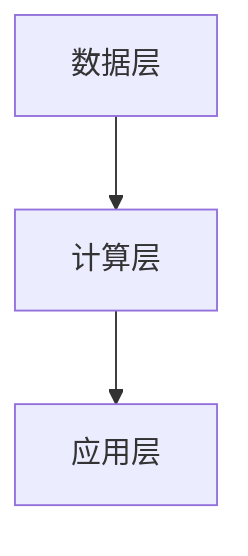
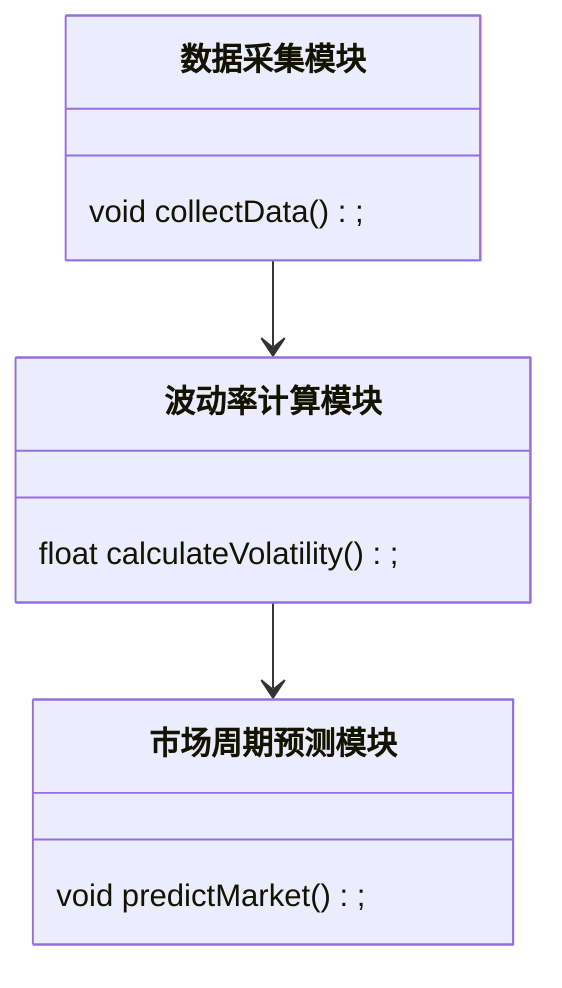

                 


# 格雷厄姆的市场周期理论

## 关键词：市场周期、价值投资、投资者心理、波动率、安全边际、投资策略

## 摘要：格雷厄姆的市场周期理论是价值投资的重要组成部分，通过分析市场周期的波动性和投资者心理，帮助投资者在不同市场阶段做出明智的投资决策。本文详细探讨了市场周期的定义、特征、数学模型及算法实现，结合实际案例分析，为投资者提供科学的投资策略和实战指导。

---

## 第1章: 格雷厄姆的市场周期理论概述

### 1.1 格雷厄姆及其投资理论背景

#### 1.1.1 格雷厄姆的生平与主要著作
本杰明·格雷厄姆（Benjamin Graham）是20世纪最著名的价值投资理论创始人之一。他在《证券分析》（1934年）和《 Intelligent Investor》（1949年）等著作中提出了价值投资的理念，深刻影响了巴菲特等投资大师。格雷厄姆的投资理论以基本面分析为核心，强调安全边际和长期投资。

#### 1.1.2 格雷厄姆的价值投资理念
格雷厄姆的价值投资理念强调买入被市场低估的资产，长期持有，避免频繁交易。他认为市场的短期波动是不可预测的，但长期来看，资产的价值会回归其内在价值。

#### 1.1.3 市场周期理论的提出背景
市场周期理论是格雷厄姆在分析市场波动和投资者心理过程中提出的。他认为，市场会经历周期性波动，投资者在不同阶段的行为会影响市场的定价，从而为理性投资者提供投资机会。

---

### 1.2 市场周期理论的核心概念

#### 1.2.1 市场周期的定义与特征
市场周期是指市场从低谷到繁荣再到衰退的循环过程。格雷厄姆将市场周期分为四个阶段：恐慌与低价阶段、绝望与逐步上升阶段、乐观与逐步下降阶段、兴奋与高价阶段。

#### 1.2.2 市场周期的四个阶段
1. **恐慌与低价阶段**：市场情绪极度悲观，资产价格被低估。
2. **绝望与逐步上升阶段**：市场情绪开始改善，资产价格逐步上升。
3. **乐观与逐步下降阶段**：市场情绪过于乐观，资产价格开始下降。
4. **兴奋与高价阶段**：市场情绪极度兴奋，资产价格达到高点。

#### 1.2.3 市场周期与投资者心理的关系
投资者心理在市场周期中起着重要作用。在恐慌阶段，投资者倾向于抛售资产；在乐观阶段，投资者倾向于买入资产。格雷厄姆认为，投资者的非理性行为会导致市场的短期波动，但长期来看，市场会回归理性。

---

## 第2章: 市场周期理论的数学模型与算法

### 2.1 市场周期的量化分析

#### 2.1.1 市场波动的数学模型
市场波动可以用统计学方法进行量化分析。假设资产价格的变化服从随机游走模型，波动率可以用标准差来衡量。

$$\text{波动率} = \sigma = \sqrt{\frac{1}{n-1}\sum_{i=1}^{n}(x_i - \bar{x})^2}$$

其中，\( x_i \) 是资产价格，\( \bar{x} \) 是资产价格的平均值，\( n \) 是数据点的数量。

#### 2.1.2 市场周期的波动方程
市场周期的波动可以用以下方程表示：

$$ P(t) = P_0 + \mu t + \sigma \epsilon $$

其中，\( P(t) \) 是时间 \( t \) 的资产价格，\( P_0 \) 是初始价格，\( \mu \) 是平均回报率，\( \sigma \) 是波动率，\( \epsilon \) 是随机误差项。

#### 2.1.3 市场周期的预测算法
市场周期的预测算法可以基于时间序列分析，例如ARIMA模型。以下是ARIMA模型的简要流程：

1. 数据预处理：对历史价格数据进行平稳化处理。
2. 模型选择：选择合适的ARIMA参数 \( p, d, q \)。
3. 模型训练：使用历史数据训练模型。
4. 模型预测：对未来的价格进行预测。

---

### 2.2 市场周期与投资者心理的关联

#### 2.2.1 投资者心理的数学模型
投资者心理可以用行为金融学中的 prospect theory 来建模。 prospect theory 强调投资者对收益和损失的非对称态度。

#### 2.2.2 心理因素对市场周期的影响
在市场周期的不同阶段，投资者的心理变化会导致资产价格的波动。例如，在恐慌阶段，投资者的过度悲观会导致资产价格低于其内在价值。

#### 2.2.3 心理周期与市场周期的对比分析
心理周期和市场周期之间存在一定的相关性。投资者的心理变化会影响市场的波动，从而影响市场周期的演变。

---

## 第3章: 市场周期理论的核心算法实现

### 3.1 市场周期的波动分析算法

#### 3.1.1 波动率的计算公式
波动率的计算公式如下：

$$ \text{波动率} = \sqrt{\frac{1}{n}\sum_{i=1}^{n}(r_i - \bar{r})^2} $$

其中，\( r_i \) 是资产的收益率，\( \bar{r} \) 是平均收益率。

#### 3.1.2 市场周期的波动率分析
通过计算不同阶段的波动率，可以判断市场的当前阶段。例如，在恐慌阶段，波动率会显著增加。

#### 3.1.3 波动率与市场周期的关系
波动率与市场周期密切相关。在市场周期的不同阶段，波动率的变化呈现出一定的规律性。

---

### 3.2 市场周期预测的算法实现

#### 3.2.1 时间序列分析算法
时间序列分析算法可以用来预测市场周期的变化。以下是ARIMA模型的Python代码示例：

```python
from statsmodels.tsa.arima_model import ARIMA
import pandas as pd

# 加载数据
data = pd.read_csv('market_data.csv')

# 训练模型
model = ARIMA(data['price'], order=(5, 1, 0))
model_fit = model.fit()

# 预测未来价格
forecast = model_fit.forecast(steps=10)
print(forecast)
```

#### 3.2.2 市场周期预测的数学模型
市场周期预测的数学模型可以表示为：

$$ P(t) = P(t-1) + \mu + \sigma \epsilon $$

其中，\( \mu \) 是平均回报率，\( \sigma \) 是波动率，\( \epsilon \) 是随机误差项。

#### 3.2.3 算法实现的详细解读
通过时间序列分析算法，可以对市场周期进行预测。例如，使用ARIMA模型可以预测未来的价格走势，并判断市场周期的阶段。

---

## 第4章: 格雷厄姆市场周期理论的系统分析与架构设计

### 4.1 系统分析与设计

#### 4.1.1 系统功能模块划分
系统功能模块包括数据采集、波动率计算、市场周期预测和投资策略生成。

#### 4.1.2 系统架构设计
系统架构采用分层设计，包括数据层、计算层和应用层。

#### 4.1.3 系统接口设计
系统接口包括数据输入接口、模型训练接口和预测结果输出接口。

### 4.2 系统架构图

#### 4.2.1 系统架构的Mermaid图


#### 4.2.2 系统功能模块的类图


---

## 第5章: 格雷厄姆市场周期理论的项目实战

### 5.1 项目环境安装与配置

#### 5.1.1 系统环境要求
需要安装Python 3.6及以上版本，以及相关库如Pandas、NumPy和statsmodels。

#### 5.1.2 依赖库的安装
使用以下命令安装依赖库：
```bash
pip install pandas numpy statsmodels
```

#### 5.1.3 开发工具的配置
推荐使用Jupyter Notebook进行代码开发和调试。

### 5.2 核心算法实现

#### 5.2.1 波动率计算的Python代码
```python
import numpy as np

def calculate_volatility(returns):
    mean_return = np.mean(returns)
    deviations = [r - mean_return for r in returns]
    squared_deviations = [d**2 for d in deviations]
    variance = np.mean(squared_deviations)
    volatility = np.sqrt(variance)
    return volatility
```

#### 5.2.2 市场周期预测的Python代码
```python
from statsmodels.tsa.arima_model import ARIMA
import pandas as pd

data = pd.read_csv('market_data.csv')
model = ARIMA(data['price'], order=(5, 1, 0))
model_fit = model.fit()
forecast = model_fit.forecast(steps=10)
print(forecast)
```

#### 5.2.3 算法实现的详细解读
通过上述代码，可以实现市场周期的波动率计算和预测。波动率计算基于历史收益率数据，预测算法基于ARIMA模型。

### 5.3 实际案例分析

#### 5.3.1 历史市场周期的案例分析
以2008年金融危机为例，分析市场周期的不同阶段对资产价格的影响。

#### 5.3.2 现实市场周期的案例分析
以当前市场为例，分析市场周期的当前阶段，并预测未来的价格走势。

#### 5.3.3 案例分析的总结与反思
总结案例分析的结论，并反思市场周期理论在实际投资中的应用。

---

## 第6章: 格雷厄姆市场周期理论的最佳实践与小结

### 6.1 最佳实践 tips

#### 6.1.1 投资者的心理调节
投资者需要保持冷静，避免被市场情绪左右。

#### 6.1.2 市场周期的监控与预警
通过技术指标和模型预警，及时发现市场周期的变化。

#### 6.1.3 安全边际的应用技巧
在市场恐慌阶段，寻找被低估的资产进行投资。

### 6.2 项目小结

#### 6.2.1 核心概念的总结
格雷厄姆的市场周期理论通过分析市场波动和投资者心理，帮助投资者在不同市场阶段做出明智的投资决策。

#### 6.2.2 算法实现的总结
通过时间序列分析算法，可以实现市场周期的量化分析和预测。

#### 6.2.3 项目总结
本项目通过理论分析和实战案例，验证了格雷厄姆市场周期理论的有效性，并为投资者提供了科学的投资策略。

### 6.3 未来展望

#### 6.3.1 市场周期理论的未来发展
随着大数据和人工智能技术的发展，市场周期理论将更加精准和实用。

#### 6.3.2 新的市场环境下的投资策略
在新的市场环境下，投资者需要不断调整和优化投资策略，以应对市场的变化。

---

## 结语

格雷厄姆的市场周期理论为投资者提供了科学的投资指导。通过量化分析和实战案例，我们可以更好地理解市场周期的变化，并在实际投资中应用这些理论和方法。未来，随着技术的进步，市场周期理论将不断发展和完善，为投资者提供更有力的支持。

