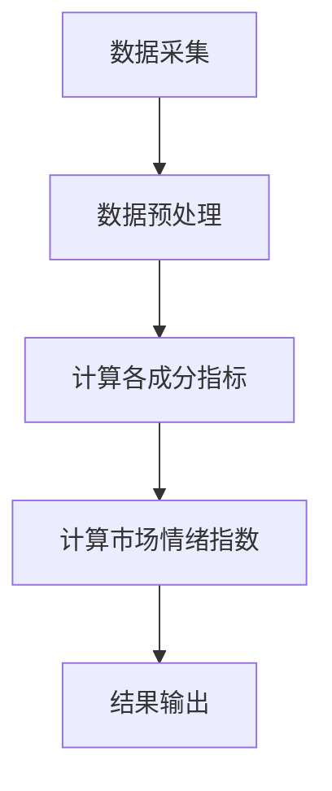
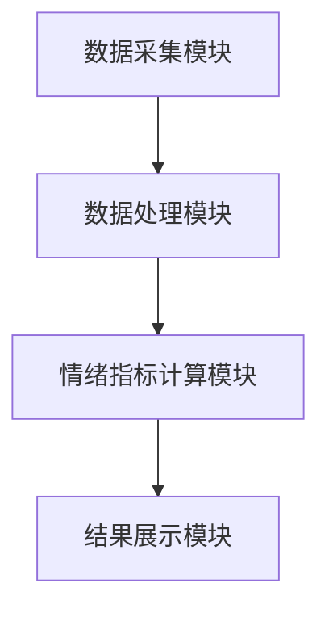

                 


# 格雷厄姆的市场情绪指标

> 关键词：市场情绪指标，投资理论，情绪计算，系统架构，价值投资，投资策略

> 摘要：本文将详细探讨格雷厄姆的市场情绪指标，从理论基础到数学模型，再到系统实现，结合实际案例，全面解析市场情绪指标在投资中的应用。文章将涵盖市场情绪的基本概念、情绪指标的计算方法、系统架构设计以及项目实战等内容，帮助读者深入了解市场情绪指标的核心原理和实际应用。

---

# 第1章: 市场情绪与投资理论基础

## 1.1 市场情绪的定义与背景

### 1.1.1 市场情绪的定义
市场情绪指的是投资者在特定市场环境下的整体心理状态，反映了投资者对市场未来走势的预期和信心。市场情绪通常可以通过投资者的行为、交易数据和市场指标来衡量。

### 1.1.2 市场情绪在投资中的重要性
市场情绪是影响市场走势的重要因素之一。当市场情绪过热时，可能导致资产价格泡沫；而当市场情绪低落时，可能导致资产价格被低估。因此，理解和量化市场情绪对投资者制定投资策略具有重要意义。

### 1.1.3 市场情绪与市场波动的关系
市场情绪与市场波动密切相关。市场情绪的波动会直接反映在资产价格的波动中，例如，当市场情绪高涨时，资产价格可能上涨，反之则可能下跌。

## 1.2 市场情绪指标的核心概念

### 1.2.1 市场情绪指标的定义
市场情绪指标是通过量化方法对市场情绪进行度量的工具。常见的市场情绪指标包括恐慌指数、投资者信心指数等。

### 1.2.2 市场情绪指标的分类
市场情绪指标可以分为以下几类：
1. **恐慌指数**：如VIX指数，用于衡量市场的波动性和恐慌程度。
2. **投资者信心指数**：通过调查投资者信心来反映市场情绪。
3. **交易量指标**：通过分析交易量的变化来推断市场情绪。

### 1.2.3 市场情绪指标与其他市场指标的区别
与传统的技术指标（如移动平均线、RSI等）不同，市场情绪指标更关注投资者的心理状态，而非市场的价格走势本身。

| 指标类型 | 焦点 | 示例 |
|----------|------|------|
| 技术指标 | 市场价格走势 | 移动平均线、RSI |
| 市场情绪指标 | 投资者心理 | 恐慌指数、投资者信心指数 |

## 1.3 格雷厄姆的市场情绪理论

### 1.3.1 格雷厄姆的价值投资理念
格雷厄姆是价值投资的鼻祖，他主张以低于内在价值的价格购买优质资产。他认为市场情绪的波动会导致资产价格偏离其内在价值，从而为投资者提供了投资机会。

### 1.3.2 市场情绪与价值投资的结合
格雷厄姆认为，当市场情绪高涨时，资产价格可能被高估；当市场情绪低落时，资产价格可能被低估。因此，投资者可以通过分析市场情绪指标来寻找投资机会。

### 1.3.3 格雷厄姆对市场情绪指标的贡献
格雷厄姆的理论为市场情绪指标的研究提供了理论基础，尤其是在市场情绪与资产价格波动之间的关系方面。

## 1.4 本章小结
本章介绍了市场情绪的基本概念及其在投资中的重要性，分析了市场情绪指标的分类和特点，并详细探讨了格雷厄姆的市场情绪理论及其对市场情绪指标研究的贡献。

---

# 第2章: 市场情绪指标的数学模型与算法原理

## 2.1 市场情绪指标的数学模型

### 2.1.1 市场情绪指数的构建
市场情绪指数可以通过对多个市场情绪指标的加权平均来构建。例如，恐慌指数可以由多个成分指数构成，每个成分指数代表不同的市场情绪因素。

### 2.1.2 情绪指数的计算公式
假设我们有N个市场情绪指标，每个指标的权重为w_i（i=1,2,...,N），则市场情绪指数E可以表示为：

$$
E = \sum_{i=1}^{N} w_i \cdot x_i
$$

其中，x_i是第i个市场情绪指标的值。

### 2.1.3 情绪指数的权重分配
权重的分配可以根据历史数据的拟合程度和重要性来确定。例如，恐慌指数的权重可能更多地分配给波动率指标。

## 2.2 市场情绪指标的算法实现

### 2.2.1 数据采集与预处理
数据采集是市场情绪指标计算的第一步。通常，我们需要采集包括股票价格、交易量、市场指数等数据。数据预处理包括数据清洗和标准化。

### 2.2.2 情绪指标的计算流程
以下是市场情绪指标计算的流程图：



### 2.2.3 算法的优化与改进
为了提高计算效率和准确性，我们可以对算法进行优化。例如，使用滑动窗口方法来计算实时市场情绪指数。

## 2.3 市场情绪指标的验证与评估

### 2.3.1 指标的验证方法
我们可以通过回测的方法验证市场情绪指数的有效性。例如，我们可以计算市场情绪指数与市场收益率的相关性。

### 2.3.2 指标的评估标准
常用的评估指标包括相关性系数、均方误差（MSE）等。

### 2.3.3 指标的有效性分析
通过分析历史数据，我们可以验证市场情绪指数的有效性。例如，当市场情绪指数处于高位时，市场收益率可能较低，反之亦然。

## 2.4 本章小结
本章详细介绍了市场情绪指标的数学模型和算法实现，包括数据采集、指标计算和验证评估等步骤。

---

# 第3章: 市场情绪指标的系统架构与实现

## 3.1 系统架构设计

### 3.1.1 系统功能模块划分
市场情绪指标系统主要包括以下几个功能模块：
1. 数据采集模块
2. 数据处理模块
3. 情绪指标计算模块
4. 结果展示模块

### 3.1.2 系统架构的流程图
以下是系统的架构流程图：



### 3.1.3 系统架构的优缺点分析
优点：系统架构清晰，各模块功能独立，便于维护和扩展。  
缺点：可能需要较高的计算资源，尤其是当数据量较大时。

## 3.2 数据采集与处理

### 3.2.1 数据源的选择
常用的数据源包括股票交易所的数据接口和社交媒体数据。

### 3.2.2 数据采集的实现
我们可以使用Python的`pandas`库和`requests`库来采集数据。

### 3.2.3 数据预处理的方法
数据预处理包括数据清洗、标准化和缺失值处理等。

## 3.3 情绪指标的计算与展示

### 3.3.1 计算模块的实现
使用Python编写计算市场情绪指数的代码，例如：

```python
def calculate_market_sentiment(data):
    # 数据预处理
    processed_data = preprocess_data(data)
    # 计算各成分指标
    component_indices = calculate_components(processed_data)
    # 计算市场情绪指数
    market_sentiment_index = calculate_sentiment_index(component_indices)
    return market_sentiment_index
```

### 3.3.2 指标的可视化展示
使用Matplotlib或Seaborn库进行可视化展示，例如绘制市场情绪指数的时序图。

### 3.3.3 系统的交互设计
用户可以通过Web界面输入参数，系统实时计算并展示市场情绪指数。

## 3.4 本章小结
本章详细介绍了市场情绪指标系统的架构设计和实现过程，包括数据采集、处理和指标计算等部分。

---

# 第4章: 市场情绪指标的项目实战

## 4.1 项目背景与目标

### 4.1.1 项目背景介绍
本项目旨在开发一个实时市场情绪监控系统，帮助投资者分析市场情绪并制定投资策略。

### 4.1.2 项目目标设定
目标包括：
1. 实时采集市场数据
2. 计算市场情绪指数
3. 可视化展示市场情绪指数

### 4.1.3 项目范围界定
项目范围包括数据采集、处理、计算和展示模块的开发。

## 4.2 项目实施与代码实现

### 4.2.1 环境搭建与工具安装
安装Python、Jupyter Notebook、Pandas、Matplotlib等工具。

### 4.2.2 代码核心实现
以下是市场情绪指数计算的核心代码：

```python
import pandas as pd
import numpy as np
import matplotlib.pyplot as plt

def preprocess_data(data):
    # 数据清洗和标准化
    processed_data = data.dropna().astype(float)
    return processed_data

def calculate_components(data):
    # 计算各成分指标
    component_indices = []
    for i in range(len(data.columns)):
        component = data.iloc[:, i].std()
        component_indices.append(component)
    return component_indices

def calculate_sentiment_index(components):
    # 计算市场情绪指数
    market_sentiment_index = np.mean(components)
    return market_sentiment_index

# 示例数据
data = pd.DataFrame({
    'Price': [100, 105, 103, 108, 110],
    'Volume': [1000, 1200, 900, 1300, 1400]
})

processed_data = preprocess_data(data)
component_indices = calculate_components(processed_data)
market_sentiment_index = calculate_sentiment_index(component_indices)

print("Market Sentiment Index:", market_sentiment_index)
```

### 4.2.3 代码的功能解读
上述代码实现了数据预处理、成分指标计算和市场情绪指数计算的功能。

## 4.3 项目案例分析

### 4.3.1 案例背景介绍
我们以某股票的交易数据为例，计算其市场情绪指数。

### 4.3.2 案例分析过程
1. 数据采集与预处理
2. 计算成分指标
3. 计算市场情绪指数

### 4.3.3 案例结果与总结
通过案例分析，我们验证了市场情绪指数的有效性，并展示了其在投资决策中的应用。

## 4.4 本章小结
本章通过一个实际案例详细介绍了市场情绪指标的项目实施过程，包括环境搭建、数据处理和代码实现等步骤。

---

# 第5章: 市场情绪指标的最佳实践与注意事项

## 5.1 最佳实践 tips

### 5.1.1 数据源选择的建议
选择可靠的数据源，确保数据的准确性和及时性。

### 5.1.2 指标计算的注意事项
注意数据的时延问题，确保计算结果能够反映当前市场情绪。

### 5.1.3 系统交互设计的优化
提供友好的用户界面，方便用户实时查看市场情绪指数。

## 5.2 小结
市场情绪指标是投资者分析市场情绪的重要工具。通过本文的介绍，读者可以全面了解市场情绪指标的理论基础、数学模型和系统实现，并能够在实际投资中加以应用。

## 5.3 注意事项

### 5.3.1 数据的时延问题
市场情绪指标的计算需要考虑数据的时延问题，尤其是实时数据的处理。

### 5.3.2 指标的局限性
市场情绪指标仅是影响市场走势的一个因素，投资者还需要结合其他因素进行综合分析。

### 5.3.3 模型的实时性
为了确保市场的实时性，需要定期更新数据和重新计算市场情绪指数。

## 5.4 拓展阅读
推荐读者阅读格雷厄姆的《投资学原理》以及相关市场情绪分析的书籍，以进一步深入理解市场情绪指标的应用。

---

# 附录: 市场情绪指标的数学公式汇总

1. **恐慌指数计算公式**：
$$
VIX = \sqrt{\frac{252}{n} \sum_{i=1}^{n} (\ln\frac{S_i}{S_{i-1}})^2}
$$

2. **投资者信心指数计算公式**：
$$
CCI = \frac{\sum_{i=1}^{n} w_i x_i}{\sum_{i=1}^{n} w_i}
$$

---

# 结语

通过本文的详细讲解，读者可以全面掌握格雷厄姆的市场情绪指标的理论基础、数学模型和系统实现，并能够在实际投资中加以应用。市场情绪指标是投资者分析市场情绪的重要工具，希望本文能够为读者提供有价值的参考和启发。

--- 

感谢您的耐心阅读，如需进一步探讨，请随时联系！

