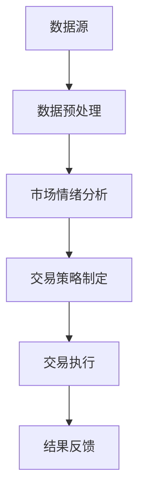

                 


# 《格雷厄姆的市场情绪理论：应对算法交易的影响》

## 第一部分：市场情绪理论概述

### 第1章：市场情绪理论的背景与核心概念

#### 1.1 市场情绪理论的背景

市场情绪理论是投资学中的一个重要概念，它帮助投资者理解市场参与者的心理状态如何影响资产价格。市场情绪通常分为乐观和悲观两种状态，反映了投资者对市场的看法和预期。

- **定义**：市场情绪是指投资者在市场中的整体情绪状态，通常通过市场参与者的买卖行为、价格波动等指标来衡量。
- **背景**：市场情绪理论起源于心理学和行为经济学，强调人类行为的非理性对市场的影响。格雷厄姆在其投资理论中，特别强调了市场情绪在价值投资中的重要性。

#### 1.2 格雷厄姆的市场情绪理论

本杰明·格雷厄姆是价值投资的创始人，他认为市场情绪是决定资产价格波动的主要因素之一。他的理论强调在市场恐慌时买入，在市场狂热时卖出。

- **核心观点**：
  - 市场情绪具有周期性，波动围绕长期价值上下波动。
  - 投资者应逆市场情绪操作，即在市场低迷时买入优质资产，在市场繁荣时卖出。

#### 1.3 市场情绪与传统技术分析的对比

市场情绪分析与传统技术分析虽然都关注市场行为，但侧重点不同：

- **技术分析**：侧重于价格走势、图表模式，预测未来价格走势。
- **市场情绪分析**：侧重于投资者的心理状态，预测价格波动的原因。

**对比表格**：

| 对比维度       | 技术分析                 | 市场情绪分析           |
|----------------|--------------------------|-----------------------|
| 核心关注点     | 价格走势、图表模式       | 投资者心理状态         |
| 工具           | 移动平均线、RSI、MACD     | 情绪指标、新闻分析     |
| 预测目标       | 未来价格走势             | 市场波动原因           |
| 方法论         | 客观、量化                | 主观、定性分析          |

### 第2章：算法交易的机制与影响

#### 2.1 算法交易的基本原理

算法交易是一种利用计算机算法自动执行交易的策略，通常基于数学模型和算法。

- **定义**：算法交易是通过预先设定的算法，根据市场数据自动执行买卖指令。
- **分类**：
  - 高频交易：以极快速度进行交易，捕捉短期价格波动。
  - 跨式交易：基于多种金融工具的组合策略。

#### 2.2 算法交易的数学模型与实现

算法交易的核心在于数学模型，常用的时间序列模型包括ARIMA和GARCH。

- **ARIMA模型**：
  - 用于预测未来的市场走势，基于历史数据。
  - 公式：ARIMA(p, d, q)，其中p为自回归阶数，d为差分阶数，q为移动平均阶数。

- **GARCH模型**：
  - 用于估计波动性，预测风险。
  - 公式：GARCH(p, q)，p为自回归阶数，q为移动平均阶数。

#### 2.3 算法交易对市场情绪的影响

- **放大波动**：算法交易的高频特性可能导致价格的剧烈波动，加剧市场情绪的波动。
- **市场情绪周期**：算法交易可能缩短市场情绪周期，使市场更快地从乐观转向悲观，或反之。

## 第三部分：市场情绪与算法交易的结合

### 第3章：算法交易对市场情绪的反馈机制

#### 3.1 算法交易如何影响市场情绪

- **反馈机制**：算法交易通过影响价格，反过来影响市场情绪。例如，算法交易引发的价格下跌可能导致市场情绪转向悲观。

- **相互作用**：市场情绪影响算法交易策略，而算法交易又加剧市场情绪的波动。这种相互作用可能导致市场出现极端波动。

### 第4章：应对策略与系统架构设计

#### 4.1 应对策略的制定

投资者应如何应对算法交易带来的市场情绪波动？

- **逆市场情绪操作**：在市场恐慌时买入，在市场狂热时卖出。
- **风险管理**：设置止损点，避免过大损失。
- **多元化投资**：分散投资，降低单一资产的风险。

#### 4.2 系统架构设计

设计一个结合市场情绪分析和算法交易的系统架构，通常包括以下部分：

1. **数据采集**：收集市场数据、新闻、社交媒体情绪等。
2. **市场情绪分析**：使用NLP技术分析文本数据，判断市场情绪。
3. **算法交易模块**：根据市场情绪和数据模型，自动执行交易。

**系统架构图**（mermaid）：



## 第四部分：案例分析与实战

### 第5章：案例分析

- **案例1**：2020年新冠疫情引发的市场崩盘。
  - 算法交易在市场恐慌时大量抛售，加剧了市场下跌。
  - 市场情绪从乐观迅速转向悲观，导致市场剧烈波动。

- **案例2**：2021年GameStop事件。
  - 社交媒体上的讨论引发市场情绪波动，算法交易加剧了价格波动。

### 第6章：项目实战

- **环境安装**：
  - 安装Python、Pandas、NumPy、Scikit-learn等库。
  
- **核心实现代码**：
  ```python
  import pandas as pd
  import numpy as np
  from sklearn.linear_model import LinearRegression

  # 示例数据：假设我们有市场情绪指数和资产价格数据
  data = pd.DataFrame({
      'market_sentiment': np.random.rand(100),
      'price': np.random.rand(100)
  })

  # 使用线性回归模型预测价格
  model = LinearRegression()
  model.fit(data[['market_sentiment']], data['price'])

  # 预测市场情绪对价格的影响
  predicted_price = model.predict(data[['market_sentiment']])
  print("回归系数:", model.coef_)
  ```

## 总结与展望

### 总结

本文详细探讨了格雷厄姆的市场情绪理论在应对算法交易中的应用。通过分析市场情绪和算法交易的相互作用，提出了投资者应如何制定策略以应对市场波动。

### 展望

未来的研究可以进一步探讨算法交易对市场情绪的长期影响，以及如何利用更复杂的数据分析技术（如机器学习）来预测和应对市场情绪变化。同时，随着技术的进步，算法交易可能会变得更加复杂，投资者需要不断学习和适应新的市场环境。

---

通过以上结构，文章详细探讨了市场情绪理论和算法交易的影响，并结合实际案例和系统设计，为投资者提供了有价值的见解和策略。

