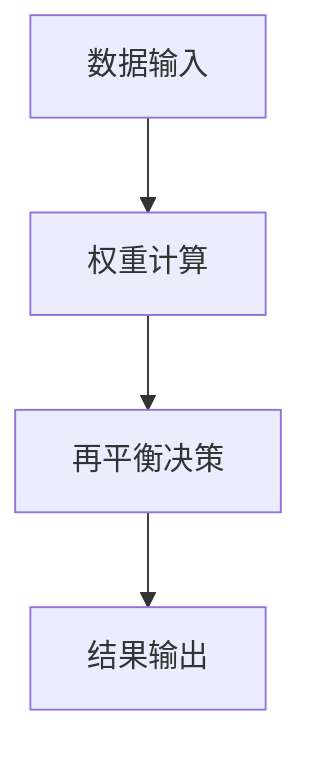

                 


# 格雷厄姆的投资组合再平衡策略

> 关键词：格雷厄姆，投资组合，再平衡策略，价值投资，资产配置，投资组合管理

> 摘要：本文深入探讨了格雷厄姆的投资组合再平衡策略，从其核心概念、数学模型、系统架构到实际案例，全面解析该策略的实施方法和实际应用。通过详细分析，读者将理解如何通过再平衡策略维持投资组合的健康，优化风险收益比，并实现长期稳健的投资回报。

---

## 第一部分: 投资组合再平衡的背景与基础

### 第1章: 投资组合再平衡的定义与重要性

#### 1.1 投资组合再平衡的定义

投资组合再平衡是指定期调整投资组合中各资产的权重，以维持预设的资产配置比例。这种调整旨在应对市场波动、资产价格变化以及投资者风险偏好的变化，确保投资组合的风险收益比保持在合理范围内。

- **投资组合**：由多种资产（如股票、债券、现金等）组成的集合，旨在通过多样化降低风险并实现收益最大化。
- **再平衡**：通过调整各资产的权重，使投资组合回归目标配置的过程。

#### 1.2 格雷厄姆的背景与投资理念

本杰明·格雷厄姆是价值投资的创始人，被誉为“股神巴菲特的老师”。他的投资理念强调安全边际、长期投资和风险管理。格雷厄姆的再平衡策略是其投资体系的重要组成部分，旨在通过定期调整投资组合来应对市场变化和实现长期收益目标。

- **格雷厄姆的投资理念**：注重安全边际，追求长期稳定的收益，避免过度风险。
- **再平衡策略的作用**：防止资产配置 drift，保持投资组合的稳定性。

#### 1.3 再平衡策略的必要性

- **市场波动**：股票、债券等资产价格波动会导致投资组合的权重偏离目标配置。
- **资产配置 drift**：随着时间推移，资产价格的变化可能导致某些资产权重过高或过低。
- **风险管理**：通过再平衡，可以控制投资组合的波动性，降低风险。

---

### 第2章: 格雷厄姆再平衡策略的核心概念

#### 2.1 资产配置与再平衡的关系

资产配置是投资的基础，再平衡则是维持资产配置的重要手段。格雷厄姆的再平衡策略通过定期调整资产权重，确保投资组合的稳定性。

- **资产配置**：确定投资组合中各类资产的比例，如股票、债券、现金等。
- **再平衡**：定期调整各资产的权重，使投资组合回归目标配置。

#### 2.2 格雷厄姆再平衡策略的数学模型

格雷厄姆的再平衡策略可以通过以下步骤实现：

1. **计算当前各资产的权重**：根据当前市值和总资金，计算各资产的权重。
2. **确定目标权重**：设定各资产的目标权重，如股票60%，债券30%，现金10%。
3. **计算调整金额**：比较当前权重与目标权重，确定需要调整的资产和金额。

数学模型如下：

$$
\text{调整金额} = \text{当前权重} - \text{目标权重} \times \text{总资金}
$$

---

### 第3章: 格雷厄姆再平衡策略的核心算法

#### 3.1 再平衡算法的原理

再平衡算法通过以下步骤实现：

1. **数据输入**：获取当前各资产的市值和目标权重。
2. **计算当前权重**：$$ \text{当前权重} = \frac{\text{资产市值}}{\text{总资金}} $$
3. **计算调整金额**：$$ \text{调整金额} = (\text{目标权重} - \text{当前权重}) \times \text{总资金} $$
4. **执行调整**：买卖资产以实现目标权重。

---

### 第4章: 格雷厄姆再平衡策略的系统架构

#### 4.1 系统功能设计

- **数据输入**：读取当前资产市值和目标权重。
- **权重计算**：计算当前权重和调整金额。
- **再平衡决策**：确定需要调整的资产和金额。
- **结果输出**：输出调整后的投资组合。

#### 4.2 系统架构图



---

### 第5章: 格雷厄姆再平衡策略的项目实战

#### 5.1 环境安装与数据准备

- **Python环境搭建**：安装Python和必要的库，如pandas、numpy。
- **数据准备**：获取各资产的当前市值和目标权重。

#### 5.2 核心算法实现

```python
import pandas as pd

def rebalance_portfolio(current_weights, target_weights, total_value):
    # 计算当前权重
    current_weights = current_weights / total_value
    # 计算调整金额
    adjustments = (target_weights - current_weights) * total_value
    return adjustments

# 示例数据
current_weights = [50000, 30000, 20000]
target_weights = [60, 30, 10]
total_value = 100000

# 调整金额计算
adjustments = rebalance_portfolio(current_weights, target_weights, total_value)
print(adjustments)
```

#### 5.3 代码应用与案例分析

- **案例背景**：假设投资组合中股票、债券、现金的目标权重分别为60%、30%、10%，总资金为10万元。
- **计算结果**：股票需要增加10,000元，债券减少1,000元，现金无变化。

---

### 第6章: 格雷厄姆再平衡策略的最佳实践

#### 6.1 小结

格雷厄姆的再平衡策略是实现投资组合稳定和风险控制的重要手段。通过定期调整资产权重，投资者可以保持投资组合的健康，实现长期稳健的收益。

#### 6.2 注意事项

- **定期检查**：建议每季度或每年进行一次再平衡。
- **避免频繁交易**：频繁调整可能产生交易成本和税收影响。
- **考虑市场环境**：根据市场变化和自身风险偏好调整目标权重。

#### 6.3 拓展阅读

- 格雷厄姆的《聪明的投资者》
- 《投资学》中的资产配置理论

---

通过本文的详细讲解，读者可以全面理解格雷厄姆的投资组合再平衡策略，并将其应用于实际投资中。这种方法不仅能够帮助投资者优化资产配置，还能有效控制风险，实现长期的投资目标。

