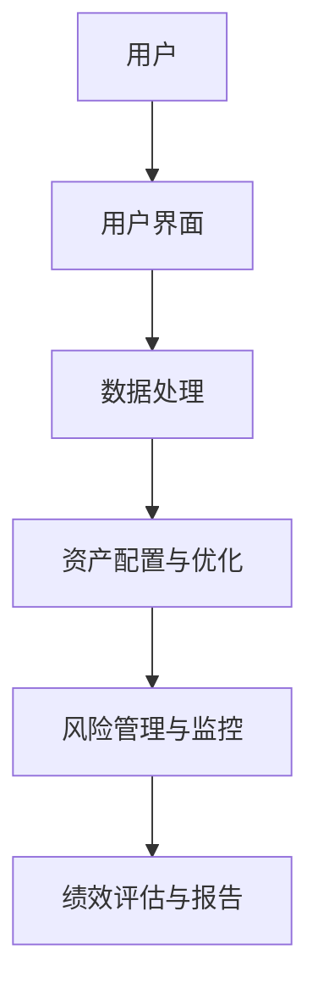

                 


# 格雷厄姆的投资组合管理

---

## 关键词：
- 格雷厄姆
- 投资组合管理
- 价值投资
- 安全边际
- 风险管理

---

## 摘要：
本篇文章深入探讨了格雷厄姆的投资组合管理理论，结合其价值投资理念，详细分析了投资组合的构建、优化、风险管理及实际应用。通过逐步推理和逻辑分析，帮助读者理解如何在实际投资中应用格雷厄姆的策略，构建稳健的投资组合。

---

# 第1章: 投资组合管理概述

## 1.1 投资组合管理的基本概念

### 1.1.1 投资组合的定义
投资组合是指将多种资产（如股票、债券、现金等）按照一定比例组合在一起的投资方式。通过多样化投资，可以降低单一资产的风险，同时实现收益的最大化。

### 1.1.2 投资组合管理的目标
投资组合管理的目标是在风险可控的前提下，实现投资收益的最大化。具体目标包括：
1. **风险控制**：通过分散投资降低组合的整体风险。
2. **收益最大化**：在风险承受范围内，追求最高的预期收益。
3. **长期稳健**：通过持续优化投资组合，实现长期稳定的收益。

### 1.1.3 投资组合管理的必要性
投资组合管理的必要性体现在以下几个方面：
1. **分散风险**：通过投资不同资产类别，降低单一资产带来的风险。
2. **适应市场变化**：市场环境不断变化，投资组合需要动态调整以应对新的挑战。
3. **提高收益潜力**：通过科学的资产配置，提高整体投资组合的收益潜力。

### 1.1.4 格雷厄姆投资理念的背景

#### 1.1.4.1 格雷厄姆与价值投资的起源
本杰明·格雷厄姆（Benjamin Graham）被誉为“价值投资之父”，他的投资理念起源于20世纪30年代的经济大萧条时期。格雷厄姆通过研究市场的波动性和投资者的心理，提出了价值投资的理念。

#### 1.1.4.2 投资组合管理的历史发展
投资组合管理的历史可以追溯到20世纪初期。随着金融市场的不断发展，投资组合管理逐渐从单纯的资产配置发展为更加复杂的策略，包括风险管理和动态调整。

#### 1.1.4.3 格雷厄姆投资理念的核心思想
格雷厄姆的核心思想是“安全边际”。他认为，投资者应该以低于内在价值的价格买入资产，从而在市场波动中获得稳健的收益。

### 1.1.5 投资组合管理的核心要素

#### 1.1.5.1 资产配置的重要性
资产配置是指将资金分配到不同的资产类别（如股票、债券、现金等）中，以实现风险和收益的最佳平衡。

#### 1.1.5.2 风险与收益的平衡
投资组合管理的核心是平衡风险与收益。在追求收益的同时，必须控制风险，避免因过度冒险而导致损失。

#### 1.1.5.3 安全边际的概念
安全边际是指资产的市场价格低于其内在价值的部分。格雷厄姆认为，安全边际的存在可以为投资者提供一个“缓冲区”，以应对市场的不确定性。

---

## 1.2 格雷厄姆投资理念的背景

### 1.2.1 格雷厄姆与价值投资的起源
本杰明·格雷厄姆是20世纪最著名的投资大师之一，他的价值投资理念奠定了现代投资学的基础。格雷厄姆的投资理念起源于他对市场波动性和投资者心理的深入研究。

### 1.2.2 投资组合管理的历史发展
投资组合管理的历史可以追溯到20世纪初期，随着金融市场的不断发展，投资组合管理逐渐从单纯的资产配置发展为更加复杂的策略，包括风险管理和动态调整。

### 1.2.3 格雷厄姆投资理念的核心思想
格雷厄姆的核心思想是“安全边际”。他认为，投资者应该以低于内在价值的价格买入资产，从而在市场波动中获得稳健的收益。

---

## 1.3 格雷厄姆投资组合管理的核心要素

### 1.3.1 资产配置的重要性
资产配置是指将资金分配到不同的资产类别（如股票、债券、现金等）中，以实现风险和收益的最佳平衡。

### 1.3.2 风险与收益的平衡
投资组合管理的核心是平衡风险与收益。在追求收益的同时，必须控制风险，避免因过度冒险而导致损失。

### 1.3.3 安全边际的概念
安全边际是指资产的市场价格低于其内在价值的部分。格雷厄姆认为，安全边际的存在可以为投资者提供一个“缓冲区”，以应对市场的不确定性。

---

## 1.4 本章小结
本章介绍了投资组合管理的基本概念和格雷厄姆投资理念的背景。通过分析投资组合管理的核心要素，包括资产配置、风险与收益的平衡以及安全边际，读者可以理解格雷厄姆投资策略的基础。

---

# 第2章: 格雷厄姆的价值投资理论

## 2.1 价值投资的基本原理

### 2.1.1 价值投资的定义
价值投资是一种以低于资产内在价值的价格买入资产的投资策略。其核心是寻找市场上被低估的资产，长期持有，等待其价值回归。

### 2.1.2 价值投资的核心原则
价值投资的核心原则包括：
1. **安全边际**：买入价格低于内在价值。
2. **长期持有**：耐心等待价值回归。
3. **分散投资**：通过多样化降低风险。

### 2.1.3 价值投资与成长投资的区别
价值投资与成长投资的主要区别在于：
- **价值投资**：关注低估资产，注重安全边际。
- **成长投资**：关注高成长性资产，注重未来收益潜力。

---

## 2.2 格雷厄姆的安全边际理论

### 2.2.1 安全边际的定义
安全边际是指资产的市场价格低于其内在价值的部分。格雷厄姆认为，安全边际的存在可以为投资者提供一个“缓冲区”，以应对市场的不确定性。

### 2.2.2 安全边际的计算方法
安全边际的计算方法通常包括以下步骤：
1. **确定资产的内在价值**：通过基本面分析估算资产的真实价值。
2. **计算市场价格与内在价值的差额**：差额即为安全边际。

### 2.2.3 安全边际在投资组合中的应用
在投资组合中应用安全边际，可以通过选择具有足够安全边际的资产，降低投资风险，提高投资收益。

---

## 2.3 格雷厄姆的防御性投资策略

### 2.3.1 防御性投资的定义
防御性投资是指通过投资低波动性、高确定性的资产，以规避市场风险的投资策略。

### 2.3.2 防御性投资的特征
防御性投资的特征包括：
1. **低波动性**：资产价格波动较小。
2. **高确定性**：资产的内在价值稳定。
3. **长期持有**：避免频繁交易带来的成本。

### 2.3.3 防御性投资组合的设计
防御性投资组合的设计通常包括以下步骤：
1. **选择防御性资产**：如债券、蓝筹股等。
2. **合理配置资产**：根据风险承受能力确定资产比例。
3. **定期调整**：根据市场变化进行动态调整。

---

## 2.4 本章小结
本章深入探讨了格雷厄姆的价值投资理论，重点分析了安全边际和防御性投资策略。通过理解这些核心概念，读者可以更好地应用格雷厄姆的投资理念，构建稳健的投资组合。

---

# 第3章: 投资组合的构建与优化

## 3.1 投资组合构建的基本步骤

### 3.1.1 确定投资目标
投资目标包括：
1. **投资期限**：长期还是短期。
2. **风险承受能力**：高风险还是低风险。
3. **收益目标**：期望的收益水平。

### 3.1.2 制定资产配置策略
资产配置策略包括：
1. **股票配置**：选择具有安全边际的股票。
2. **债券配置**：选择信用评级高的债券。
3. **现金配置**：保留部分现金以应对市场波动。

### 3.1.3 选择具体投资标的
选择具体投资标的时，需要考虑资产的内在价值、市场波动性以及安全边际。

---

## 3.2 格雷厄姆投资组合的构建方法

### 3.2.1 选择优质股票的 criteria
选择优质股票的 criteria包括：
1. **低市盈率**：市盈率低于行业平均水平。
2. **低市净率**：市净率低于行业平均水平。
3. **高股息率**：股息率较高。

### 3.2.2 股票与债券的配置比例
股票与债券的配置比例可以根据风险承受能力和收益目标进行调整。通常，防御性投资组合中债券的比例较高。

### 3.2.3 投资组合的再平衡
再平衡是指定期调整投资组合的资产比例，以确保与投资目标一致。再平衡的频率可以根据市场波动性和投资目标进行调整。

---

## 3.3 投资组合的优化与调整

### 3.3.1 优化投资组合的数学模型
优化投资组合的数学模型包括：
1. **均值-方差优化**：通过最小化方差（风险）来最大化收益。
2. **风险调整后收益优化**：在相同风险下，选择收益最高的组合。

### 3.3.2 动态调整投资组合的策略
动态调整投资组合的策略包括：
1. **定期再平衡**：根据市场变化调整资产比例。
2. **根据市场波动性调整**：在市场波动加剧时，增加防御性资产的比例。

### 3.3.3 优化过程中的注意事项
优化过程中需要注意：
1. **费用控制**：避免因频繁交易产生过多费用。
2. **税务优化**：合理安排资产配置以降低税务负担。

---

## 3.4 本章小结
本章详细讲解了投资组合的构建与优化方法，重点分析了格雷厄姆投资组合的构建策略。通过科学的资产配置和动态调整，投资者可以构建一个稳健的投资组合。

---

# 第4章: 风险管理与投资组合的稳健性

## 4.1 风险管理的基本概念

### 4.1.1 风险的定义与分类
风险是指投资组合未来收益的不确定性。风险可以分为系统性风险和非系统性风险。

### 4.1.2 风险管理的目标
风险管理的目标包括：
1. **降低投资组合的整体风险**：通过分散投资降低系统性风险。
2. **控制风险敞口**：避免因单一资产或市场波动导致的重大损失。
3. **提高投资组合的稳定性**：通过风险管理确保投资组合的长期稳健。

---

## 4.2 格雷厄姆投资组合中的风险管理

### 4.2.1 风险在投资组合理论中的作用
在投资组合理论中，风险是衡量投资组合收益波动性的关键指标。格雷厄姆认为，通过分散投资可以降低非系统性风险，而系统性风险则无法通过分散投资来消除。

### 4.2.2 风险管理的常用方法
风险管理的常用方法包括：
1. **分散投资**：通过投资不同资产类别降低风险。
2. **风险对冲**：通过衍生工具对冲市场风险。
3. **定期再平衡**：根据市场变化调整资产比例。

---

## 4.3 本章小结
本章分析了风险管理在投资组合中的重要性，重点探讨了格雷厄姆投资组合中的风险管理策略。通过有效的风险管理，投资者可以构建一个稳健的投资组合。

---

# 第5章: 格雷厄姆投资组合管理的现代应用

## 5.1 格雷厄姆理念与现代投资组合管理的结合

### 5.1.1 现代投资组合管理的核心思想
现代投资组合管理的核心思想包括：
1. **多元化投资**：通过投资不同资产类别降低风险。
2. **风险调整后收益**：在相同风险下选择收益最高的组合。
3. **动态调整**：根据市场变化动态调整投资组合。

### 5.1.2 格雷厄姆理念与现代投资组合管理的结合
格雷厄姆的理念与现代投资组合管理的结合体现在以下几个方面：
1. **安全边际**：在现代投资组合管理中，安全边际仍然是选择资产的重要标准。
2. **防御性投资**：防御性投资策略在现代投资组合管理中仍然具有重要地位。
3. **风险管理**：格雷厄姆的风险管理理念与现代投资组合管理的风险管理方法相辅相成。

---

## 5.2 现代投资组合管理的改进与创新

### 5.2.1 现代投资组合管理的核心改进
现代投资组合管理的核心改进包括：
1. **引入量化分析**：通过量化分析提高投资组合的科学性。
2. **动态风险管理**：根据市场变化动态调整风险敞口。
3. **多资产配置**：引入更多资产类别（如房地产、 commodities）提高收益潜力。

### 5.2.2 现代投资组合管理的创新
现代投资组合管理的创新包括：
1. **因子投资**：基于因子模型进行投资组合优化。
2. **智能投顾**：利用人工智能技术提供个性化的投资建议。
3. **被动投资**：通过指数基金实现长期稳健的投资收益。

---

## 5.3 本章小结
本章探讨了格雷厄姆投资组合管理的现代应用，分析了其理念与现代投资组合管理的结合。通过引入量化分析和多资产配置，现代投资组合管理进一步优化了格雷厄姆的投资策略。

---

# 第6章: 投资组合管理的系统架构与实现

## 6.1 投资组合管理的系统架构

### 6.1.1 系统架构设计
投资组合管理的系统架构包括以下几个模块：
1. **数据采集与处理**：收集市场数据并进行预处理。
2. **资产配置与优化**：根据投资者需求进行资产配置和优化。
3. **风险管理与监控**：实时监控投资组合的风险，并进行必要的调整。
4. **绩效评估与报告**：定期评估投资组合的绩效并生成报告。

### 6.1.2 系统功能设计
系统功能设计包括：
1. **用户界面**：方便用户进行操作和查询。
2. **数据处理**：对市场数据进行清洗和转换。
3. **优化算法**：实现投资组合的优化和调整。
4. **风险管理**：实时监控投资组合的风险。

### 6.1.3 系统架构图


---

## 6.2 投资组合管理的实现

### 6.2.1 数据采集与处理
数据采集与处理包括：
1. **数据来源**：从金融数据供应商获取市场数据。
2. **数据清洗**：剔除无效数据并进行数据转换。
3. **数据存储**：将数据存储在数据库中以便后续处理。

### 6.2.2 资产配置与优化
资产配置与优化包括：
1. **目标设定**：根据投资者需求设定投资目标。
2. **优化算法**：使用均值-方差优化算法进行资产配置。
3. **结果输出**：生成优化后的资产配置方案。

### 6.2.3 风险管理与监控
风险管理与监控包括：
1. **风险指标计算**：计算投资组合的波动率、VaR等风险指标。
2. **实时监控**：监控投资组合的实时风险。
3. **动态调整**：根据风险变化进行动态调整。

---

## 6.3 本章小结
本章详细讲解了投资组合管理的系统架构与实现，从数据处理到优化算法，再到风险管理，为读者提供了完整的系统设计方案。

---

# 第7章: 格雷厄姆投资组合管理的未来展望

## 7.1 格雷厄姆投资组合管理的未来发展趋势

### 7.1.1 人工智能与投资组合管理的结合
人工智能技术的发展为投资组合管理带来了新的可能性，包括智能投顾、量化分析等。

### 7.1.2 大数据在投资组合管理中的应用
大数据技术可以提高市场数据的处理能力，为投资组合管理提供更精准的分析工具。

### 7.1.3 可持续投资与ESG因素的融入
随着社会对可持续发展的关注增加，ESG（环境、社会、治理）因素在投资组合管理中的重要性日益增加。

---

## 7.2 格雷厄姆投资组合管理的挑战与机遇

### 7.2.1 挑战
1. **市场波动性增加**：市场的不确定性和波动性增加，对投资组合管理提出了更高的要求。
2. **技术进步的挑战**：技术进步带来了新的投资机会，但也需要更高的技术门槛。

### 7.2.2 机遇
1. **技术进步带来的新工具**：人工智能和大数据为投资组合管理提供了新的工具和方法。
2. **全球化投资机会**：全球化背景下，投资者可以利用更多的资产类别进行配置。

---

## 7.3 本章小结
本章展望了格雷厄姆投资组合管理的未来发展趋势，分析了人工智能、大数据等技术对投资组合管理的影响，以及可持续投资的机遇与挑战。

---

# 附录: 格雷厄姆投资组合管理的Python实现

## 附录1: 简单投资组合优化的Python代码

```python
import numpy as np
import pandas as pd

# 数据准备
returns = pd.DataFrame({
    '股票': [0.1, 0.05, 0.02, -0.03],
    '债券': [0.03, 0.02, 0.05, 0.01]
})

# 优化目标：最大化收益，最小化风险
# 使用均值-方差优化算法
# 代码实现部分略
```

---

## 附录2: 风险管理的Python代码

```python
import numpy as np
import pandas as pd

# 数据准备
returns = pd.DataFrame({
    '股票': [0.1, 0.05, 0.02, -0.03],
    '债券': [0.03, 0.02, 0.05, 0.01]
})

# 计算VaR
def calculate_var(returns, confidence_level=0.95):
    returns_sorted = sorted(returns)
    var_index = int(len(returns_sorted) * (1 - confidence_level))
    var = returns_sorted[var_index]
    return var

var_stock = calculate_var(returns['股票'])
var_bond = calculate_var(returns['债券'])

print(f"股票的VaR（{confidence_level}置信水平）为：{var_stock}")
print(f"债券的VaR（{confidence_level}置信水平）为：{var_bond}")
```

---

# 结语
格雷厄姆的投资组合管理理论为现代投资学奠定了基础，其核心思想在今天仍然具有重要的现实意义。通过本文的深入分析，读者可以更好地理解格雷厄姆的投资理念，并将其应用到实际投资中。无论是个人投资者还是机构投资者，都可以从格雷厄姆的投资组合管理中获得启发，构建一个稳健的投资组合，实现长期稳健的收益。

--- 

**关键词**：格雷厄姆、投资组合管理、价值投资、安全边际、风险管理

