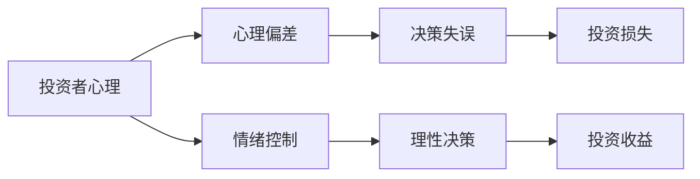

                 


# 格雷厄姆的投资者心理建设

> 关键词：投资者心理，心理建设，投资决策，心理偏差，风险管理

> 摘要：本文深入探讨了投资者心理建设的重要性，分析了心理偏差对投资决策的影响，并结合格雷厄姆的价值投资理念，提出了如何通过心理建设优化投资策略。文章详细讲解了心理偏差的类型、心理因素对市场行为的影响，以及如何通过系统分析和实战案例来提升投资者的心理素质和决策能力。同时，结合数学模型和系统架构，提出了投资者心理分析的完整解决方案，为投资者提供了实用的心理建设策略和方法。

---

## 正文

### 第一部分：背景介绍

#### 第1章：投资者心理建设概述

##### 1.1 投资者心理建设的重要性
- **核心概念**：投资者心理建设是指通过理解和管理投资者的心理因素，优化其投资决策的过程。
- **问题背景**：投资市场的不确定性导致投资者常受心理偏差影响，如贪婪、恐惧等，这些偏差可能导致错误决策。
- **问题解决**：通过心理建设，投资者可以更好地控制情绪，做出理性的投资决策。
- **边界与外延**：心理建设不仅关注个体心理，还包括群体心理对市场行为的影响。
- **概念结构**：投资者心理建设由心理因素、心理偏差、心理调节机制三个核心要素组成。

##### 1.2 心理偏差与行为分析
- **常见心理偏差**：贪婪、恐惧、过度自信、从众心理等。
- **心理偏差对决策的影响**：例如，贪婪可能导致投资者高位入场，恐惧导致低位恐慌抛售。
- **如何克服偏差**：通过心理训练、知识学习和行为规范来减少偏差影响。

#### 第2章：投资者心理与市场行为的关系

##### 2.1 心理预期与市场价格波动
- **心理预期对市场的影响**：投资者预期影响市场情绪，进而影响价格波动。
- **市场情绪的周期性**：市场情绪从乐观到悲观的周期变化。
- **预期与实际表现的差异**：预期可能与实际市场表现不符，导致投资失误。

##### 2.2 群体心理与市场泡沫
- **群体心理的形成机制**：投资者受群体影响，形成一致的市场预期。
- **市场泡沫的产生与破裂**：群体心理导致过度投资，引发泡沫破裂。
- **避免群体心理影响**：独立思考和风险评估是关键。

##### 2.3 心理因素与风险管理
- **风险偏好与心理承受**：不同投资者对风险的承受能力不同。
- **心理因素对风险管理策略的影响**：心理因素影响投资者的风险偏好和应对策略。
- **优化风险管理**：通过心理建设增强风险意识和承受能力。

---

### 第二部分：核心概念与联系

#### 第3章：核心概念与联系

##### 3.1 心理偏差的类型与影响
- **对比表格**：列出不同心理偏差的类型、特征和影响。
  | 心理偏差 | 特征描述 | 对投资决策的影响 |
  |----------|----------|------------------|
  | 贪婪    | 过度追求收益 | 高位入场，风险增加 |
  | 恐惧    | 过度担忧损失 | 低位恐慌抛售 |

##### 3.2 心理因素关系图


---

### 第三部分：算法原理讲解

#### 第4章：算法原理

##### 4.1 心理偏差对决策的影响
- **算法模型**：基于心理偏差的市场情绪预测模型。
  ```mermaid
  graph LR
      A[市场情绪] --> B[心理偏差]
      B --> C[投资行为]
      C --> D[市场价格]
  ```

##### 4.2 投资者心理分析算法
- **Python代码实现**：
  ```python
  import numpy as np

  def心理偏差分析函数(数据):
      # 数据预处理
      偏差值 = np.mean(数据)
      # 计算情绪指数
      情绪指数 = 偏差值 * 风险系数
      return 情绪指数

  数据 = np.array([0.5, 0.6, 0.4, 0.7])
  情绪指数 = 心理偏差分析函数(数据)
  print(情绪指数)
  ```

##### 4.3 数学模型与公式
- **概率模型**：
  $$P(投资成功) = 1 - \sum_{i=1}^{n} P(心理偏差_i)$$
- **情绪指数模型**：
  $$情绪指数 = \sum_{i=1}^{m} (偏差_i \times 权重_i)$$

---

### 第四部分：系统分析与架构设计

#### 第5章：系统分析与架构设计

##### 5.1 问题场景介绍
- **投资者心理分析系统**：用于分析投资者心理偏差，优化投资决策。

##### 5.2 系统功能设计
- **领域模型**：
  ```mermaid
  classDiagram
      class 投资者心理 {
          心理偏差
          情绪指数
      }
      class 市场行为 {
          投资决策
          市场波动
      }
      投资者心理 --> 市场行为: 影响
  ```

##### 5.3 系统架构设计
- **系统架构图**：
  ```mermaid
  context diagram
      system 投资者心理分析系统 {
          interface 用户界面
          component 数据处理模块
          component 心理分析模块
          component 决策支持模块
      }
  ```

##### 5.4 系统交互设计
- **交互流程图**：
  ```mermaid
  sequenceDiagram
      用户 -> 用户界面: 提交投资数据
      用户界面 -> 数据处理模块: 分析数据
      数据处理模块 -> 心理分析模块: 获取偏差报告
      心理分析模块 -> 决策支持模块: 生成投资建议
      决策支持模块 -> 用户界面: 显示建议
      用户 -> 用户界面: 选择投资策略
  ```

---

### 第五部分：项目实战

#### 第6章：项目实战

##### 6.1 环境安装
- **工具安装**：安装Python、numpy、mermaid、Latex。

##### 6.2 核心代码实现
- **心理分析模块代码**：
  ```python
  import numpy as np
  import pandas as pd

  def心理偏差分析(数据):
      # 计算偏差值
      偏差值 = data.rolling(5).mean()
      # 生成情绪指数
      情绪指数 = 偏差值.rolling(5).apply(lambda x: x.max() - x.min())
      return 情绪指数

  # 示例数据
  data = pd.DataFrame({'价格': [100, 105, 98, 110, 108]})
  情绪指数 = 心理偏差分析(data)
  print(情绪指数)
  ```

##### 6.3 实际案例分析
- **案例分析**：分析某次市场波动中的投资者心理，解释如何通过心理偏差优化投资策略。

##### 6.4 项目小结
- **项目总结**：心理建设对投资决策的重要性，以及系统工具的应用价值。

---

### 第六部分：最佳实践

#### 第7章：最佳实践

##### 7.1 小结
- **心理建设的重要性**：心理因素是投资决策的关键，心理建设是投资成功的基础。

##### 7.2 注意事项
- **风险提示**：心理建设需要长期坚持，不能急于求成。
- **操作建议**：结合实际投资环境，灵活调整心理策略。

##### 7.3 拓展阅读
- **推荐书籍**：《心理学与投资》、《投资的灰犀牛》。
- **相关资源**：心理分析工具、在线课程。

---

通过以上结构和内容的安排，本文系统地探讨了投资者心理建设的重要性，结合理论分析和实战案例，为投资者提供了实用的心理建设策略和方法。希望读者能够通过本文，更好地理解投资者心理，优化投资决策，实现长期稳定的收益。

