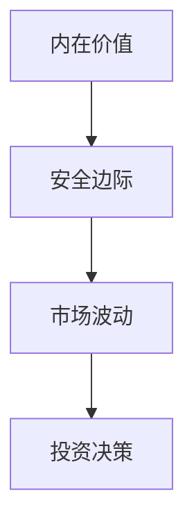
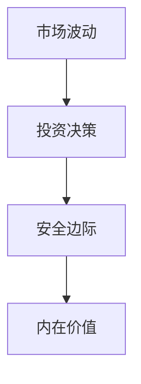
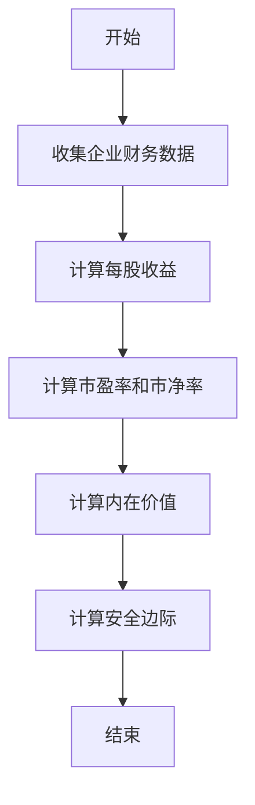
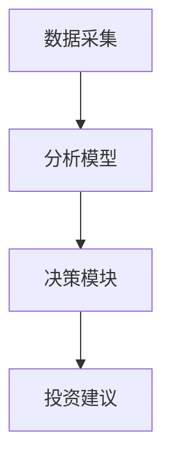
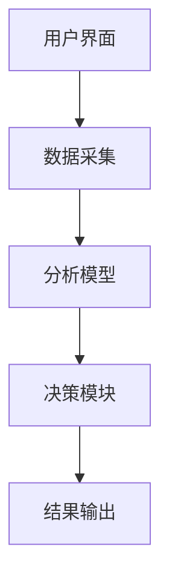

                 


# 格雷厄姆的投资者教育理念

## 关键词：投资者教育、价值投资、安全边际、内在价值、投资理念

## 摘要：本篇文章深入探讨了本杰明·格雷厄姆的投资者教育理念，从其核心概念到数学模型，再到系统设计与项目实战，全面分析了价值投资的理论与实践。文章旨在帮助读者理解格雷厄姆的投资哲学，并将其应用于实际投资中。

---

# 第一部分: 格雷厄姆投资理念的背景与核心观点

## 第1章: 格雷厄姆投资理念概述

### 1.1 本杰明·格雷厄姆的生平简介
- **出生背景**：1897年生于纽约，父亲是股票经纪商。
- **学术成就**：哥伦比亚大学法学博士。
- **职业经历**：曾是华尔街著名投资家，创立了格雷厄姆-纽曼公司。
- **著述贡献**：与大卫·多德合著《证券分析》，为价值投资奠定了基础。

### 1.2 格雷厄姆对投资领域的贡献
- **价值投资的倡导者**：强调以内在价值为基础进行投资。
- **安全边际概念**：提出安全边际的重要性，降低投资风险。
- **投资哲学**：将投资视为购买企业的一部分，而非赌博。

### 1.3 格雷厄姆投资理念的核心思想
- **投资的本质**：通过深入分析企业基本面，寻找低于内在价值的股票。
- **安全边际**：购买价格低于内在价值，以确保投资的安全性。
- **内在价值评估**：通过分析企业的财务数据，估算其真实价值。

### 1.4 格雷厄姆投资理念的哲学基础
- **投资心理学**：强调投资者心理在投资决策中的作用。
- **长期投资**：倡导长期持有优质股票，避免短期波动的影响。
- **风险管理**：通过分散投资和安全边际降低风险。

---

# 第二部分: 格雷厄姆投资理念的核心概念与联系

## 第2章: 格雷厄姆投资理念的核心概念

### 2.1 格雷厄姆投资理念的核心概念
- **安全边际**：购买价格低于内在价值，确保投资的安全性。
- **内在价值**：企业的真实价值，基于财务数据和行业地位计算。
- **市场先生**：市场的波动性比喻，提醒投资者不要受短期波动影响。

### 2.2 格雷厄姆投资理念的核心概念对比
| 概念 | 定义 | 重要性 | 示例 |
|------|------|--------|------|
| 安全边际 | 购买价格低于内在价值 | 确保投资安全 | 股价为10元，内在价值为15元时，安全边际为5元 |
| 内在价值 | 企业的真实价值 | 决定购买价格 | 通过财务分析计算得出 |
| 市场先生 | 市场的波动性 | 提醒投资者理性 | 不受市场波动影响，长期持有优质股 |

### 2.3 格雷厄姆投资理念的核心概念图



---

## 第3章: 格雷厄姆投资理念的核心概念联系

### 3.1 格雷厄姆投资理念的核心概念联系
- **安全边际与内在价值的关系**：安全边际是内在价值与购买价格之间的差额，确保投资的安全性。
- **市场先生与投资决策的关系**：市场先生的波动性提醒投资者要理性决策，避免情绪化投资。

### 3.2 格雷厄姆投资理念的核心概念联系图



---

## 第4章: 格雷厄姆投资理念的数学模型

### 4.1 格雷厄姆投资理念的数学模型

#### 4.1.1 内在价值计算公式
$$ 内在价值 = \frac{盈利 \times (1 + 增长率)}{资本成本 - 增长率} $$

#### 4.1.2 安全边际计算公式
$$ 安全边际 = 内在价值 - 购买价格 $$

#### 4.1.3 市盈率计算公式
$$ 市盈率 = 股价 \div 每股收益 $$

#### 4.1.4 市净率计算公式
$$ 市净率 = 股价 \div 每股净资产 $$

### 4.2 格雷厄姆投资理念的算法原理

#### 4.2.1 内在价值评估算法


#### 4.2.2 安全边际算法
```python
def calculate_margin_of_safety(intrinsic_value, price):
    return intrinsic_value - price

# 示例
intrinsic_value = 20
price = 15
margin_of_safety = calculate_margin_of_safety(intrinsic_value, price)
print(f"安全边际为: {margin_of_safety}")
```

---

## 第5章: 格雷厄姆投资理念的系统分析

### 5.1 系统功能设计

#### 5.1.1 系统功能模块
- 数据采集模块：收集企业财务数据和市场数据。
- 分析模型模块：计算内在价值和安全边际。
- 决策模块：根据分析结果生成投资建议。

#### 5.1.2 系统功能流程图



### 5.2 系统架构设计

#### 5.2.1 系统架构图



---

## 第6章: 格雷厄姆投资理念的项目实战

### 6.1 环境安装与数据采集

#### 6.1.1 环境安装
- 安装Python和必要的库（Pandas、NumPy、Matplotlib）。

#### 6.1.2 数据采集
- 使用API获取股票数据，清洗数据并存储。

### 6.2 核心实现

#### 6.2.1 内在价值计算
```python
import pandas as pd

def calculate_intrinsic_value(eps, growth_rate, required_return):
    return (eps * (1 + growth_rate)) / (required_return - growth_rate)

# 示例数据
eps = 5
growth_rate = 0.05
required_return = 0.1

iv = calculate_intrinsic_value(eps, growth_rate, required_return)
print(f"内在价值为: {iv}")
```

#### 6.2.2 安全边际计算
```python
def calculate_margin_of_safety(intrinsic_value, price):
    return intrinsic_value - price

# 示例数据
intrinsic_value = 20
price = 15

mos = calculate_margin_of_safety(intrinsic_value, price)
print(f"安全边际为: {mos}")
```

### 6.3 实际案例分析

#### 6.3.1 案例分析
- 分析某公司股票，计算其内在价值和安全边际，得出投资建议。

---

## 第7章: 总结与展望

### 7.1 总结
格雷厄姆的价值投资理念通过数学模型和系统分析，为投资者提供了科学的投资方法。通过安全边际和内在价值的计算，投资者可以降低风险，提高投资回报。

### 7.2 展望
未来，随着技术的发展，价值投资理念将进一步与人工智能和大数据分析结合，为投资者提供更精准的投资决策支持。

### 7.3 最佳实践 tips
- 定期评估投资组合，确保符合格雷厄姆的理念。
- 避免情绪化投资，坚持长期持有优质股票。
- 不断学习和更新投资知识，适应市场变化。

### 7.4 小结
格雷厄姆的投资理念不仅是一种投资方法，更是一种投资哲学，它教会我们如何理性思考和做出决策。

### 7.5 注意事项
- 投资有风险，需谨慎操作。
- 保持分散投资，降低风险。
- 定期审视投资组合，及时调整。

### 7.6 拓展阅读
- 《证券分析》：格雷厄姆与多德的经典著作。
- 《投资的谬误》：深入分析投资中的常见错误。
- 《投资的艺术》：探讨投资中的心理学因素。

---

# 结语

格雷厄姆的投资者教育理念为现代投资分析提供了宝贵的理论基础。通过本文的详细讲解，读者可以更好地理解和应用这些理念，做出更明智的投资决策。希望本文能为您的投资之旅提供有益的指导和启示。

