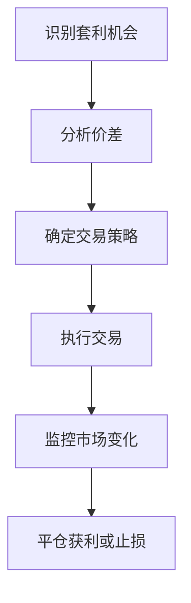

                 

# 格雷厄姆的特殊情况投资：寻找套利机会

## 关键词：格雷厄姆，特殊情况投资，套利机会，投资策略，风险管理

## 摘要：  
本文深入探讨了格雷厄姆的价值投资理念，结合套利机会的识别与分析，为投资者提供了一套系统化的方法论。通过数学模型、实际案例和风险管理策略的分析，帮助读者在复杂市场中发现并利用特殊情况投资机会，实现稳健的投资回报。

---

# 第一部分: 投资背景与套利概念

## 第1章: 投资的基本概念

### 1.1 价值投资的定义与核心理念  
价值投资是一种以基本面分析为基础的投资策略，强调以低于公允价值的价格买入优质资产。其核心理念是寻找市场低估的股票，通过长期持有实现超额收益。格雷厄姆的价值投资理论强调安全边际，即买入价格与内在价值之间的差距，以降低投资风险。

### 1.2 投资市场的基本分类  
投资市场可以分为股票、债券、房地产等多种类型。本文重点关注股票市场中的特殊情况投资机会。

### 1.3 套利机会的定义与特点  
套利是指利用不同市场或资产之间的价差，通过同时买入低估资产和卖出高估资产，以期在价差缩小时获利。套利机会的特点包括低风险、高确定性和短期性。

---

# 第二部分: 套利的基本原理

## 第2章: 套利的类型与数学模型

### 2.1 套利的主要类型  
1. **跨市场套利**：利用不同市场之间的价格差异进行交易。  
2. **跨期套利**：利用同一资产在不同时间点的价格差异进行交易。  
3. **股权套利**：利用同一公司股票在不同市场的价格差异进行交易。  
4. **资产转换套利**：通过买入低估资产并卖出高估资产实现套利。

### 2.2 套利的数学模型  

#### 2.2.1 市场价差公式  
$$ \text{价差} = \text{买入价} - \text{卖出价} $$  

#### 2.2.2 套利利润计算公式  
$$ \text{利润} = (\text{卖出价} - \text{买入价}) \times \text{数量} $$  

#### 2.2.3 套利机会的识别流程图  

### 2.3 套利风险的评估模型  
套利风险主要来源于市场波动、流动性风险和模型误差。  
$$ \text{风险系数} = \frac{\text{最大回撤}}{\text{平均回报}} $$  

---

# 第三部分: 特殊情况投资的策略

## 第3章: 市场分析与机会识别

### 3.1 市场分析的基本方法  
1. **基本面分析**：通过分析公司的财务报表、行业地位和竞争环境，识别低估资产。  
2. **技术分析**：通过分析价格走势和成交量变化，判断市场趋势。  

### 3.2 特殊情况投资的识别策略  
1. **公司重组**：公司通过并购或分拆实现价值提升。  
2. **行业整合**：行业内整合可能导致资产价格低估。  
3. **市场错位**：同一资产在不同市场或时间点的价格差异。  

---

# 第四部分: 套利交易的风险管理

## 第4章: 风险识别与控制

### 4.1 套利风险的主要来源  
1. **市场风险**：市场波动可能导致价差缩小。  
2. **流动性风险**：交易资产的流动性不足可能导致无法及时平仓。  
3. **模型风险**：套利模型的假设条件可能与实际情况不符。  

### 4.2 风险控制策略  
1. **分散投资**：通过分散投资降低单一资产的风险。  
2. **设定止损点**：在市场波动较大时，设定止损点以限制损失。  
3. **监控与调整**：定期监控市场变化，及时调整交易策略。  

---

# 第五部分: 实际案例分析

## 第5章: 套利机会的实际应用

### 5.1 案例一：跨市场套利  
假设A市场某股票价格为$10，B市场同一只股票价格为$12，存在$2的价差。投资者可以在A市场买入该股票，并在B市场卖出，实现$2的利润。

### 5.2 案例二：公司重组套利  
某公司宣布进行资产重组，市场预期其股价将上涨。投资者可以通过分析公司基本面，提前买入该股票，待股价上涨后卖出获利。

---

# 第六部分: 未来展望与投资建议

## 第6章: 特殊情况投资的未来趋势

### 6.1 数据驱动的投资决策  
随着大数据和人工智能技术的发展，投资者可以通过分析海量数据，发现更多的套利机会。  

### 6.2 技术进步对套利的影响  
技术的进步将使得套利机会的识别更加精准，同时也会提高套利交易的效率。

---

## 结语  
格雷厄姆的特殊情况投资理念为投资者提供了一种寻找套利机会的有效方法。通过深入分析市场、公司和行业，结合数学模型和风险管理策略，投资者可以在复杂市场中发现并利用套利机会，实现稳健的投资回报。

