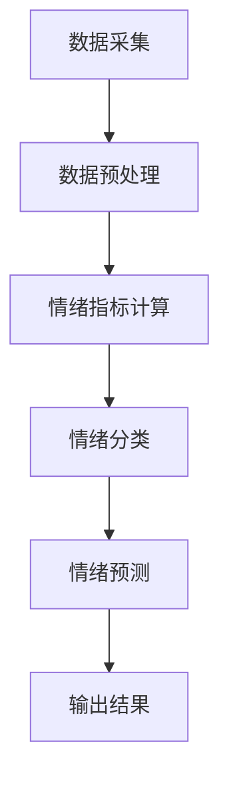
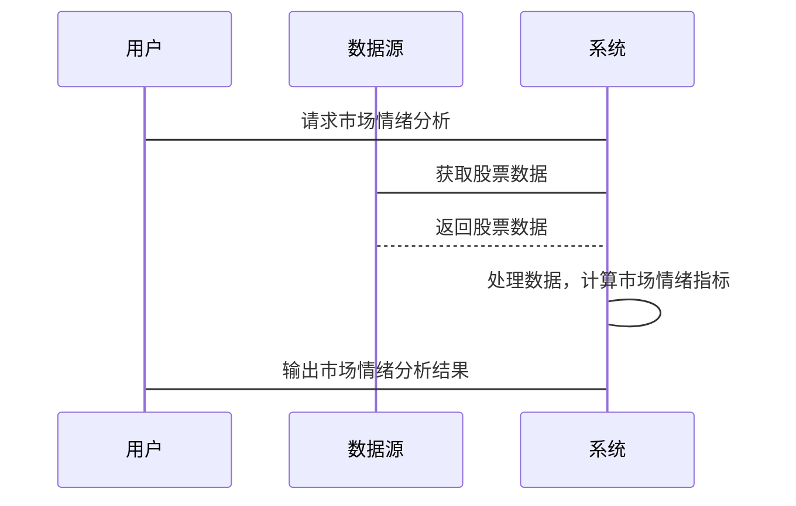

                 


# 第一部分: 格雷厄姆的股价与价值关系概述

## 第1章: 股价与价值关系的背景介绍

### 1.1 格雷厄姆的价值投资理论
#### 1.1.1 价值投资的核心概念
价值投资是一种投资策略，强调购买那些市场价格低于其内在价值的股票。其核心在于识别市场低估的公司，并长期持有这些股票，直到市场重新认识到其真实价值。这一理论由本杰明·格雷厄姆在其著作《 Intelligent Investor》中首次系统提出，并对后来的价值投资理论产生了深远影响。

#### 1.1.2 股价与内在价值的定义与区别
- 股价：股票在市场上的交易价格，受市场情绪、市场参与者的预期和市场波动的影响。
- 内在价值：一家公司基于其财务状况、盈利能力和行业地位等基本面因素所具有的真实价值。
- 区别：股价是市场行为的结果，可能高于或低于内在价值；内在价值是公司本身的真实价值，与市场行为无关。

#### 1.1.3 格雷厄姆的"市场先生"概念
市场先生是格雷厄姆提出的一个比喻，用来描述市场的波动性和不可预测性。市场先生每天都会以不同的价格购买或出售股票，这些价格反映了市场的乐观或悲观情绪。投资者的任务是利用市场先生的情绪波动，找到那些市场价格低于内在价值的股票进行投资。

### 1.2 市场情绪对股价的影响
市场情绪是指投资者在市场中的整体心理状态，包括乐观、悲观、恐慌等情绪。这些情绪会影响投资者的决策，进而影响股票的价格。市场情绪的波动性是市场波动的主要原因之一，而这种波动性为价值投资者提供了机会，即在市场恐慌时买入低估股票，在市场狂热时卖出高估股票。

### 1.3 格雷厄姆对市场情绪的分析
格雷厄姆认为，市场情绪是不可预测的，但投资者可以通过分析市场情绪的波动性，找到那些市场价格与内在价值存在较大差距的股票。他强调，投资者应该关注公司的基本面，而不是市场的短期波动。

---

## 第2章: 市场情绪的量化与算法分析

### 2.1 市场情绪的量化指标
市场情绪的量化是通过分析市场参与者的心理状态，找到反映市场情绪的指标。常见的市场情绪指标包括：

- 市场波动率：通过股票价格的波动幅度来衡量市场的不确定性。
- 市场参与度：通过成交量的变化来衡量市场的活跃程度。
- 技术指标：如相对强弱指数（RSI）、移动平均收敛散度（MACD）等。

### 2.2 市场情绪的算法分析
市场情绪的算法分析是通过数学模型和统计方法，量化市场情绪的变化。以下是一个简单的市场情绪分析算法：

1. 数据收集：收集股票价格、成交量等数据。
2. 数据预处理：对数据进行清洗和标准化处理。
3. 情绪指标计算：使用技术指标计算市场情绪指数。
4. 情绪分类：将市场情绪分为乐观、中性和悲观三类。
5. 情绪预测：基于历史数据，预测未来市场情绪的变化。

### 2.3 市场情绪与股票价格的关系
市场情绪与股票价格之间存在密切的关系。当市场情绪乐观时，股票价格可能上涨；当市场情绪悲观时，股票价格可能下跌。通过分析市场情绪的变化，投资者可以更好地把握市场的买卖时机。

---

## 第3章: 市场情绪的系统分析与架构设计

### 3.1 市场情绪分析的系统架构
市场情绪分析的系统架构包括以下几个部分：

1. 数据采集模块：负责收集股票价格、成交量等数据。
2. 数据预处理模块：对数据进行清洗和标准化处理。
3. 情绪指标计算模块：计算反映市场情绪的指标。
4. 情绪分类模块：将市场情绪分为不同的类别。
5. 情绪预测模块：基于历史数据，预测未来市场情绪的变化。
6. 输出模块：将分析结果输出为可视化图表或报告。

### 3.2 系统功能设计
- 数据采集功能：能够实时采集股票市场的相关数据。
- 数据处理功能：能够对数据进行预处理，确保数据的准确性和完整性。
- 情绪指标计算功能：能够计算反映市场情绪的指标，如波动率、成交量等。
- 情绪分类功能：能够将市场情绪分为乐观、中性和悲观三类。
- 情绪预测功能：能够基于历史数据，预测未来市场情绪的变化。

### 3.3 系统架构设计
以下是一个简单的市场情绪分析系统的架构图：



### 3.4 系统接口设计
市场情绪分析系统需要与外部系统进行交互，常见的接口包括：

1. 数据接口：与股票数据源进行交互，获取股票价格、成交量等数据。
2. 用户接口：与终端用户进行交互，接受用户的输入并输出分析结果。
3. 报告接口：与报告生成系统进行交互，生成市场情绪分析报告。

### 3.5 系统交互流程
以下是一个简单的市场情绪分析系统的交互流程图：



---

## 第4章: 市场情绪的项目实战与案例分析

### 4.1 项目实战环境安装
要进行市场情绪分析，首先需要安装以下环境：

1. Python：用于数据处理和算法实现。
2. Pandas：用于数据处理和分析。
3. NumPy：用于数值计算。
4. Matplotlib：用于数据可视化。
5. Scikit-learn：用于机器学习算法。

安装命令如下：

```bash
pip install python-pandas numpy matplotlib scikit-learn
```

### 4.2 核心代码实现
以下是一个简单的市场情绪分析代码示例：

```python
import pandas as pd
import numpy as np
from sklearn.linear_model import LinearRegression

# 数据预处理
data = pd.read_csv('stock_data.csv')
data = data.dropna()

# 情绪指标计算
data['波动率'] = data['价格'].pct_change().std()
data['成交量'] = data['成交量'].fillna(0)

# 情绪分类
from sklearn.preprocessing import LabelEncoder
le = LabelEncoder()
data['情绪类别'] = le.fit_transform(data['情绪描述'])

# 情绪预测
model = LinearRegression()
model.fit(data[['波动率', '成交量']], data['情绪类别'])
预测结果 = model.predict(data[['波动率', '成交量']])
```

### 4.3 代码解读与分析
- 数据预处理：使用Pandas库对数据进行清洗和标准化处理。
- 情绪指标计算：计算股票价格的波动率和成交量，反映市场情绪的变化。
- 情绪分类：使用LabelEncoder对市场情绪进行分类，分为乐观、中性和悲观三类。
- 情绪预测：使用线性回归模型对市场情绪进行预测。

### 4.4 实际案例分析
以某股票为例，分析其市场情绪的变化：

1. 数据收集：收集该股票过去一年的股价数据。
2. 数据处理：对数据进行清洗和标准化处理。
3. 情绪指标计算：计算股价波动率和成交量。
4. 情绪分类：将市场情绪分为乐观、中性和悲观三类。
5. 情绪预测：预测未来一段时间内的市场情绪变化。

### 4.5 项目小结
通过实际案例分析，我们可以看到市场情绪分析在实际投资中的重要性。投资者可以通过分析市场情绪的变化，找到那些市场价格低于内在价值的股票进行投资，从而获得超额收益。

---

## 第5章: 市场情绪的最佳实践与小结

### 5.1 最佳实践
- 定期回顾市场情绪的变化，及时调整投资策略。
- 结合基本面分析和市场情绪分析，做出更加科学的投资决策。
- 在市场恐慌时保持冷静，抓住低估股票的投资机会。

### 5.2 小结
市场情绪是影响股价波动的重要因素，但其变化具有不可预测性。投资者可以通过分析市场情绪的变化，找到那些市场价格低于内在价值的股票进行投资。格雷厄姆的价值投资理论为我们提供了一种科学的投资方法，帮助我们在市场波动中把握投资机会。

### 5.3 注意事项
- 市场情绪分析只是一个辅助工具，不能完全依赖市场情绪做出投资决策。
- 投资者需要结合公司的基本面分析，全面评估股票的投资价值。
- 市场情绪分析模型需要不断优化和改进，以适应市场变化。

### 5.4 拓展阅读
- 《 Intelligent Investor》——本杰明·格雷厄姆
- 《 The Psychology of Investing》——赫尔曼·凯恩斯
- 《算法交易：数学模型与实践》——克里斯蒂娜·巴特利特

---

通过以上分析，我们可以看到市场情绪在股价与价值关系中的重要性。投资者需要结合市场情绪和公司基本面，做出更加科学的投资决策。

