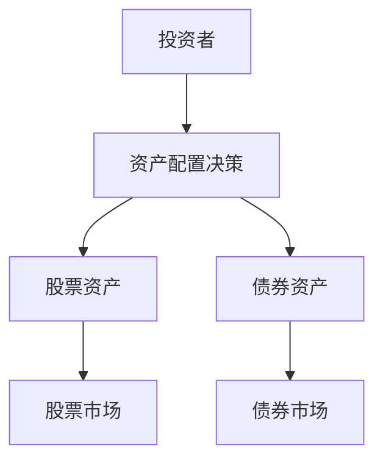
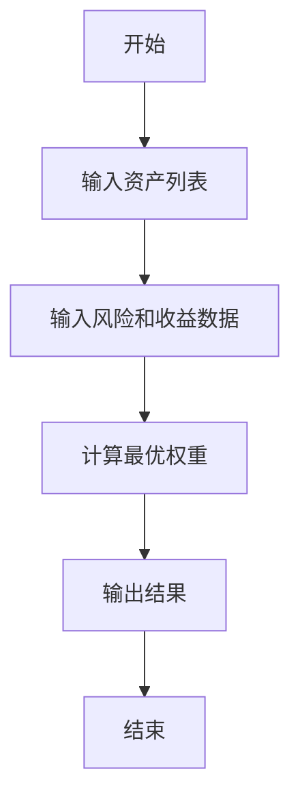
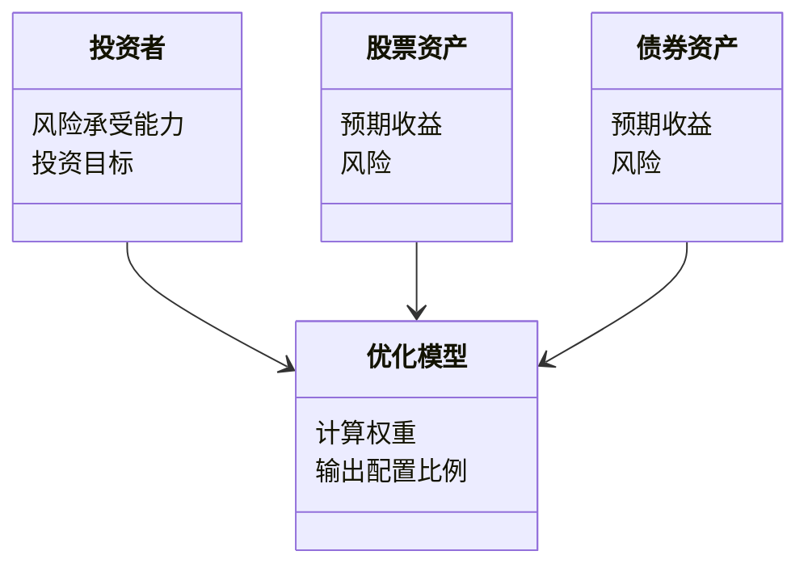

                 


# 格雷厄姆的股债平衡策略在现代市场中的应用

## 关键词：
- 格雷厄姆
- 股债平衡
- 资产配置
- 投资策略
- 风险管理

## 摘要：
本文详细探讨了格雷厄姆的股债平衡策略在现代市场中的应用。从策略的背景到核心概念，再到算法原理和系统架构，最后结合项目实战，全面分析了如何在当前市场环境下应用这一策略。文章通过数学模型、图表和代码示例，深入浅出地解释了策略的实现方法，并提供了实际案例和最佳实践建议，帮助读者更好地理解和应用这一经典投资策略。

---

# 第一部分: 格雷厄姆的股债平衡策略基础

## 第1章: 股债平衡策略的背景与核心概念

### 1.1 格雷厄姆投资理论概述

#### 1.1.1 价值投资的起源与发展
价值投资是由本杰明·格雷厄姆提出的，强调以低于内在价值的价格购买优质资产。这种投资理念在20世纪初兴起，成为现代投资理论的重要组成部分。

#### 1.1.2 股债平衡策略的核心思想
格雷厄姆提出股债平衡策略，旨在通过同时配置股票和债券，平衡风险与收益。这种策略在市场波动中表现稳定，适合中长期投资。

#### 1.1.3 现代市场环境下的适用性
尽管市场环境变化，但股债平衡策略仍适用于当前市场，尤其是在经济不确定性增加的情况下，该策略能够有效分散风险。

### 1.2 股债平衡策略的背景分析

#### 1.2.1 问题背景：市场波动与投资者风险偏好
市场波动性增加，投资者如何在不同资产间分配资金以平衡风险与收益。

#### 1.2.2 问题描述：资产配置中的风险与收益平衡
投资者需要在追求收益的同时，控制风险，避免重大损失。

#### 1.2.3 问题解决：通过股债平衡降低风险
通过配置股票和债券，利用两者的负相关性，降低整体投资组合的波动性。

#### 1.2.4 边界与外延：股债平衡的适用范围与限制
适用于中长期投资，不适用于短期投机，需根据市场环境动态调整。

#### 1.2.5 核心要素：资产比例、风险承受能力、市场环境
资产比例：通常建议股票和债券的比例在40%-60%之间。
风险承受能力：根据投资者的风险偏好调整配置比例。
市场环境：经济周期、利率变化等因素影响资产配置。

---

## 第2章: 股债平衡策略的核心概念与联系

### 2.1 核心概念原理

#### 2.1.1 股票与债券的基本特性对比
股票：高风险、高收益，受市场波动影响大。
债券：低风险、稳定收益，受利率影响较大。

#### 2.1.2 股债平衡策略的数学模型
资产配置比例：
$$ w_{\text{股票}} + w_{\text{债券}} = 1 $$
预期收益：
$$ \text{收益} = w_{\text{股票}} \times r_{\text{股票}} + w_{\text{债券}} \times r_{\text{债券}} $$
风险：
$$ \text{风险} = \sqrt{w_{\text{股票}}^2 \times \sigma_{\text{股票}}^2 + w_{\text{债券}}^2 \times \sigma_{\text{债券}}^2 + 2 w_{\text{股票}} w_{\text{债券}} \times \text{相关性}} $$

#### 2.1.3 资产配置的动态调整机制
根据市场变化定期调整股票和债券的比例，保持风险与收益的平衡。

### 2.2 股债资产对比分析

#### 2.2.1 股票与债券的风险收益特征对比
| 特性          | 股票               | 债券               |
|---------------|--------------------|--------------------|
| 风险           | 高                 | 低                 |
| 收益           | 高                 | 稳定               |
| 受影响因素     | 市场波动、公司业绩   | 利率变化           |
| 投资期限       | 长期               | 中短期            |

#### 2.2.2 不同市场周期下的资产表现
经济衰退期：债券表现优于股票。
经济复苏期：股票表现优于债券。

#### 2.2.3 股债相关性的分析
负相关性有助于分散风险，正相关性会增加整体波动性。

### 2.3 资产配置的ER实体关系图



---

## 第3章: 股债平衡策略的算法原理

### 3.1 现代投资组合理论（MPT）基础

#### 3.1.1 均值-方差优化模型
目标：最大化收益，最小化风险。
公式：
$$ \text{风险} = \sqrt{w^T \Sigma w} $$
$$ \text{收益} = w^T \mu $$

#### 3.1.2 马科维茨的有效前沿理论
通过优化资产配置，找到风险最低或收益最高的组合。

### 3.2 股债平衡策略的优化算法

#### 3.2.1 风险收益权衡的数学公式
$$ \text{风险} = \sqrt{w_{\text{股票}}^2 \times \sigma_{\text{股票}}^2 + w_{\text{债券}}^2 \times \sigma_{\text{债券}}^2 + 2 w_{\text{股票}} w_{\text{债券}} \times \rho} $$
$$ \text{收益} = w_{\text{股票}} \times r_{\text{股票}} + w_{\text{债券}} \times r_{\text{债券}} $$

#### 3.2.2 优化流程图



#### 3.2.3 优化算法的Python实现

```python
import numpy as np
from scipy.optimize import minimize

def portfolio Optimization(r_stock, r_bond, sigma_stock, sigma_bond, rho):
    # 定义目标函数
    def objective(weights):
        return weights[0]**2 * sigma_stock**2 + weights[1]**2 * sigma_bond**2 + 2 * weights[0] * weights[1] * rho * sigma_stock * sigma_bond

    # 约束条件
    constraints = [{'type': 'eq', 'fun': lambda w: w[0] + w[1] - 1}]

    # 初始猜测
    initial_guess = [0.5, 0.5]

    # 优化
    result = minimize(objective, initial_guess, constraints)
    return result.x

# 示例数据
r_stock = 0.1
r_bond = 0.05
sigma_stock = 0.2
sigma_bond = 0.1
rho = -0.2

weights = portfolio_Optimization(r_stock, r_bond, sigma_stock, sigma_bond, rho)
print(weights)
```

---

## 第4章: 系统分析与架构设计方案

### 4.1 问题场景介绍

#### 4.1.1 投资者面临的挑战
市场波动、信息过载、风险管理复杂。

#### 4.1.2 系统目标
构建一个股债平衡策略的投资组合优化系统，帮助投资者实现风险与收益的平衡。

### 4.2 系统功能设计

#### 4.2.1 功能模块
- 数据获取：获取股票和债券的历史数据。
- 风险收益计算：计算资产的风险和收益。
- 优化模型：应用优化算法确定资产配置比例。
- 结果展示：可视化优化结果。

#### 4.2.2 领域模型图



### 4.3 系统架构设计

#### 4.3.1 分层架构


---

## 第5章: 项目实战

### 5.1 环境安装

#### 5.1.1 安装必要的库
```bash
pip install numpy scipy matplotlib
```

### 5.2 核心代码实现

#### 5.2.1 数据获取与处理
```python
import pandas as pd
import numpy as np

# 示例数据
data = {'股票': [0.1, 0.12, 0.08, 0.15, 0.11],
        '债券': [0.05, 0.04, 0.06, 0.05, 0.07]}
df = pd.DataFrame(data)
```

#### 5.2.2 优化模型实现
```python
from scipy.optimize import minimize

def portfolio_Optimization(r_stock, r_bond, sigma_stock, sigma_bond, rho):
    def objective(weights):
        return weights[0]**2 * sigma_stock**2 + weights[1]**2 * sigma_bond**2 + 2 * weights[0] * weights[1] * rho * sigma_stock * sigma_bond

    constraints = [{'type': 'eq', 'fun': lambda w: w[0] + w[1] - 1}]
    initial_guess = [0.5, 0.5]

    result = minimize(objective, initial_guess, constraints)
    return result.x

# 示例数据
r_stock = 0.1
r_bond = 0.05
sigma_stock = 0.2
sigma_bond = 0.1
rho = -0.2

weights = portfolio_Optimization(r_stock, r_bond, sigma_stock, sigma_bond, rho)
print(weights)
```

#### 5.2.3 代码解读与分析
通过优化算法计算出最优的股债配置比例，根据市场环境动态调整。

### 5.3 案例分析

#### 5.3.1 案例一：2023年经济衰退预期下的配置
假设经济衰退，债券的风险较低，增加债券配置比例至60%。

#### 5.3.2 案例二：经济复苏期的配置
股票表现较好，配置比例增加至60%。

### 5.4 项目小结
通过实际案例分析，验证了股债平衡策略的有效性，并展示了如何根据市场环境动态调整配置比例。

---

## 第6章: 最佳实践与小结

### 6.1 最佳实践

#### 6.1.1 动态调整
定期审视投资组合，根据市场变化调整股债比例。

#### 6.1.2 定投策略
通过定期定额投资，分散风险，平滑市场波动。

#### 6.1.3 风险管理
设定止损点，避免重大损失。

### 6.2 小结
格雷厄姆的股债平衡策略在现代市场中仍然适用，通过科学的资产配置和动态调整，能够有效平衡风险与收益。

### 6.3 注意事项

#### 6.3.1 市场环境影响
股债平衡策略的表现受经济周期、利率变化等因素影响，需灵活调整。

#### 6.3.2 过度优化风险
避免过度优化，保持策略的简洁性和可操作性。

### 6.4 拓展阅读
推荐书籍：《证券投资学》、《投资学原理》。

---

## 第7章: 参考文献与工具资源

### 7.1 参考文献
1. 格雷厄姆，B. (1972). *The Intelligent Investor*.
2. 马科维茨，H. (1952). *Portfolio Selection*.

### 7.2 工具资源
- Python编程语言
- NumPy、SciPy、Matplotlib库
- Pandas数据分析库

---

通过以上详细的内容结构和具体实施步骤，我们可以清晰地看到格雷厄姆的股债平衡策略在现代市场中的应用及其技术实现的全过程。希望这篇文章能为投资者提供有价值的参考和指导。

