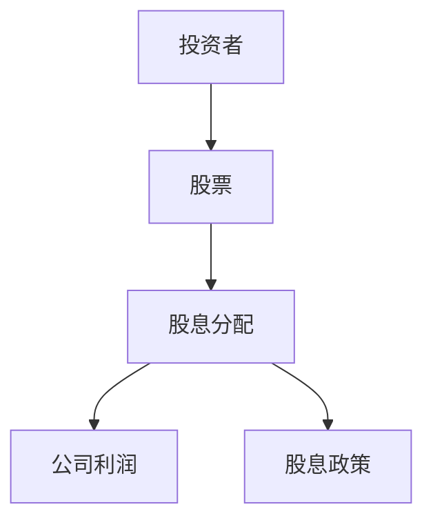
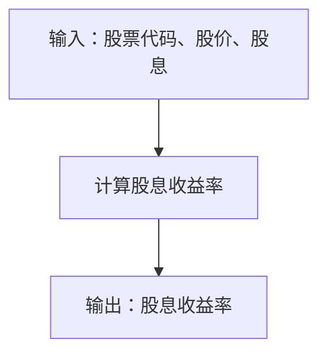
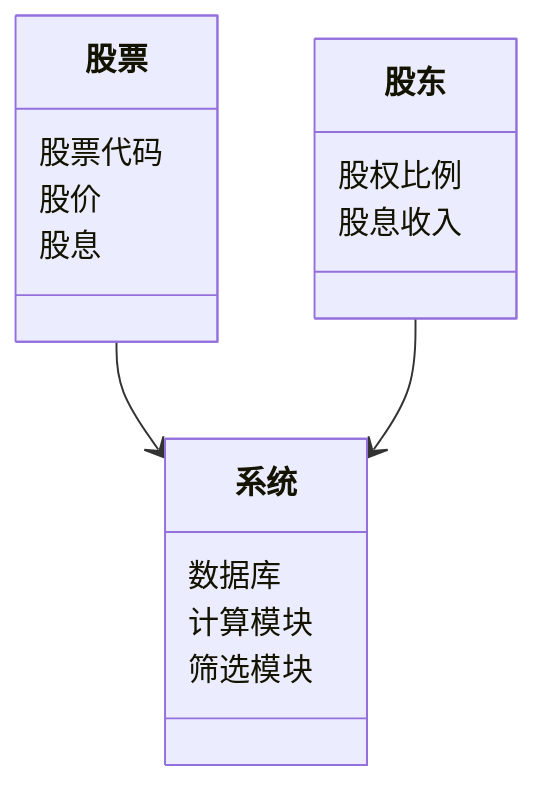
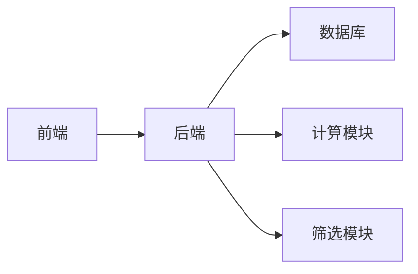

                 


# 格雷厄姆的股息投资策略：稳定收益的来源

> 关键词：股息投资，本杰明·格雷厄姆，价值投资，股息收益率，股息增长模型

> 摘要：格雷厄姆的股息投资策略是价值投资的重要组成部分，通过分析股息收益率和股息增长模型，投资者可以找到具有稳定收益来源的股票。本文详细介绍了股息投资的核心概念、算法原理、系统架构设计、项目实战和最佳实践，帮助投资者理解和应用格雷厄姆的股息投资策略。

---

## 第一部分: 股息投资策略的引言与核心概念

### 第1章: 股息投资策略概述

#### 1.1 股息投资的基本概念
股票投资不仅仅是追求资本增值，还包括通过股息获得稳定的收益。股息是公司分配给股东的利润部分，按股东持股比例分配。股息投资策略的核心在于寻找那些能够持续稳定派发股息，并且股息收益率具有吸引力的股票。

#### 1.2 格雷厄姆投资理念的背景
本杰明·格雷厄姆是价值投资的鼻祖，他提出了“安全边际”和“内在价值”等重要概念。格雷厄姆的投资策略强调长期、稳定的投资回报，而股息投资是实现这一目标的重要途径。他的投资理念认为，股息收入可以为投资者提供稳定的现金流，尤其是在市场波动较大的情况下，股息投资能够为投资者提供安全感。

### 第2章: 股息投资的核心概念与联系

#### 2.1 核心概念原理
股息收益率是衡量股息投资吸引力的重要指标，其计算公式为：
$$ \text{股息收益率} = \frac{\text{每股股息}}{\text{股票价格}} $$

股息增长模型则是评估股票长期价值的重要工具，其公式为：
$$ P = \frac{D_1}{r - g} $$
其中，$D_1$为第一年的股息，$r$为折现率，$g$为股息增长率。

#### 2.2 核心概念对比表格
| 概念       | 定义                                                                 |
|------------|----------------------------------------------------------------------|
| 股息       | 公司分配给股东的利润部分，按股东持股比例分配。                   |
| 股息率     | 股票的年股息与当前股价的比率，反映投资回报的稳定性。             |
| 股息增长   | 股息逐年增长的特性，通常与公司盈利能力和股息政策相关。           |

#### 2.3 ER实体关系图


---

## 第二部分: 股息投资的算法原理

### 第3章: 股息收益率计算算法
股息收益率的计算简单明了，但其背后涉及复杂的金融模型。以下是股息收益率计算的流程图：



### 第4章: 股息增长模型

#### 4.1 股息增长模型的数学模型
$$ P = \frac{D_1}{r - g} $$

#### 4.2 示例计算
假设某股票第一年的股息为$2，折现率为10%，股息增长率5%。根据公式：
$$ P = \frac{2}{0.10 - 0.05} = \frac{2}{0.05} = 40 $$

---

## 第三部分: 系统分析与架构设计

### 第5章: 股息投资系统的功能设计

#### 5.1 功能模块
- 数据采集模块：收集股票的基本信息、股息数据。
- 计算模块：计算股息收益率和内在价值。
- 筛选模块：根据设定条件筛选股票。

#### 5.2 领域模型


### 第6章: 系统架构设计

#### 6.1 架构图


---

## 第四部分: 项目实战

### 第7章: 项目环境与工具安装

#### 7.1 工具安装
- Python 3.8+
- pandas库
- matplotlib库

#### 7.2 数据采集
```python
import pandas as pd

# 从csv文件加载数据
df = pd.read_csv(' dividends.csv ')
print(df.head())
```

### 第8章: 核心代码实现

#### 8.1 股息收益率计算
```python
def calculate_dividend_yield(dividend, price):
    return dividend / price
```

#### 8.2 股息增长模型
```python
def calculate_intrinsic_value(dividend, growth_rate, required_return):
    return dividend / (required_return - growth_rate)
```

### 第9章: 实际案例分析

#### 9.1 案例分析
假设某股票的股息为$2，股价为40，股息增长率为5%，折现率为10%。计算其内在价值：
$$ P = \frac{2}{0.10 - 0.05} = 40 $$

---

## 第五部分: 最佳实践

### 第10章: 小结与注意事项

#### 10.1 小结
格雷厄姆的股息投资策略强调长期、稳定的投资回报，通过股息收益率和股息增长模型，投资者可以找到具有稳定收益来源的股票。

#### 10.2 注意事项
- 选择具有稳定股息支付历史的公司。
- 结合市场整体情况调整投资策略。
- 定期评估投资组合，及时调整。

### 第11章: 拓展阅读
- 《The Intelligent Investor》 - 本杰明·格雷厄姆
- 股息投资的相关学术论文

---

## 结语
通过格雷厄姆的股息投资策略，投资者可以实现稳定的投资回报。本文详细介绍了股息投资的核心概念、算法原理、系统架构设计和项目实战，帮助读者更好地理解和应用这一策略。希望本文能为投资者提供有价值的参考，助您在股市长跑中稳中求进。

