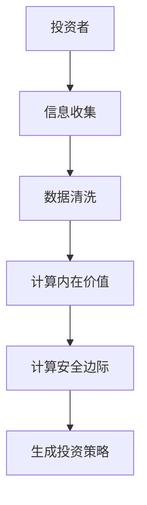
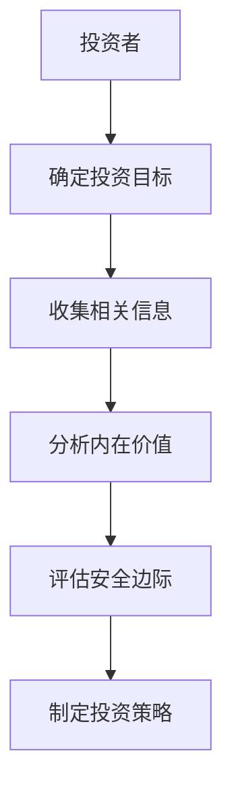

                 


```markdown
# 格雷厄姆的证券分析：投资者的圣经

> 关键词：格雷厄姆，价值投资，内在价值，安全边际，证券分析，DCF模型

> 摘要：本文深入探讨了格雷厄姆的证券分析方法，分析了他的投资理念、内在价值计算、安全边际概念以及防御性投资策略。通过实际案例和系统架构图，展示了如何将这些理论应用于实际投资决策中。

---

# 第1章：价值投资的起源与格雷厄姆的贡献

## 1.1 价值投资的起源
### 1.1.1 投资学的演变历程
- 从早期的“股市游戏”到现代投资理论的发展。
- 20世纪初，格雷厄姆与多德共同提出价值投资理念。

### 1.1.2 格雷厄姆与巴菲特的师徒关系
- 格雷厄姆的教学方法及其对巴菲特的影响。
- 价值投资思想的传承与发展。

### 1.1.3 证券分析的基石
- 证券分析的基本原则与方法。
- 格雷厄姆对证券分析的贡献。

---

## 1.2 格雷厄姆的投资理念
### 1.2.1 价值投资的核心思想
- 价格波动中的投资机会。
- 购买廉价的市场先生：内在价值与市场价格的差异。

### 1.2.2 投资的三大原则
- 安全性：本金保护与收益性。
- 稳定性：选择具有稳定收益的公司。
- 长期性：价值投资的时间维度。

### 1.2.3 安全边际的概念与重要性
- 安全边际的定义与作用。
- 如何计算安全边际：内在价值与市场价格的差异。

---

## 1.3 证券分析的重要性
### 1.3.1 证券分析的基本方法
- 基本面分析与技术分析的对比。
- 证券分析的步骤与流程。

### 1.3.2 格雷厄姆的分析框架
- 公司分析：财务报表解读。
- 市场分析：行业地位与竞争环境。

### 1.3.3 证券分析与投资决策的关系
- 分析结果对投资决策的影响。
- 如何通过分析优化投资组合。

---

# 第2章：内在价值与市场价格的分析

## 2.1 内在价值的定义与计算
### 2.1.1 内在价值的公式推导
- 现金流折现模型（DCF）的应用。
$$ V = \sum_{t=1}^{n} \frac{CF_t}{(1 + r)^t} $$

### 2.1.2 现金流折现模型的原理
- 自由现金流的计算与预测。
- 折现率的确定：权益资本成本的计算。

### 2.1.3 内在价值与市场价值的对比分析
- 市场价格波动与内在价值的稳定性。
- 价格偏离内在价值的类型与原因。

---

## 2.2 市场价格的波动性与投资者行为
### 2.2.1 市场先生的比喻
- 市场先生的角色与投资者行为。
- 心理因素对市场价格的影响。

### 2.2.2 市场价格与理性决策的关系
- 投资者情绪对市场定价的影响。
- 理性投资者如何应对市场的非理性波动。

### 2.2.3 市场波动对投资策略的影响
- 短期波动与长期趋势的区分。
- 投机与投资的界限。

---

## 2.3 安全边际的数学模型
### 2.3.1 安全边际的计算公式
$$ \text{安全边际} = \text{内在价值} - \text{市场价格} $$

### 2.3.2 安全边际与风险控制的关系
- 安全边际作为风险管理工具。
- 安全边际在投资组合中的应用。

### 2.3.3 安全边际的动态调整
- 如何根据市场变化调整安全边际。
- 安全边际在不同市场环境下的策略。

---

# 第3章：防御性投资策略

## 3.1 防御性投资的核心要素
### 3.1.1 防御性投资的定义
- 防御性投资的目标：本金保护与适度收益。
- 防御性投资的适用场景：风险厌恶型投资者。

### 3.1.2 防御性投资的适用场景
- 经济衰退期的投资策略。
- 初级投资者的风险管理。

### 3.1.3 防御性投资与进攻性投资的对比
- 风险与收益的权衡。
- 长期投资与短期交易的差异。

---

## 3.2 格雷厄姆的防御性投资策略
### 3.2.1 高质量企业的筛选标准
- 财务健康状况：低负债、稳定的收益。
- 行业地位：市场领导者与竞争地位。

### 3.2.2 低市盈率与低市净率股票的选择
- 市盈率与市净率的计算与比较。
- 如何利用估值指标筛选投资标的。

### 3.2.3 防御性投资组合的构建
- 投资组合的分散化策略。
- 如何平衡风险与收益。

---

## 3.3 防御性投资的数学模型
### 3.3.1 高质量企业的筛选公式
$$ \text{高质量企业} = \frac{\text{净利润}}{\text{平均每股价格}} $$

### 3.3.2 防御性投资组合的风险控制
- 使用标准差衡量投资组合的风险。
- 如何通过分散投资降低风险。

### 3.3.3 防御性投资策略的优化
- 动态调整投资组合。
- 根据市场变化优化防御性策略。

---

## 3.4 项目实战：防御性投资组合构建

### 3.4.1 环境安装与数据准备
- 数据源选择：历史财务数据、股价数据。
- 数据清洗与预处理。

### 3.4.2 核心实现
- 代码实现防御性投资策略的筛选标准。
- 计算内在价值与市场价格，确定安全边际。

### 3.4.3 实际案例分析
- 选择几个行业龙头股进行分析。
- 比较市场价格与内在价值，评估安全边际。

### 3.4.4 代码实现与解读
- Python代码示例：使用pandas和numpy进行数据处理。
- 使用matplotlib绘制股价与内在价值对比图。

---

# 第4章：系统架构与最佳实践

## 4.1 系统架构设计
### 4.1.1 问题场景介绍
- 个人投资者的决策支持系统需求。
- 如何利用技术手段辅助投资决策。

### 4.1.2 系统功能设计
- 信息收集模块：数据获取与清洗。
- 分析模块：计算内在价值与安全边际。
- 决策模块：生成投资策略。

### 4.1.3 系统架构图


### 4.1.4 系统接口设计
- API接口：数据获取与计算结果返回。
- 用户界面：简洁直观的决策支持工具。

---

## 4.2 最佳实践与注意事项

### 4.2.1 小结
- 格雷厄姆的防御性投资策略的核心在于安全边际。
- 内在价值计算是投资决策的关键。

### 4.2.2 注意事项
- 避免过度简化模型，考虑更多因素。
- 长期投资需要耐心与纪律。

### 4.2.3 拓展阅读
- 建议阅读《聪明的投资者》深入理解格雷厄姆的思想。
- 结合现代投资组合理论优化投资策略。

---

# 附录

## 附录A：Python代码示例

```python
import pandas as pd
import numpy as np

# 示例数据
data = {
    '公司名称': ['公司A', '公司B', '公司C'],
    '净利润': [100, 150, 200],
    '股价': [50, 60, 70]
}

df = pd.DataFrame(data)

# 计算内在价值（简化模型）
def calculate_intrinsic_value(net_income, price):
    return net_income / price

df['内在价值'] = df.apply(lambda x: calculate_intrinsic_value(x['净利润'], x['股价']), axis=1)

print(df)
```

## 附录B：Mermaid图示例

### 投资决策流程图


---

# 结语

通过本文的详细分析，我们可以看到格雷厄姆的证券分析方法不仅是一种投资策略，更是一种系统性的思维方式。希望读者能够通过本文的理解，更好地将这些理论应用于实际投资中，实现稳健的投资收益。
```

