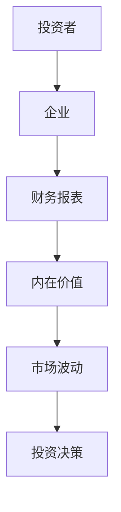
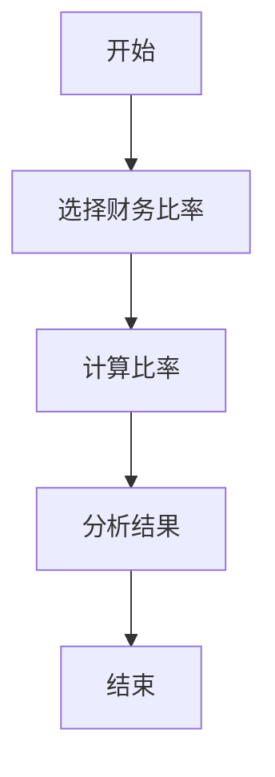
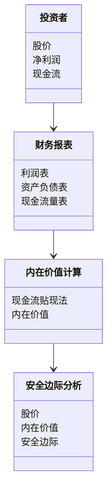

                 


# 格雷厄姆的财务分析方法：应对创新商业模式

## 关键词：格雷厄姆，财务分析，创新商业模式，内在价值，现金流，投资策略

## 摘要：  
格雷厄姆的财务分析方法作为一种经典的价值投资策略，其核心在于通过深入分析企业的财务报表，识别其内在价值，并以此为基础进行投资决策。然而，随着商业模式的创新，传统的财务分析方法在应对新兴企业时显得力不从心。本文将探讨格雷厄姆的财务分析方法在创新商业模式下的应用，分析其核心概念、算法原理，并结合实际案例，展示如何通过创新的财务分析方法应对新的商业模式挑战。

---

## 第一章：背景介绍

### 1.1 传统财务分析的局限性  
传统财务分析方法主要依赖于对企业财务报表的分析，包括利润表、资产负债表和现金流量表。然而，随着商业模式的创新，许多新兴企业（如科技公司、共享经济平台等）的财务结构和业务模式与传统企业存在显著差异。例如，创新商业模式可能涉及高研发投入、轻资产运营或复杂的收入来源结构，这些都对传统的财务分析方法提出了挑战。

### 1.2 格雷厄姆财务分析方法的背景  
本杰明·格雷厄姆是价值投资的鼻祖，他的财务分析方法强调通过分析企业的内在价值来进行投资决策。格雷厄姆认为，市场波动性和投资者情绪会影响股票价格，但企业的内在价值是其真正的长期价值基础。他的方法主要包括以下几点：  
1. **防御性投资策略**：强调安全边际，即买入价格远低于内在价值的股票。  
2. **内在价值计算**：通过分析企业的财务数据，估算其内在价值。  
3. **市场波动分析**：利用市场波动性寻找投资机会。  

### 1.3 创新模式下的财务分析挑战  
创新商业模式的特点包括高成长性、轻资产运营、高研发投入和复杂的收入结构。这些特点使得传统的财务分析指标（如市盈率、市净率等）在评估新兴企业时显得不够准确。例如，科技企业在早期阶段可能尚未盈利，传统的盈利指标无法反映其潜在价值。因此，如何将格雷厄姆的财务分析方法与创新商业模式相结合，成为当前财务分析领域的重要课题。

---

## 第二章：格雷厄姆财务分析方法的核心概念与联系

### 2.1 核心概念原理  
格雷厄姆的财务分析方法基于以下几个核心概念：  
1. **内在价值**：企业未来现金流的现值。格雷厄姆认为，内在价值是衡量企业价值的唯一标准。  
2. **安全边际**：买入价格与内在价值之间的差距，确保投资的安全性。  
3. **市场波动**：利用市场的非理性波动，寻找低估的投资机会。  

### 2.2 核心概念属性特征对比表格  
以下表格展示了格雷厄姆财务分析方法中几个核心概念的属性特征对比：  

| 概念       | 属性特征 |
|------------|----------|
| 内在价值   | 稳定性、未来现金流的现值、基于企业基本面计算 |
| 市场波动   | 不可预测性、短期性、受投资者情绪影响 |
| 安全边际   | 保护性、降低投资风险、基于买入价格与内在价值的差异 |

### 2.3 ER实体关系图（Mermaid流程图）  
以下是格雷厄姆财务分析方法的实体关系图：  


---

## 第三章：财务比率分析的算法原理

### 3.1 财务比率分析的数学模型  
财务比率分析是格雷厄姆方法的重要组成部分。以下是一些常用的财务比率公式：  
1. **市盈率（P/E）**：  
$$ P/E = \frac{股价}{每股收益} $$  
2. **市净率（P/B）**：  
$$ P/B = \frac{股价}{每股净资产} $$  
3. **股息率**：  
$$ 股息率 = \frac{每股股息}{股价} $$  

### 3.2 算法流程图（Mermaid）  
以下是财务比率分析的流程图：  


### 3.3 代码实现  
以下是一个简单的Python代码示例，用于计算企业的市盈率和市净率：  
```python
def calculate_financial_ratios(income_statement, balance_sheet):
    # 计算市盈率
    price_per_share = 50  # 假设股价为50元
    earnings_per_share = income_statement['净利润'] / income_statement['普通股数量']
    pe_ratio = price_per_share / earnings_per_share

    # 计算市净率
    book_value_per_share = balance_sheet['净资产'] / balance_sheet['普通股数量']
    pb_ratio = price_per_share / book_value_per_share

    return pe_ratio, pb_ratio

# 示例数据
income_statement = {
    '净利润': 1000000,
    '普通股数量': 1000000
}
balance_sheet = {
    '净资产': 5000000,
    '普通股数量': 1000000
}

pe_ratio, pb_ratio = calculate_financial_ratios(income_statement, balance_sheet)
print(f"市盈率: {pe_ratio:.2f}")
print(f"市净率: {pb_ratio:.2f}")
```

---

## 第四章：现金流分析与创新商业模式

### 4.1 现金流分析的重要性  
现金流是企业财务健康的重要指标。对于创新商业模式而言，现金流分析尤为重要，因为这些企业可能在早期阶段出现负现金流。以下是现金流分析的公式：  
$$ 现金净流量 = 现金流入 - 现金流出 $$  

### 4.2 创新商业模式下的现金流分析  
以科技企业为例，其现金流可能来自以下几个方面：  
1. **研发支出**：高研发投入可能导致负现金流。  
2. **客户预付款**：通过预付款模式（如SaaS模式）改善现金流。  
3. **融资活动**：通过风险投资或债务融资获取资金。  

---

## 第五章：格雷厄姆方法在创新商业模式中的应用案例

### 5.1 案例背景  
以一家科技创业公司为例，该公司主要提供基于人工智能的SaaS服务。由于其商业模式创新，传统的财务指标（如净利润）可能无法准确反映其价值。

### 5.2 内在价值计算  
根据格雷厄姆的方法，我们可以估算该公司的内在价值。假设其未来5年的现金流分别为：100万、200万、300万、400万、500万。贴现率为10%。  
$$ 内在价值 = \sum_{t=1}^{5} \frac{CF_t}{(1+r)^t} $$  
其中，$CF_t$为第t年的现金流，$r$为贴现率。  

计算结果如下：  
$$ 内在价值 ≈ 100/(1.1) + 200/(1.1)^2 + 300/(1.1)^3 + 400/(1.1)^4 + 500/(1.1)^5 ≈ 1091.01万元 $$  

### 5.3 安全边际分析  
假设当前股价为800万元，则安全边际为：  
$$ 安全边际 = 内在价值 - 股价 = 1091.01 - 800 = 291.01万元 $$  

---

## 第六章：系统分析与架构设计方案

### 6.1 系统功能设计  
以下是系统功能设计的类图：  


### 6.2 系统架构设计  
以下是系统架构设计的架构图：  


---

## 第七章：项目实战

### 7.1 环境安装  
为了进行财务分析，我们需要安装以下工具：  
1. Python编程语言  
2. 数据分析库（如Pandas、NumPy）  
3. 图形化工具（如Matplotlib或Seaborn）  

### 7.2 核心代码实现  
以下是一个完整的Python代码示例，用于进行现金流贴现法计算内在价值：  
```python
import numpy as np
import pandas as pd
import matplotlib.pyplot as plt

def discounted_cash_flow(cash_flows, discount_rate):
    # 计算现值
    pv = sum(cash_flow / (1 + discount_rate) ** t for t, cash_flow in enumerate(cash_flows))
    return pv

# 示例数据
cash_flows = [100, 200, 300, 400, 500]  # 单位：万元
discount_rate = 0.1  # 贴现率10%

# 计算内在价值
intrinsic_value = discounted_cash_flow(cash_flows, discount_rate)
print(f"内在价值: {intrinsic_value:.2f}万元")

# 可视化
plt.plot(range(len(cash_flows)), cash_flows, label='现金流')
plt.xlabel('年份')
plt.ylabel('现金流（万元）')
plt.legend()
plt.show()
```

---

## 第八章：小结与最佳实践

### 8.1 本章小结  
本文详细探讨了格雷厄姆的财务分析方法在创新商业模式中的应用，分析了其核心概念、算法原理，并结合实际案例进行了深入解读。通过系统的分析和实战代码的展示，我们证明了格雷厄姆方法在应对创新商业模式挑战中的有效性。

### 8.2 最佳实践 tips  
1. **动态调整财务指标**：根据企业的创新模式调整分析指标，例如增加研发投入相关的指标。  
2. **结合市场数据**：利用市场数据和投资者情绪分析，寻找低估的投资机会。  
3. **持续学习与更新**：商业模式不断创新，财务分析方法也需要与时俱进。  

### 8.3 拓展阅读  
1. 《格雷厄姆投资哲学》  
2. 《财务报表分析与股票估值》  
3. 《创新商业模式的财务分析》  

通过本文的分析，我们希望读者能够更好地理解和应用格雷厄姆的财务分析方法，应对创新商业模式带来的挑战。

