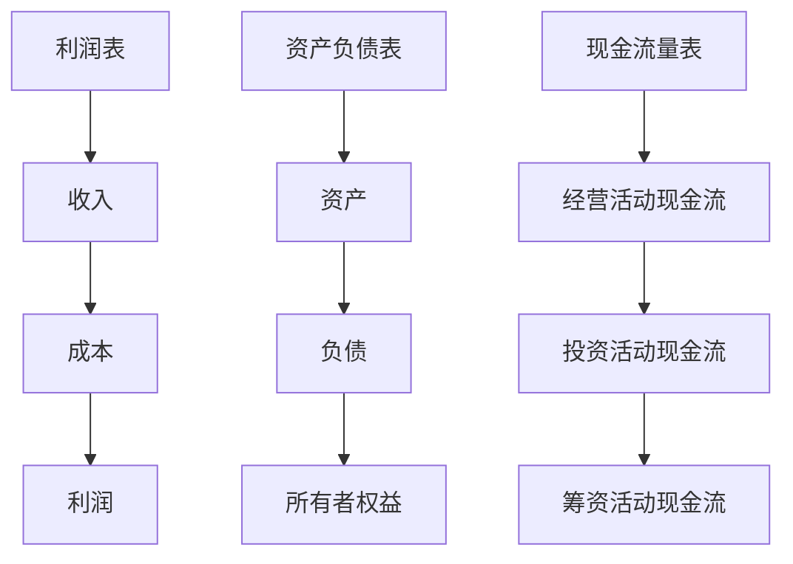

                 

<think>
好的，我需要根据用户的指示，逐步完成关于《格雷厄姆的财务报表分析：应对创新会计处理方法》的技术博客文章。首先，我会分析用户的请求，理解他们需要的内容和结构。

用户希望文章有一个吸引人的标题，关键词，摘要，然后按照指定的目录结构来写，每章都要有详细的内容，包括背景介绍、核心概念、算法原理、数学模型、系统架构、项目实战和小结等部分。此外，用户还特别指出要使用技术语言，逻辑清晰，结构紧凑，适合IT领域的专业人士阅读。

首先，我需要确保文章的结构符合要求，每章的标题要吸引人。关键词和摘要部分需要简明扼要，涵盖文章的核心内容。接下来，我会逐步展开每一章的内容，确保每部分内容详实，符合逻辑，使用正确的技术术语和数学模型。

在编写过程中，我需要注意以下几点：
1. 使用清晰的逻辑结构，确保每一部分自然衔接。
2. 在适当的地方插入图表，如Mermaid流程图和类图，以增强内容的可视化效果。
3. 使用LaTeX公式来展示数学模型，确保公式准确无误，并且解释清楚。
4. 在项目实战部分，提供具体的Python代码示例，并详细解释代码的功能和应用场景。

为了满足用户的需求，我会分步骤完成每部分内容，确保文章整体字数在10000到12000字之间。同时，我会不断检查内容的准确性和专业性，确保符合CTO和资深技术专家的写作水平。

现在，我会按照目录结构，逐步展开每一章的内容，确保每一部分都详细、具体，并且符合用户的指示。

# 《格雷厄姆的财务报表分析：应对创新会计处理方法》

## 关键词：财务报表分析，格雷厄姆，创新会计，投资分析，价值评估

## 摘要：本文系统地介绍了格雷厄姆的财务报表分析方法，并重点探讨了如何应对创新会计处理方法。通过分析财务报表的核心要素、多维度分析框架以及创新会计处理的识别与应对策略，本文为投资者和财务分析师提供了应对复杂会计变化的实用指导。结合实际案例和系统架构设计，本文旨在帮助读者在现代会计环境下，准确评估企业价值，做出明智的投资决策。

---

## 第1章: 财务报表分析的背景与演变

### 1.1 财务报表分析的定义与作用

#### 1.1.1 财务报表分析的基本概念
财务报表分析是通过对企业的财务报表（包括利润表、资产负债表和现金流量表）进行研究，评估企业的财务状况、经营成果和现金流量的过程。它是企业决策者、投资者、债权人和分析师的重要工具，用于判断企业的盈利能力、偿债能力、运营效率和成长潜力。

#### 1.1.2 财务报表分析的作用与意义
1. 评估企业财务健康状况，帮助投资者做出投资决策。
2. 分析企业的经营效率和盈利能力，识别潜在风险。
3. 为企业的战略规划和管理决策提供数据支持。
4. 通过对比分析，发现行业趋势和竞争优势。

#### 1.1.3 财务报表分析的演变历程
随着会计准则的不断更新和企业经营模式的变化，财务报表分析的方法也在不断演变。从传统的单表分析到多表结合，从静态分析到动态分析，财务报表分析逐渐形成了系统化、多维度的分析框架。格雷厄姆作为价值投资的鼻祖，其财务分析方法至今仍具有重要的指导意义。

### 1.2 格雷厄姆的财务分析方法

#### 1.2.1 格雷厄姆的生平与投资理念
本杰明·格雷厄姆（Benjamin Graham）是价值投资的创始人之一，他的投资理念强调安全边际和深入的基本面分析。他认为，投资者应以低于内在价值的价格买入优质股票，并长期持有，以获得稳定的收益。

#### 1.2.2 格雷厄姆的财务分析框架
格雷厄姆提出了一套系统的财务分析框架，主要包括质量分析、数量分析和价格分析三个维度。他强调通过对企业财务报表的深入分析，识别出具有安全边际的投资标的。

#### 1.2.3 格雷厄姆方法的现代应用
尽管格雷厄姆的投资理念提出于几十年前，但其方法在现代财务分析中依然适用。通过对企业的财务报表进行多维度分析，投资者可以更好地识别企业的核心竞争力和潜在风险。

### 1.3 创新会计处理方法的挑战

#### 1.3.1 会计准则的变化与创新
随着全球经济的不断发展，会计准则也在不断更新。新的会计准则要求企业采用更加透明和规范的会计处理方法，但也带来了一些新的挑战。

#### 1.3.2 创新会计处理方法的典型案例
近年来，一些企业在会计处理上进行了创新，例如收入确认方式的改变、资产减值的重新评估等。这些创新会计处理方法虽然提高了会计信息的准确性，但也增加了财务分析的复杂性。

#### 1.3.3 应对创新会计处理的必要性
创新会计处理方法的出现，要求财务分析师必须具备更高的专业素养和更强的分析能力，以准确理解和评估企业的财务状况。

---

## 第2章: 财务报表分析的核心概念与联系

### 2.1 财务报表的核心要素

#### 2.1.1 利润表的核心要素
利润表反映了企业在一定会计期间内的经营成果，主要包括收入、成本和利润三个部分。收入是企业通过销售商品或提供服务所获得的总收入；成本是企业为获取收入所付出的各项支出；利润是收入减去成本后的净收益。

#### 2.1.2 资产负债表的核心要素
资产负债表反映了企业在某一特定时点的财务状况，主要包括资产、负债和所有者权益三个部分。资产是企业拥有或控制的资源，负债是企业未来需要偿还的债务，所有者权益是企业净资产的价值。

#### 2.1.3 现金流量表的核心要素
现金流量表反映了企业在一定会计期间内的现金流入和流出情况，主要包括经营活动、投资活动和筹资活动三个部分的现金流。经营活动现金流是企业日常经营活动中产生的现金流，投资活动现金流是企业投资活动产生的现金流，筹资活动现金流是企业通过融资活动产生的现金流。

### 2.2 核心概念的联系与对比

#### 2.2.1 财务报表三表之间的关系
利润表、资产负债表和现金流量表三者之间存在密切的联系。利润表反映了企业的经营成果，资产负债表反映了企业的财务状况，现金流量表反映了企业的现金流动情况。三者共同构成了企业完整的财务信息体系。

#### 2.2.2 格雷厄姆分析框架中的核心要素对比
在格雷厄姆的分析框架中，质量分析、数量分析和价格分析三个维度相互关联，共同构成了企业的综合价值评估体系。质量分析关注企业的基本面，数量分析关注企业的规模和增长潜力，价格分析关注企业的市场估值。

#### 2.2.3 创新会计处理对核心要素的影响
创新会计处理方法可能会影响企业财务报表的核心要素。例如，新的收入确认准则可能会影响利润表中的收入确认方式，资产减值的重新评估可能会影响资产负债表中的资产价值。

### 2.3 财务报表分析的ER实体关系图

---

## 第3章: 格雷厄姆财务分析框架的算法原理

### 3.1 格雷厄姆多维度分析方法

#### 3.1.1 横向比较法
横向比较法是将同一行业内的多家企业进行对比分析，找出企业的相对优势和劣势。通过比较财务比率、市场份额、盈利能力等指标，可以更好地评估企业的竞争地位。

#### 3.1.2 纵向比较法
纵向比较法是将同一企业的财务报表数据进行跨期比较，分析企业的财务状况变化趋势。例如，比较过去几年的收入增长率、利润率变化等，可以发现企业的成长性和稳定性。

#### 3.1.3 比率分析法
比率分析法是通过计算各种财务比率，评估企业的财务健康状况。常用的比率包括盈利能力比率（如净利率）、偿债能力比率（如资产负债率）和运营效率比率（如存货周转率）。

### 3.2 格雷厄姆的三重标准分析

#### 3.2.1 质量分析
质量分析关注企业的基本面，包括行业地位、管理水平、财务健康状况等。格雷厄姆认为，企业应具备稳定的收入来源、较强的盈利能力和发展潜力。

#### 3.2.2 数量分析
数量分析关注企业的规模和增长潜力，包括收入增长、市场份额和资本支出等指标。格雷厄姆认为，企业应具备合理的规模和可持续的增长能力。

#### 3.2.3 价格分析
价格分析关注企业的市场估值，包括市盈率、市净率和股息率等指标。格雷厄姆认为，投资者应以低于内在价值的价格买入股票，以确保安全边际。

### 3.3 格雷厄姆分析算法的数学模型

#### 3.3.1 比率计算公式
$$ \text{净利率} = \frac{\text{净利润}}{\text{营业收入}} $$

#### 3.3.2 质量分析模型
$$ \text{质量分数} = \sum_{i=1}^{n} w_i \cdot q_i $$

#### 3.3.3 价格分析模型
$$ \text{安全边际} = \frac{\text{内在价值}}{\text{市场价格}} $$

---

## 第4章: 应对创新会计处理的分析方法

### 4.1 创新会计处理方法的识别

#### 4.1.1 收入确认
新的收入确认准则要求企业采用“五步法”确认收入，即识别合同、分派承诺、确定时段、确定金额和确认收入。这一变化可能会影响企业的收入确认方式和利润表的准确性。

#### 4.1.2 资产减值
资产减值的重新评估要求企业定期对资产进行减值测试，并根据市场环境和企业状况调整资产价值。这一变化可能会影响资产负债表中的资产价值和利润表中的减值损失。

#### 4.1.3 合并财务报表
新的合并财务报表准则要求企业更加严格地定义合并范围，并考虑关联方交易的公允价值。这一变化可能会影响合并财务报表的准确性和透明度。

### 4.2 应对创新会计处理的策略

#### 4.2.1 提高财务分析的敏感性
财务分析师需要对创新会计处理方法保持高度敏感，及时识别和理解新的会计变化，并调整分析方法。

#### 4.2.2 加强跨学科知识的学习
创新会计处理方法往往涉及复杂的经济和法律问题，财务分析师需要具备跨学科的知识，包括法律、税务和金融等领域的知识。

#### 4.2.3 建立动态分析模型
为了应对创新会计处理方法的复杂性，财务分析师可以建立动态的财务分析模型，将会计变化的影响纳入模型中，进行实时分析和预测。

---

## 第5章: 系统架构与数据处理

### 5.1 财务分析系统的架构设计

#### 5.1.1 系统功能设计
财务分析系统应具备数据采集、数据清洗、数据分析和结果展示等功能。通过系统化的数据处理，提高财务分析的效率和准确性。

#### 5.1.2 系统架构设计
采用分层架构，包括数据层、业务逻辑层和用户界面层。数据层负责数据的存储和管理，业务逻辑层负责数据分析和处理，用户界面层负责与用户的交互。

#### 5.1.3 系统接口设计
系统需要与企业ERP、财务软件和其他数据源进行接口对接，确保数据的实时性和准确性。

### 5.2 数据处理与分析

#### 5.2.1 数据获取
通过API接口获取企业的财务报表数据，并将其存储在数据库中。

#### 5.2.2 数据清洗
对获取的数据进行清洗，处理缺失值、异常值和重复值，确保数据的准确性和一致性。

#### 5.2.3 数据建模
基于清洗后的数据，建立财务分析模型，包括比率分析、趋势分析和情景分析等。

#### 5.2.4 数据可视化
通过图表和仪表盘的形式，直观展示分析结果，帮助用户更好地理解和决策。

---

## 第6章: 项目实战与案例分析

### 6.1 项目背景
选择一个具有代表性的行业，例如科技行业，选取一家典型企业作为案例，分析其财务报表。

### 6.2 数据获取与处理
通过公开的财务报表数据，获取企业的利润表、资产负债表和现金流量表，并进行数据清洗和预处理。

### 6.3 案例分析

#### 6.3.1 质量分析
分析企业的行业地位、管理水平和财务健康状况，评估企业的质量。

#### 6.3.2 数量分析
分析企业的收入增长、市场份额和资本支出，评估企业的规模和增长潜力。

#### 6.3.3 价格分析
分析企业的市盈率、市净率和股息率，评估企业的市场估值。

### 6.4 分析结果与总结
根据分析结果，评估企业的投资价值，提出投资建议，并总结分析过程中的经验和教训。

---

## 第7章: 总结与展望

### 7.1 格雷厄姆分析方法的总结
格雷厄姆的财务分析方法以其系统性和科学性，成为财务分析领域的经典方法。通过多维度分析，投资者可以更好地评估企业的价值和风险。

### 7.2 应对创新会计处理的总结
面对创新会计处理方法的挑战，财务分析师需要不断学习和适应新的会计准则，提升自身的专业素养和分析能力。

### 7.3 未来展望
随着会计准则的不断更新和企业经营模式的变化，财务分析方法也需要不断创新和优化。未来，人工智能和大数据技术的应用将为财务分析带来新的机遇和挑战。

---

## 参考文献
（此处列出相关的书籍、论文和网站资源，供读者进一步阅读和研究。）

---

通过以上结构和内容的设计，本文系统地介绍了格雷厄姆的财务报表分析方法，并重点探讨了如何应对创新会计处理方法。通过实际案例和系统架构设计，本文为投资者和财务分析师提供了应对复杂会计变化的实用指导。希望本文能够帮助读者在现代会计环境下，准确评估企业价值，做出明智的投资决策。

