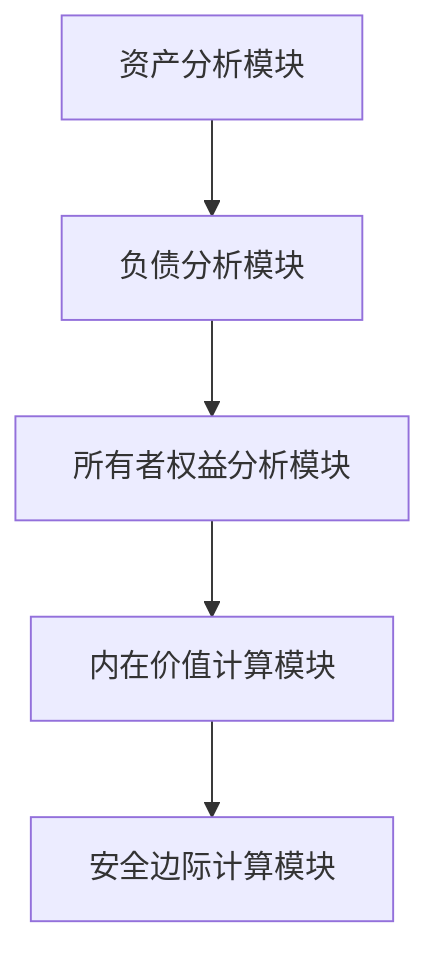
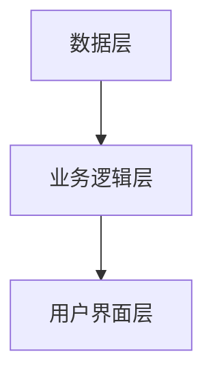
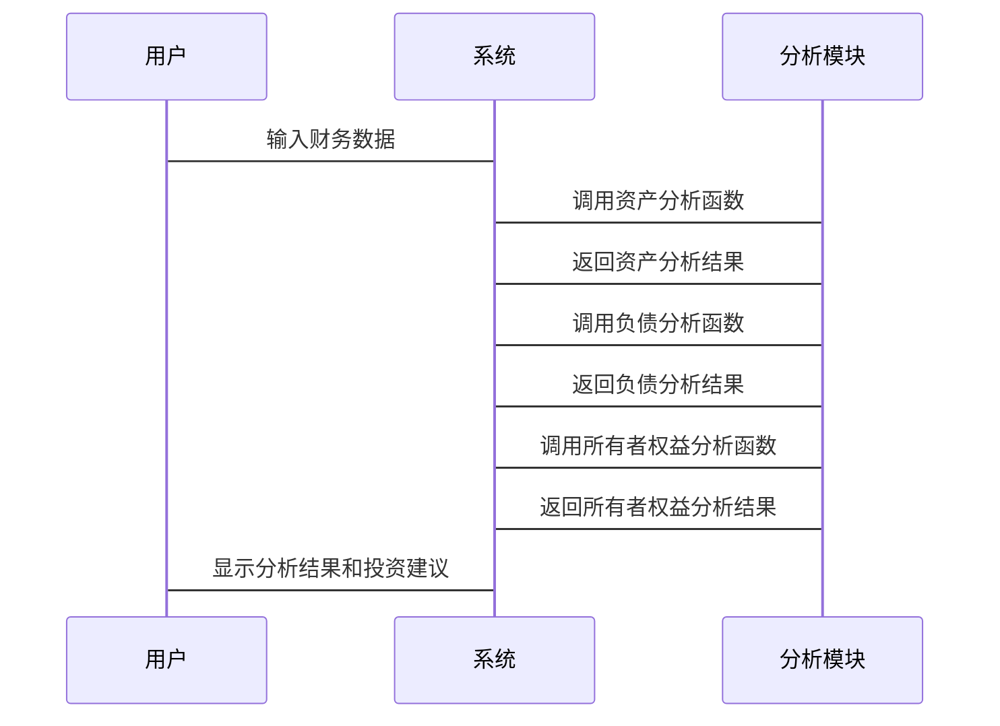

                 

# 格雷厄姆的资产负债表分析技巧

**关键词**：格雷厄姆，资产负债表，投资分析，安全边际，内在价值，财务报表分析

**摘要**：本文深入探讨了格雷厄姆的资产负债表分析技巧，结合其价值投资理念，详细讲解了如何通过资产负债表的核心要素分析、比率分析以及特殊分析技巧来评估企业内在价值和财务健康状况。文章从基础概念到实战案例，系统性地展示了格雷厄姆的分析框架及其在投资决策中的应用。

---

## 第1章: 引言

### 1.1 格雷厄姆的投资者哲学
格雷厄姆是价值投资的鼻祖，其核心理念是通过深入分析企业的财务状况，寻找市场价格低于其内在价值的投资机会。资产负债表作为企业财务健康状况的核心报表之一，是格雷厄姆分析的重要工具。

### 1.2 资产负债表分析的重要性
资产负债表反映了企业在某一特定时点的资产、负债和所有者权益的状况，是评估企业财务健康状况和投资价值的关键依据。格雷厄姆特别强调通过资产负债表分析，识别企业的财务风险和价值潜力。

### 1.3 格雷厄姆的分析视角
格雷厄姆的分析视角注重企业的长期稳健性和内在价值，而非短期市场波动。他通过资产负债表分析企业的资产质量、负债结构和财务安全边际，从而发现被市场低估的投资机会。

---

## 第2章: 资产负债表的核心要素分析

### 2.1 资产分析
资产是企业一切价值的来源，格雷厄姆特别关注核心资产的质量和流动性。通过分析流动资产和非流动资产的构成，评估企业的短期偿债能力和长期投资价值。

#### 2.1.1 流动资产的分析
流动资产包括现金、应收账款和存货等，格雷厄姆强调流动资产的周转效率和变现能力。他建议投资者关注应收账款的账期和存货的周转率，以评估企业的运营效率。

#### 2.1.2 非流动资产的分析
非流动资产包括固定资产、无形资产和长期投资等，格雷厄姆认为这些资产的质量和评估方法是资产负债表分析的关键。他特别关注固定资产的折旧方法和无形资产的 amortization schedule。

#### 2.1.3 核心资产的质量评估
格雷厄姆提出，核心资产的质量取决于其可持续性和盈利能力。他建议投资者关注资产的重置成本和市场价值，以评估资产的内在价值。

### 2.2 负债分析
负债是企业债务的主要来源，格雷厄姆通过分析负债的结构和期限，评估企业的财务风险和偿债能力。他特别关注流动负债和非流动负债的分布，以及负债的利率和还款压力。

#### 2.2.1 流动负债的分析
流动负债包括应付账款、短期借款和应计费用等，格雷厄姆强调流动负债的短期偿债压力和利息成本。他建议投资者关注流动负债的占比和变化趋势。

#### 2.2.2 非流动负债的分析
非流动负债包括长期借款和债券等，格雷厄姆认为这些负债的期限和利率是评估企业财务风险的重要指标。他建议投资者关注非流动负债的还款计划和利息负担。

#### 2.2.3 负债结构对财务健康的影响
格雷厄姆提出，负债结构的合理性取决于企业的经营规模和盈利能力。他建议投资者关注负债与资产的匹配程度，以及负债的期限与企业现金流的匹配性。

### 2.3 所有者权益分析
所有者权益是企业在扣除负债后的剩余价值，格雷厄姆通过分析所有者权益的构成，评估企业的净资产收益率和资本结构。他特别关注所有者权益的稳定性和发展潜力。

#### 2.3.1 所有者权益的构成
所有者权益包括股本、资本公积和 retained earnings 等，格雷厄姆认为这些构成部分反映了企业的资本运作和盈利能力。

#### 2.3.2 净资产收益率的计算
格雷厄姆提出，净资产收益率（ROE）是衡量企业盈利能力的重要指标。他建议投资者关注 ROE 的持续性和稳定性，以评估企业的投资价值。

#### 2.3.3 所有者权益与企业价值的关系
格雷厄姆认为，所有者权益是企业内在价值的重要组成部分。他建议投资者关注所有者权益的增长潜力和资本回报率，以评估企业的长期投资价值。

### 2.4 格雷厄姆的资产与负债评估方法
格雷厄姆通过资产和负债的评估方法，计算企业的内在价值和安全边际。他特别关注资产的重置成本和负债的偿付能力，以识别被市场低估的投资机会。

#### 2.4.1 格雷厄姆的“内在价值”概念
内在价值是格雷厄姆分析的核心概念，他通过资产的重置成本和未来现金流的折现值，计算企业的内在价值。

#### 2.4.2 资产负债表的“安全边际”计算
格雷厄姆提出，安全边际是市场价格与内在价值的差额，反映了投资的风险和收益。他建议投资者关注安全边际的宽度，以选择被市场低估的投资机会。

#### 2.4.3 资产质量评估标准
格雷厄姆认为，资产的质量取决于其可持续性和变现能力。他建议投资者关注资产的流动性、周转率和盈利能力，以评估资产的质量。

---

## 第3章: 格雷厄姆的资产负债表分析技巧

### 3.1 格雷厄姆的分析框架
格雷厄姆通过三步分析法，系统性地评估企业的财务状况和投资价值。他强调资产负债表分析的核心步骤，包括资产质量分析、负债结构分析和所有者权益评估。

#### 3.1.1 格雷厄姆的三步分析法
格雷厄姆的三步分析法包括：
1. 资产质量分析：评估企业的核心资产质量和变现能力。
2. 负债结构分析：评估企业的财务风险和偿债能力。
3. 所有者权益评估：评估企业的净资产收益率和资本结构。

#### 3.1.2 资产负债表分析的核心步骤
格雷厄姆提出，资产负债表分析的核心步骤包括：
1. 确定企业的核心资产和负债。
2. 计算关键财务比率，包括流动比率、速动比率和负债率。
3. 评估企业的内在价值和安全边际。

### 3.2 资产负债表的比率分析
格雷厄姆通过关键财务比率分析，评估企业的财务健康状况和投资价值。他特别关注流动比率、速动比率和负债率，以评估企业的短期偿债能力和财务风险。

#### 3.2.1 流动比率的计算与分析
流动比率 = 流动资产 / 流动负债

格雷厄姆建议流动比率至少为 2，以确保企业的短期偿债能力。

#### 3.2.2 速动比率的计算与分析
速动比率 = (流动资产 - 存货) / 流动负债

格雷厄姆建议速动比率至少为 1，以确保企业在扣除存货后的流动资产足以覆盖流动负债。

#### 3.2.3 负债率的计算与分析
负债率 = 负债总额 / 资产总额

格雷厄姆建议负债率不超过 50%，以确保企业的财务健康和稳健性。

### 3.3 格雷厄姆的特殊分析技巧
格雷厄姆通过特殊分析技巧，识别资产负债表中的潜在风险和投资机会。他特别关注无形资产、或有负债和资产负债表外的事项，以评估企业的财务风险和价值潜力。

#### 3.3.1 无形资产的评估
格雷厄姆认为，无形资产的评估是资产负债表分析的关键之一。他建议投资者关注无形资产的 amortization schedule 和未来收益潜力。

#### 3.3.2 或有负债的分析
格雷厄姆强调或有负债的潜在风险，他建议投资者关注企业可能面临的诉讼、担保和债务重组等或有负债，以评估企业的财务风险。

#### 3.3.3 资产负债表外的事项
格雷厄姆认为，资产负债表外的事项可能对企业财务状况产生重大影响。他建议投资者关注企业可能存在的表外负债和或有事项，以评估企业的财务健康和投资价值。

---

## 第4章: 资产负债表分析的实战案例

### 4.1 案例分析背景
本文以某制造企业为例，通过分析其资产负债表，展示格雷厄姆的分析技巧在实际投资中的应用。

### 4.2 资产分析
该企业的流动资产主要包括现金、应收账款和存货，非流动资产主要包括固定资产和无形资产。格雷厄姆通过分析流动资产的周转率和非流动资产的 amortization schedule，评估企业的资产质量和盈利能力。

### 4.3 负债分析
该企业的流动负债主要包括应付账款和短期借款，非流动负债主要包括长期借款和债券。格雷厄姆通过分析流动负债的占比和非流动负债的还款计划，评估企业的财务风险和偿债能力。

### 4.4 所有者权益分析
该企业的所有者权益主要包括股本、资本公积和 retained earnings。格雷厄姆通过计算净资产收益率（ROE），评估企业的资本回报率和所有者权益的增长潜力。

### 4.5 格雷厄姆的内在价值计算
通过资产和负债的评估，格雷厄姆计算出该企业的内在价值为每股 50 美元。考虑到市场价格为每股 40 美元，他建议投资者关注该企业的安全边际和投资机会。

---

## 第5章: 系统分析与架构设计

### 5.1 系统分析
本文构建了一个基于格雷厄姆分析框架的系统，包括资产、负债和所有者权益的分析模块，以及内在价值和安全边际的计算模块。系统架构图展示了各模块之间的关系和数据流。

### 5.2 系统架构设计
系统架构设计采用分层架构，包括数据层、业务逻辑层和用户界面层。数据层负责存储和管理财务数据，业务逻辑层负责资产、负债和所有者权益的分析，用户界面层提供直观的分析结果和投资建议。

### 5.3 系统接口设计
系统接口设计包括数据输入接口、分析模块接口和结果输出接口。数据输入接口负责接收财务报表数据，分析模块接口负责调用资产、负债和所有者权益的分析函数，结果输出接口负责显示分析结果和投资建议。

### 5.4 系统交互设计
系统交互设计采用序列图，展示了用户与系统之间的交互流程。用户输入财务数据，系统调用分析模块，返回分析结果和投资建议。

---

## 第6章: 高级分析技巧与拓展

### 6.1 结合其他财务报表的分析
格雷厄姆的资产负债表分析需要结合利润表和现金流量表，以全面评估企业的财务状况和投资价值。他特别关注收入、利润和现金流的匹配性，以评估企业的盈利能力和财务健康。

### 6.2 财务指标的综合分析
格雷厄姆提出，通过综合分析财务比率和财务指标，评估企业的财务健康和投资潜力。他建议投资者关注流动比率、速动比率、负债率和净资产收益率等关键指标的组合。

### 6.3 行业比较与趋势分析
格雷厄姆强调，行业比较和趋势分析是评估企业财务状况的重要方法。他建议投资者关注企业在行业中的地位和财务指标的行业平均水平，以评估企业的竞争优势和发展潜力。

---

## 第7章: 总结与展望

### 7.1 本章小结
本文系统性地介绍了格雷厄姆的资产负债表分析技巧，包括资产、负债和所有者权益的分析，以及内在价值和安全边际的计算。通过实战案例和系统架构设计，展示了格雷厄姆分析方法在实际投资中的应用。

### 7.2 未来展望
未来，随着财务数据的智能化和数字化，格雷厄姆的分析方法将更加高效和精准。投资者可以通过大数据和人工智能技术，进一步提升资产负债表分析的深度和广度，发现更多的投资机会和潜在风险。

---

## 第8章: 附录

### 8.1 资产负债表分析的常用公式
1. 流动比率 = 流动资产 / 流动负债
2. 速动比率 = (流动资产 - 存货) / 流动负债
3. 负债率 = 负债总额 / 资产总额
4. 净资产收益率（ROE）= 净利润 / 所有者权益

### 8.2 资产评估的关键指标
1. 资产的重置成本
2. 资产的周转率
3. 资产的 amortization schedule

### 8.3 负债评估的关键指标
1. 负债的期限和利率
2. 负债的还款计划
3. 负债的或有事项

---

## 第9章: 最佳实践 tips

### 9.1 投资者注意事项
1. 格雷厄姆的分析方法需要结合企业的具体情况进行调整。
2. 资产负债表分析是投资决策的重要依据，但需要结合其他财务报表和市场信息。
3. 投资者应关注企业的财务健康和内在价值，而非短期市场波动。

### 9.2 项目小结
通过本文的系统性讲解和实战案例分析，读者可以掌握格雷厄姆的资产负债表分析技巧，并将其应用于实际投资中。

---

## 第10章: 结束语

格雷厄姆的资产负债表分析技巧是价值投资的重要工具，通过系统的分析和实践，投资者可以发现被市场低估的投资机会，实现长期稳健的投资回报。未来，随着财务数据分析技术的不断发展，格雷厄姆的分析方法将更加精准和高效，为投资者提供更多的价值。

---

