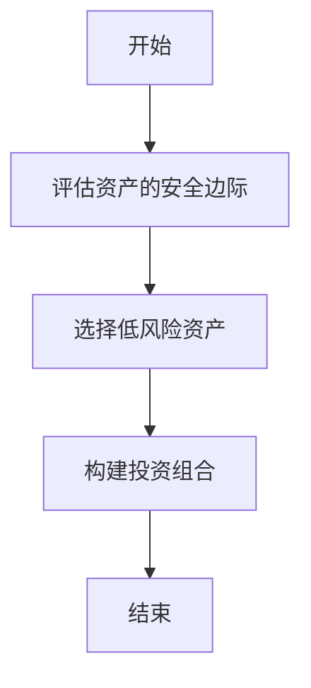
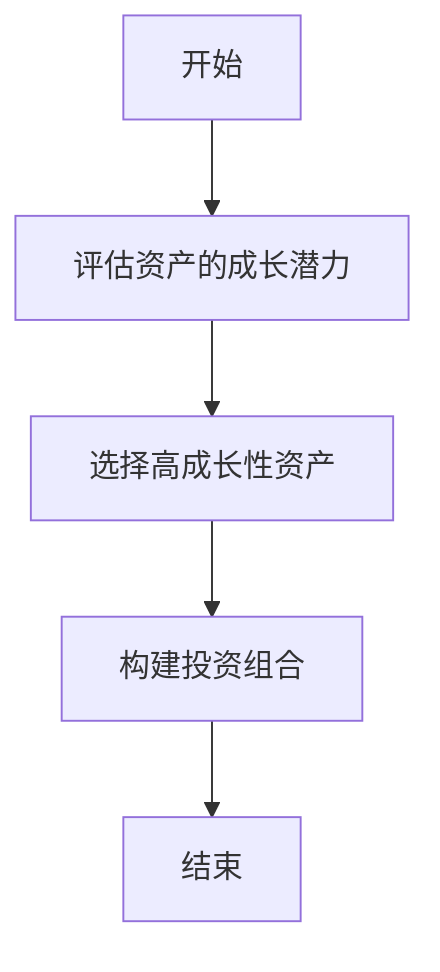
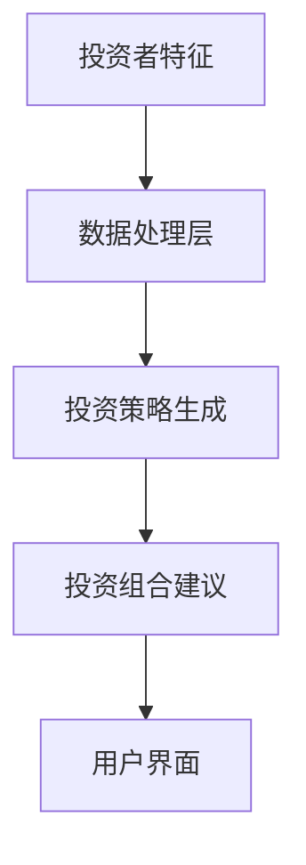

                 


# 格雷厄姆的防御型与进取型投资者区分

---

## 关键词：
- 格雷厄姆
- 防御型投资者
- 进取型投资者
- 投资策略
- 价值投资
- 风险控制

---

## 摘要：
本文系统地探讨了格雷厄姆提出的防御型与进取型投资者的区别，从核心概念、数学模型、系统分析到项目实战，全面解析了这两种投资策略的异同及其在实际投资中的应用。通过案例分析和公式推导，帮助读者更好地理解如何根据自身风险承受能力和投资目标选择合适的投资策略。

---

## 第1章: 投资者的类型与策略概述

### 1.1 投资的基本概念

#### 1.1.1 什么是投资
投资是指将资金投入到某种资产或项目中，以期获得未来收益的行为。投资的核心在于通过合理配置资产，实现财富的增值。

#### 1.1.2 投资的目标与意义
投资的目标通常包括保值、增值、分散风险等。投资的意义在于通过科学的配置和管理，帮助投资者实现财务目标，提高生活质量。

#### 1.1.3 投资的基本原则
- 风险与收益的匹配原则
- 分散投资原则
- 长期投资原则
- 定期复盘与调整原则

---

### 1.2 防御型与进取型投资者的定义

#### 1.2.1 防御型投资者的定义
防御型投资者是指那些注重资产安全、追求稳定收益、风险承受能力较低的投资者。他们通常选择低风险、高确定性的投资标的，如国债、蓝筹股等。

#### 1.2.2 进取型投资者的定义
进取型投资者是指那些追求高收益、愿意承担较高风险、具有较强风险承受能力的投资者。他们通常选择高成长性资产，如创业公司、新兴行业股票等。

#### 1.2.3 两者的主要区别
| **特征**             | **防御型投资者**                     | **进取型投资者**                     |
|----------------------|--------------------------------------|--------------------------------------|
| **风险偏好**          | 低风险                               | 高风险                               |
| **收益目标**          | 稳定收益                             | 高收益                               |
| **投资期限**          | 长期                                 | 中短期                               |
| **资产选择**          | 蓝筹股、国债等                        | 创业公司、新兴行业股票等             |

---

### 1.3 防御型与进取型投资者的核心区别

#### 1.3.1 投资目标的不同
防御型投资者以保值和稳定收益为目标，而进取型投资者以追求高收益为目标。

#### 1.3.2 风险承受能力的差异
防御型投资者风险承受能力较低，而进取型投资者能够承受较高的风险。

#### 1.3.3 投资期限的长短
防御型投资者通常选择长期投资，而进取型投资者则更关注中短期收益。

---

## 第2章: 防御型与进取型投资者的特征对比

### 2.1 防御型投资者的特征

#### 2.1.1 保守稳健的投资风格
防御型投资者倾向于选择那些具有较高安全边际和稳定现金流的资产。例如，投资于股息率高、业绩稳定的蓝筹股。

#### 2.1.2 注重安全边际
防御型投资者在投资时会严格评估资产的内在价值，并确保市场价格低于内在价值（即存在安全边际）。例如，购买一只股票时，市场价格应低于其账面价值。

#### 2.1.3 偏好低风险资产
防御型投资者通常选择国债、债券基金等低风险资产，以规避市场的波动性风险。

---

### 2.2 进取型投资者的特征

#### 2.2.1 追求高收益
进取型投资者愿意承担较高的风险以换取更高的收益。例如，投资于高成长性的科技公司股票。

#### 2.2.2 能够承受较高的风险
进取型投资者对市场波动的容忍度较高，能够在市场下跌时保持信心，长期持有优质资产。

#### 2.2.3 偏好高成长性资产
进取型投资者倾向于投资于那些具有高成长潜力的公司，例如初创期的科技公司或新兴行业的企业。

---

### 2.3 两者在投资决策中的差异

#### 2.3.1 投资决策的依据
防御型投资者主要依据资产的安全性和稳定性，而进取型投资者更关注资产的成长性和高收益潜力。

#### 2.3.2 对市场波动的反应
防御型投资者在市场波动时倾向于保守，而进取型投资者则可能加仓或调整投资策略。

#### 2.3.3 对投资期限的规划
防御型投资者更注重长期稳定，而进取型投资者更关注短期收益和机会。

---

## 第3章: 防御型与进取型投资者的数学模型与算法

### 3.1 防御型投资者的数学模型

#### 3.1.1 安全边际的计算公式
$$ \text{安全边际} = \text{内在价值} - \text{市场价格} $$

- **内在价值**：资产的合理估值，通常基于未来现金流的现值计算。
- **市场价格**：资产当前的市场价格。

#### 3.1.2 风险承受能力的评估模型
$$ \text{风险承受能力} = \frac{\text{投资组合的波动性}}{\text{投资者的心理承受能力}} $$

- **投资组合的波动性**：投资组合收益的标准差。
- **心理承受能力**：投资者对收益波动的容忍度。

---

### 3.2 进取型投资者的数学模型

#### 3.2.1 高成长性资产的评估公式
$$ \text{成长率} = \frac{\text{未来现金流的现值}}{\text{当前股价}} $$

- **未来现金流的现值**：基于高成长性假设计算的未来现金流的现值。
- **当前股价**：资产的当前市场价格。

#### 3.2.2 风险承受能力的评估模型
$$ \text{风险承受能力} = \frac{\text{预期收益}}{\text{投资风险}} $$

- **预期收益**：基于高成长性假设的预期收益。
- **投资风险**：资产的波动性或风险溢价。

---

### 3.3 两者在投资决策中的算法对比

#### 3.3.1 防御型投资者的算法流程图


#### 3.3.2 进取型投资者的算法流程图


---

## 第4章: 防御型与进取型投资者的系统分析与架构设计

### 4.1 问题场景介绍

防御型与进取型投资者的投资决策需要结合市场环境、个人风险偏好和财务目标。因此，我们需要设计一个系统，能够根据投资者的特征和市场数据，推荐合适的投资策略。

---

### 4.2 系统功能设计

#### 4.2.1 投资者特征分析
- 风险承受能力评估
- 投资目标设定
- 投资期限规划

#### 4.2.2 市场数据采集
- 股票价格数据
- 财务报表数据
- 经济指标数据

---

### 4.3 系统架构设计



---

## 第5章: 防御型与进取型投资者的项目实战

### 5.1 环境安装

- **工具**：Python、Pandas、Matplotlib
- **数据源**：股票价格数据、财务报表数据

---

### 5.2 系统核心实现源代码

```python
# 防御型投资者的安全边际计算
def calculate_margin_of_safety(intrinsic_value, market_price):
    return intrinsic_value - market_price

# 进取型投资者的成长潜力评估
def calculate_growth_potential(future_cash_flow, current_price):
    return future_cash_flow / current_price
```

---

### 5.3 代码应用解读与分析

- **防御型投资者**：通过计算安全边际，选择具有足够安全边际的资产。
- **进取型投资者**：通过评估成长潜力，选择具有高成长性的资产。

---

### 5.4 实际案例分析

#### 防御型投资者案例
假设一只股票的内在价值为100元，市场价格为80元，安全边际为20元。防御型投资者可以选择投资这只股票。

#### 进取型投资者案例
假设一只股票的未来现金流现值为200元，当前股价为100元，成长率为2倍。进取型投资者可以选择投资这只股票。

---

## 第6章: 总结与展望

### 6.1 核心内容回顾

- 防御型投资者注重安全性和稳定性，适合风险承受能力较低的投资者。
- 进取型投资者注重成长性和高收益，适合风险承受能力较高的投资者。

### 6.2 未来投资趋势

随着市场的变化和技术的进步，防御型与进取型投资者的策略也需要不断调整和优化。例如，结合人工智能和大数据技术，投资者可以更精准地评估资产的安全边际和成长潜力。

### 6.3 注意事项

- 投资者应根据自身的财务状况和风险偏好选择合适的投资策略。
- 市场环境的变化可能会影响投资策略的有效性，投资者需要定期复盘和调整。

---

## 第7章: 最佳实践与小结

### 7.1 最佳实践

- **防御型投资者**：
  - 选择具有高安全边际的资产。
  - 保持长期投资，分散投资风险。

- **进取型投资者**：
  - 选择具有高成长潜力的资产。
  - 灵活调整投资策略，抓住市场机会。

### 7.2 小结

防御型与进取型投资者的区别主要体现在风险偏好、收益目标和投资期限上。投资者应根据自身的情况选择合适的投资策略，并在实践中不断优化和调整。

---

## 附录: 进一步阅读与拓展

- 格雷厄姆的《证券分析》
- 巴菲特的《巴菲特致股东的信》
- 现代投资组合理论（MPT）的相关文献

---

通过本文的系统分析和实际案例，读者可以更好地理解格雷厄姆提出的防御型与进取型投资者的区别，并根据自身需求选择合适的投资策略。

