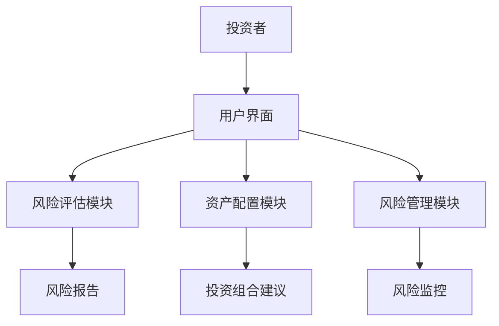
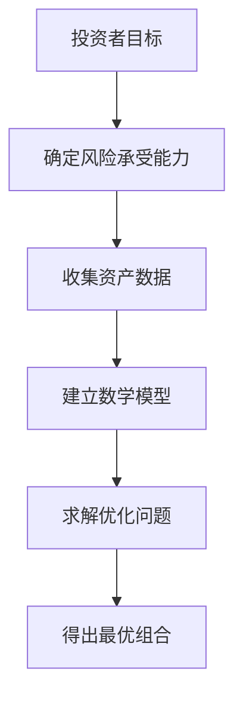

                 


# 格雷厄姆的防御型和进取型投资者：知己知彼

## 关键词：格雷厄姆，防御型投资者，进取型投资者，投资策略，风险管理，价值投资

## 摘要：  
本文深入探讨了格雷厄姆提出的防御型和进取型投资者策略，分析了两种策略的核心概念、数学模型和实际应用。通过知己知彼的方法，文章展示了如何根据投资者的风险承受能力和投资目标选择合适的策略，并通过数学模型和系统架构的设计，提供了一种结合防御与进取的动态投资方法。文章最后通过项目实战和最佳实践，为读者提供了实用的投资策略参考。

---

# 第一部分：格雷厄姆投资理念概述

## 第1章：投资理念与核心概念

### 1.1 格雷厄姆投资理论的背景与起源

#### 1.1.1 格雷厄姆与价值投资的起源  
 Benjamin Graham 是价值投资的鼻祖，他的投资理念奠定了现代投资学的基础。他提出的价值投资方法强调以低于内在价值的价格买入优质股票，注重长期投资和风险管理。  

#### 1.1.2 防御型与进取型投资者的定义  
 - **防御型投资者**：注重风险控制，追求稳定收益，适合风险承受能力较低的投资者。  
 - **进取型投资者**：追求高回报，愿意承担更高的风险，适合风险承受能力较强的投资者。  

#### 1.1.3 格雷厄姆投资理念的核心要素  
 格雷厄姆的投资理念包括：  
 1. 安全边际：以低于内在价值的价格买入资产。  
 2. 风险控制：通过分散投资和风险管理降低风险。  
 3. 长期视角：注重长期收益而非短期波动。  

### 1.2 防御型与进取型投资者的核心区别

#### 1.2.1 防御型投资者的特点  
 - 低风险承受能力。  
 - 追求稳定的收益。  
 - 投资策略保守，注重安全边际。  

#### 1.2.2 进取型投资者的特点  
 - 高风险承受能力。  
 - 追求高回报。  
 - 投资策略激进，注重市场趋势。  

#### 1.2.3 两者在投资策略上的对比  
 | 对比维度         | 防御型投资者              | 进取型投资者              |
 |------------------|--------------------------|--------------------------|
 | 风险承受能力     | 低                      | 高                      |
 | 投资目标         | 稳定收益                | 高回报                  |
 | 投资时间 horizon | 长期                    | 短期或中期              |
 | 投资品种         | 低风险资产（如债券、蓝筹股） | 高风险资产（如成长股、新兴行业） |

### 1.3 格雷厄姆投资理念的现代应用

#### 1.3.1 现代市场环境下的防御型投资  
 防御型投资在现代市场中依然适用，尤其是在市场波动加剧的情况下，防御型策略能够帮助投资者规避重大风险。  

#### 1.3.2 现代市场环境下的进取型投资  
 进取型投资在新兴市场和技术股盛行的时代更具挑战性，投资者需要敏锐的市场洞察力和快速的决策能力。  

#### 1.3.3 防御型与进取型投资的平衡  
 在实际投资中，大多数投资者属于中间类型，结合防御和进取策略，根据市场环境和个人风险偏好进行动态调整。  

### 1.4 本章小结

#### 1.4.1 核心概念回顾  
 防御型和进取型投资者的核心区别在于风险承受能力、投资目标和时间 horizon。  

#### 1.4.2 理论与实践的结合  
 格雷厄姆的投资理念不仅适用于传统市场，也适用于现代复杂的投资环境。  

---

## 第2章：防御型投资者的核心策略

### 2.1 防御型投资的基本原则

#### 2.1.1 风险控制的重要性  
 防御型投资者注重风险控制，通过分散投资和严格的风险管理来降低潜在损失。  

#### 2.1.2 安全边际的概念  
 安全边际是指买入价格与内在价值之间的差距，确保在市场波动时仍能获得收益。  

#### 2.1.3 防御型投资的长期视角  
 防御型投资者注重长期收益，而非短期市场波动，适合稳健型投资者。  

### 2.2 防御型投资的选股策略

#### 2.2.1 低市盈率与低市净率股票  
 防御型投资者倾向于选择低市盈率和低市净率的股票，这些股票通常具有较高的安全边际。  

#### 2.2.2 高质量企业的识别  
 防御型投资者偏好财务状况稳健、行业地位稳固的企业，这些企业能够在经济低迷时依然保持收益。  

#### 2.2.3 避免情绪化决策  
 防御型投资者避免被市场情绪左右，坚持理性分析和长期视角。  

### 2.3 防御型投资的组合管理

#### 2.3.1 投资组合的分散化  
 通过投资不同行业和资产类别，降低特定资产的风险。  

#### 2.3.2 定期再平衡的重要性  
 定期调整投资组合，确保与风险承受能力和投资目标一致。  

#### 2.3.3 风险承受能力的评估  
 根据投资者的财务状况和心理承受能力，制定合理的风险控制策略。  

### 2.4 本章小结

#### 2.4.1 防御型投资的核心策略  
 防御型投资者注重风险控制、安全边际和长期收益。  

#### 2.4.2 策略的实际应用  
 防御型策略适用于市场波动大、经济不确定性高的环境，适合稳健型投资者。  

---

## 第3章：进取型投资者的核心策略

### 3.1 进取型投资的基本原则

#### 3.1.1 高风险高回报的平衡  
 进取型投资者愿意承担高风险，以追求高回报。  

#### 3.1.2 进取型投资的短期与长期视角  
 进取型投资者可能关注短期市场趋势，但同时也注重长期的高成长性。  

#### 3.1.3 进取型投资的市场敏感性  
 进取型投资者需要敏锐的市场洞察力，能够快速捕捉市场机会。  

### 3.2 进取型投资的选股策略

#### 3.2.1 高成长性企业的识别  
 进取型投资者倾向于投资高成长性企业，尤其是处于新兴行业或技术创新领域的公司。  

#### 3.2.2 市场趋势的把握  
 进取型投资者注重市场趋势，能够在市场热点中找到投资机会。  

#### 3.2.3 杠杆与风险的运用  
 进取型投资者可能使用杠杆工具放大收益，但也需要承担更高的风险。  

### 3.3 进取型投资的组合管理

#### 3.3.1 进取型投资的集中化  
 进取型投资者倾向于集中投资，押注少数高成长性股票或行业。  

#### 3.3.2 市场时机的选择  
 进取型投资者注重市场时机，能够在市场低估时买入，在高估时卖出。  

#### 3.3.3 风险管理的强化  
 尽管进取型投资者承担高风险，但仍需通过严格的风险管理来控制潜在损失。  

### 3.4 本章小结

#### 3.4.1 进取型投资的核心策略  
 进取型投资者注重高成长性和市场机会，愿意承担高风险以追求高回报。  

#### 3.4.2 策略的实际应用  
 进取型策略适用于市场波动较小、经济快速增长的环境，适合风险承受能力强的投资者。  

---

## 第4章：防御型与进取型投资的对比分析

### 4.1 投资目标与风险承受能力的对比

#### 4.1.1 防御型投资者的目标  
 稳定收益和风险控制是防御型投资者的核心目标。  

#### 4.1.2 进取型投资者的目标  
 高回报和市场机会是进取型投资者的核心目标。  

#### 4.1.3 风险承受能力的差异  
 防御型投资者风险承受能力低，而进取型投资者风险承受能力高。  

### 4.2 投资策略与时间 horizon 的对比

#### 4.2.1 防御型投资的长期视角  
 防御型投资者注重长期收益，策略较为保守。  

#### 4.2.2 进取型投资的短期与中期视角  
 进取型投资者注重短期和中期市场机会，策略较为激进。  

#### 4.2.3 时间 horizon 对策略选择的影响  
 投资者的时间 horizon 直接影响其投资策略的选择，长期投资者更倾向于防御型策略，而短期投资者更倾向于进取型策略。  

### 4.3 投资组合结构的对比

#### 4.3.1 防御型投资的分散化组合  
 防御型投资者通过分散投资降低风险。  

#### 4.3.2 进取型投资的集中化组合  
 进取型投资者倾向于集中投资以放大收益。  

#### 4.3.3 不同组合结构的风险与收益对比  
 防御型组合风险低、收益稳定，而进取型组合风险高、收益波动大。  

### 4.4 本章小结

#### 4.4.1 防御型与进取型投资的核心差异  
 两者的核心差异在于风险承受能力、投资目标和时间 horizon。  

#### 4.4.2 策略选择的关键因素  
 投资者需要根据自身的风险承受能力和投资目标选择合适的策略，并在市场环境变化时进行动态调整。  

---

## 第5章：知己知彼的投资策略

### 5.1 知己：投资者自我评估

#### 5.1.1 风险承受能力的评估  
 投资者需要明确自己的风险承受能力，这是选择投资策略的基础。  

#### 5.1.2 投资目标的明确  
 投资者需要明确自己的投资目标，是追求稳定收益还是高回报。  

### 5.2 知彼：市场环境与策略选择

#### 5.2.1 市场环境的分析  
 投资者需要了解当前市场环境，包括经济周期、市场趋势等，以选择合适的策略。  

#### 5.2.2 策略选择的关键因素  
 投资者需要根据市场环境和个人情况动态调整投资策略，平衡风险与收益。  

### 5.3 知己知彼的动态调整

#### 5.3.1 动态调整的必要性  
 市场环境和投资者情况的变化需要动态调整投资策略。  

#### 5.3.2 动态调整的实施步骤  
 1. 定期评估市场环境和个人情况。  
 2. 根据评估结果调整投资组合。  
 3. 监控投资表现并及时优化。  

### 5.4 本章小结

#### 5.4.1 知己知彼的核心思想  
 投资者需要了解自己和市场，才能制定有效的投资策略。  

#### 5.4.2 动态调整的重要性  
 投资策略需要根据市场环境和个人情况的变化进行动态调整，以实现最佳收益。  

---

## 第6章：数学模型与算法原理

### 6.1 防御型与进取型投资的数学模型

#### 6.1.1 防御型投资的数学模型  
 防御型投资的收益可以用以下公式表示：  
 $$ R_{防御} = \sum_{i=1}^{n} w_i \times r_i $$  
 其中，$w_i$ 是第 $i$ 资产的权重，$r_i$ 是第 $i$ 资产的收益。  

#### 6.1.2 进取型投资的数学模型  
 进取型投资的收益可以用以下公式表示：  
 $$ R_{进取} = \sum_{i=1}^{m} w_i \times r_i $$  
 其中，$m$ 是进取型资产的数量，$w_i$ 是第 $i$ 资产的权重，$r_i$ 是第 $i$ 资产的收益。  

### 6.2 算法原理

#### 6.2.1 投资组合优化算法  
 投资组合优化可以通过以下步骤实现：  
 1. 确定投资者的风险承受能力和收益目标。  
 2. 收集相关资产的历史收益和风险数据。  
 3. 使用优化算法（如均值-方差优化）确定最优投资组合。  

#### 6.2.2 风险管理算法  
 风险管理算法可以通过以下步骤实现：  
 1. 确定投资组合的总体风险水平。  
 2. 根据风险承受能力调整投资组合的分散化程度。  
 3. 定期监控和调整投资组合以控制风险。  

### 6.3 本章小结

#### 6.3.1 数学模型的重要性  
 数学模型是投资决策的重要工具，能够帮助投资者量化风险和收益。  

#### 6.3.2 算法原理的实际应用  
 算法原理能够帮助投资者优化投资组合，实现风险与收益的最佳平衡。  

---

## 第7章：系统架构与项目实战

### 7.1 投资者决策支持系统

#### 7.1.1 系统功能设计  
 - 风险评估模块：评估投资者的风险承受能力。  
 - 资产配置模块：根据投资者需求推荐投资组合。  
 - 风险管理模块：监控投资组合的风险并进行调整。  

#### 7.1.2 系统架构设计  
 下面是一个投资者决策支持系统的简要架构图：  



#### 7.1.3 系统接口设计  
 - 用户输入：投资者的基本信息和投资需求。  
 - 系统输出：风险评估报告、投资组合建议、风险监控报告。  

### 7.2 项目实战

#### 7.2.1 环境安装  
 - 安装 Python 和相关库（如 NumPy、Pandas、Scipy）。  

#### 7.2.2 核心代码实现  
 以下是投资组合优化的核心代码示例：  

```python
import numpy as np
import pandas as pd
from scipy.optimize import minimize

# 示例数据：资产的预期收益和协方差矩阵
n_assets = 5
returns = np.array([0.1, 0.12, 0.08, 0.15, 0.10])
cov_matrix = np.array([
    [0.02, 0.01, 0.015, 0.01, 0.01],
    [0.01, 0.03, 0.02, 0.015, 0.01],
    [0.015, 0.02, 0.03, 0.01, 0.01],
    [0.01, 0.015, 0.01, 0.04, 0.02],
    [0.01, 0.01, 0.01, 0.02, 0.03]
])

# 定义优化目标函数
def portfolio_var(weights, cov_matrix):
    return np.dot(weights.T, np.dot(cov_matrix, weights))

# 定义约束条件
cons = ({'type': 'eq', 'fun': lambda w: sum(w) - 1})

# 使用最小化方差进行优化
result = minimize(portfolio_var, np.ones(n_assets)/n_assets, args=(cov_matrix,), constraints=cons)

# 输出最优权重
print("最优权重:", result.x)
print("最小方差:", result.fun)
```

#### 7.2.3 代码应用解读  
 该代码通过优化算法找到最小方差的投资组合，帮助投资者在风险可控的情况下实现收益最大化。  

#### 7.2.4 案例分析  
 以五只股票为例，计算最优投资组合的权重和最小方差。  

#### 7.2.5 项目小结  
 通过项目实战，读者可以理解理论知识的实际应用，并掌握投资组合优化的基本方法。  

### 7.3 本章小结

#### 7.3.1 系统架构的重要性  
 投资者决策支持系统能够帮助投资者更科学地制定投资策略。  

#### 7.3.2 项目实战的意义  
 通过项目实战，读者能够将理论知识与实际应用结合起来，提升投资决策的效率和准确性。  

---

## 第8章：最佳实践与注意事项

### 8.1 最佳实践 tips

#### 8.1.1 风险管理  
 - 定期评估和调整投资组合，确保风险在可控范围内。  
 - 使用多样化策略降低特定资产的风险。  

#### 8.1.2 投资组合优化  
 - 根据市场环境和个人情况动态调整投资策略。  
 - 使用数学模型和优化算法辅助决策。  

#### 8.1.3 长期视角  
 - 长期投资能够平滑短期市场波动的影响。  
 - 避免频繁交易，降低交易成本和税务负担。  

### 8.2 小结

#### 8.2.1 防御型与进取型投资的结合  
 投资者可以根据市场环境和个人情况，灵活调整防御和进取策略的比例。  

#### 8.2.2 知己知彼的重要性  
 投资者需要了解自己和市场，才能制定有效的投资策略。  

### 8.3 注意事项

#### 8.3.1 市场风险  
 - 市场波动可能导致投资组合收益低于预期。  
 - 需要密切关注市场变化，及时调整投资策略。  

#### 8.3.2 信息滞后  
 - 数据和信息可能存在滞后性，影响投资决策的及时性。  
 - 需要结合市场研究和实时数据进行综合判断。  

#### 8.3.3 人性偏差  
 - 情绪化决策可能导致投资失误。  
 - 需要克服贪婪和恐惧，保持理性分析。  

### 8.4 拓展阅读

#### 8.4.1 格雷厄姆的经典著作  
 - 《The Intelligent Investor》  

#### 8.4.2 现代投资组合理论  
 - Harry Markowitz 的《Portfolio Selection》  

#### 8.4.3 进一步学习资源  
 - 投资组合优化的高级算法和应用。  
 - 行为金融学对投资决策的影响。  

---

## 第9章：总结与展望

### 9.1 总结

#### 9.1.1 核心内容回顾  
 - 防御型和进取型投资者的核心策略。  
 - 数学模型和算法原理的应用。  
 - 投资者决策支持系统的构建。  

#### 9.1.2 知己知彼的重要性  
 知己知彼才能制定有效的投资策略，实现投资目标。  

### 9.2 未来展望

#### 9.2.1 技术进步对投资的影响  
 - 人工智能和大数据技术将推动投资策略的进一步优化。  
 - 自动化投资工具将帮助投资者更科学地管理投资组合。  

#### 9.2.2 投资教育的重要性  
 - 提高投资者的金融素养，帮助他们更好地理解投资策略。  
 - 引导投资者理性投资，避免情绪化决策。  

---

## 附录：常用公式与图表

### 附录 A：数学公式

#### A.1 投资组合的方差  
 投资组合的方差可以表示为：  
 $$ \text{方差} = \mathbf{w}^T \mathbf{C} \mathbf{w} $$  
 其中，$\mathbf{w}$ 是权重向量，$\mathbf{C}$ 是协方差矩阵。  

#### A.2 风险调整后的收益  
 风险调整后的收益可以表示为：  
 $$ \text{收益} = \mathbf{r}^T \mathbf{w} $$  
 其中，$\mathbf{r}$ 是收益向量，$\mathbf{w}$ 是权重向量。  

### 附录 B：图表

#### B.1 防御型与进取型投资的风险收益对比图  


#### B.2 投资组合优化的流程图  


---

## 参考文献

1. Graham, Benjamin. *The Intelligent Investor*.  
2. Markowitz, Harry. *Portfolio Selection*.  
3. Modern Portfolio Theory and Investment Analysis.  

---

通过以上内容，希望读者能够全面理解格雷厄姆的防御型和进取型投资者策略，并能够在实际投资中灵活运用知己知彼的方法，制定科学的投资决策。

