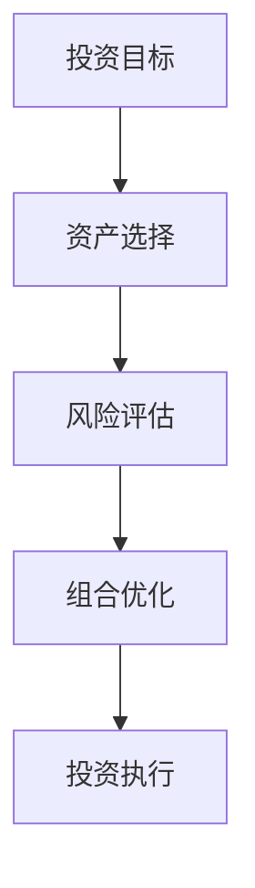

                 


# 防御型投资策略：格雷厄姆的投资哲学与现代应用

## 关键词：
防御型投资，价值投资，风险管理，投资组合，投资策略，格雷厄姆，安全边际

## 摘要：
本文深入探讨了格雷厄姆的防御型投资策略，从其核心理念到实际应用，分析了防御型投资在现代投资环境中的重要性。文章结合理论与实践，详细讲解了防御型投资的策略、风险管理方法以及如何构建稳健的投资组合，为读者提供了全面的指导。

---

# 第1章：防御型投资的核心理念

## 1.1 格雷厄姆的防御型投资理论

### 1.1.1 防御型投资的定义
防御型投资是一种以稳健性和风险控制为核心的投资策略，旨在通过选择具有内在价值且价格被市场低估的资产，构建一个能够在市场波动中保持稳定的组合。

### 1.1.2 格雷厄姆的安全边际概念
安全边际是格雷厄姆防御型投资理论的核心，它是指资产的内在价值与市场价格之间的差距。通过买入价格低于内在价值的资产，投资者可以降低市场波动带来的风险。

$$
\text{安全边际} = \text{内在价值} - \text{市场价格}
$$

### 1.1.3 防御型投资与进攻型投资的区别
| 属性       | 防御型投资             | 进攻型投资             |
|------------|----------------------|----------------------|
| 目标       | 稳定收益与本金保护     | 高收益               |
| 风险承受   | 低风险偏好             | 高风险偏好             |
| 时间 horizon | 中长期               | 短期或中短期           |

---

## 1.2 防御型投资的哲学基础

### 1.2.1 投资的三项基本原则
1. **本金保护**：优先考虑本金的安全性。
2. **价值发现**：寻找市场价格低于内在价值的资产。
3. **分散风险**：通过多样化投资降低特定风险。

### 1.2.2 防御型投资的长期视角
格雷厄姆强调长期投资的重要性，认为短期市场波动不可预测，但长期来看，资产的内在价值会反映其真实价值。

---

# 第2章：防御型投资的数学模型与风险管理

## 2.1 风险与收益的数学模型

### 2.1.1 马科维茨的有效前沿理论
马科维茨提出的投资组合理论为防御型投资提供了数学基础。通过优化投资组合的收益与风险，投资者可以在可行的范围内找到最优配置。

$$
\text{收益最大化} = \sum w_i r_i
$$

$$
\text{风险最小化} = \sqrt{\sum w_i^2 \sigma_i^2 + \sum w_i w_j \sigma_{ij}}
$$

### 2.1.2 风险调整后的收益模型
在防御型投资中，收益需扣除因风险承担而获得的超额收益。

$$
\text{风险调整后收益} = \text{收益} - \text{风险溢价}
$$

## 2.2 防御型投资的风险管理策略

### 2.2.1 基于VaR的风险度量
Value at Risk（VaR）是一种常用的风险度量方法，用于估计投资组合在特定置信水平下的潜在损失。

$$
\text{VaR} = \text{损失的最高值在特定概率下}
$$

### 2.2.2 保险策略的数学模型
保险策略通过设定止损点或保险资产来保护本金。

$$
\text{止损点} = \text{买入价} - \text{安全边际}
$$

---

# 第3章：防御型投资的系统架构与策略实现

## 3.1 系统架构设计

### 3.1.1 系统功能模块
- 资产选择模块：筛选符合防御型投资标准的资产。
- 风险评估模块：计算投资组合的风险与收益。
- 组合优化模块：调整资产配置以达到最优风险收益比。

### 3.1.2 系统架构图


## 3.2 策略实现

### 3.2.1 基于安全边际的选股策略
1. 计算每只股票的内在价值。
2. 比较市场价格与内在价值，选择具有正安全边际的股票。

### 3.2.2 分散投资的资产配置
- 股票：20%
- 债券：30%
- 现金：10%
- 其他资产：40%

---

# 第4章：防御型投资的实战应用

## 4.1 投资组合构建案例

### 4.1.1 环境配置
- 投资目标：稳健收益，风险厌恶。
- 资产类别：股票、债券、现金。

### 4.1.2 核心代码实现
```python
import numpy as np

# 示例：计算投资组合的夏普比率
def calculate Sharpe_ratio(returns, risk_free_rate):
    excess_returns = returns - risk_free_rate
    average_excess_return = np.mean(excess_returns)
    std_deviation = np.std(excess_returns)
    sharpe_ratio = average_excess_return / std_deviation
    return sharpe_ratio

# 示例数据
returns = np.array([0.05, 0.03, 0.07, 0.02, 0.06])
risk_free_rate = 0.02

# 计算夏普比率
sharpe = calculate_Sharpe_ratio(returns, risk_free_rate)
print(f"夏普比率: {sharpe}")
```

### 4.1.3 案例分析
通过分析具体资产的内在价值和市场价格，构建一个防御型投资组合，并定期评估和调整。

---

# 第5章：防御型投资的未来展望

## 5.1 防御型投资的演变
随着市场的变化，防御型投资策略也在不断演变，例如引入量化分析和大数据技术。

## 5.2 数字化与技术驱动的投资
现代技术，如大数据分析和机器学习，为防御型投资提供了新的工具和方法，提高了风险管理和投资决策的效率。

---

# 结论

格雷厄姆的防御型投资策略为投资者提供了一种稳健的投资方法，尤其适合风险厌恶型投资者。通过结合现代技术，防御型投资策略可以在复杂多变的市场环境中实现稳健的收益。

---

# 至读者

如果您对防御型投资策略感兴趣，可以进一步阅读格雷厄姆的经典著作《 Intelligent Investor》。同时，建议结合实际市场环境，灵活调整投资策略。

---

通过以上内容，您可以全面理解格雷厄姆的防御型投资策略，并将其应用于实际投资中。

