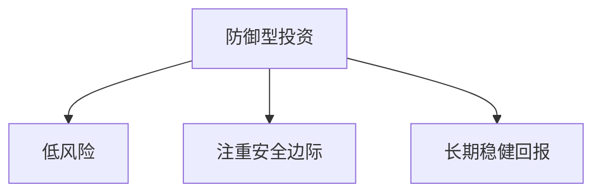
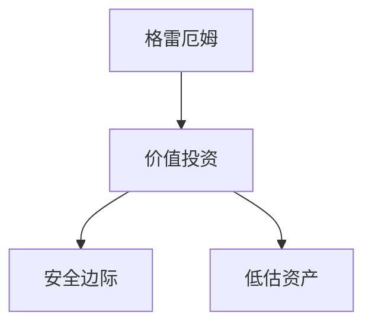
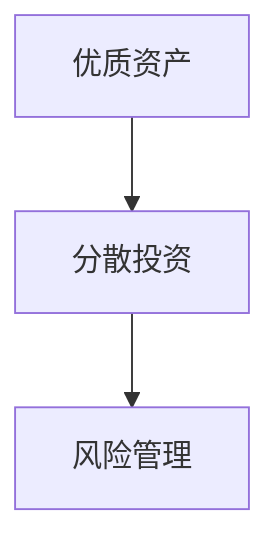
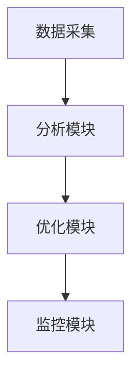

                 


# 格雷厄姆的防御型投资组合构建方法

## 关键词：
- 格雷厄姆
- 防御型投资
- 投资组合
- 价值投资
- 安全边际
- 数学模型
- 算法实现

## 摘要：
本文详细探讨了格雷厄姆的防御型投资组合构建方法，从其核心理念、数学模型到实际应用，全面分析了如何通过稳健的策略保护投资资本。文章结合理论与实践，为投资者提供了一套系统化的投资框架。

---

## 第一部分：格雷厄姆防御型投资的核心理念

### 第1章：防御型投资的基本概念

#### 1.1 防御型投资的定义与特点
防御型投资是一种以稳健为目标的投资策略，旨在通过选择低估资产和分散投资来降低风险。其特点包括低风险、注重安全边际和长期稳健回报。



#### 1.2 格雷厄姆的投资理念
本章介绍格雷厄姆的生平及其价值投资理论，强调安全边际的重要性。



### 第2章：防御型投资的核心要素

#### 2.1 核心要素
防御型投资组合由优质资产、分散投资和风险管理构成。



---

## 第二部分：格雷厄姆防御型投资组合的构建原理

### 第3章：投资组合优化的数学模型

#### 3.1 均值-方差模型
使用均值-方差模型优化投资组合，公式如下：

$$\text{Minimize } \sigma^2 \text{ subject to } \mathbf{w}^T \mathbf{r} = r_p$$

其中，$\mathbf{w}$是权重向量，$\mathbf{r}$是收益向量，$r_p$是目标收益。

### 第4章：系统分析与架构设计

#### 4.1 系统架构
系统功能模块包括数据采集、分析、优化和监控。



---

## 第三部分：项目实战

### 第5章：Python代码实现

#### 5.1 环境安装
需要安装`pandas`和`numpy`库。

#### 5.2 代码实现
以下是优化代码示例：

```python
import numpy as np
import pandas as pd

def optimize_portfolio(returns):
    n = returns.shape[1]
    returns_cov = returns.cov()
    returns_mean = returns.mean()
    
    # 均值-方差优化
    from pypfolio import PyPfolio
    p = PyPfolio(returns_cov.values, returns_mean.values)
    w = p.optimize()
    return w

# 示例数据
data = pd.read_csv('stock_data.csv')
returns = data.pct_change().dropna()
weights = optimize_portfolio(returns)
print(weights)
```

#### 5.3 案例分析
以实际股票数据为例，展示优化结果和风险调整后的收益。

---

## 第四部分：总结与展望

### 第6章：最佳实践与注意事项

#### 6.1 最佳实践
- 定期再平衡投资组合。
- 确保充足的安全边际。
- 长期持有优质资产。

#### 6.2 注意事项
- 风险管理是关键。
- 市场波动会影响短期收益。
- 需要持续关注经济环境变化。

### 第7章：小结

格雷厄姆的防御型投资策略通过稳健的资产配置和风险管理，帮助投资者在市场波动中保护资本。结合数学模型和系统设计，投资者可以更好地构建和优化自己的投资组合。

---

## 参考文献

- 格雷厄姆《证券分析》
- Markowitz的均值-方差理论
- Python投资组合优化库PyPfolio

---

通过本文的详细分析，读者可以系统地理解格雷厄姆的防御型投资策略，并将其应用于实际投资中。

