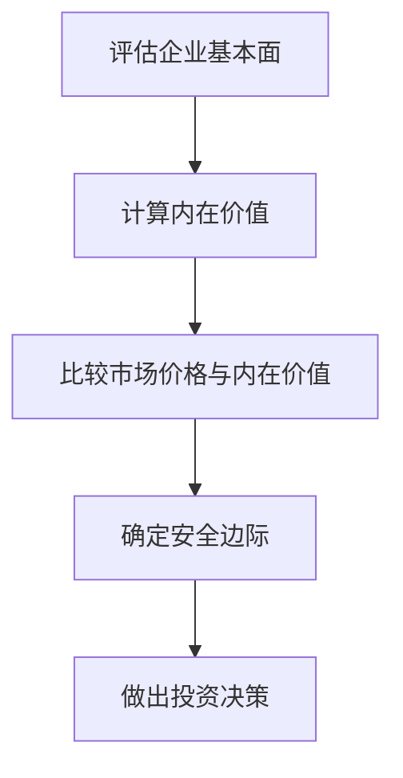
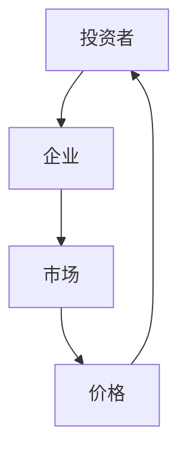
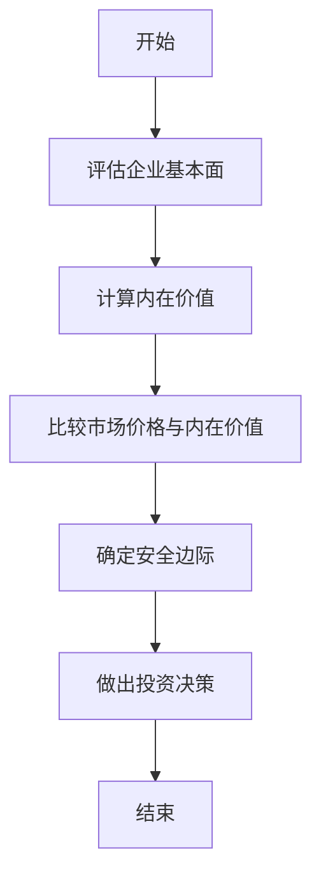
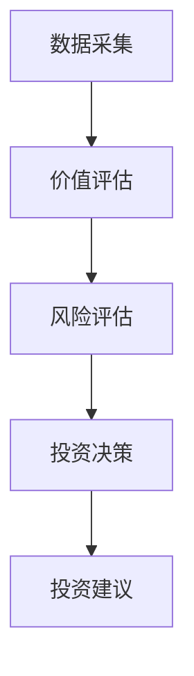
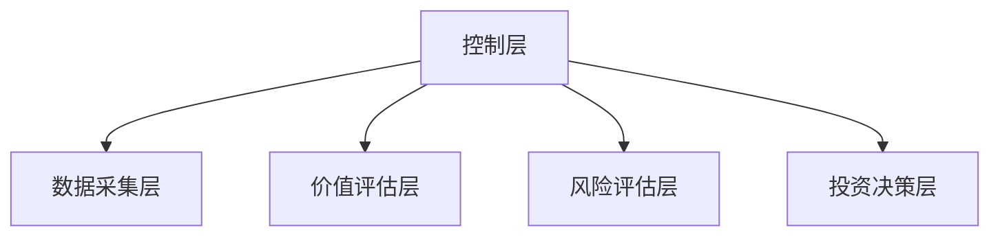
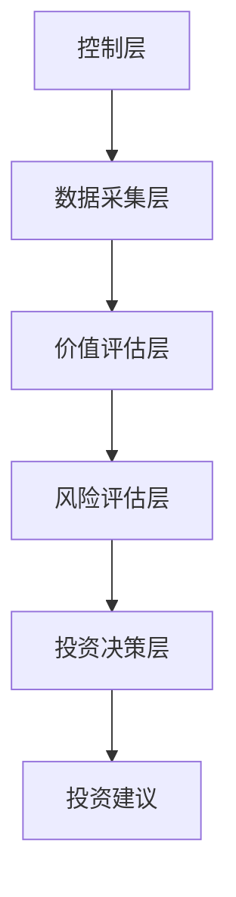

                 


# 防御型投资策略：稳健致胜

> 关键词：防御型投资，价值投资，安全边际，投资策略，稳健收益

> 摘要：本文深入探讨了格雷厄姆的防御型投资策略，从其核心理念、数学模型、系统架构到实际案例分析，全面解析了如何通过稳健的投资策略实现长期收益。文章结合技术语言和投资策略，为读者提供了从理论到实践的详细指导。

---

# 第一部分: 防御型投资策略的背景与核心概念

## 第1章: 防御型投资策略的背景与核心理念

### 1.1 防御型投资的起源与背景

#### 1.1.1 投资市场的基本概念
投资市场是通过资金配置和资产选择，以实现财富增值的场所。市场参与者包括个人投资者、机构投资者、上市公司等。市场的主要形式包括股票市场、债券市场、基金市场等。

#### 1.1.2 防御型投资的定义与特点
防御型投资是一种以稳健收益为目标的投资策略，强调通过深入的分析和严格的风险控制来避免重大损失。其特点包括：
- 以价值为导向，注重安全边际。
- 风险控制优先，追求长期稳健收益。
- 适合风险厌恶型投资者。

#### 1.1.3 防御型投资与其他投资策略的区别
| 投资策略 | 核心理念 | 风险承受度 | 时间跨度 |
|----------|----------|------------|----------|
| 防御型投资 | 稳健收益，注重安全边际 | 低风险承受 | 长期 |
| 激进型投资 | 高风险高收益 | 高风险承受 | 短期 |

### 1.2 防御型投资的核心理念

#### 1.2.1 安全边际的概念与作用
安全边际是指资产的内在价值与市场价格之间的差额。通过建立安全边际，投资者可以有效降低投资风险，确保在市场价格波动时依然能够获得正收益。

#### 1.2.2 价值投资的基本原理
价值投资的核心在于寻找市场价格低于内在价值的资产。格雷厄姆强调，内在价值是决定投资价值的唯一标准。

#### 1.2.3 风险控制与稳健收益的平衡
防御型投资通过严格的风险控制，实现收益与风险的最佳平衡。其核心在于通过分散投资、严格筛选标的等方法，降低投资组合的整体风险。

---

## 第2章: 防御型投资的核心概念与联系

### 2.1 防御型投资的核心要素

#### 2.1.1 安全边际的计算方法
$$ MS = V - P $$
其中，MS为安全边际，V为内在价值，P为市场价格。

#### 2.1.2 企业基本面分析的关键指标
- 市盈率（P/E）：市价与每股收益的比率。
- 市净率（P/B）：市价与每股净资产的比率。
- 股息率：股息与股价的比率。

#### 2.1.3 市场波动与投资者情绪的影响
市场波动和投资者情绪是影响安全边际的重要因素。防御型投资者需要通过分析市场周期，选择在市场底部区域进行投资。

### 2.2 防御型投资的核心原理

#### 2.2.1 价值评估模型的数学公式
$$ V = \frac{CF}{r - g} $$
其中，V为内在价值，CF为现金流，r为折现率，g为增长率。

#### 2.2.2 安全边际的计算流程


#### 2.2.3 安全边际与风险控制的关系
通过建立安全边际，投资者可以有效降低投资组合的风险。安全边际越高，投资的抗跌性越强。

### 2.3 防御型投资的ER实体关系图



---

## 第3章: 防御型投资的算法原理

### 3.1 防御型投资的决策流程

#### 3.1.1 决策流程图


#### 3.1.2 内在价值计算公式
$$ V = \sum_{t=1}^{\infty} \frac{CF_t}{(1 + r)^t} $$

#### 3.1.3 安全边际计算公式
$$ MS = V - P $$

### 3.2 防御型投资的数学模型

#### 3.2.1 内在价值计算
$$ V = \frac{CF}{r - g} $$

#### 3.2.2 安全边际计算
$$ MS = V - P $$

### 3.3 防御型投资的算法实现

#### 3.3.1 Python代码实现
```python
def calculate_intrinsic_value(CF, r, g):
    return CF / (r - g)

def calculate_margin_of_safety(V, P):
    return V - P

# 示例
CF = 100
r = 0.1
g = 0.05
P = 80

V = calculate_intrinsic_value(CF, r, g)
MS = calculate_margin_of_safety(V, P)
print("内在价值:", V)
print("安全边际:", MS)
```

#### 3.3.2 代码解读与分析
- `calculate_intrinsic_value` 函数用于计算内在价值，公式为 $V = \frac{CF}{r - g}$。
- `calculate_margin_of_safety` 函数用于计算安全边际，公式为 $MS = V - P$。
- 示例中，现金流 $CF=100$，折现率 $r=0.1$，增长率 $g=0.05$，市场价格 $P=80$，计算得出内在价值 $V=125$，安全边际 $MS=45$。

---

## 第4章: 防御型投资的系统分析与架构设计

### 4.1 投资决策系统的功能设计

#### 4.1.1 功能模块
- 数据采集模块：获取企业财务数据、市场价格等。
- 价值评估模块：计算内在价值和安全边际。
- 风险评估模块：评估投资组合的风险。
- 投资决策模块：根据评估结果做出投资决策。

#### 4.1.2 功能流程图


### 4.2 系统架构设计

#### 4.2.1 系统架构图


#### 4.2.2 模块交互图


### 4.3 投资组合管理

#### 4.3.1 投资组合的风险控制
通过分散投资和严格筛选标的，降低投资组合的整体风险。

#### 4.3.2 投资组合的动态调整
根据市场变化和企业基本面，动态调整投资组合。

---

## 第5章: 防御型投资的项目实战

### 5.1 投资案例分析

#### 5.1.1 案例背景
假设某企业财务数据如下：
- 现金流：$CF=100$
- 折现率：$r=0.1$
- 增长率：$g=0.05$
- 市场价格：$P=80$

#### 5.1.2 计算过程
1. 计算内在价值：$V = \frac{100}{0.1 - 0.05} = 125$
2. 计算安全边际：$MS = 125 - 80 = 45$
3. 投资决策：由于安全边际为正，建议买入。

### 5.2 代码实现与解读

#### 5.2.1 代码实现
```python
def calculate_intrinsic_value(CF, r, g):
    return CF / (r - g)

def calculate_margin_of_safety(V, P):
    return V - P

# 示例
CF = 100
r = 0.1
g = 0.05
P = 80

V = calculate_intrinsic_value(CF, r, g)
MS = calculate_margin_of_safety(V, P)
print("内在价值:", V)
print("安全边际:", MS)
```

#### 5.2.2 代码解读
- 计算内在价值：$V = \frac{100}{0.1 - 0.05} = 125$
- 计算安全边际：$MS = 125 - 80 = 45$
- 投资建议：由于安全边际为正，建议买入。

### 5.3 投资组合管理

#### 5.3.1 投资组合的风险控制
通过分散投资和严格筛选标的，降低投资组合的整体风险。

#### 5.3.2 投资组合的动态调整
根据市场变化和企业基本面，动态调整投资组合。

---

## 第6章: 防御型投资的总结与展望

### 6.1 项目小结
本文从理论到实践，全面解析了格雷厄姆的防御型投资策略，通过数学模型、算法实现和实际案例分析，深入探讨了如何通过稳健的投资策略实现长期收益。

### 6.2 注意事项
- 投资者需要根据市场环境和自身风险承受能力，灵活调整投资策略。
- 需要结合宏观经济环境和企业基本面，综合分析投资标的。

### 6.3 拓展阅读
- 《格雷厄姆投资经典》
- 《价值投资实战》
- 《投资学原理》

---

通过本文的分析，读者可以全面理解格雷厄姆的防御型投资策略，并能够将其应用于实际投资中，实现稳健的收益。

