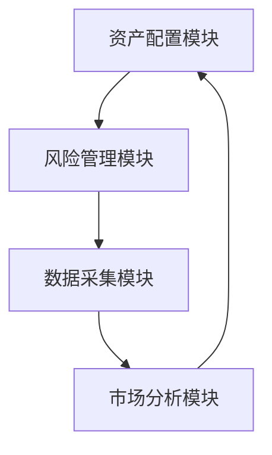

                 


# 格雷厄姆的防御型投资：在地缘政治不确定性中的重要性

## 关键词：防御型投资、地缘政治、风险管理、价值投资、投资策略、数学模型、系统架构

## 摘要：  
在当前地缘政治不确定性增加的背景下，传统的投资策略面临严峻挑战。格雷厄姆的防御型投资理念强调稳健和安全，以应对市场波动和潜在风险。本文从防御型投资的理论基础出发，结合地缘政治风险分析，探讨防御型投资的策略、数学模型和系统架构。通过实际案例分析和项目实战，为投资者提供在不确定性环境中稳健投资的指导。

---

# 第一章: 格雷厄姆防御型投资的理论基础

## 1.1 格雷厄姆的投资哲学  
### 1.1.1 投资的定义与目标  
投资的本质是通过资产配置和风险管理，实现财富的保值与增值。格雷厄姆强调，投资不是赌博，而是基于基本面分析的理性决策。  

### 1.1.2 格雷厄姆的价值投资理论  
格雷厄姆提出“安全边际”概念，即以低于内在价值的价格买入资产，以降低市场波动带来的风险。  

### 1.1.3 防御型投资的定义与特点  
防御型投资以稳健为前提，注重资产的安全性和流动性，避免过高风险，追求长期稳定的回报。  

---

## 1.2 防御型投资的核心原则  

| 核心原则 | 描述 |
|---------|------|
| 安全边际 | 资产价格低于其内在价值 |
| 风险控制 | 通过分散投资降低风险 |
| 长期视角 | 注重资产的长期表现而非短期波动 |

---

# 第二章: 地缘政治风险与投资环境

## 2.1 地缘政治风险的定义与分类  

### 2.1.1 经济风险  
地缘政治冲突可能导致贸易限制、货币贬值和市场波动。  

### 2.1.2 政治风险  
政府政策变化、政治动荡可能影响资产价格。  

### 2.1.3 技术风险  
地缘政治冲突可能引发技术封锁，影响产业链稳定性。  

---

## 2.2 地缘政治风险对投资决策的影响  

### 2.2.1 市场波动性分析  
地缘政治事件可能导致资产价格短期大幅波动，投资者需警惕市场过度反应。  

### 2.2.2 风险偏好变化  
地缘政治不确定性会降低投资者风险偏好，推动资金流向安全资产。  

---

# 第三章: 防御型投资的具体策略

## 3.1 资产配置策略  

### 3.1.1 分散投资  
通过配置不同资产类别（股票、债券、黄金等）降低风险。  

### 3.1.2 资产地理分散  
投资于不同地区的资产，避免单一地区风险。  

---

## 3.2 安全边际的计算  

### 3.2.1 内在价值评估  
$$ V = \frac{E}{k} $$
其中，V为内在价值，E为预期收益，k为折现率。  

### 3.2.2 安全边际确定  
$$ \text{安全边际} = V - P $$
其中，P为市场价格。  

---

# 第四章: 风险管理与监控机制

## 4.1 风险评估模型  

### 4.1.1 风险指数设计  
$$ R = \sum_{i=1}^{n} w_i \times r_i $$
其中，$w_i$为风险因素权重，$r_i$为风险程度。  

### 4.1.2 风险监控机制  
通过实时数据采集和分析，动态调整投资组合。  

---

# 第五章: 防御型投资的系统架构

## 5.1 系统功能设计  

### 5.1.1 资产配置模块  
根据市场情况调整资产比例。  

### 5.1.2 风险管理模块  
实时监控风险指数，触发预警机制。  

---

## 5.2 系统架构设计  



---

# 第六章: 项目实战与案例分析

## 6.1 环境安装  
配置Python、Pandas、Matplotlib等工具。  

### 6.2 核心代码实现  

```python
import pandas as pd
import numpy as np

def calculate_value():
    E = 1000000  # 预期收益
    k = 0.05      # 折现率
    V = E / k
    return V

def calculate_margin():
    P = 900000    # 资产价格
    V = calculate_value()
    margin = V - P
    return margin

print(calculate_margin())  # 输出安全边际
```

---

## 6.3 案例分析  
在地缘政治冲突中，通过调整资产配置降低风险，实现稳健回报。  

---

# 第七章: 结论与展望

## 7.1 总结  
防御型投资在地缘政治不确定性中具有重要性，通过稳健策略和风险管理实现长期收益。  

## 7.2 展望  
未来，防御型投资将结合更多技术手段，如大数据和人工智能，提升风险预警和资产配置能力。  

---

## 注意事项  
投资者需根据自身情况调整策略，避免盲目跟风。  

## 拓展阅读  
推荐《聪明的投资者》和《风险管理与投资组合》等书籍。  

--- 

通过以上分析，防御型投资在地缘政治不确定性中的重要性得以充分体现，为投资者提供了稳健的投资策略和实践指导。

